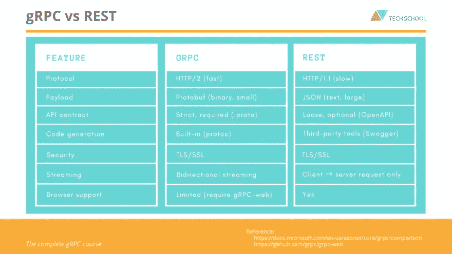
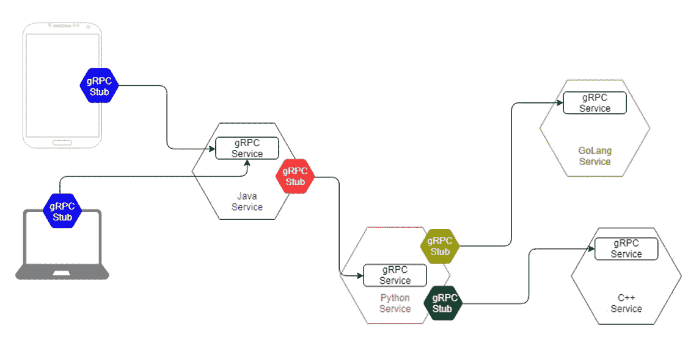
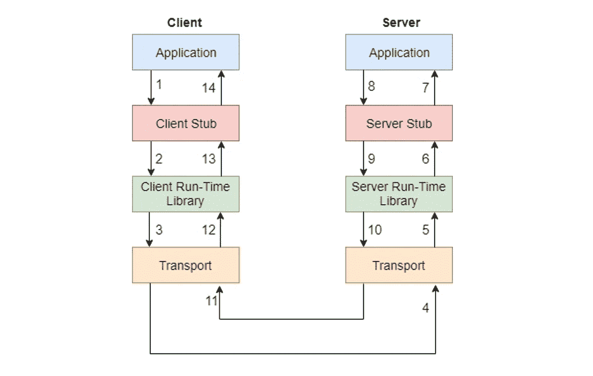

# 使用 gRPC、Python 和 Golang 构建微服务应用程序(第 1 部分)

> 原文：<https://medium.com/nerd-for-tech/build-a-microservice-app-using-grpc-python-and-golang-part-1-1371aceded72?source=collection_archive---------6----------------------->


照片由[亨利·陈](https://unsplash.com/@chentianlu?utm_source=medium&utm_medium=referral)在 [Unsplash](https://unsplash.com?utm_source=medium&utm_medium=referral)

在这一系列文章中，我们将了解 gRPC 的概念及其在 Python 和 Golang 中的实现。然后，为了确保我们理解了所学的内容，我们将构建一个简单的 todo 应用程序，它具有最少的功能，但仍然具有足够的挑战性来实现它。

整个应用程序结构将由三个不同的较小的服务组成。一个服务将负责认证，另一个将负责管理 todos，最后一个作为直接连接到用户的主界面。该架构将类似于一些极简和定制设计的微服务。

此外，为了确保我们有效地学习它，我将把教程分成几篇文章，我们将从头开始构建它。所以，你可以按照自己的步调去阅读和跟随。现在，让我们从一个关于 gRPC 的简单概念开始。

# gRPC

直接取自 gRPC 官网:

> gRPC 是一个现代的开源高性能远程过程调用(RPC)框架，可以在任何环境中运行。它可以通过对负载平衡、跟踪、运行状况检查和身份验证的可插拔支持，高效地连接数据中心内和跨数据中心的服务。它也适用于分布式计算的最后一英里，将设备、移动应用程序和浏览器连接到后端服务。

gRPC 是一个开源的 RPC 框架，最初由 Google 开发，它使用 HTTP/2 进行传输，这是 RPC 框架被认为比 REST 框架更好的原因之一。

等等，这种情况下 RPC 是什么？

在[分布式计算](https://en.wikipedia.org/wiki/Distributed_computing)中，一个**远程过程调用** ( **RPC** )是当一个计算机程序导致一个过程([子程序](https://en.wikipedia.org/wiki/Subroutine#:~:text=In_computer_programming,_a_subroutine,particular_task_should_be_performed.))在一个不同的地址空间(通常在共享网络上的另一台计算机上)执行时，它就像一个普通的(本地)过程调用一样被编码，而不需要程序员显式地编码远程交互的细节。

我用来记住这个定义的比喻是这样的:

想象有一对夫妇，他们互相认识。让我们给他们取名为爱丽丝和鲍勃。爱丽丝是一个了不起的厨师，鲍勃是一个优秀的工程师。他们的交流方式是某种非常规的，不是直呼其名，而是使用一些工具进行交流。爱丽丝和鲍勃使用各种声音的铃铛来区分哪个是哪个。例如，爱丽丝想请鲍勃修理厕所。他们都知道哪个铃代表鲍勃在修厕所，所以爱丽丝会按这个铃，鲍勃就会知道他该做什么。同样，如果鲍勃让爱丽丝做意大利面，他会使用特定的铃铛，所以爱丽丝会明白这是什么意思。要记住的一个关键是，如果他们想交流，他们都知道用哪个铃。

很有帮助，还是没那么大帮助？一些寓言和思维导图实际上可以帮助我们更好地理解事物，至少对我来说是这样。

## gRPC 和 REST 有什么区别？



[https://dev . to/techschoolguru/is-grpc-better-than-the-rest-where-to-use-it-3 blg](https://dev.to/techschoolguru/is-grpc-better-than-rest-where-to-use-it-3blg)

gRPC 和 REST 使用不同的协议，gRPC 使用 HTTP/2，REST 使用 HTTP/1.1。使用 HTTP/2 的好处是它比 HTTP/1.1 更快，但坏处是现在的浏览器不支持 HTTP/2(解决方案可能是使用 gRPC-web)。我喜欢 gRPC 的另一个主要原因是，它使用严格的 API 契约，而不是 REST，REST 可以以更灵活的方式定义 API 契约。

## 微服务会是什么样子？



这就是使用 gRPC 的微服务的样子。提出请求的部分是 gRPC 存根，然后到达服务器。一般来说，gRPC 的内部工作流程如下:



# 让我们创造

现在，让我们给这个项目起一个你喜欢的名字，在这个例子中，我把这个项目命名为`python-golang-grpc`。我们首先构建主服务，即用户与整个应用程序直接交互的界面。

创建一个名为 main-service 的文件夹，然后创建一个虚拟环境，将我们的开发环境与本地机器的其余部分分开。

```
mkdir main-service        # create the folder
cd main-service           # change directory to main-service folder
python3 -m venv venv      # create virtual environment
source venv/bin/activate  # activate the virtual environment
```

对于主要服务，我们使用烧瓶。

```
pip install flask
```

在本文中，我们将重点放在构建主服务的框架上。在下一个教程中，我们将实现所有的细节。

现在，创建一个名为`app.py`的文件。

我们首先导入所需的依赖项。在第 2 行和第 3 行，我们导入了用于身份验证的模块和用于 todo 的 CRUD，稍后我们将对此进行定义。然后我们在第 7 行和第 8 行注册蓝图，在第 10 行到第 14 行创建一个`root_route`视图功能，并在第 16–17 行运行应用程序。

我们仍然需要定义负责认证和 todo CRUD 操作的模块。让我们创建两个文件夹，并在其中创建与文件夹名称相同的文件。一个是`auth`，一个是`todo`。

`auth/auth.py`的内容。

`todo/todo/py`的内容。

这两个文件的内容很大程度上只是一个模板，我们将在为已定义的模块(auth 和 todo)创建服务之后定义它。

本文到此为止，在我们开始实际实现下一篇文章中的细节之前，您可以休息一下。你可以在这里找到这篇文章的代码[https://github . com/agusrichard/python-golang-grpc/tree/part 1](https://github.com/agusrichard/python-golang-grpc/tree/part1)。

如果您有任何问题或反馈，请随时留下评论或通过电子邮件联系我，agus.richard21@gmail.com。另外，如果你认为这篇文章对你有帮助，请不要犹豫，给这篇文章鼓掌。

感谢您的阅读，下一篇文章再见。