# 用 Tailwind CSS 构建一个简单的 React 网站

> 原文：<https://medium.com/nerd-for-tech/build-a-simple-react-website-with-tailwind-css-281f3114a932?source=collection_archive---------5----------------------->


反应

在这篇文章中，我们将使用 Tailwind CSS 构建一个简单的 ReactJS 应用程序，并在这个过程中学习将 Tailwind CSS 添加到我们的应用程序中。

因此，打开您的终端，使用下面的命令创建一个新的 ReactJS 应用程序。

```
npx create-react-app tailwindcss-reactjs
```

现在，按照说明，切换到新创建的文件夹。我也用 VS 代码打开了这个项目。

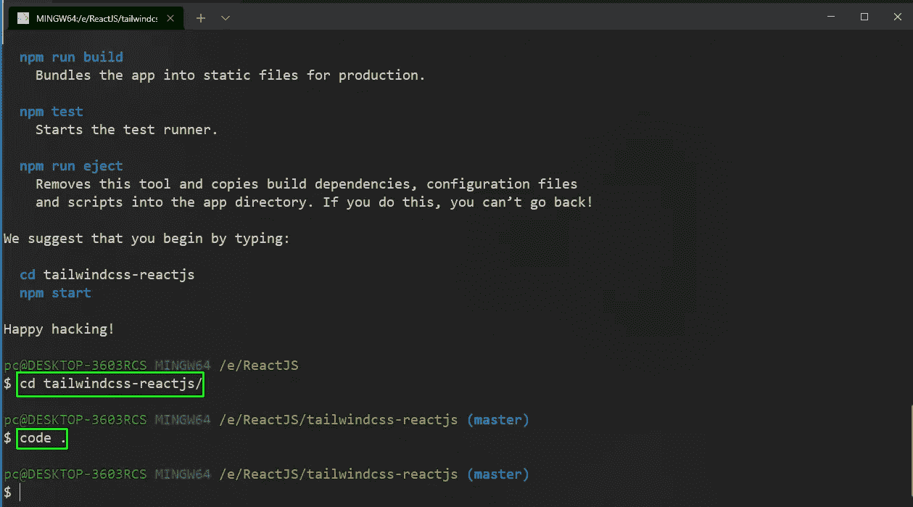

打开

现在，顺风 CSS 的安装过程对于每个平台都是不同的，我们将遵循[https://tailwindcss.com/docs/guides/create-react-app](https://tailwindcss.com/docs/guides/create-react-app)的 React 过程

所以，首先我们需要在我们的项目中安装下面的开发依赖包。

```
npm install -D tailwindcss@npm:@tailwindcss/postcss7-compat postcss@^7 autoprefixer@^9
```

接下来，我们需要安装另一个依赖项。

```
npm install @craco/craco
```

接下来，在 **package.json** 中，我们需要更新三个脚本，如下所示。

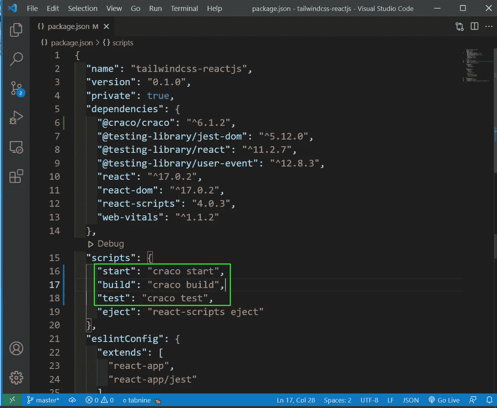

package.json

接下来，我们需要在根目录下创建一个文件 **craco.config.js** ，并在其中添加以下内容。

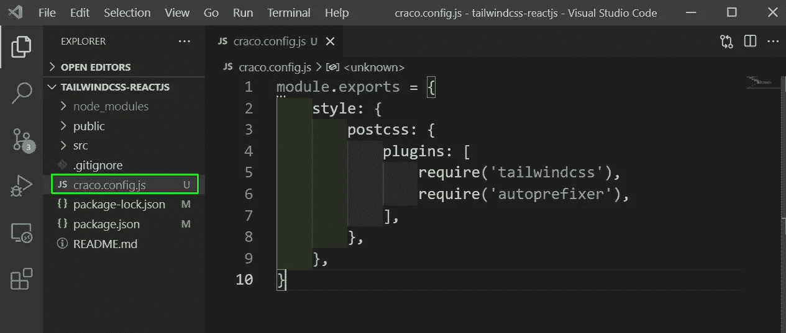

craco.config.js

接下来，要生成 **tailwind.config.js** 文件，我们需要运行下面的命令。

```
npx tailwindcss init
```

我在 **autofixer** 中遇到错误，并在[stack overflow 链接中找到了解决方法。](https://stackoverflow.com/questions/65179304/tailwind-in-react-project-getting-cannot-find-module-autoprefixer-error-du)

现在，根据文档，我们需要更新新创建的 **tailwind.config.js** 文件中的一行。

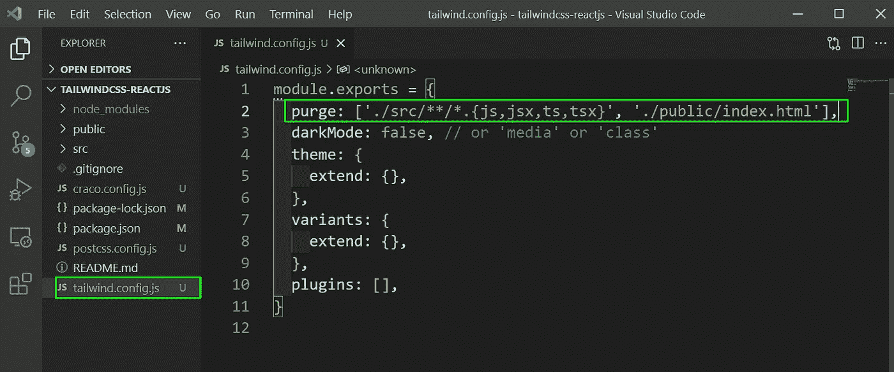

tailwind.config.js

然后在 **index.css** 文件中，我们需要用下面提到的内容替换旧的内容。

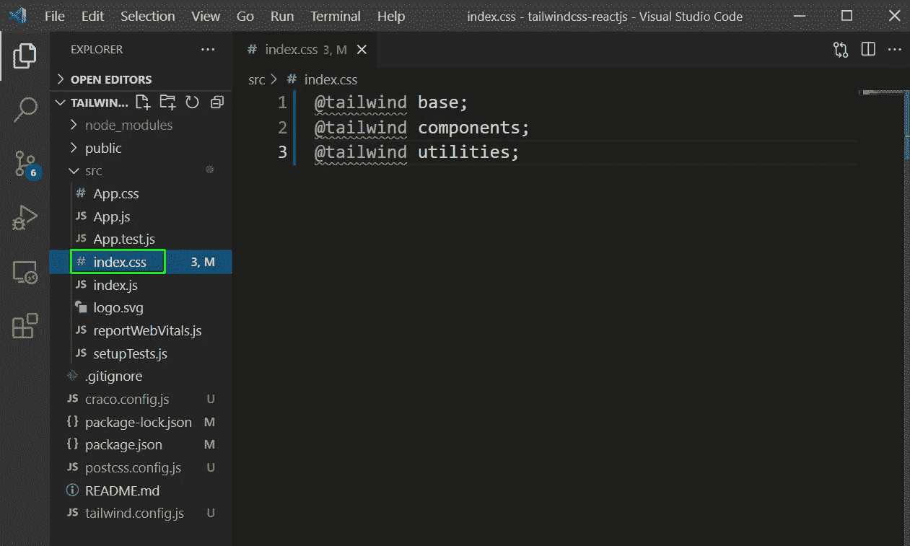

index.css

最后，我们可以通过运行 **npm start** 来启动 React 应用程序，如果一切正常，我们将在 [http://localhost:3000/](http://localhost:3000/) 中看到下面的内容

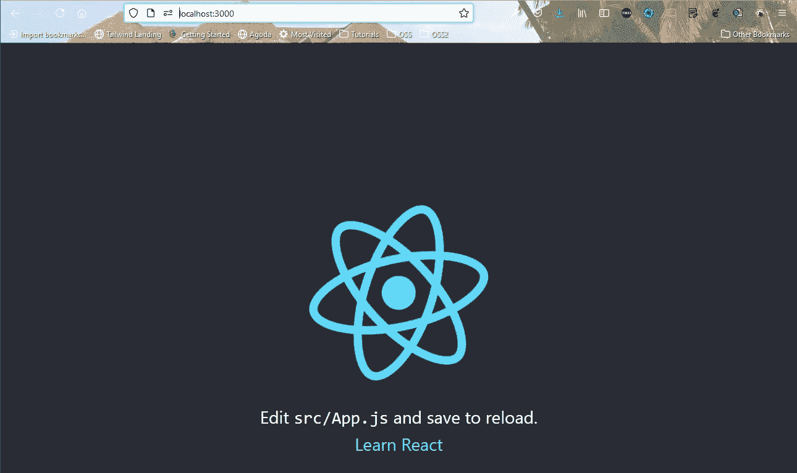

npm 开始

现在，在 **src** 文件夹中创建一个**组件**文件夹。在其中创建五个文件- **Content.js** 、 **Dropdown.js** 、 **Footer.js** 、 **Hero.js** 和 **Navbar.js** 。

现在，在继续之前，我们将在我们的项目中安装 React 路由器。我已经在 VS 代码中安装了相同的集成终端。之后导入到 **index.js** 文件中，用**路由器**包装 App。

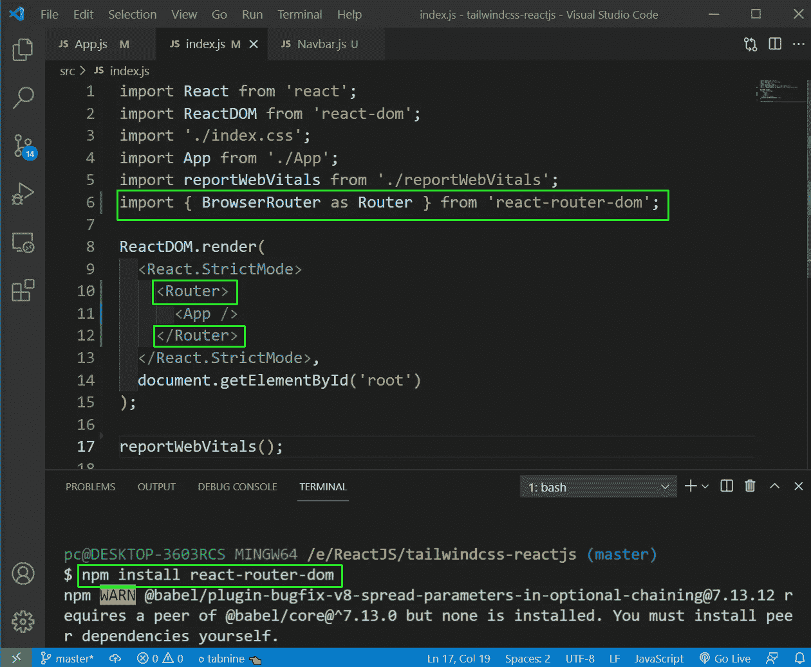

索引. js

现在，删除 **App.js** 文件中的所有内容，并在其中添加以下内容。

```
import Navbar from './components/Navbar';function App() {
  return (
    <>
      <Navbar />
    </>
  );
}export default App;
```

现在，我们将开始处理 Navbar.js 文件。我们将在这里使用一个图标，它取自[https://heroicons.dev/?query=menu](https://heroicons.dev/?query=menu)链接。React 要做的一件事是先点击右上角的代码图标，然后点击菜单图标。这样它将被复制为 svg。

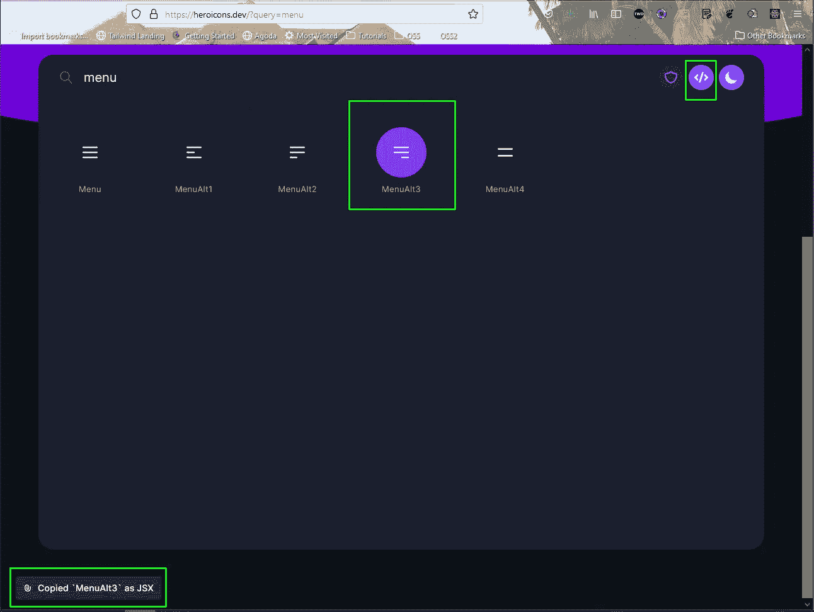

英雄图标

现在，我们将在 **Navbar.js** 文件中添加简单 Navbar 的代码。这里，我们展示了从移动视图中的 Heroicons 复制的菜单和桌面视图中的带链接的菜单。

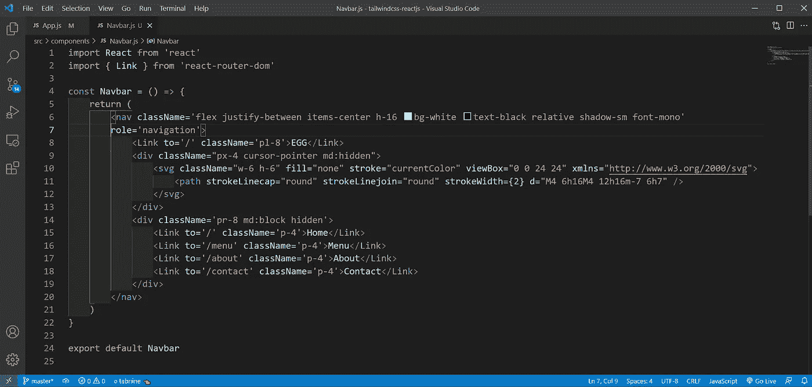

Navbar.js

现在，我们在桌面视图中的菜单如下。


桌面视图

移动视图中的菜单如下。

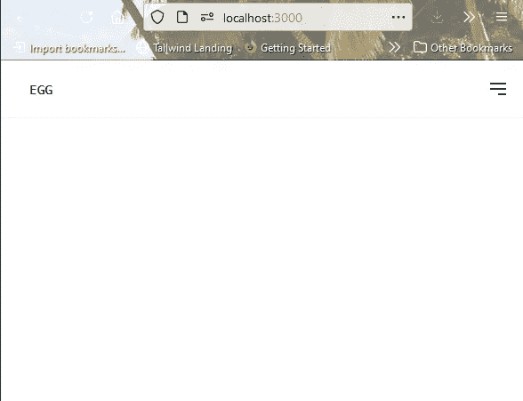

移动视图

现在，我们将创建英雄部分，我们将再次使用英雄图标中的一个令人敬畏的图标。搜索购物车，并点击第二个图标。

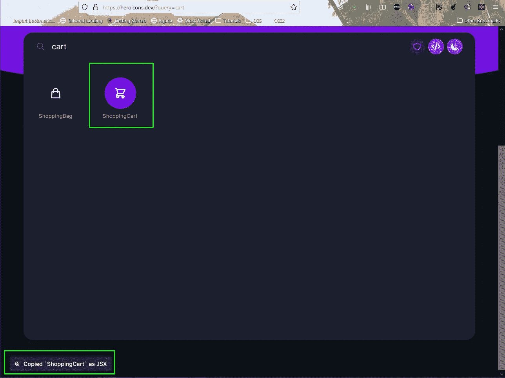

手推车

现在，用这个图标我们将创建我们的 **Hero.js** 。它还是一个简单的组件，有一个大的文本，在不同的屏幕上有不同的大小。

接下来，我们有包含购物车图标的**现在订购**按钮。另外，请注意，我们使用的是 tailwind css 中的 animate-bounce，它为按钮添加了漂亮的动画。

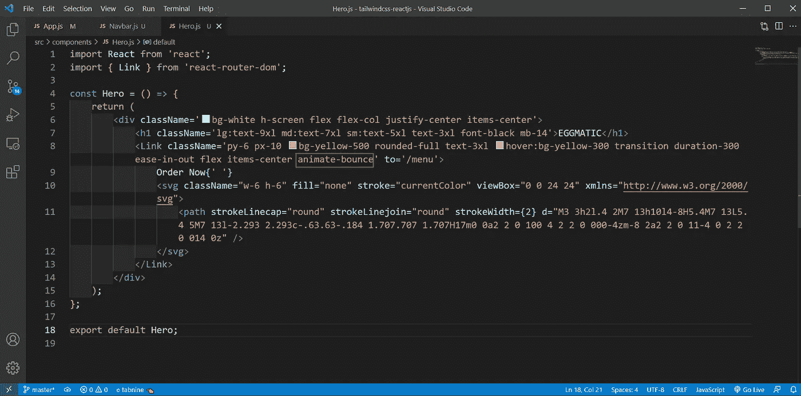

Hero.js

现在，我们的应用程序看起来像下面的桌面屏幕。

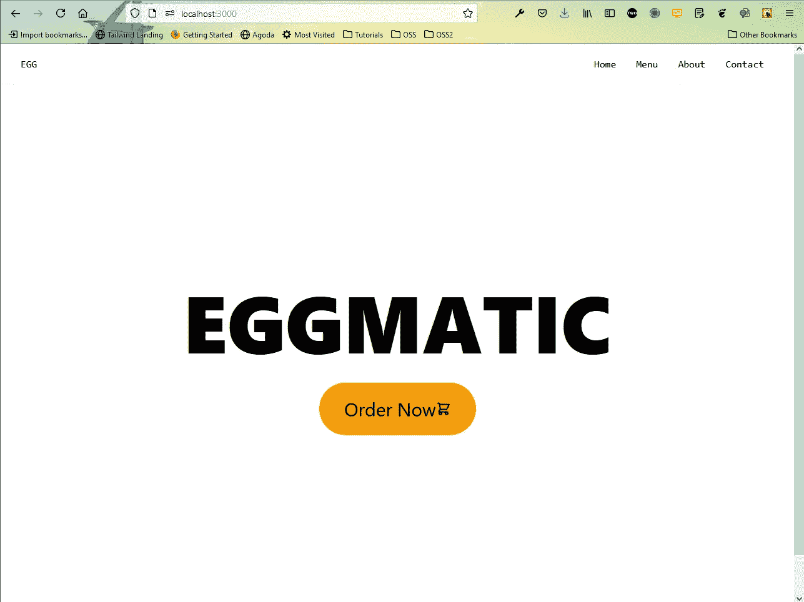

桌面

现在，我们将展示项目中的内容。为此，在 **src** 中创建一个 **images** 文件夹，并在其中放置两张垂直的蛋形盘子图片。我从 unsplash.com 带回来的。

现在，在我们的 **Content.js** 文件中添加以下内容。注意**菜单卡**和**中心内容**类。它们是公共类，样式取自 **index.css** 文件。

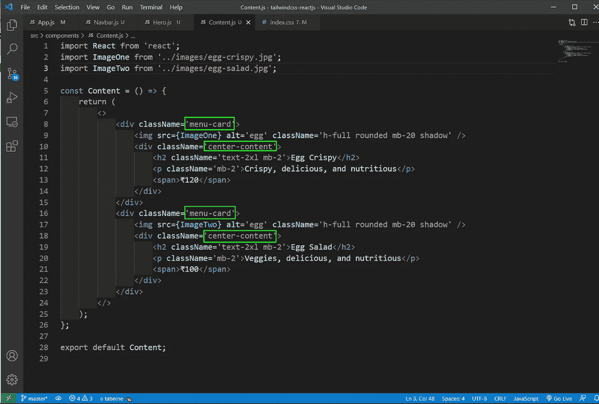

内容. js

现在，在 **index.css** 文件中，我们将添加顺风 css 类，并将引用**菜单卡**和**中心内容**类。注意，**的使用适用于**通用类的使用。

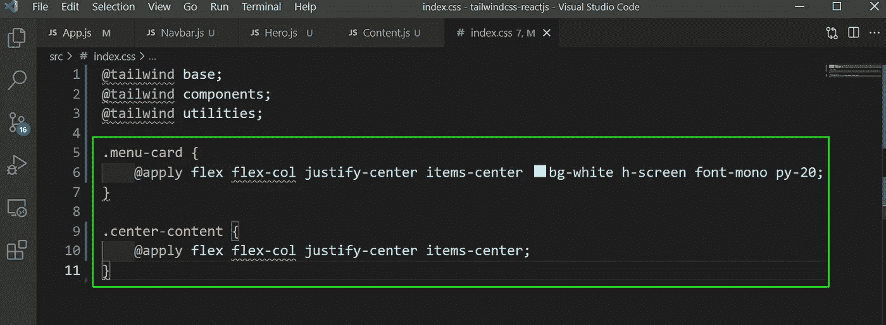

index.css

现在，在 **App.js** 文件中添加**内容**组件。

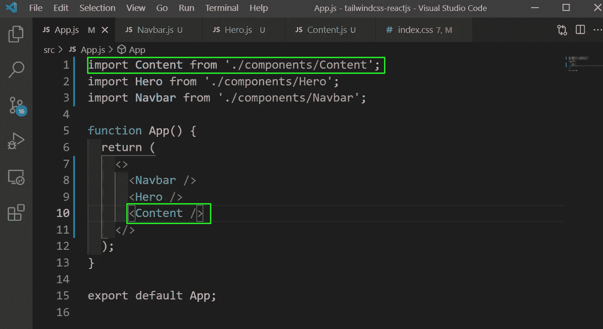

App.js

现在，我们内容组件将在两个视图上都显示良好。下面是移动视图。

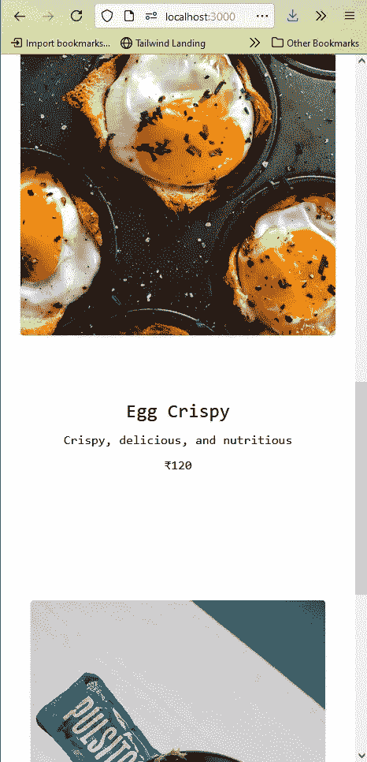

移动视图

现在，我们将创建一个简单的页脚组件。在 **Footer.js** 文件中添加以下内容。

```
import React from 'react';const Footer = () => {
    return (
        <div className='flex justify-center items-center h-16 bg-black text-white'>
        <p>Copyright © 2021 EGGMATIC All rights reserved.</p>
        </div>
    );
};export default Footer;
```

另外在 **App.js** 文件中添加**页脚**组件。

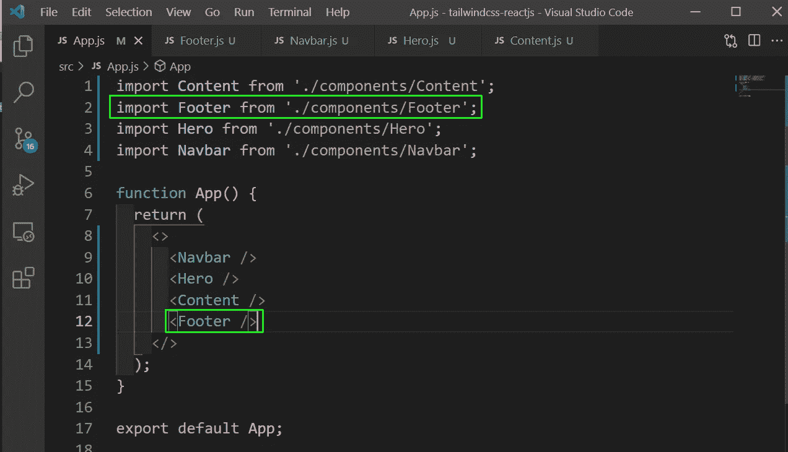

App.js

现在，页脚组件完美地显示出来了。

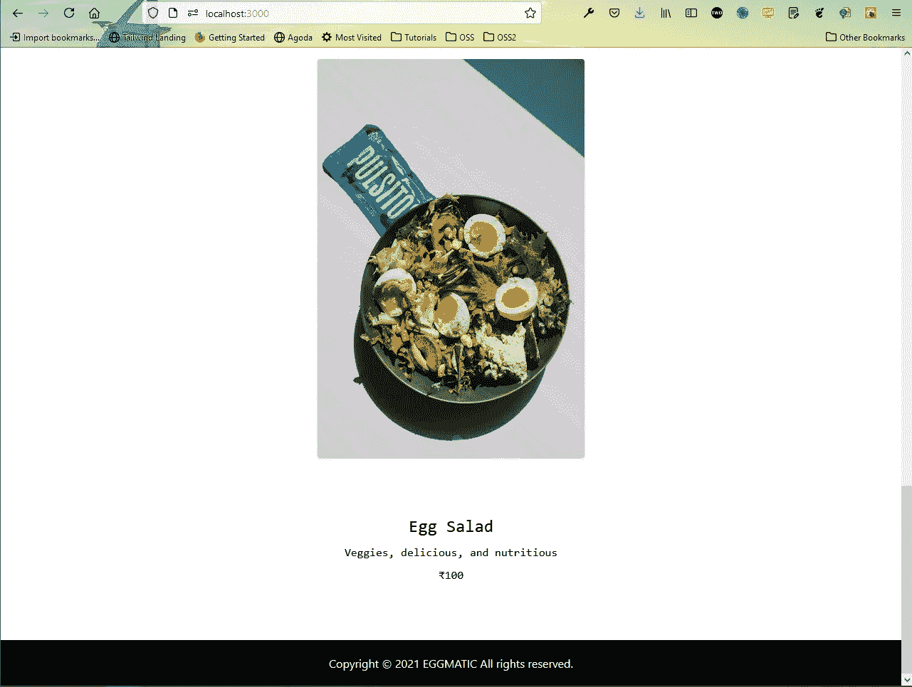

漂亮的页脚

这就完成了我们简单的带有 Tailwind CSS 的 ReactJS 应用程序。你可以在[这个](https://github.com/nabendu82/tailwind-reactjs) github repo 中找到相同的代码。

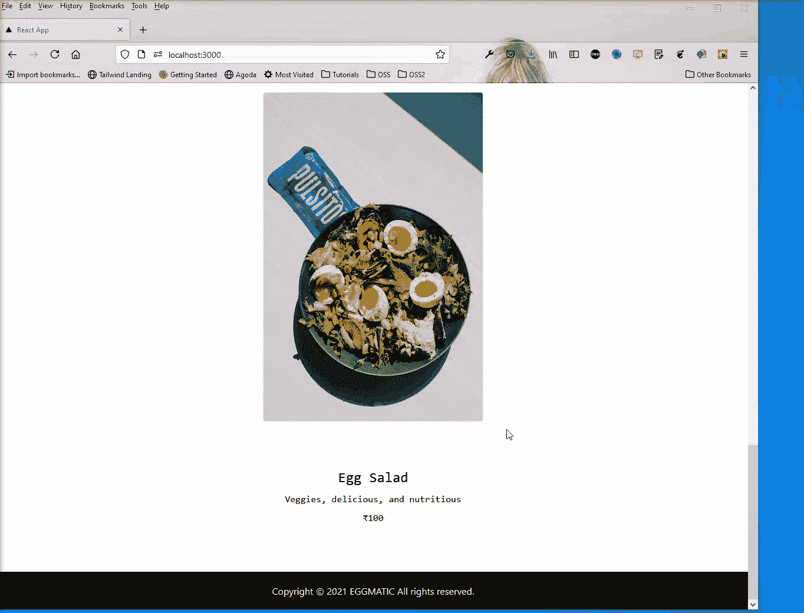

可交换的图像格式