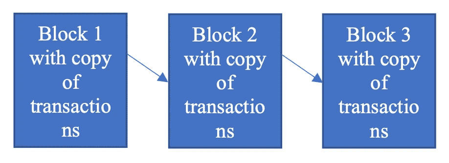
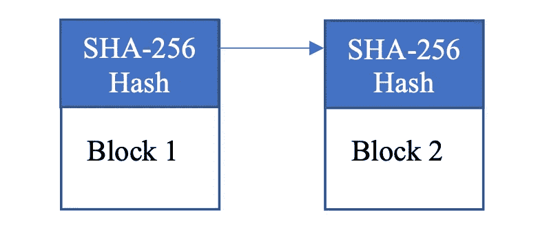
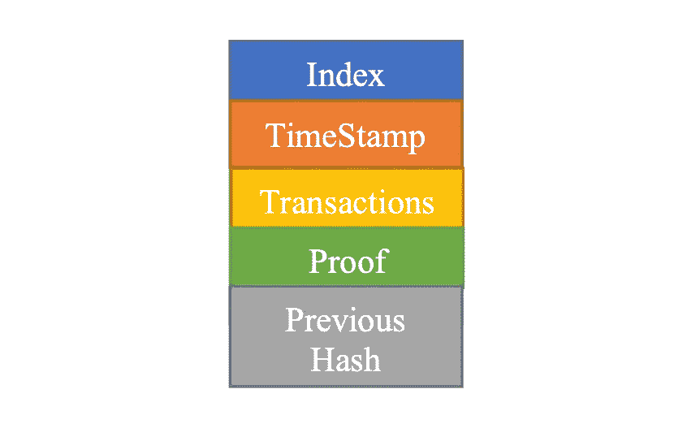

# 在 Python 上构建基本的块链

> 原文：<https://medium.com/nerd-for-tech/building-a-basic-block-chain-on-python-59e3e3ab6c6b?source=collection_archive---------9----------------------->


Pierre Borthiry 在 [Unsplash](https://unsplash.com?utm_source=medium&utm_medium=referral) 上拍摄的照片

*区块链，加密货币的建立在过去的五年里受到了广泛的关注。*加密货币、元宇宙、NFT(不可替代的代币)是当今世界最热门的词汇。我们听说所有这些概念都建立在不同的区块链上，如以太坊、索拉纳、多边形等。但是许多人可能会问，这些区块链能提供什么，它们是如何工作的。在本文中，我们将使用 python 构建一个基本的区块链。以及不同的块如何形成一个链的节点，它是如何分散的。

区块链也可以看作是一个分布式数据库，在计算机的几个不同节点之间共享。他们最出名的是维护分散和安全的交易记录。区块链的关键区别在于，通过分散式系统，区块链无需可信的第三方系统就能在用户中产生信任。

典型数据库和区块链之间的一个主要区别是数据的结构。区块链以小组的形式收集信息，称为

块，其中每个块保存一组特定的信息。

块已经具有预先确定的存储容量，当填满时，块被关闭并链接到先前填充的块，形成称为区块链的数据链。一旦一个块被添加到区块链，所有随后的新信息被添加到新添加的块中，该新添加的块然后被编译成新的块，该新的块一旦被填充，就被添加到区块链中。

对于一个数据库来说，数据通常被组织成表格，而顾名思义，区块链将它们分离成数据块，然后将它们串在一起。当以分散的方式实现时，这种数据结构本质上使得数据的时间线不可逆。当一块被填满时，它就被固定在石头上了。

在区块链上添加信息被称为事务。每当区块链上发生事务时，都会将事务的副本添加到块中，然后将块添加到区块链上。



连接在一起的区块链中的块

区块链模型:

从本文的这一点开始，我们开始探索区块链模型，并开始用 python 构建它。对于任何项目，我们需要一些库，我们将使用我们需要的各种功能。

进口:

Sha256:这个库将用于计算我们的块的散列。在本文的后面，我们将更多地了解这些散列的含义。

时间:这个库将被用来为我们在区块链的区块加时间戳。

Json:这个库将用于解析数据。

```
from hashlib import sha256import jsonimport time
```

方法和属性:

现在我们已经完成了导入，我们将使用来实现这个目的，下一步将创建区块链类。正如我们之前所介绍的，区块链是一个由记录块组成的分类账，而记录块则由交易填充。为了管理整个流程，我们利用 python 的面向对象特性，定义了一个区块链类，其对象维护一个唯一的区块链。区块链类将有两个属性，一个是区块链中的块列表，另一个是区块链中等待发生的事务列表。

除了这些属性，我们还需要类中的三个方法，一个用于添加事务，另一个用于计算散列，第三个用于添加块。有了这些方法和属性，我们就完成了区块链类。现在，让我们详细研究其中的每一种方法:

添加事务:我们要看的第一个方法是添加事务。如前所述，我们有一个保存所有未决事务列表的属性。我们使用这种方法，将更多的事务添加到待定列表中。一旦挂起事务列表的长度等于块的容量，挂起列表就被包装在块中，然后该块被附加到区块链。

例如，假设我们有区块链，每个区块可以完成 3 笔交易，两个用户 A & B 目前正在区块链进行交易。一旦 A 对 B 进行了交易，该交易的副本将被附加到未决交易列表中。在两个以上的类似事务之后，未决事务列表的大小将等于一个块的事务容量。现在，我们可以将事务添加到块中，并将块添加到区块链中。

一个交易不能被分类为成功的，除非该交易没有被添加到块，并且该块没有被添加到区块链。

```
def add_transaction(self, sender, recipient, amount):transaction = {"sender": sender,"recipient": recipient,"amount": amount}self.pending.append(transaction)
```

计算散列:散列是将一个字符串转换成另一个字符串的函数。对于我们的用例，它将用于索引区块链中的块。我们将使用 sha- 256 来为我们的用例计算散列。因为没有两个事务是相同的，所以我们每次都会得到唯一的散列，然后可以用作块的索引，并可以用于将区块链的块链接在一起。

SHA-2 是由美国国家安全局设计的一组加密散列函数，于 2001 年首次发布。它们是使用 Merkle–damg rd 结构构建的，而单向压缩函数本身是使用专用分组密码中的 Davies–Meyer 结构构建的。SHA-256 是一个散列函数，输出 256 位长的加密散列。

例如，如果我们将“hello，world”传递给 SHA-256，我们可能会得到类似于 0xd34db33f 的内容。因此，现在我们可以使用哈希字符串来引用每个块，因为它可以用作块的唯一标识符。

出于散列的目的，我们使用 JSON 来获得块中数据的表示。这个 json 表示然后通过我们的散列函数传递，并给我们一个散列输出，这是我们对于那个特定块的唯一标识符。



使用先前的哈希值链接块

```
def compute_hash(self, block):json_block = json.dumps(block, sort_keys=True).encode()curhash = sha256(json_block).hexdigest()return curhash
```

添加积木:这将是我们班最重要的方法。对于这个方法，我们将使用 python 语言中的 dictionary 对象。字典是存储键、值对的数据结构；是可变的，不允许重复。由于所有这些属性，字典对于我们的目的来说是完美的数据结构。每个块字典有 5 个键，即:索引、时间戳、事务、证明、先前散列。下面详细解释了每个键:

Index:块的索引号，用于我们的区块链；我们将从零开始索引编号。

时间戳:我们使用时间库来添加添加块时的时间戳。

事务:未决事务的列表被附加到这个字典块中，因此事务被添加到区块链中。

Proof:这个密钥用于验证一个证明，证明块的有效性。在区块链中验证证据的过程称为挖掘。由于挖掘的计算量很大，因此它超出了这个特定实现的范围。一个人需要大量的计算能力来挖掘。

前一个散列:这个键包含前一个块的散列串。这完成了链接区块链中所有块的过程。随后，该块的哈希字符串将出现在区块链的下一个块中。



一个块的所有属性都在区块链上的框图

```
def add_block(self, proof, prevhash=None):block = {"index": len(self.blockchain),"timestamp": time.time(),"transactions": self.pending,"proof": proof,"prevhash": prevhash or self.compute_hash(self.blockchain[-1])}self.pending = []self.blockchain.append(block)
```

结果:

现在，我们已经定义了区块链的流程和过程，接下来我们来看看我们创建的算法的结果。我们向区块链添加了两个块，变量 t1 到 t6 代表发生的所有 6 个事务。

```
chain = Chain()t1 = chain.add_transaction("A", "B", 64)t2 = chain.add_transaction("B", "C", 100)t3 = chain.add_transaction("C", "A", 24)chain.add_block(12345)t4 = chain.add_transaction("X", "Y", 75)t5 = chain.add_transaction("Y", "Z", 30)t6 = chain.add_transaction("Z", "X", 8)chain.add_block(6789)print(chain.blockchain)
```

每个块具有 3 个事务的容量，因此在前 3 个事务之后，我们调用我们已经定义的 add block 方法。

添加第一个块后，我们继续接下来的 3 个事务，并以类似的方式在区块链上添加第二个块。

现在，我们已经在区块链上添加了两个块，为了得到结果，我们打印了保存区块链上所有块的列表的属性，正如我们可以看到的，我们已经成功地创建了一个区块链。

当我们在类的初始化上添加一个块时，我们可以在我们的区块链中看到所有 3 个块。

```
[{'index': 0, 'timestamp': 1656238678.6959717, 'transactions': [], 'proof': 123, 'prevhash': 'Genesis'},{'index': 1, 'timestamp': 1656238678.6960707, 'transactions': [{'sender': 'A', 'recipient': 'B', 'amount': 64}, {'sender': 'B', 'recipient': 'C', 'amount': 100}, {'sender': 'C', 'recipient': 'A', 'amount': 24}], 'proof': 12345, 'prevhash': '37083492717eb7c1f4a5b108158762d52966cbaa841c8ba2aa039313a7c8c11d'},{'index': 2, 'timestamp': 1656238678.696206, 'transactions': [{'sender': 'X', 'recipient': 'Y', 'amount': 75}, {'sender': 'Y', 'recipient': 'Z', 'amount': 30}, {'sender': 'Z', 'recipient': 'X', 'amount': 8}], 'proof': 6789, 'prevhash': '12e5de2c427a9fc2b6aa9b78137233836e3a24adb5b0958311c306d2de3c5123'}]
```

因此，从结果可以看出，我们已经成功地用 python 从头开始构建了一个基本的区块链。每个区块都有自己独特的身份，并与区块链的前一个区块相联系。区块链经常被吹捧为数字货币的未来，但作为一种技术，区块链有几个其他的用例，可以彻底改变当前的事态。

链接到完整的 ipynb 文件，在这里可以看到完整的代码:

[](https://github.com/Vatsal-Sheth/BasicBlockChain) [## GitHub-vats al-Sheth/basic block chain

### 此时您不能执行该操作。您已使用另一个标签页或窗口登录。您已在另一个选项卡中注销，或者…

github.com](https://github.com/Vatsal-Sheth/BasicBlockChain) 

嗯，就是这样。希望你今天学到了一些有趣的新东西。我解释的时候很开心。

感谢您的阅读！