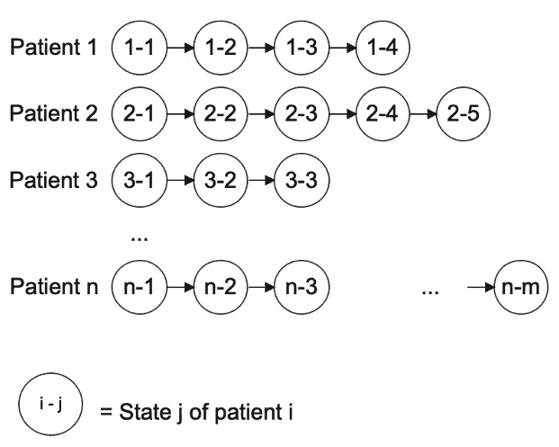

# 构建以患者为中心的语义网络

> 原文：<https://medium.com/nerd-for-tech/building-a-patient-centric-semantic-net-1e0f5a26efb2?source=collection_archive---------20----------------------->

## **医疗保健中基于知识的人工智能代理**

## FHIR 支持的以患者为中心的语义网络可以在医疗保健中实现智能代理


图片提供: [Pixabay](https://www.pexels.com/photo/abstract-close-up-cobweb-connection-276502/) 在 [Prexels](https://www.pexels.com/)

# **介绍**

在过去的几年里，人工智能和人工智能技术已经在医疗保健领域得到了广泛的应用。我们已经看到人工智能驱动的诊断技术的采用，可以从声纹中检测出精神疾病，聊天机器人可以预测健康的社会决定因素。虽然在某些领域已经取得了巨大的进步，但是可能还有其他的大机会领域，可以通过利用基于知识的智能代理来收获红利。

在我们深入研究这些智能代理之前，让我们先来看几个关键方面。

*   首先，医疗保健本质上是一个跨学科的话题。一个人的健康可能与许多不同的“特征”有关，这些特征很难检测，更不用说获取数据了。
*   第二，尽管医疗保健在微观层面上依赖于许多因素，但只要有正确的投入，它在本质上仍是高度可预测的。例如，如果知道患者胆固醇水平升高、药物治疗依从性低、不良饮食选择和久坐不动的生活方式，那么严重心血管疾病发作的可预测性非常高。
*   第三，一个典型的医疗保健组织拥有大量代表不同类型用例的数据。卫生系统拥有丰富的数据集，显示患者各种疾病的进展情况。类似地，健康保险公司拥有显示其成员购买行为和参与模式的数据集。

利用这三个原则，人们可以真正尝试在医疗保健中创建基于知识的智能代理，它可以回答各种问题。这种问题的例子可以是 a)该患者的急性程度可能基于特定的治疗途径而增加或降低 b)保险公司将潜在客户转化为会员的最佳参与方法是什么？

在这篇关于医疗保健中基于知识的智能代理的文章中，我们探索了通过利用基于知识的人工智能工具和技术来创建这样一个生态系统的步骤和设计原则。这是一篇由三部分组成的文章。我们首先阐明以患者为中心的语义网络如何真正捕捉数据，以促进现实世界用例的部署。接下来，我们探讨主题角色系统以及如何在医疗保健的背景下构建这样的系统。我们也看看现有的本体在创建这样的主题角色中所扮演的角色。最后，我们看看主题角色系统如何提供常识推理，并基于已知的临床证据以一种可解释的方式产生现实生活中的预测。

# **前言**

在我们开始讨论智能代理之前，我们先简要讨论一下基于知识的代理的智能和基于机器学习的智能。在整个讨论中，我们求助于一个共同的主题，即在医疗保健中，科学的知识体系已经在临床文献中建立。智能代理将以最佳方式应用经临床验证的知识，考虑所有可能的临床和非临床维度。这与统计机器学习技术形成对比，在统计机器学习技术中，大型数据集提供了检测模式和生成预测的基础。

# **以患者为中心的语义网络**

语义网络是人工智能中普遍存在的结构。它可以表示许多事物，例如对象之间的关系或对象的两种状态之间的关系。它本质上是任何概念的知识表示。

为了创建以患者为中心的语义网络，我们考虑一个特定的问题。患有慢性疾病的患者会经历疾病进展的不同状态。患者可以控制慢性疾病，或者病情可能变得更加严重。患者可能获得第二种慢性疾病或可能与现有慢性疾病相互作用的另一种发作性或急性疾病。这是一个以患者为中心的语义网络的图示，描述患者状态的“特征”非常有限。


图 1a。一个简单的以患者为中心的语义网络示例，显示疾病进展

需要注意的是，语义网接受糖尿病、高血压的临床定义，以及每种疾病上下文中“受控”和“未受控”的定义。它创建了患者状况及其进展的结构化表示。对每个病人来说，它本质上是一个单向的、非循环的图或树。

现在让我们来看看如何创建病人的状态。创建病人状态的一种方法是简单地按时间。医生对患者的每个观察/触摸点都可以认为是一种患者状态。然而，这种方法有可能产生非常大量的患者状态，因为患者可能在病情真正成为更大的问题之前已经控制了多年。更好的方法可能是当患者的临床状态改变时创建新的患者状态。如果患者的慢性病得到控制，患者的状态就不会改变。如果视敏度增加或患者获得了共病，那么患者的状态就会改变。同样，创建新患者状态的决定是由现有的临床知识驱动的，而不是通过数据的统计分析。因此，这种状态变化总是可以解释的。

如果我们考虑大量的患者和大量的状态，我们可以得到如下的表示:



图 1b。以患者为中心的语义网集合

在这一点上，让我们检查一个状态的内容。患者状态内容的设计将取决于用例。

如果目标是回答临床问题，如下一个最佳行动方案，患者状态将包含关键的临床信息，如诊断、药物、风险、生物特征等。，关于病人。它还可以包含其他相关信息，如健康的社会决定因素(SDoH)需求。人们也许可以在这种病人状态的内容和他们的资源之间建立逻辑联系。这不是巧合，因为两者都打算携带病人的临床信息。事实上，序列化的 FHIR 资源可以直接存储为患者状态的一部分。

可以通过以下设计来构建患者状态:

```
{ “id”: fhir:Patient.identifier, “firstname”: fhir:Patient.name, “birthday”: fhir:Patient.birthDate, “gender”: fhir:Patient.gender, “conditions”: [ { “identifier”:fhir:Condition.identifier, “category”:fhir:Condition.category, “severity”:fhir:Condition.severity, “onsetAge”:fhir:Condition.onset[n]: fhir.condition.onsetAge
      }
      {
         ..... } ] “medications”:  [ { “identifier”: fhir:Medication.identifier, “code”: fhir:Medication.code,          “status”: fhir:Medication.status, } { ... } ]}
```

上面的例子显示了一个带有临床数据的语义网络。类似的语义网也可以被设计来回答其他医疗保健问题，例如谁最接近更新保险计划，或者谁可能难以支付他们的治疗保费或费用份额。为了回答这些问题，可以在患者状态中加入额外的管理和财务元素。

本文有意回避了使用特定技术实现病人状态的问题。所描述的概念是足够通用的，它们可以在大多数现代编程语言以及许多商业可用的网络/图形数据库中实现。在详细设计过程中，必须考虑特定的因素。这种患者状态的音量可能非常高。虽然图形数据库提供了持久性，但对于内存操作，python 的数据结构可能是有用的。

# **总结**

在这篇文章中，我们定义了一个以病人为中心的语义网，并讨论了它的目的。我们还定义了说明性内容，并确定了这些内容的可能来源。

关键点是

1.  语义网的内容完全依赖于用例及上下文。
2.  以患者为中心的语义网络可以从许多当前的医疗保健临床或索赔数据中填充。
3.  语义网本身并不试图提供任何智能，而是使智能代理能够回答我们将在本系列后面看到的问题。

在文章的下一部分，我们将讨论主题角色系统及其框架，这些概念可用于了解患者当前和未来的进展。

> 本博客中表达的任何观点或意见都是严格的个人观点，属于博客作者。除非明确说明，否则此类观点或意见不得解释为代表作者目前或过去以个人或专业身份参与的任何组织。