# 构建 Reddit 推荐系统

> 原文：<https://medium.com/nerd-for-tech/building-a-reddit-recommendation-system-44ab6734d9d9?source=collection_archive---------4----------------------->

## 数据科学教程

## 使用协同过滤、隐式数据收集、K 个最近邻居和余弦相似性


Reddit——又名，[“互联网的首页。”](https://www.reddit.com/)就在 15 年前， [Reddit 开始是一个由大学生创建的小而鲜为人知的网站](https://en.wikipedia.org/wiki/Reddit)，提供匿名论坛或“子编辑”，主题大多与科学和编程有关。现在，Reddit 是世界上最大的社交网络平台之一，截至 2021 年初，估计有 4.3 亿活跃用户和 10 万活跃子网站。

Reddit 上的用户提交从图片、动画 GIF 和视频到基于文本的观点文章和新闻报道链接的所有内容。虽然 Reddit 上的一些内容是原创的，但许多内容是其他用户分享或“转发”的，用户不仅可以对他们关注的子编辑中的帖子发表评论，还可以“投票赞成”或“投票反对”这些评论和帖子，以此作为提高或降低内容受欢迎程度的民主方式，从而提高或降低对其他用户的可见性。

每个子主题都致力于一个特定的主题，尽管一些最受欢迎的子主题范围相对较广，如“r/新闻”或“r/政治”，但还有许多其他子主题致力于难以想象的范围。

**然而，有十万个独特的选项可供选择，Reddit 用户怎么可能知道该订阅哪个 subreddit 呢？**

幸运的是，Reddit 平台已经在其搜索功能中使用了一个推荐系统，即使是最简单的搜索，一个完整的子编辑世界也为你敞开了大门。但如果没有呢？如果 Reddit 在机器学习算法甚至搜索引擎普及之前，以某种方式在另一个时间线提前十年开发出来会怎么样？如果用户找到可能感兴趣的子编辑的唯一方法是直接在 web 浏览器中键入 URL，或者从托管该子编辑的另一个页面中单击指向该子编辑的链接，会怎么样？

当然，在这个另一个世界中，对艺术感兴趣的用户可能知道他们应该简单地导航到“reddit.com/r/Art”。也许他们会产生创意，并想到输入类似“reddit.com/r/ConceptArt”或“reddit.com/r/Drawing”的内容但是他们会想到输入“r/DrawForMe”吗？“r/icandrawthath”怎么样？或者可能是“r/IDrewAPicture？”" r/RandomActsOfDrawing？"

我们探索 Reddit 越多，就发现越多晦涩难懂、标题奇特的子 Reddit。然而，如果没有一种精确的方法来找到我们感兴趣的类似商品，我们就没有机会访问以 Reddit 为家的广大社区。

所以，让我们来解决这个假设的问题，并学习如何建立一个 Reddit 推荐系统。这样，无论我们的用户处于什么样的世界，我们都可以帮助他们找到他们下一个最喜欢的子编辑，基于他们已经知道的。

# **介绍算法**

为了开发一个可以向用户推荐子编辑的程序，我们必须了解这种相似性搜索的基本原理，以及我们必须使用的算法。

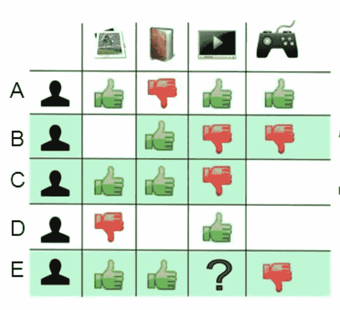

相似矩阵

在我的[早先关于搜索相似内容的文章](/web-mining-is688-spring-2021/covid-tweets-finding-similar-twitter-users-in-the-first-days-of-the-pandemic-f72a66447dfa)中，我谈到了**协同过滤**以及我们如何使用**余弦相似性度量**来实现它。这篇文章也依赖于余弦相似性和协同过滤——但是在这种情况下，过滤是基于**项**而不是用户的[,并且使用用户评级](https://www.analyticsvidhya.com/blog/2020/11/create-your-own-movie-movie-recommendation-system/)的**相似性矩阵**。简而言之，如果一个用户对另一个用户已经评价过的相同项目给出相似的评价，那么显然这两个用户本身彼此相似，至少在偏好方面相似，并且对其他项目具有相似的偏好，即使其中一个用户还没有对其中一些项目进行评价。同样，由相同用户相似地评级的一组项目也彼此相似，这是显而易见的。我们还打算使用**K-最近邻算法**和余弦相似度来识别彼此非常接近的项目。此外，虽然数据集中的用户并不总是对有问题的项目给出**显式评级**，但我们可以基于某些用户行为来估计一组**隐式评级**，例如与另一个项目相比，他们与一个项目交互了多少次。

# **设置和收集数据**

虽然我无法注册 Reddit API，但我能够在 Kaggle 上找到一个[大型 Reddit 数据集，是在 2017 年的 5 天时间里拍摄的。数据集有 14，000，000 行和两列，有超过 20，000 个唯一的用户名和每个用户评论的子编辑列表。然而，尽管它很大，但这个数据集是非常有限的——它不包括用户的帖子，它不显示评论本身的内容，并且没有任何数据可以用于任何类型的推荐系统。起初，我甚至不确定它是否有足够的信息，但幸运的是，我能够实现一系列聪明的方法，从用户那里提取隐含的评级，并将数据重组为可用的形式。](https://www.kaggle.com/colemaclean/subreddit-interactions)

与每个数据科学项目一样，我们的第一步是导入我们计划在整个项目中使用的库。只有在我们将这些插入 python 之后，我们才能开始处理我们下载的数据集，并将 CSV 文件转换成可读的数据帧。

导入库和读取数据帧

*   **熊猫**为数据帧
*   **Numpy** 进行计算
*   **Scipy** 用于创建矩阵
*   **Scikit-Learn** 用于机器学习算法
*   用于可视化的 **Matplotlib** 和 **Seaborn** 。

# 重构数据

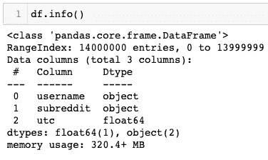

数据帧信息

我们注意到的第一件事是，除了 username 和 subreddit 之外，这个数据集还包含一个 datetime 列。我们没有理由使用这个特性，所以我们放弃了它——然后打印数据集中唯一用户名和子编辑的数量。

删除日期时间列，查找用户名和子日期的数量

```
**Number of Usernames: 22610
Number of Subreddits: 34967**
```

*注意:用户名被涂黑以保持匿名。*

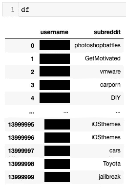

数据帧头和尾

这里，我们有数据帧的头部和尾部，相同的用户名在左侧重复列出，该用户在右侧列出的某个子编辑中所做的单个评论的表示。当相同的子编辑和用户名连续出现时，意味着用户在该子编辑中发表了两条评论。但棘手的部分来了:尽管我们的数据集中有数百万这样的行，但我们没有任何人的明确评级列表，因此我们没有任何方法来衡量用户对他们评论过的子编辑的偏好。

还是我们？通过计算每个用户在每个子编辑中发表的评论的总数，然后计算每个用户在任何子编辑中发表的评论的最大数量，然后将总数除以最大数量，我们可以生成一个隐式评级，该评级代表用户对他们已经评论的一个子编辑的兴趣与他们已经评论的所有其他子编辑的兴趣的比较。

用于创建评级系统的代码

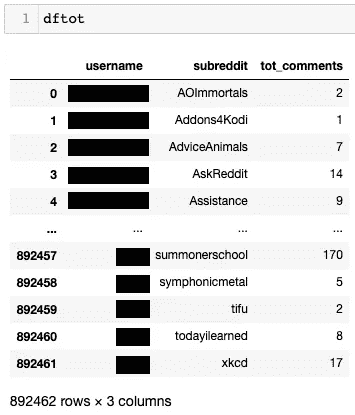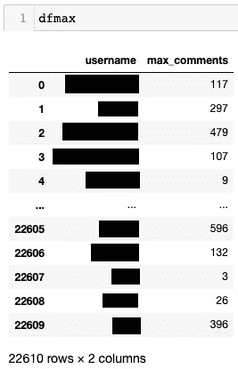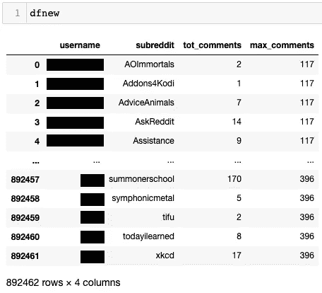

包含全部评论的数据框(左)，包含最多评论的数据框(中)，包含两者的数据框(右)

举个例子:如果用户 A 对 Subreddit B 评论了 10 次，Subreddit C 评论了 50 次，Subreddit D 评论了 100 次，而这是用户 A 评论过的仅有的三个 Subreddit，那么 Subreddit B 的评分是 10/100(或 0.1)，Subreddit C 的评分是 50/100(或 0.5)，Subreddit D 的评分是 100/100(或 1.0)。因此，我们可以测量用户从一个子编辑到另一个子编辑的参与比例，而不考虑他们的实际评论数。这是一种权宜之计，但可能会奏效。

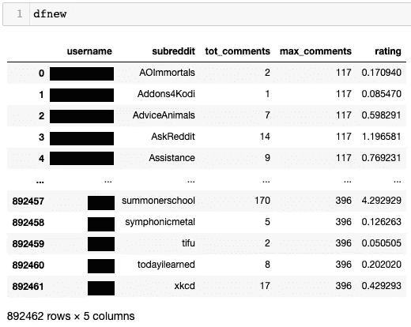

带评级的数据框

[https://gist . github . com/dougrizio/a2 b 6 C2 AAA 775 aa 7 c 9598 EFA 35 c 80 beb 8 . js](https://gist.github.com/dougrizio/a2b6c2aaa775aa7c9598efa35c80beb8.js)

然而，对每个用户的每个子编辑的评论进行评级是不够的——为了创建一个相似性矩阵，每个字段都必须有一个数字 id。接下来的这几行代码展示了我们如何创建一组单独的数据帧，这些数据帧仅包含数据集的唯一用户名和子数据，根据索引号为每个数据帧分配一个固定的数字 id，然后将这些 id 添加回数据集中合适的位置。

用于创建用户和子编辑 id 的代码

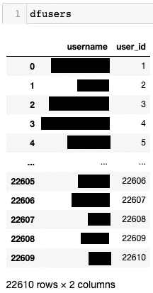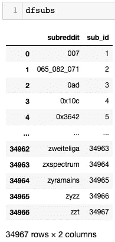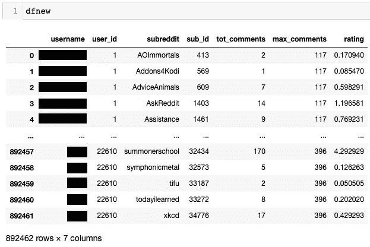

带有用户 ID 的数据框(左)，带有子编辑 ID 的数据框(中)，带有两者的数据框(右)

经过几个繁琐的步骤，我们已经将一个基本的两列数据集变成了一个完整的信息网格，我们可以从中提取有趣的见解。为什么我们不把数据可视化来更熟悉它呢？

# **可视化数据**

绘制用户最多的前 10 个子街道

在这里，我们可以根据订阅它的用户总数，看到数据集中前 10 个最受欢迎的子编辑。任何一个 Redditor 的人都会认出一些顶级的 subs，r/AskReddit、r/pics、r/funny、r/today learned 和 r/worldnews 占据了前五名。我们排名第一的 subreddit r/AskReddit 拥有 14，000 名用户，拥有整个数据集中超过 60%的用户。

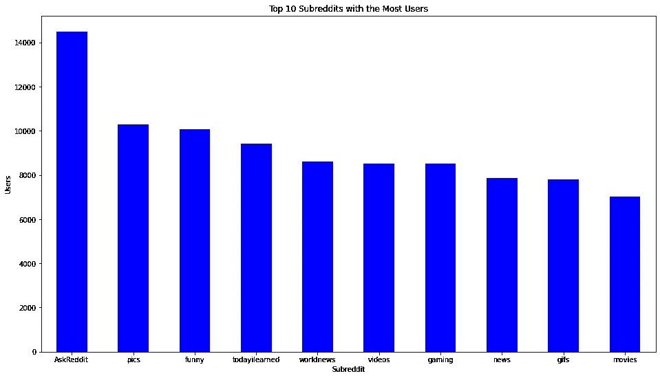

用户最多的前 10 个子条目

绘制评论最多的前 10 个子主题

下面，我们还可以根据用户在其中发表的*评论*的总数，看到前 10 个最受欢迎的子主题。虽然不同用户之间的差异相对较小，但 r/AskReddit 在总评论数方面超过了竞争对手，评论数刚刚超过 100 万，是评论数第二高的子编辑 r/politics 的两倍多。

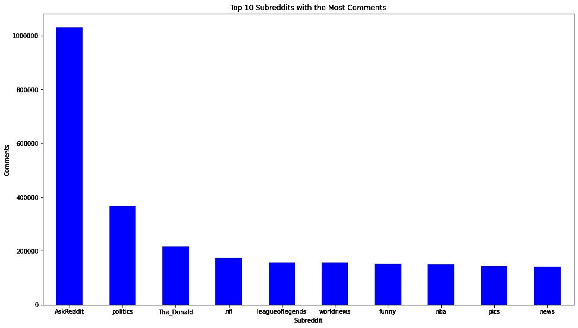

评论最多的前 10 个子编辑

绘制跟随最多子记录的前 10 名用户

我们可以形象化这些数据的另一种方式是绘制关注子主题数量最多的前 10 名用户。虽然我之前的免责声明提到我们不会显示任何人的用户名，但进一步检查后，该图中的每个用户名都属于机器人(又名，为不同目的设计的自动化 Reddit 帐户，如发布特定内容或评论其他用户使用特定单词和短语时的评论)。还有谁会评论 700 个不同的子条目？

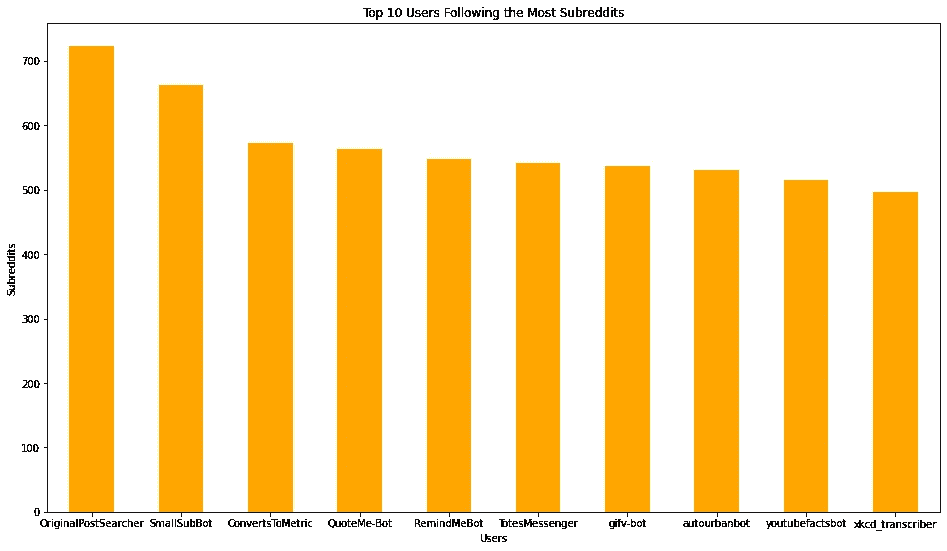

关注最多子主题的前 10 名用户

绘制评论最多的前 10 名用户

在这里，我们决定绘制所有子主题中总评论数最高的前 10 名用户(他们中的大多数似乎是人类！)然而，我们得出了一个令人惊讶的结论:没有一个用户在数据集中列出的评论超过 1000 条。这可能会给我们的即席评分系统带来问题，该系统依赖于每个子编辑的评论的准确比率——如果用户 A 实际上对子编辑 B 评论了 1000 次，子编辑 C 评论了 5000 次，子编辑 C 评论了 10000 次，但是所有的评论都在 1000 处被截断，那么这三个子编辑将被评为彼此相等，即使用户对其中一个子编辑的兴趣明显大于其他子编辑。

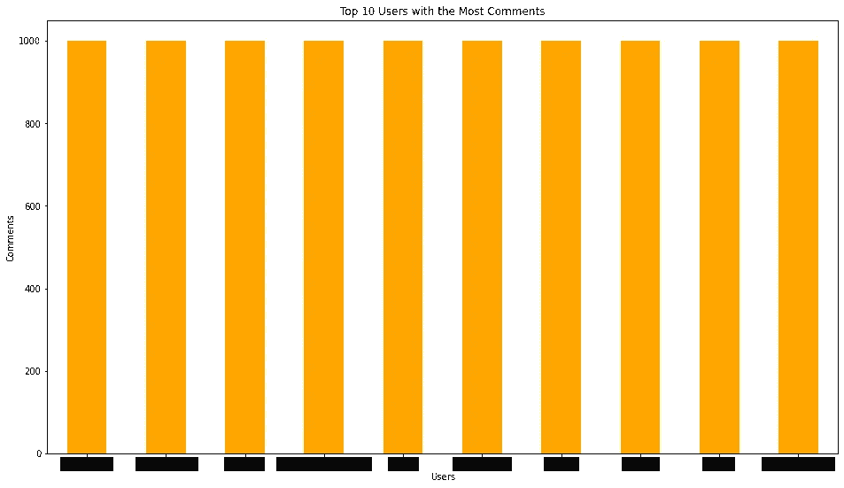

评论最多的前 10 名用户

绘制关注最多子编辑的用户的前 10 个喜爱的子编辑

在我们进入推荐系统之前，我们的最后一张图显示了评论最多的子编辑，来自关注最多子编辑的用户——在这种情况下，是前面提到的机器人之一。有点令人惊讶的是，虽然这个机器人评论了 700 多个不同的子主题，但它对每个子主题的评论都不超过 25 次。

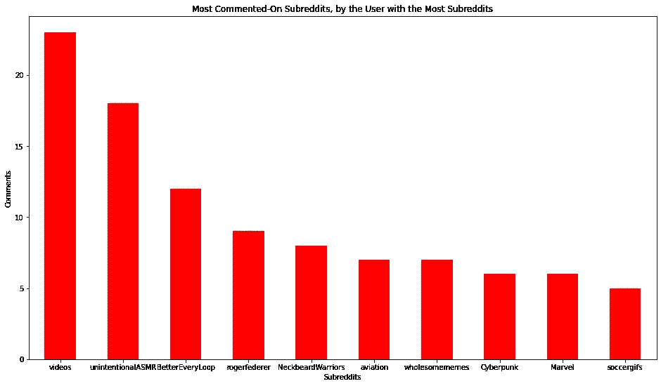

关注最多子编辑的用户最喜欢的前 10 个子编辑

# **相似矩阵和数据简化**

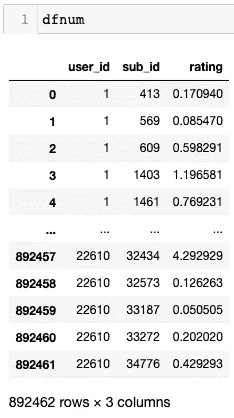

只有数值的数据帧

现在我们已经熟悉了数据，是时候建立我们的评级矩阵了。通过消除非数字值，将数据集旋转到一个网格中，将所有用户与数据集中的所有子数据集进行比较，并将用户和子数据集之间的值替换为从空到零的现有连接，我们创建了一个庞大的关系矩阵——尽管它大部分是空的。这就是所谓的**稀疏性**的问题，即大多数用户没有评论过大多数子编辑，大多数子编辑也没有大多数用户的评论。

创建相似性矩阵

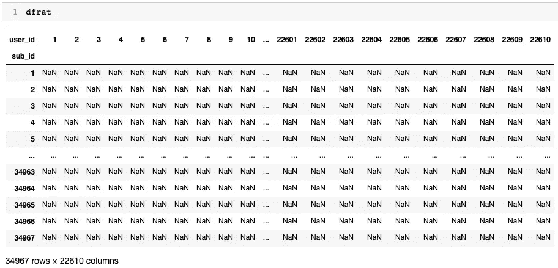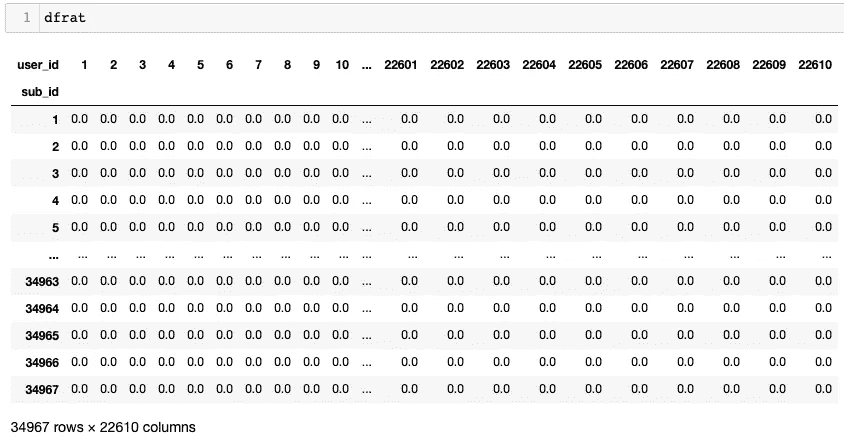

具有空值的数据帧(左)，空值被零替换的数据帧(右)

聚合用户和子记录

在下一步中，我们汇总了评论不同子编辑的用户数量，以及不同用户评论的子编辑的数量，并将这些数字投影到散点图上，以查看表示为点的所有数据集。

绘制每个子编辑的用户评论数

在下面的图中，我们在 y=100 处放置了一条线，表示我们的推荐系统所基于的每个子评论的最小用户阈值。虽然数据集中有许多子编辑，但其中许多子编辑的评论用户数量非常少，这意味着子编辑要么用户基数小，要么用户活动很少。推荐其他人都不感兴趣的子编辑是没有意义的，所以我们最终会删除任何评论少于 100 个用户的子编辑。

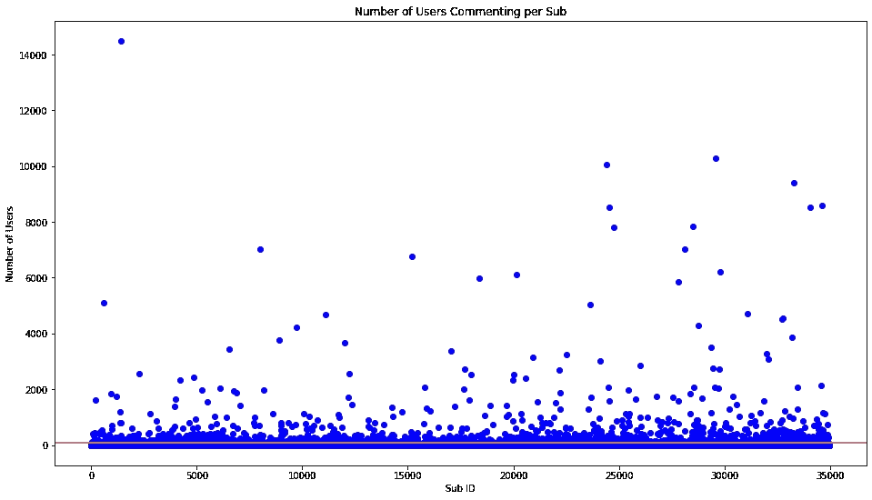

每个子编辑评论的用户数量

绘制每个用户关注的子编辑数

在第二个散点图中，我们可以看到每个用户评论或关注的子主题数量。与前面的图不同，虽然与用户相比子编辑相对较少，并且大多数子编辑具有较小的用户基数，但是与子编辑相比有许多用户，并且大多数用户关注和评论惊人大量的子编辑(点仅在 y=100 附近失去密度)。)然而，将推荐系统建立在关注至少 100 个子主题的用户基础上似乎是一种获得不准确结果的好方法——正如我们在早期的条形图中意识到的那样，许多评论最多子主题的用户实际上是机器人。事实上，大多数*的人类*用户可能关注更少的子主题，并且只评论他们真正感兴趣的少数子主题。由于这个原因，我们将每个评论用户的最小子主题的阈值设置为 10。尽管与之前的阈值相比，这个数字非常低，但我们希望确保大多数用户的利益都得到体现。我们还想确保我们包括的人类用户与机器人的比例很高，这一点除了从总体上广泛覆盖用户之外，我们没有办法确保。

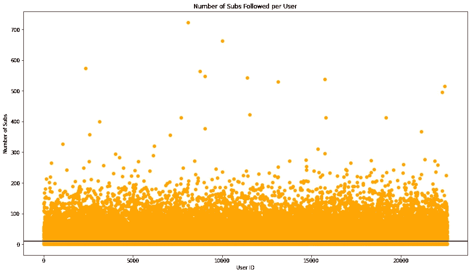

每个用户关注的子编辑数

减少数据帧

既然我们已经决定了最小阈值，我们可以减少数据集。我们还可以使用一种叫做压缩稀疏行(CSR) 的[机器学习工具来帮助我们解析系统。即使像我们这样的具有许多零的稀疏矩阵也是相当大的，并且需要大量的计算能力，但是因为矩阵中的零不包含有用的信息，所以它们最终增加了矩阵运算的时间和复杂性。这个问题的解决方案是使用另一种数据结构来表示稀疏数据，这最终相当于忽略零值，只关注矩阵中更密集的部分。](https://machinelearningmastery.com/sparse-matrices-for-machine-learning/)

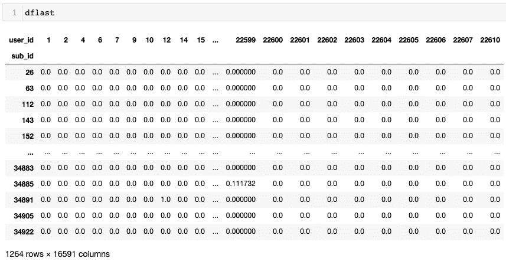

简化数据帧

由于将数据集限制为我们前面讨论的两个用户和子编辑阈值，我们已经将数据集大小从大约 35，000 x 22，000 大幅减少到大约 1，200 x 17，000。并且，在使用 CSR 之后，我们已经将矩阵处理成一个更有用的形式，作为一个名为“csr_data”的对象。是时候设计我们的 subreddit 推荐器了。

# **子编辑推荐器**

子编辑推荐器的代码

首先，我们将 CSR 数据拟合到 KNN 算法中，最近邻的数量设置为 20，度量设置为余弦距离，以便计算相似性。然后我们定义函数 subreddit recommender，将推荐的 subreddit 的数量设置为 10，指示它在数据库中搜索我们输入的 subreddit，找到相似的 sub Reddit，根据相似性对它们进行排序，并从列表中输出前 10 个最相似的 sub Reddit。让我们试一试。


子编辑— r/AskReddit

我们的第一次尝试将在 r/AskReddit 上进行，这是整个系列中最受欢迎的子编辑。

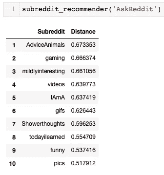

搜索与“AskReddit”相似的子编辑

所有的结果都是其他受欢迎的子群，它们的相似性相当低，最相似的子群是 r/AdviceAnimals，距离只有 0.673。也许我们的输入太普通了，因为大多数用户似乎都遵循它，以及列表中的其他子编辑。也许我们应该选择一个更加小众的子主题。这将是对 subreddit 推荐者成功的真正考验。


子编辑— r/leageoflegends

我们的下一个子编辑是 r/leagueoflegends，这是另一个不太受欢迎的子编辑，仍然在用户评论数量最多的前 5 个子编辑之列。在我们进行这个搜索之前，我们应该问自己，我们对它的期望是什么？幸运的话，一个基于特定主题的子编辑，比如视频游戏，应该和其他基于视频游戏的子编辑非常相似。

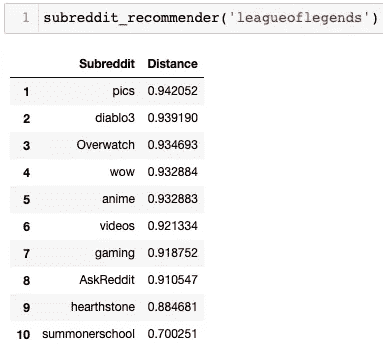

搜索与“leagueoflegends”相似的子条目

在流行的子编辑 r/pics 之后，来自搜索的下一个最相似的子编辑是 r/diabo3、r/Overwatch 和 r/wow，分别具有 0.942、0.939 和 0.934 的距离。由于这三个子主题都是基于视频游戏，我认为这是一次成功的尝试！其他类似的子学分支是 r/anime(一个经常与视频游戏重叠的兴趣)，r/gaming，r/hearthstone(另一个视频游戏)，以及 r/召唤师学校(另一个英雄联盟子学分支)。事实上，唯一不直接相关的子编辑是 r/pics、r/videos 和 r/AskReddit——但这三个子编辑在用户中非常常见，搜索很难不将它们视为与其他子编辑相似。


subred dit—r/赛博朋克

我们最后的尝试将是 r/赛博朋克，一个致力于黑暗、科技和反乌托邦社会的诱人美学的分支。我们期待在搜索中看到其他类似类型的子主题。

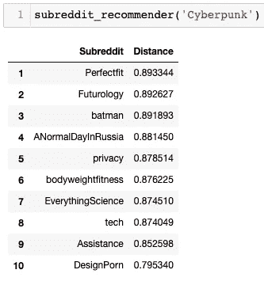

搜索与“赛博朋克”相似的子主题

虽然有些人可能很难看出这些子主题和我们最初的输入之间的相似性，但我看到了一些共同的主题——r/perfect fit 和 r/DesignPorn 是关于功能对象的美学，而 r/Futorology，r/privacy，r/EverythingScience 和 r/tech 是关于科学和技术的，r/ANormalDayInRussia 是一种很难描述的反乌托邦。r/batman 也代表了一个超级英雄，根据上下文可以被认为是赛博朋克的缩影。r/bodyweightfitness 和 r/Assistance 是我很难与该主题相关联的唯一子主题，但该范围内大多数其他类似的子主题都很容易解释，并且相似性得分也在 0.79 到 0.89 之间——对我来说，这是成功的另一个标志。

# **局限性和结论**

这个项目有几个限制，主要是由于数据集。

首先，数据仅限于 5 天的时间，而且是从 4 年前开始搜集的。该集合也不包含所有 Reddit 用户、这些 Reddit 用户的所有评论或抓取时可用的所有子编辑。它也只包括用户评论的记录，而不是帖子——如果我们试图确定不同子主题中的用户参与度，知道这些可能更重要。此外，有十万个子网站和数亿用户在使用 Reddit，基于整个网站制作一个准确的子网站推荐器将是一项比这个项目更艰巨的任务。

另一个明显的限制是，我们必须从头开始开发自己的用户评级系统。我们不能依赖用户可能以实际评级的形式直接给我们的明确的子编辑偏好，我们必须根据用户评论历史向我们透露的隐含的偏好来估计用户对不同子编辑的评级。

除了这些更明显的限制之外，我们还发现，数量不确定的用户是机器人，他们的评论计数和关注的子主题并不反映真实人类的行为或兴趣。相似性搜索结果也受到包含最多评论的最受关注的子编辑的影响——如果我们的系统推荐一个每个人都已经知道的子编辑，那么为什么还要使用搜索呢？

然而，尽管有这些限制，我仍然认为这个项目是中等程度的成功！大多数推荐的子编辑与我们的原始输入相对相似，虽然不是所有的都完全匹配，但几乎没有结果是完全不同的。虽然它可以使用更多的数据并对其评级系统进行一些修改，但看起来这个 subreddit 推荐器几乎已经可以使用了——在任何领域！

# 参考

[](https://www.reddit.com/) [## 新闻网站名

### Reddit 是一个基于人们兴趣的社区网络。找到您感兴趣的社区，并成为其中的一员…

www.reddit.com](https://www.reddit.com/) [](https://en.wikipedia.org/wiki/Reddit) [## Reddit —维基百科

### reddit(风格化为 Reddit)是一个社交新闻聚合、网络内容评级和讨论网站，它声称…

en.wikipedia.org](https://en.wikipedia.org/wiki/Reddit) [](https://backlinko.com/reddit-users) [## Reddit 使用和增长统计:2021 年有多少人使用 Reddit？

### Reddit 成立于 2015 年，是一个围绕不同兴趣分类的集中式社区平台。它始于…

backlinko.com](https://backlinko.com/reddit-users) [](https://realpython.com/build-recommendation-engine-collaborative-filtering/) [## 用协同过滤构建推荐引擎——真正的 Python

### 在本教程中，您将了解到协同过滤，这是最常见的构建…

realpython.com](https://realpython.com/build-recommendation-engine-collaborative-filtering/) [](https://www.kaggle.com/colemaclean/subreddit-interactions) [## 25，000 名用户的子编辑交互

### 根据元数据为 Reddit 用户建模

www.kaggle.com](https://www.kaggle.com/colemaclean/subreddit-interactions) [](https://machinelearningmastery.com/sparse-matrices-for-machine-learning/) [## 机器学习稀疏矩阵简介——机器学习掌握

### 包含大部分零值的矩阵称为稀疏矩阵，不同于包含大部分值的矩阵…

machinelearningmastery.com](https://machinelearningmastery.com/sparse-matrices-for-machine-learning/)