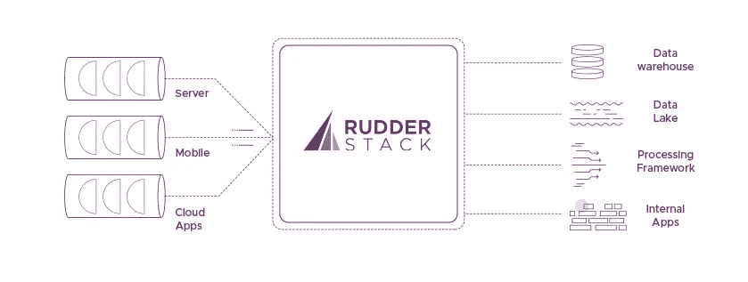
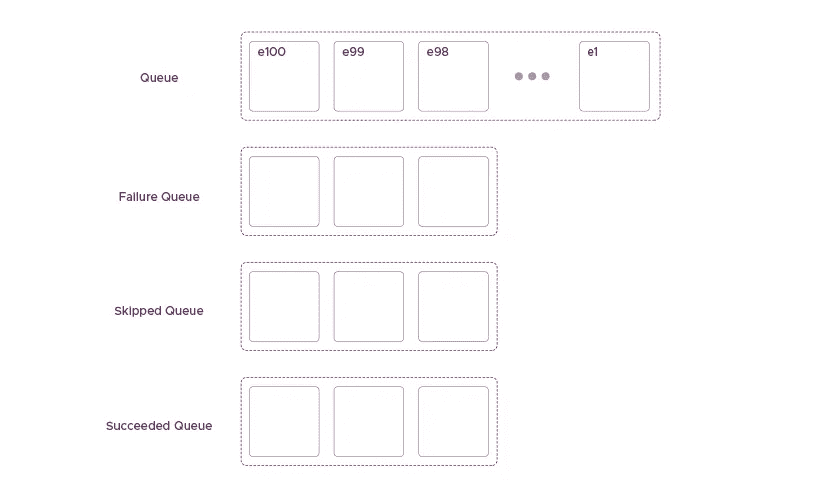
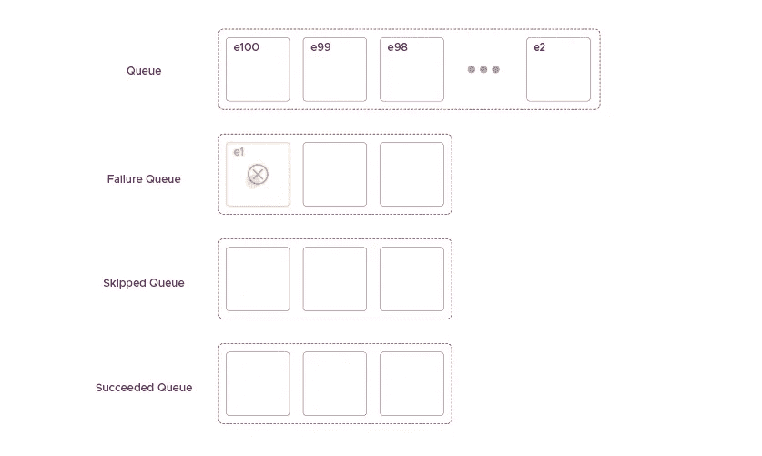
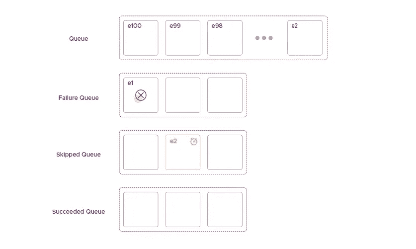
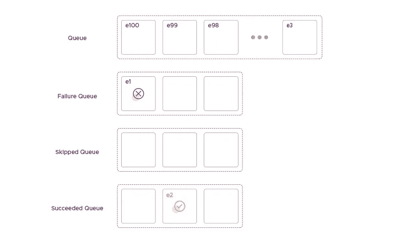
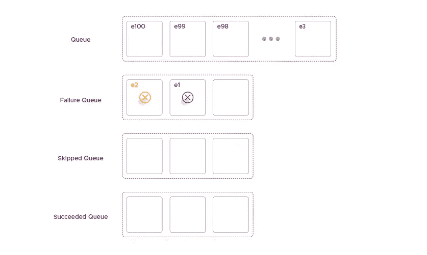

# 构建可靠的客户数据基础设施

> 原文：<https://medium.com/nerd-for-tech/building-a-reliable-customer-data-infrastructure-7dd88e91336e?source=collection_archive---------12----------------------->

**客户数据基础设施(CDI)** 是数据密集型应用的典型例子。Martin Kleppmann 的书[设计数据密集型应用](https://dataintensive.net/)在解释什么是数据密集型应用方面做了惊人的工作。CDI 的核心是一个基础设施，用于捕获、处理和路由来自应用程序的事件流。

# 客户数据基础架构中的路由

谈到数据基础设施，路由可能不是您最常听到的术语。但是，它增加了构建 CDI 的复杂性和工程挑战。路由包括将事件流从 CDI 发送到通常位于云上的各种系统和应用程序。这种应用程序的一个例子是像 Salesforce 这样的 CRM。生活在不同硬件、不同网络上的系统之间的这种交互通过不可靠的 web APIs 进行。此外，这些交互由不同的组织管理，这增加了 CDI 的复杂性。

路由需要容错，以确保不会丢失任何数据。但是，它还需要提供强一致性保证。例如，路由需要一个严格的顺序，它将数据传递给目的地服务，目的地服务将对数据执行一些操作。考虑客户与电子商务应用程序交互的一系列事件。比方说，第一个事件是产品搜索，然后是将产品添加到购物篮中，最后是结帐。当将这些事件流式传输到执行该顺序的系统时，我们希望保持该顺序。

# 客户数据基础架构中的重复数据删除

另一个相关问题是在通过 CDI 路由到这些目的地时对事件进行重复数据消除。从客户端的网络故障和重试到 CDI 中的故障，许多原因都可能导致重复事件的发生。但是这些源中的重复事件不应该导致目标中的重复事件。

这篇文章是我们试图描述我们在[舵栈](https://markdowntohtml.com/)面临的工程挑战以及我们如何应对这些挑战的系列文章的一部分。希望这将是一个与工程界对话的绝佳机会。毕竟，在处理棘手的工程问题时，您必须与社区互动，以找到最佳的解决方案。这很有趣，你最有可能发现你可能忽略的问题。

# 剖析客户数据基础架构

该图显示了客户数据基础架构(如 RudderStack)的典型部署:

**客户数据基础设施的典型部署——方向舵堆栈**

# 客户数据基础架构中的组件

正如我们在上面看到的，客户数据基础架构中有三个主要组件。

*   **客户端:**这是收集所有数据的地方。客户端可以位于数据中心内服务器的移动设备上。此外，客户端甚至可以是生成事件的云应用程序。
*   **数据平面:**这是所有神奇事情发生的地方。RudderStack 将数据从客户端推送到负责处理数据的数据层。事件的模式映射、处理、过滤和路由都发生在这一部分。
*   **目的地:**数据平面只负责将数据以正确的形式可靠地传送到正确的目的地。目的地可以是存储引擎，如数据仓库、文件系统、处理框架(如 Apache Spark)或云上的应用程序。

# 这些组件是如何组合在一起的

重要的是要记住，客户端可以在不同的网络、硬件和软件上运行。所有客户端都使用一个小软件，负责捕获数据并可靠地将其推送到数据平面。我们可以控制这个小小的软件。客户端的数量可以从服务器端客户端的几十个到移动设备的几百万个。

数据层是一个分布式系统，运行在可能随时发生故障的不同服务器上。即使在故障条件下，系统也必须提供容错和一致性保证。

目的地也有不同的能力和可靠性保证，比如实现事务的高度一致的数据库系统。此外，一些目的地可以管理在通过 UTP 通信的不可靠网络上运行的应用程序。

因此，定义和维护可靠的 CDI 是高级分布式系统中的一项工作。

# 舵栈中的容错和一致性

希望我已经让你相信了现实生活是多么的混乱，失败是一种常态。

目的地可能下降，可能是节流事件。此外，方向舵堆栈和目的地之间可能会出现短暂的网络故障。对我们来说更是如此，因为 RudderStack 的一部分运行在客户端的环境中。因此，当给定的消息无法传递时，可能会出现个别消息失败。例如，由于格式错误的消息或目标错误，可能会发生这种情况。我们已经看到了非标准编码触发失败的错误。

更糟糕的是，目的地通常不会返回错误响应代码来区分这两者。Google Analytics 总是返回 200 个错误响应代码。但是，有些目的地会针对服务器端停机时间和它无法处理的单个消息错误返回 5xx。RudderStack 的目标是设计一个可以优雅地处理这些场景的系统。这篇文章将关注我们如何处理与目的地相关的场景。

# 场景

为了简单起见，我们将考虑一个简单的场景。在这里，我们有:

*   一系列事件
*   接收这些事件的方向舵堆栈
*   一个目的地从方向舵堆栈接收这些事件

在这种情况下，我们不关心如何向 RudderStack 交付事件序列。我们将假设他们总是无损到达。此外，即使它们是无序的，RudderStack 也总能对序列进行排序。

目的地可以是通过任何接口连接的任何系统。此外，它存在于 RudderStack 的硬件和软件边界之外。

RudderStack 中的数据总是以事件序列的形式存在。RudderStack 对这些事件进行排序，这样人们总是可以使用它们的时间戳对这些事件进行排序。这个秩序很重要，我们要维护它。

**队列中的一系列事件**

正如我们所看到的，上述消息是一系列元组。这里，每个元组包含事件和一个标志，让系统知道系统是否已经处理了这些元组。

# 实施容错

在试图将事件推到目的地时，处理失败的最直接方式是通过实现某种重试机制。如果事件 e1 失败，我们可以继续重试这个特定的事件(在一段时间内有一些指数后退)。我们最终可以放弃，继续下一个信息。这不是正确的解决方案，原因如下:

*   目标服务器可能只是停机，有时停机时间可能长达数小时。因此，我们不希望在此期间丢失大量消息。定义这样一个窗口并不简单，即使对于同一个目的地，它的参数也可能经常改变。
*   如果错误在消息本身，我们希望立即转移到下一个事件。用指数回退重试会不必要地减慢整个管道。这里有两种情况我们想要处理:
*   事件之间没有依赖关系，顺序也不重要。这是一个简单的例子，我们可以放松一致性约束并丢弃事件。
*   事件之间有很强的相关性，一个事件的失败也会影响其他相互依赖的事件。

# 舵栈容错解决方案——三队列

在 RudderStack，考虑到以上具体原因，我们实现了容错和一致性。我们提出了一个解决方案，它有三个队列，分别对应于三种不同的状态。事件在任何时候都可以位于方向舵堆栈中的以下三个队列中的任何一个:

**对应三种事件状态的三个队列**

*   成功队列
*   失败队列
*   跳过的队列

我们不是在事件 e1 无法传递的情况下重试并丢弃事件 E1，而是将它与我们在上次失败尝试中生成的时间戳一起转移到失败状态。通过将事件的状态更改为 failed，我们将其移动到失败队列中。RudderStack 跟踪故障队列，事件根据其故障时间戳和可配置的重试增量进行重试。

**E1 的失败队列**

在 RudderStack 将事件 e1 移入故障队列后，我们进入下一个事件 e2。使用下面的场景可以清楚地了解为每个状态使用队列的原因。

# 事件 e2 与事件 e1 相关

如果下一个事件 e2 与事件 e1 相关，那么我们不能将它发送到目的地。由于我们希望确保交付订单的一致性，我们还将 e2 推入跳过的队列中。因此，我们不只是实现一个状态机，将每个事件从一种状态转换到另一种状态。此外，我们使用队列，在这里我们可以保持顺序。用于识别事件 e2 是否与 e1 相关的规则是通过检查它们两者的所有权。如果同一用户生成它们，那么它们被认为是相关的。

**跳过的队列—事件 e2 与事件 e1 相关**

# 事件 e2 与事件 e1 无关

下一个场景是事件 e2 与事件 e1 无关。在这种情况下，RudderStack 将尝试处理它。如果我们成功地交付了事件，那么我们将它标记为成功。RudderStack 将其放入 Succeeded 队列，并最终将其从系统中完全删除。

**成功队列—事件 e2 与事件 e1** 无关

# 事件 e2 与事件 e1 不相关，也无法传递

在下一个场景中，事件 e2 与事件 e1 不相关，但它也无法交付。在这种情况下，RudderStack 将 e2 推到 e1 后面的失败队列中。这两个不相关的消息失败暗示了目的端的失败，不像某些消息问题。考虑到这一点，我们使用一些以前的时间历史中成功队列和失败队列的比率。这个比率有助于确定问题是与目的地相关还是与消息相关。我们使用这个比率和一些启发式方法来:

*   确定失败后重试前的休眠时间——如果最后几个消息中有太多失败，我们应该在再次到达目的地之前休眠更多时间。此外，我们应该将失败的消息保存更长时间。
*   如果比率很低，那么消息本身可能有问题，因此可以丢弃它们。

**失败队列——事件 e2 与事件 e1 无关——也无法交付**

上述算法管理 RudderStack 中事件的状态和顺序。它描述了在目的端出现故障时，我们如何处理系统的可靠性。它允许我们以可配置和自适应的方式容错。我们可以决定等待和维护事件的时间。此外，我们可以试探性地决定问题在哪里。它还允许我们维护事件顺序，并在允许 RudderStack 在其管理的数据之上交付激活的级别上保持一致。

# 结论

构建可靠的数据应用程序并不是一件容易的事情，尤其是对于像 RudderStack 这样的[开放系统。在这篇文章中，我们描述了一个高级算法，如何使用状态机和队列的组合来处理失败的目的地交付，以实现令人满意的容错和一致性。](https://rudderstack.com/)

该算法本身并不能完全保证上述目标。如果处理数据的 RudderStack 节点崩溃了会发生什么？如果我们用完了内存，队列容纳不下了怎么办？关于我们如何处理这些有更多的细节。例如，我们将我们提到的队列实现为 Postgres 上的旋转表，但这是另一篇博客文章的素材。

# 免费注册并开始发送数据

测试我们的事件流、ELT 和反向 ETL 管道。使用我们的 HTTP 源在不到 5 分钟的时间内发送数据，或者在您的网站或应用程序中安装我们 12 个 SDK 中的一个。[上手](https://app.rudderlabs.com/signup?type=freetrial)。

本博客最初发表于
[https://rudder stack . com/blog/building-a-reliable-customer-data-infra structure](https://rudderstack.com/blog/building-a-reliable-customer-data-infrastructure)