# 用 Spring boot 构建一个简单的 RESTful API

> 原文：<https://medium.com/nerd-for-tech/building-a-simple-restful-api-with-spring-boot-2351687ecab0?source=collection_archive---------0----------------------->

大家好。在这篇文章中，我将指导您使用 Spring boot 框架构建一个简单的 REST API。在看详细的指南之前，让我们看看什么是 Spring boot 框架。


春季标志

Spring 是一个开源的 Java 框架，你可以用它来构建强大的应用程序。通常，这用于构建 web 应用程序和微服务。Spring boot 是一个基于 Spring 的框架，使得构建 spring 应用程序非常方便。

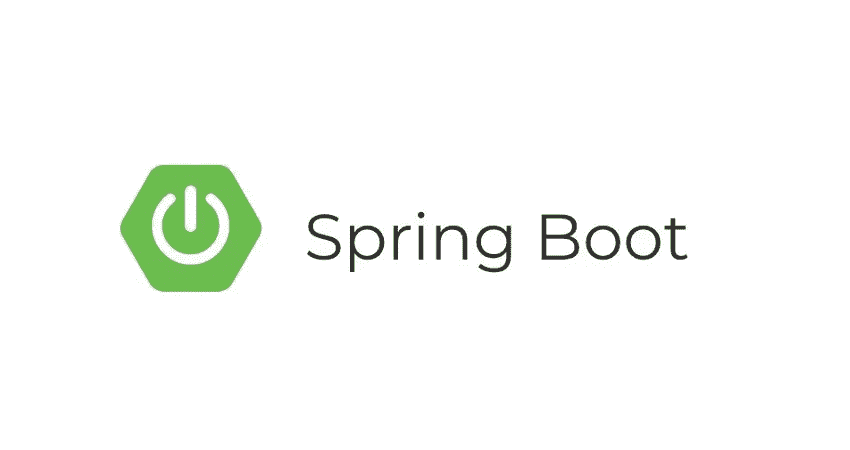

Spring boot 为 Spring 应用程序提供自动配置，它用于构建微服务。Spring boot 帮助开发人员减少开发和测试时间，让开发人员专注于他们的业务逻辑和其他事情。关于这些框架的更多细节，你可以点击下面的链接，花些时间阅读并获得更好的理解。

[https://spring.io/why-spring](https://spring.io/why-spring)

https://spring.io/projects/spring-boot

让我们看看如何启动您的应用程序。

你可以从 [spring initializr](https://start.spring.io/) 开始你的 spring 应用程序。在该网站上，您可以选择首选配置并生成您的模板。或者你也可以用你的 IDE 开始你的项目。(如果要使用 IDE 启动项目，请继续。我将给出 IntelliJ IDEA 和 Eclipse 的说明)

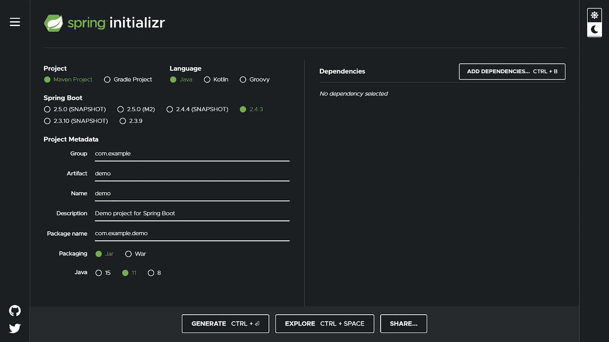

弹簧初始化 r

我使用相同的数据来生成项目，但是您可以更改必要的信息。确保您使用的是最新的 spring boot 版本(在本例中是 2.4.3)，而不是快照。此外，这里我选择了 maven 项目。

之后，您必须选择必要的依赖项。下图将向您展示我将在这个项目中使用的依赖关系。

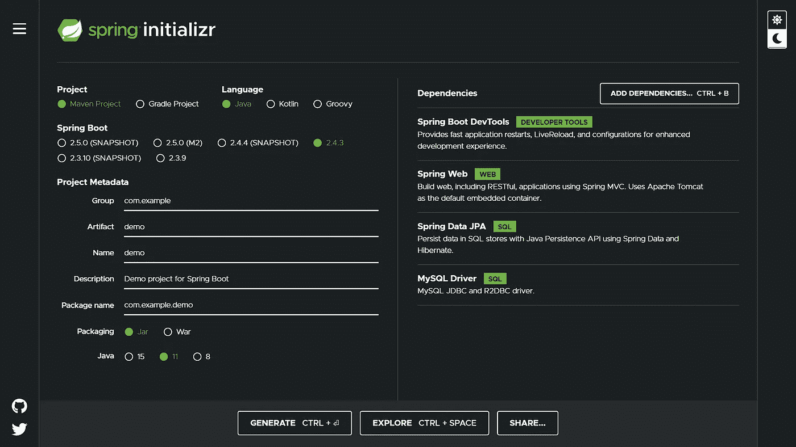

选定的依赖项

您可以通过单击“添加依赖项”按钮(或按下 *CTRL + B* )来选择这些依赖项。

Spring boot DevTools 用于部署项目以测试应用程序。正如图片中提到的，它提供了快速重启、实时重新加载和配置。

Spring Web 用于构建我们的应用程序，它使用 tomcat 服务器来部署应用程序。

Spring Data JPA 帮助我们管理数据库中的数据。

由于我将 MySQL 作为我的数据库(在 xampp 服务器中)，我还添加了 MySQL 驱动程序来连接数据库。

在生成项目之前，可以通过点击“Explore”(*CTRL+SPACE*)进行预览。

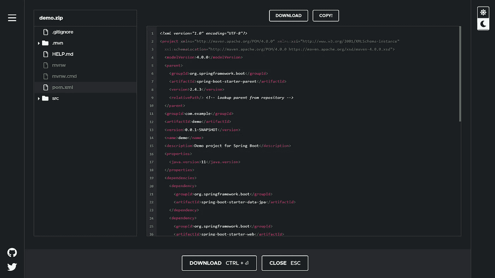

项目结构

在这里,“pom.xml”文件包含了所有的依赖项。因此，如果您以后需要向项目添加另一个依赖项，您可以在这里完成。现在，这个文件看起来像这样。

```
*<?xml version="1.0" encoding="UTF-8"?>*<project  xmlns:xsi="http://www.w3.org/2001/XMLSchema-instance"xsi:schemaLocation="http://maven.apache.org/POM/4.0.0 https://maven.apache.org/xsd/maven-4.0.0.xsd"><modelVersion>4.0.0</modelVersion><parent><groupId>org.springframework.boot</groupId><artifactId>spring-boot-starter-parent</artifactId><version>2.4.3</version><relativePath/> *<!-- lookup parent from repository -->*</parent><groupId>com.example</groupId><artifactId>demo</artifactId><version>0.0.1-SNAPSHOT</version><name>demo</name><description>Demo project for Spring Boot</description><properties><java.version>11</java.version></properties><dependencies><dependency><groupId>org.springframework.boot</groupId><artifactId>spring-boot-starter-data-jpa</artifactId></dependency><dependency><groupId>org.springframework.boot</groupId><artifactId>spring-boot-starter-web</artifactId></dependency><dependency><groupId>org.springframework.boot</groupId><artifactId>spring-boot-devtools</artifactId><scope>runtime</scope><optional>true</optional></dependency><dependency><groupId>mysql</groupId><artifactId>mysql-connector-java</artifactId><scope>runtime</scope></dependency><dependency><groupId>org.springframework.boot</groupId><artifactId>spring-boot-starter-test</artifactId><scope>test</scope></dependency></dependencies><build><plugins><plugin><groupId>org.springframework.boot</groupId><artifactId>spring-boot-maven-plugin</artifactId></plugin></plugins></build></project>
```

之后，您可以生成项目并使用首选 IDE 打开它。我将使用 IntelliJ 的想法。

如果您希望使用您的 IDE 来生成项目，那么您可以遵循这些步骤。如果已经这样做了，那么你可以跳过这些步骤。

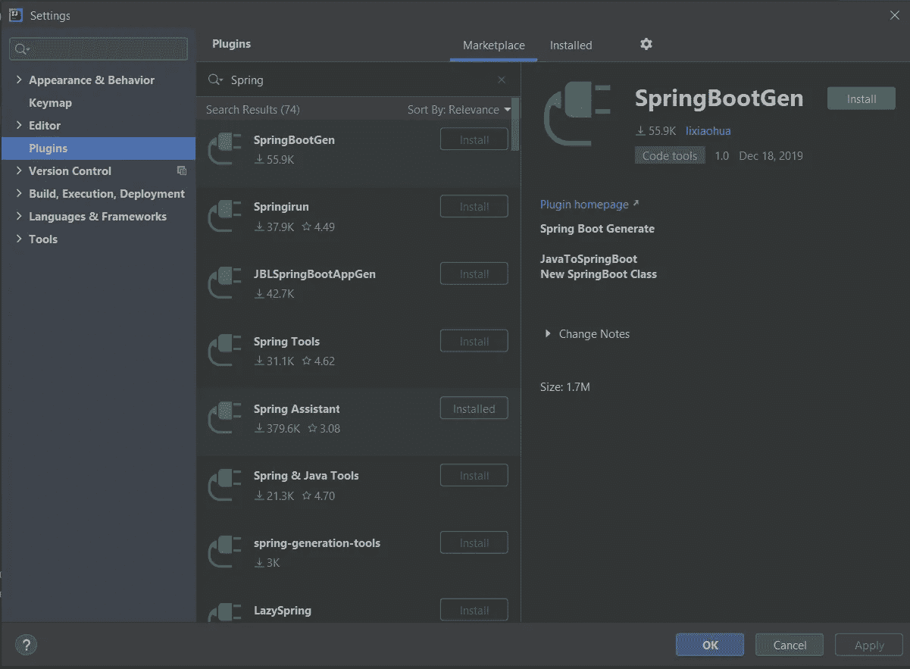

下载插件

在 IntelliJ IDEA 中，你需要下载一个插件来生成。我用过一个叫“Spring 助手”的插件。要下载这个，进入**文件>设置>插件** ( *CTRL + ALT + S >* **插件**)并选择市场标签。然后搜索 Spring，它会显示所有可用的插件。你可以安装任何插件，但我建议你使用“弹簧助手”插件。

然后进入**文件>新建>项目**你会看到这个窗口。

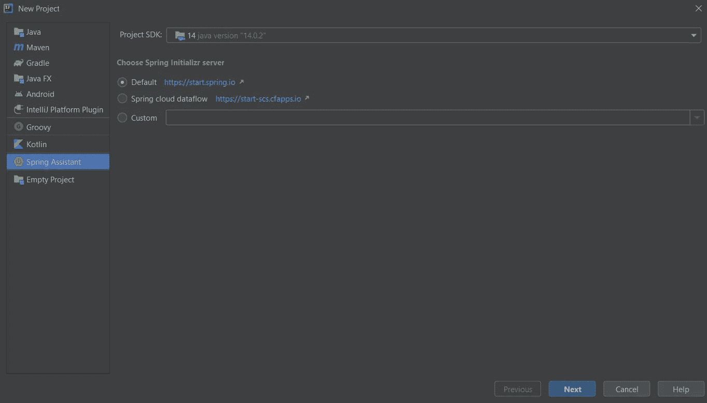

新项目

选择 Spring Assistant(或者安装了插件)，点击“下一步”(检查是否选择了默认)。然后，您将得到表单，像 Spring initializr 一样填写项目细节。这里，我也将使用默认数据，但您可以根据需要更改它。

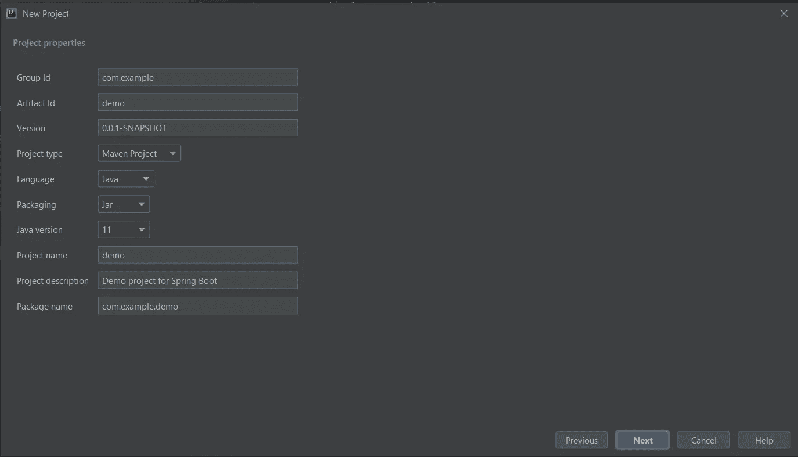

单击“下一步”，您将被重定向到另一个窗口以选择依赖关系。您可以选择我们在 Spring initializr 中选择的所有依赖项。(如果您跳过了这一部分，请向上滚动，您可以找到带有必要依赖项的图像)。

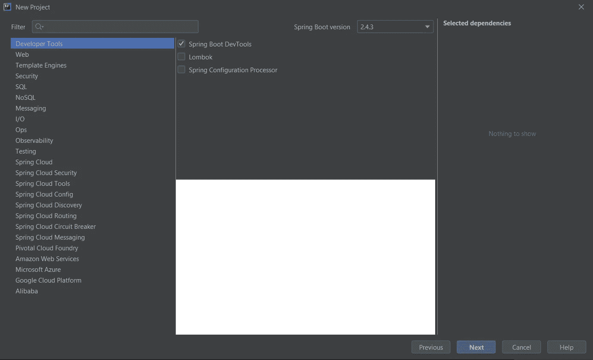

选择依赖关系

单击“下一步”后，您将看到一个窗口，提供保存文件的位置。继续并给出一个位置，然后点击“完成”。项目将在这之后生成，maven 将同步您的项目并下载所有的库。让我们看看如何用 Eclipse IDE 做同样的事情。

同样在 Ecplise 中，您需要有一个插件来生成 spring 应用程序。我将使用 Spring Tool Suit 4 (STS4)，它可以在 eclipse marketplace 中安装。你可以通过点击**帮助> Eclipse marketplace** 进入 eclipse marketplace。然后搜索“spring 工具套件”，安装 STS 4。

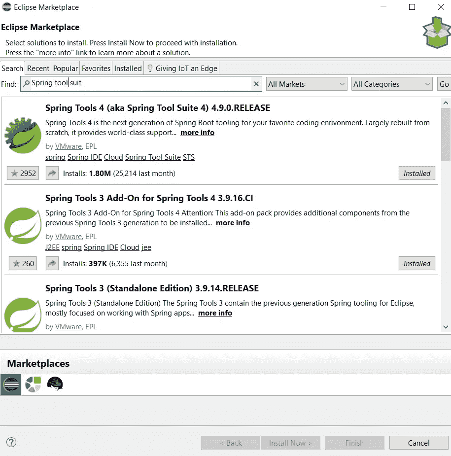

安装 STS 4

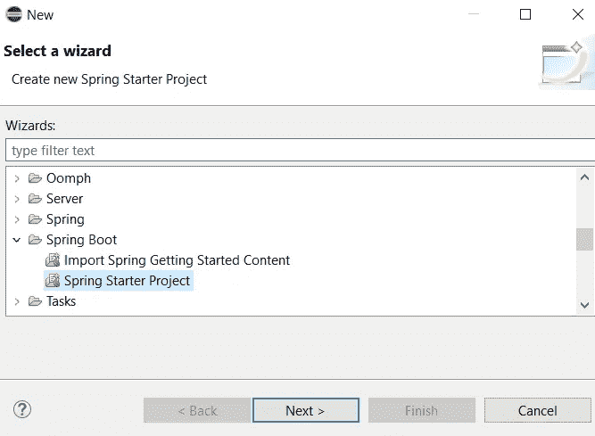

然后可以到**文件>新建>其他**然后选择 Spring boot 下的 Spring boot starter 项目。然后点击“下一步”，你就可以进入“新的 Spring starter 项目”窗口。在那里，您可以更改详细信息，然后单击“下一步”。

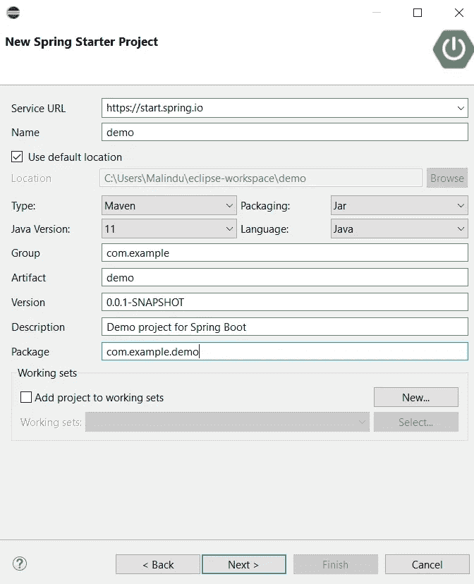

开始一个新项目

之后，您将看到一个选择依赖项的窗口。您可以选择必要的依赖项。

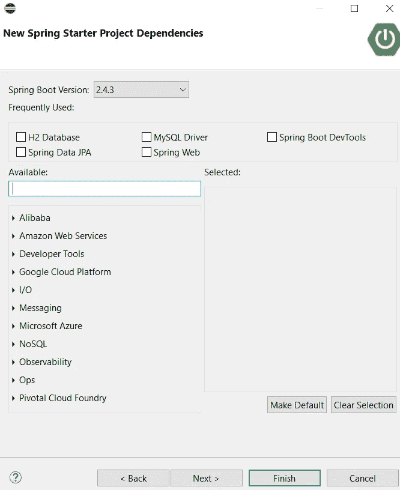

添加依赖关系

然后您就可以完成了，eclipse 将下载这些库并让您开始开发您的应用程序。

我想这就足够开始了。让我们开始编写构建 API 的代码。在这里，我将制作一个 API 来管理用户(创建，更新，删除，读取)。

在您成功地创建了一个 starter 项目之后，您可以看到您的主类(在我的例子中是 DemoApplication.java)，它看起来应该是这样的。

你可以在类声明上方看到“@SpringBootApplication”注释。这定义了您的 spring 应用程序，spring boot 可以将这个类识别为主类。让我们开始写代码吧。

首先，我们需要创建我们的实体/模型类，也就是“用户”。让我们创建一个名为“com.example.demo.entity”的包，将我们的类放在其中。在这里，您可以使用您自己的包名，您在创建 starter 项目和添加。实体”到底。之后，您可以看到在您的包中创建了一个名为“entity”的文件夹。

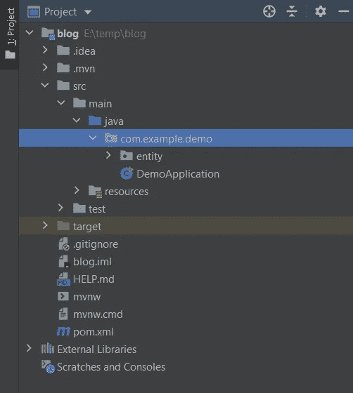

实体包已创建

在新创建的包中，让我们创建一个名为“User.java”的类。在课堂上。编写相关的变量，并为它们创建 getters 和 setters。为了让它与 JPA 一起工作，我们需要在下面的类中添加注释。根据这段代码创建您的实体类。

这将在数据库中定义您的用户表。但是如果你不创建一个从 JpaRepository 类扩展的接口，JPA 什么也不会做。为此，在您的工作包(如实体包)中创建另一个名为 repository 的包。在里面创建了一个接口，我把它命名为“UserRepository”。

然后，我们需要在 application.properties 文件中编写数据库配置，该文件位于 **src > main > resources** 文件夹中。然后写出这些配置。

这里，我没有包括“spring.datasource.password”属性，因为我的数据库没有密码。但是，如果您的数据库有密码，请确保您正在编写此内容。你也可以编辑网址。URL 格式应为“JDBC:MySQL://{您的数据库 IP }:{ port }/{数据库名称}”。如果您不希望控制台中出现任何执行消息，那么您可以删除“spring.jpa.show-sql”行。

之后，让我们创建一个服务类来实现使用我们的用户存储库的必要方法。要创建它，您必须在主包中创建另一个名为“services”的包(我的包是 com.example.demo.services)。

现在，我们可以实现一个控制器类来定义我们的 API URLs，并使用服务类来管理数据。为此，在主包中创建另一个名为“controller”的包(在我的项目中是 com.example.demo.controller)。在包内部，我创建了一个 UserController 类来定义我的 API。

在这个类中，你可以随意定义你的 API URLs。如果您需要使用自定义 URL，那么您可以使用@RequestMapping 注释并将路径作为字符串传递给注释，就像我在声明该类之前所做的那样。

现在我们什么都做了。让我们启动数据库并运行应用程序。在运行应用程序之前，检查您的数据库是否有以给定实体名称(users)命名的表。运行应用程序后，您可以在控制台中看到这些消息

现在让我们去检查我们的数据库。

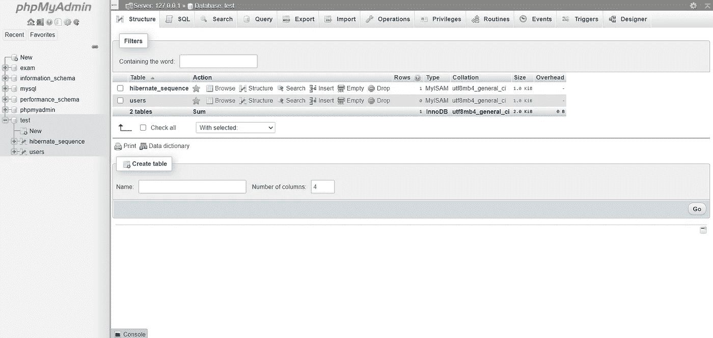

如果您正确地遵循了所有的步骤，那么您可以看到在运行数据库之后已经自动创建了一个表。呀呀呀！！！！

我们必须检查我们的应用程序是否工作正常。为此，我使用邮递员。如果您没有 postman，请点击此链接[下载](https://www.postman.com/downloads/)。

首先，我测试了从 postman 添加一个用户，如下图所示，它成功地返回了添加的用户。在那里，您可以看到 JPA 自动为用户提供了一个“id”。

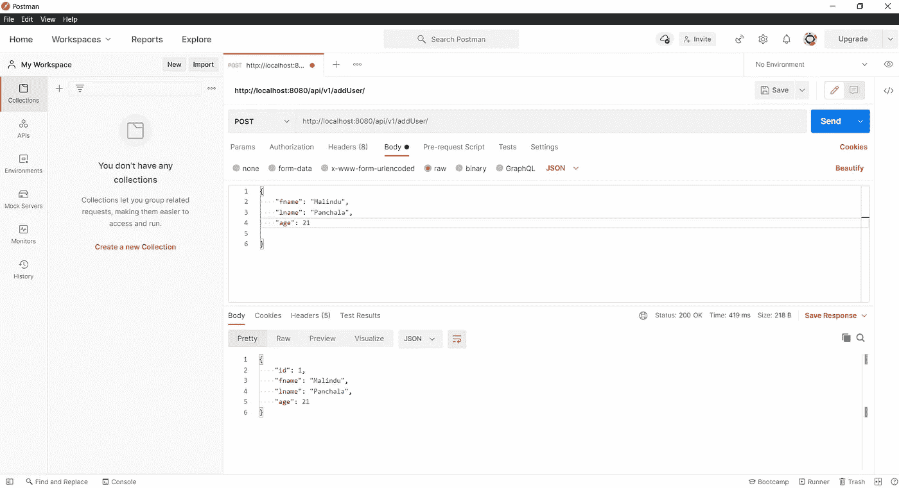

添加用户

在我的数据库中，一个新的记录被创建了！

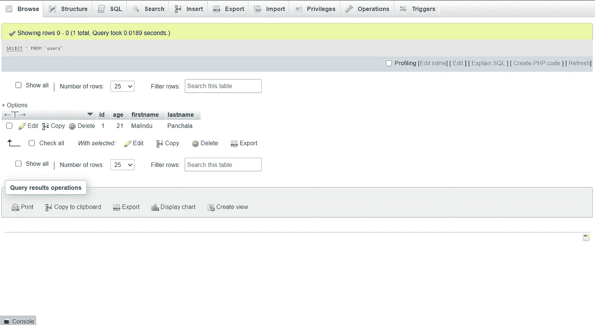

新纪录创造了！

然后，在添加更多用户后，我测试了我的 get 方法。测试/用户 API 调用后。我得到了发送给 API 的每个用户。

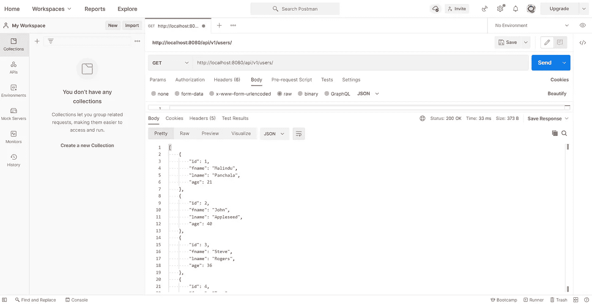

现在可以请求所有用户

它还根据 URL 中给出的 id 返回用户。

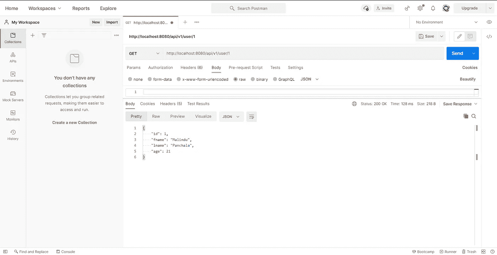

按 id 检索用户

之后，我更新了第二个用户，它返回了发送的数据。这意味着，API 成功地更新了给定的记录。但是在这里，我只发送了对象，没有在 URL 中包含 id。但是我在服务类中的函数通过从传递的对象中获取 id 来更新记录。但是如果您希望通过 URL 传递 id，您也可以这样做。你只需要在 controller 类的 updateUser 函数中定义@PathVariable，并将{id}添加到@PutMapping 的 string 参数中。

数据库现在看起来像这样，

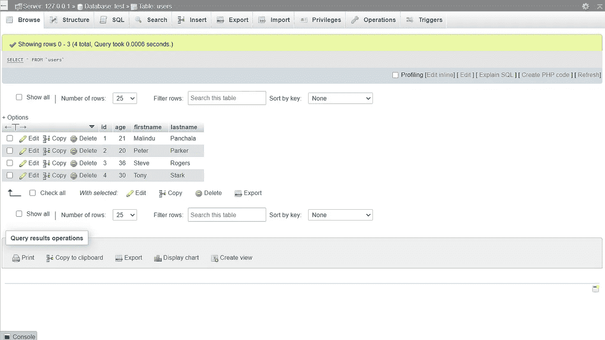

数据库ˌ资料库

最后，我执行了删除请求，这是它的结果。

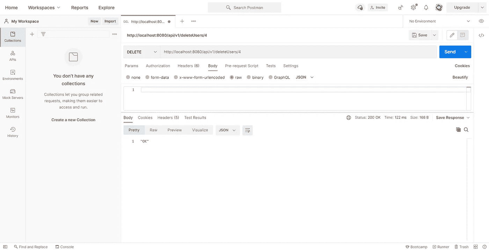

删除请求

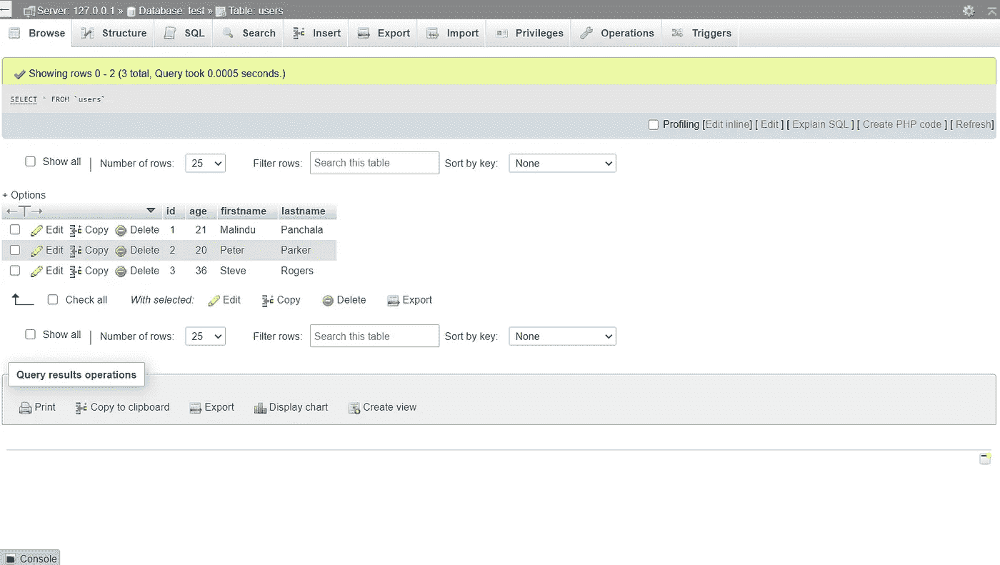

记录 4 已删除

您可以看到 id 为 4 的记录现在被删除了，它返回了响应“OK”。您可以在 deleteUser 方法中将其更改为另一个 HTTP 响应。

现在我们已经使用 Spring boot 框架成功地创建了一个带有 CRUD 操作的 RESTful API(*phew…*)。在此之后，您可以参考其他资源和实践，以此框架获得更多技能。祝你好运，感谢你阅读本指南。如果你在这篇文章中发现任何错误或者你有更好的方法，请留下评论。谢谢大家！❤

给你的资源:【https://spring.io/guides】T4

本帖代码:[https://github.com/MalinduPanchala/Springboot_api.git](https://github.com/MalinduPanchala/Springboot_api.git)