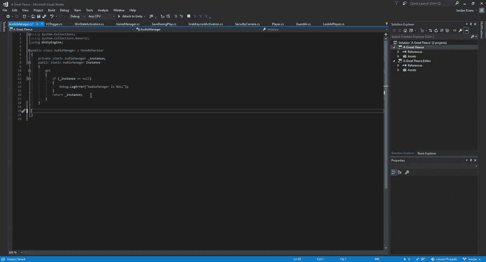
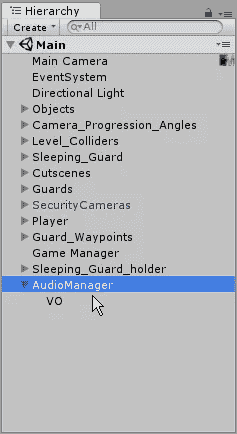
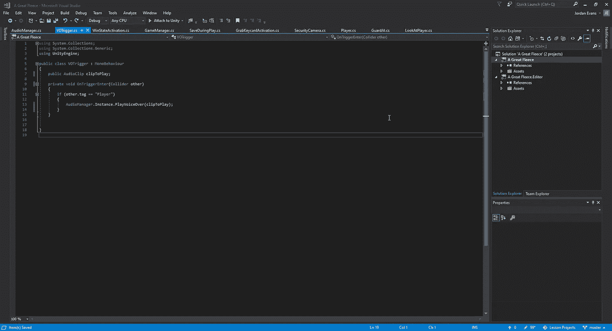
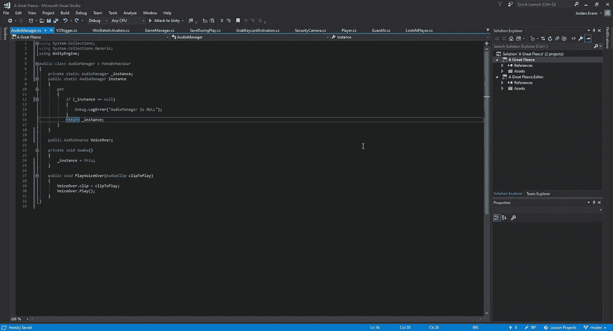
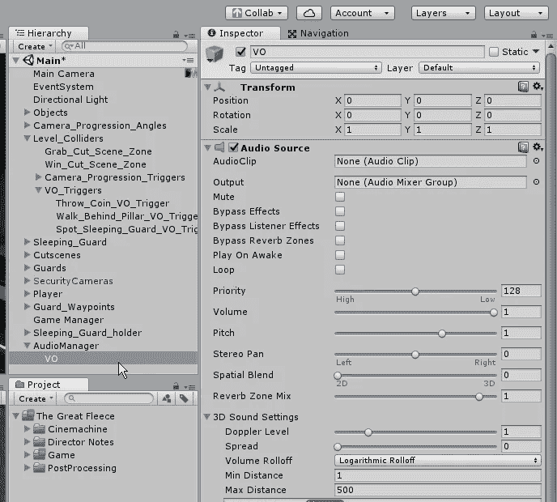
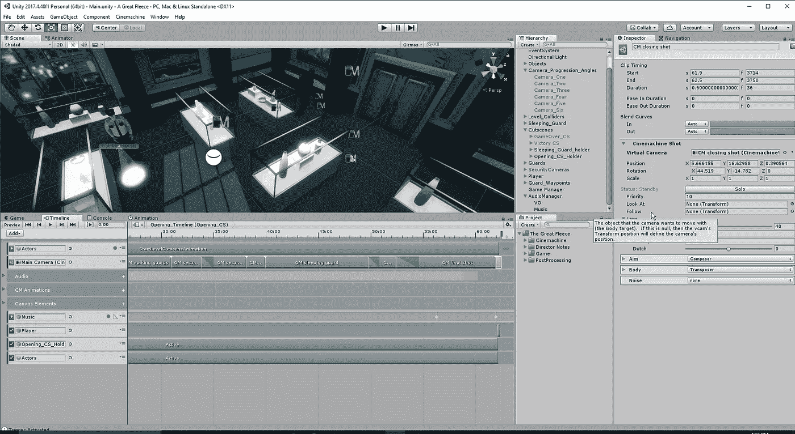
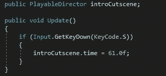

# 构建音频管理器

> 原文：<https://medium.com/nerd-for-tech/building-an-audio-manager-2a457fd7f0dd?source=collection_archive---------26----------------------->

现在我们已经建立了过场动画，我们需要调整我们的声音剪辑，同时加入一些环境音乐。对于这种情况，让我们建立一个新的管理系统，我们的音频管理器。我们需要做的第一件事是为我们的音频管理器构建一个新的单独脚本:

有了这个新的音频管理器脚本，我们将把它附加到我们的音频管理器空对象，我们将需要在我们的游戏。在那里，我们将为 VO 创建一个子对象。这是因为如果我们像现在这样玩游戏，当我们换到一个新的视角时，VO 将会被静音，并且只来自一边。

在这里，我们可以在 VOtrigger 中进行调整，同时在 AudioManager 脚本中添加几行代码，这样我们就可以通过 Audiomanager 在前面的对象上播放我们的剪辑:

相反，通过我们的剪辑播放这个对象，我们可以更好地调整它的所有属性。我们要确保它不被设置为在清醒时播放，单独将我们的空间混合设置为 2D。
从这里，我们可以进行任何我们想要的更改，它将立即应用于所有的 voiceover 剪辑，而不是我们必须分别查看每个单独的剪辑。

接下来，我们将回到我们的介绍过场动画，因为我们将想要为我们的游戏添加环境音乐，以及添加我们已经用我们的睡眠守卫完成的内容:

对于音乐，我们将在我们的音频管理器中创建一个音乐对象，并通过音频源组件将环境音乐附加到它上面。然后，我们将播放它作为一个动画轨道，这样我们就可以调整它的音量，以达到它在过场动画结束时的峰值。接下来，我们将隐藏我们的玩家对象，直到过场动画结束，同时让过场动画和其中的演员在这一切结束时消失。

在我们的 GameManager 脚本中，我们将在允许我们访问 PlayableDirector 后输入这行代码，方法是添加 Playables 的库。由于我们已经将游戏的资产设置为出现在过场动画的结尾，所以我们不会提前对过场动画应用完全停止，而是直接跳到过场动画的结尾，在那里我们已经淡出，并且我们的所有资产都已被激活到场景中。
有了这些，我们就快完成这个小项目了。游戏的核心已经完成，除了主菜单和创建一个加载屏幕。