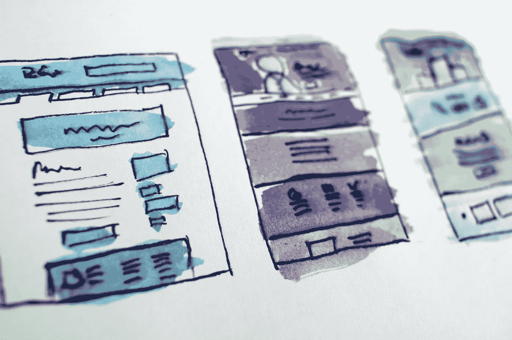

# 用 GatsbyJS 和 TailwindCSS 构建我的站点

> 原文：<https://medium.com/nerd-for-tech/building-my-site-with-gatsbyjs-and-tailwindcss-6bad652cb3e5?source=collection_archive---------11----------------------->

## 用 Gatsby，Tailwind 和 Remark 建立一个简单的响应网站。

🔔**本文原帖**[**【MihaiBojin.com】**](https://mihaibojin.com/personal-site/gatsbyjs-and-tailwindcss-tech-stack?utm_source=Medium&utm_medium=organic&utm_campaign=rss)**。**🔔



照片由[HalGatewood.com](https://unsplash.com/@halacious?utm_source=unsplash&utm_medium=referral&utm_content=creditCopyText)在 [Unsplash](https://unsplash.com/s/photos/website?utm_source=unsplash&utm_medium=referral&utm_content=creditCopyText) 上拍摄

回到本系列的第[篇介绍文章](https://mihaibojin.com/personal-site/building-a-personal-site?utm_source=Medium&utm_medium=organic&utm_campaign=rss)，我决定将我的技术栈建立在[盖茨比](https://www.gatsby.com/)的基础上。

我不会涉及 Gatsby 的所有特性，但这是我选择这个技术堆栈的原因:

*   性能:服务器端渲染的 HTML 可以被 CDN 缓存，并以惊人的速度在全球范围内分发给任何用户(Gatsby 的[自动图像优化](https://www.gatsbyjs.com/docs/conceptual/using-gatsby-image/)在这里也有好处！)
*   强大的、[开箱即用的 SEO 支持](https://www.gatsbyjs.com/docs/how-to/adding-common-features/seo/)——Gatsby 使生成元数据变得超级容易，但编写代码也很简单(例如，[用 json-ld](https://mihaibojin.com/personal-site/structured-semantic-data-with-json-ld?utm_source=Medium&utm_medium=organic&utm_campaign=rss) 添加结构化语义数据)
*   代码中的文章——我不想与第三方 CMS/后端集成——我发现将 Markdown 提交给 GitHub 更简单
*   [开箱易访问](https://www.gatsbyjs.com/docs/conceptual/making-your-site-accessible/)支持；通过林挺和其他功能，盖茨比让易访问性成为焦点！
*   强大的生态系统和易于扩展——Gatsby 是用 [React](https://reactjs.org/) 构建的，这使得编写插件和组件变得超级容易！

## 建立新的 GatsbyJS 站点

在进一步深入之前，我推荐浏览一下[盖茨比的教程](https://www.gatsbyjs.com/docs/tutorial/)。这是一个很好的资源，可以让你更好地理解盖茨比是如何工作的！

下一步是查看[启动器库](https://www.gatsbyjs.com/starters/)。其中一个甚至可以满足你的需求。就我而言，我对自己想要实现的目标更有主见，所以我从一个空白的盖茨比网站开始。

第一步是安装 Gatsby CLI。这个命令将是你所有盖茨比的切入点。

```
npm install -g gatsby-cli
```

然后，创建一个空白的盖茨比网站；我把我的回购叫做`personal-site`，但是你可以选择任何名字:

```
gatsby new personal-site
```

接下来，该安装插件了；我决定用[顺风](https://tailwindcss.com/)。

```
cd personal-site

# Install the necessary plugins
npm install -D gatsby-plugin-postcss tailwindcss@latest postcss@latest autoprefixer@latest

# Init the tailwind.config.js file
npx tailwindcss init -p
```

(如果你愿意，你也可以跟随更深入的教程[。)](https://tailwindcss.com/docs/guides/gatsby)

为了在生产中优化您的站点，您应该使用 [purge](https://tailwindcss.com/docs/guides/gatsby#configure-tailwind-to-remove-unused-styles-in-production) 从生成的 CSS 代码中移除未使用的 CSS 样式。

为此，通过编辑您的`gatsby-config.js`文件并将`gatsby-plugin-postcss`添加到您的配置中来添加 PostCSS:

```
module.exports = {
  plugins: [
    ...
    `gatsby-plugin-postcss`,
  ]
}
```

旁注:`gatsby-config.js`是您的 GatsbyJS 项目的“心脏”——在这里您可以定义配置、添加插件，甚至可以存储关于您的站点的元数据(例如，标题、site_url 等)。).

最后一步是将所有 Tailwind 的 CSS 添加到项目中。

创建一个名为`src/styles/global.css`的文件，并定义以下指令:

```
@tailwind base;
@tailwind components;
@tailwind utilities;
```

对于我的网站，由于我不是 UI 设计师，我决定[购买 TailwindUI](https://tailwindui.com/pricing) 。我很高兴我的选择！这是迄今为止我做的最好的投资之一！！！它让我在几乎没有 CSS 知识的情况下，用最少的努力，得到了一个看起来很棒的网站。

> 免责声明:我与任何顺风产品都没有关系，并根据我自己的经验提供了一个客观的观点！

为了[设置 TailwindUI](https://tailwindui.com/documentation#getting-set-up) ，我安装了这些插件:

```
npm install tailwindcss@latest

npm install @tailwindcss/forms @tailwindcss/typography @tailwindcss/aspect-ratio

npm install @headlessui/react @heroicons/react
```

## 可选配置

## 语法突出显示

因为这个站点的目标是软件工程师，所以您还需要突出显示任何代码示例的语法。显而易见的选择是[。](https://prismjs.com/)

安装必要的插件:

```
npm install gatsby-transformer-remark gatsby-remark-prismjs prismjs
```

然后将`gatsby-remark-prismjs`添加到您的`gatsby-config.js`文件中:

```
module.exports = {
  plugins: [
    ...
    `gatsby-remark-prismjs`,
  ]
}
```

## 代码林挺

这个网站已经可以使用了，但是我喜欢代码的一致性，所以接下来，我配置了更漂亮的和 ESlint:

```
npm install -g prettier eslint
```

我用的是 VSCode，我安装了更漂亮的插件:

```
# Open the command palette (Cmd-Shift-P on MacOS)
type: ext install esbenp.prettier-vscode
press Enter
```

接下来，我将我的漂亮配置存储在项目的工作区中。同样，从命令面板(Cmd-Shift-P)中，选择“首选项:打开工作区设置(JSON)”并添加以下配置:

```
{
  // Set the default
  "editor.formatOnSave": false,
  // Enable per-language
  "[javascript]": {
    "editor.formatOnSave": true,
    "editor.defaultFormatter": "esbenp.prettier-vscode"
  },
  "[json]": {
    "editor.formatOnSave": true,
    "editor.defaultFormatter": "esbenp.prettier-vscode"
  },
  "[jsonc]": {
    "editor.formatOnSave": true,
    "editor.defaultFormatter": "esbenp.prettier-vscode"
  },
  "markdownlint.config": {
    "MD033": false
  }
}
```

另外，创建一个`.prettierrc`文件并添加以下配置:

```
{
  "arrowParens": "always",
  "semi": true,
  "trailingComma": "all",
  "singleQuote": true,
  "printWidth": 70
}
```

## 替换主字体

你可以做的最后一件事是配置一个自定义字体——我用的是 TailwindUI 的字体。

```
# Install the font
npm install @fontsource/inter
```

然后编辑`gatsby-browser.js`并添加:

```
import '@fontsource/inter';
```

最后，编辑`tailwind.config.js`,并添加以下代码块:

```
theme: {
    extend: {
      fontFamily: {
        sans: ['Inter', ...defaultTheme.fontFamily.sans],
      },
    },
  },
```

值得一提的是[官方教程](https://tailwindui.com/documentation#optional-add-the-inter-font-family)对我来说不太管用。如果你把这些步骤和官方文档对比一下，你会注意到我导入的是`@fontsource/inter`，不是`@fontsource/inter.css`，字体名称是`Inter`，不是`Inter var`。希望这对别人有用！

## 运营网站

您可以使用以下方式在开发模式(快速刷新)下运行网站:

```
gatsby develop
```

它将在 [http://localhost:8000/](http://localhost:8000/) 以**开发**模式运行您的 Gatsby 站点。

当您准备好发布它时，执行:

```
gatsby build
gatsby serve
```

它将托管您在 [http://localhost:9000/](http://localhost:9000/) 上以**生产**模式运行的 Gatsby 站点。

此时，您可以开始添加页面和内容。现在，我不会讨论添加页面或托管在哪里，但这里有一个资源列表应该有所帮助:

*   [创建你的第一个盖茨比网站](https://www.gatsbyjs.com/docs/tutorial/part-1/)
*   [创建页面组件](https://www.gatsbyjs.com/docs/tutorial/part-2/#create-a-page-component)
*   [部署和托管 GatsbyJS 站点](https://www.gatsbyjs.com/docs/deploying-and-hosting/)

如果你喜欢这篇文章，并想阅读更多类似的文章，请订阅我的简讯。我每隔几周就发一封！