# 给我买那个表情..！

> 原文：<https://medium.com/nerd-for-tech/buy-me-that-look-f003e855c692?source=collection_archive---------10----------------------->


时尚

> "除非有人穿上衣服，否则衣服毫无意义。"

> 这是端到端时尚推荐引擎的第二部分。在第一部分，我讨论了直到掩模 RCNN 模型。在这一部分，我将继续其余章节的讨论。我建议先看第一部分，再看这一部分。以下是第一部分的链接:[*https://ranveersachin 143 . medium . com/buy-me-that-look-5473444 B1 f2d*](https://ranveersachin143.medium.com/buy-me-that-look-5473444b1f2d)

## 目录:

*   引言。
*   商业问题。
*   文献综述。
*   数据概述和 DL 公式。
*   损失函数。
*   掩模 RCNN 模型。
*   三元网络模型。
*   预测。
*   部署。
*   未来的工作。
*   未来连接的配置文件。
*   参考文献。

# 7.三元网络模型

三元网络是著名的暹罗网络的变体。暹罗网络使用共享权重来计算不同输入的结果。三元组网络由锚、阳性样本和阴性样本组成。在我们的例子中，对于任何给定的产品类别，锚定图像是产品所在街道图像的裁剪区域，而正片是同一产品的目录图像，负片是同一产品但具有不同设计、质地、颜色、品牌和尺寸的目录图像。如下图所示，三元组通过网络传播，其想法是有 3 个相同的网络，具有相同的神经网络架构。最后一层是平面层，这些层的输出是三元组的嵌入。

```
Input : (anchor_image, pos_image, neg_image)
Output : (achor_embedding, pos_embedding, neg_embedding)
```

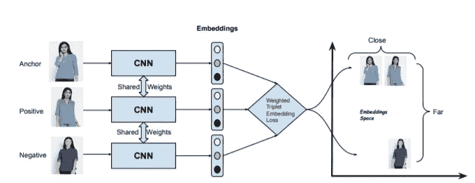

三元网络

在这些嵌入中，我们定义了一个损失函数(如前所述)。网络应该使用反向传播算法来最小化损失函数。我们希望，当模型完成训练时，它将产生嵌入(大小为 d ),这样，在某些方面(颜色、纹理、设计、大小)相似的产品应该放置得更近，而不相似的产品应该放置在“d”维欧几里得空间中。我们将使用这些嵌入来获得给定产品的推荐。

## 7.1]数据描述

为了训练 triplet network network，我使用了 street2shop 数据集，我按照这里提供的说明下载了数据集:[http://www.tamaraberg.com/street2shop](http://www.tamaraberg.com/street2shop)。基本上有三个文件夹，包含创建锚定图像、正图像和负图像数据集所需的所有信息。元数据中提供的文件夹是培训、测试和检索。在 train/test 文件夹中，我们有对应于每个类的单独的 json 文件，例如“train _ pair _ footwear.json”，在这些 json 文件中，我们给出了“照片 id”，即街道照片的 id，“边界框”信息，如宽度、高度、顶部、左侧。这有助于裁剪感兴趣的产品的精确区域，因为同一街道图像中可能有多个产品，我们一次将只关注一个产品，字段“产品 id”表示街道图像的裁剪区域中存在的产品 id。在 train/test 文件夹中，我们只给出了产品 id 和街道照片 id，我们还需要知道相应的匹配商店照片 id，因为我们要将一对图像发送到三元组网络，所以为了获得商店照片 id，他们在 retrieval.json 文件中提供了映射[产品 id，商店照片 id]。

他们还提供了 photo.txt 文件。该文件包含照片 id(商店照片 id 或街道照片 id)和相应的 url 以获取具有该 id 的图像。

使用训练、测试和检索文件夹中提供的信息，我们将创建 meta_df pandas 数据帧，其列为类型、类别、street_photo_id、shop_photo_id、宽度、顶部、高度、左侧。该数据帧将帮助我们创建最终数据集，并使用类别、product_id、shop_photo_id 等字段检索 df。该数据帧将帮助我们获得给定产品的商店图像。


meta_df

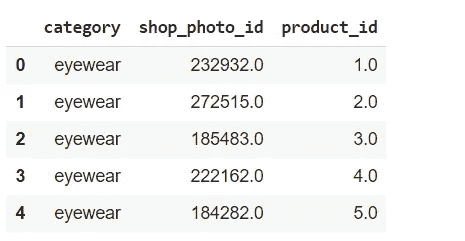

检索 _df

## 7.2]数据分析和预处理

## 7.2.1]类别分布

只有 20357 个街道图像和 404483 个商店图像以及 11 个不同的类别。还可以看到街道和商店图像中的类别分布。

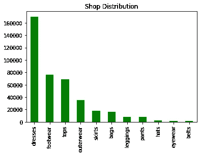

商店分布

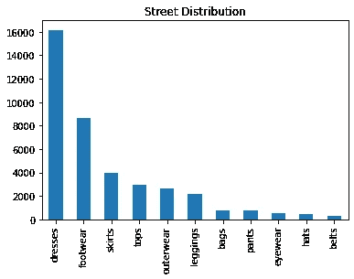

街道分布

## 7.2.2]多个条目

我们需要记住三件事，第一，可以看到街头模特穿着许多产品，第二，同一产品可以由许多街头模特穿着，第三，对于街道图像中出现的产品，我们可以有多个匹配的商店图像。

> *答:在下图中，我们可以看到模特穿了不同的衣服，比如夹克、包、鞋子、裙子等。*


案例一

> *B]在下图中，我们可以看到商店照片有重复条目，这是因为同一件商品(在本例中为裙子)被不同的模特穿过，因此出现了重复条目。*

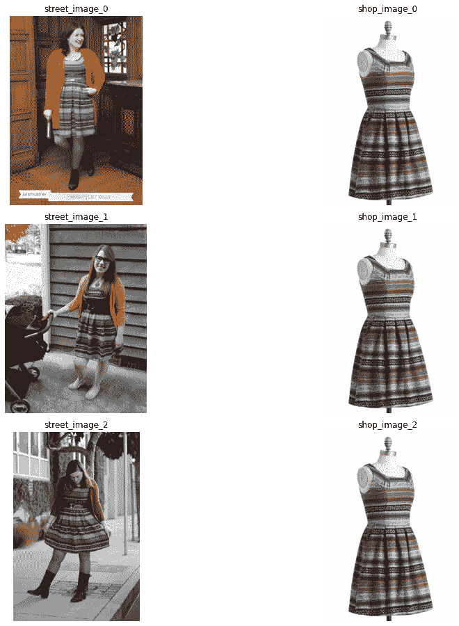

案例二

> 为了验证第三种情况，我们将连接 meta_df 和 retrieve_df，这样我们就可以在一行中包含 street_photo_id 和相应的 shop_photo_id，我们将连接['category '，' product_id']上的两个数据帧。从数据帧中我们可以看到，给定的带有某个产品 id 的 street_photo 有多个匹配的商店图像，例如，有多个条目用于街道照片 id 14537 和产品 id 286。


加入 Df

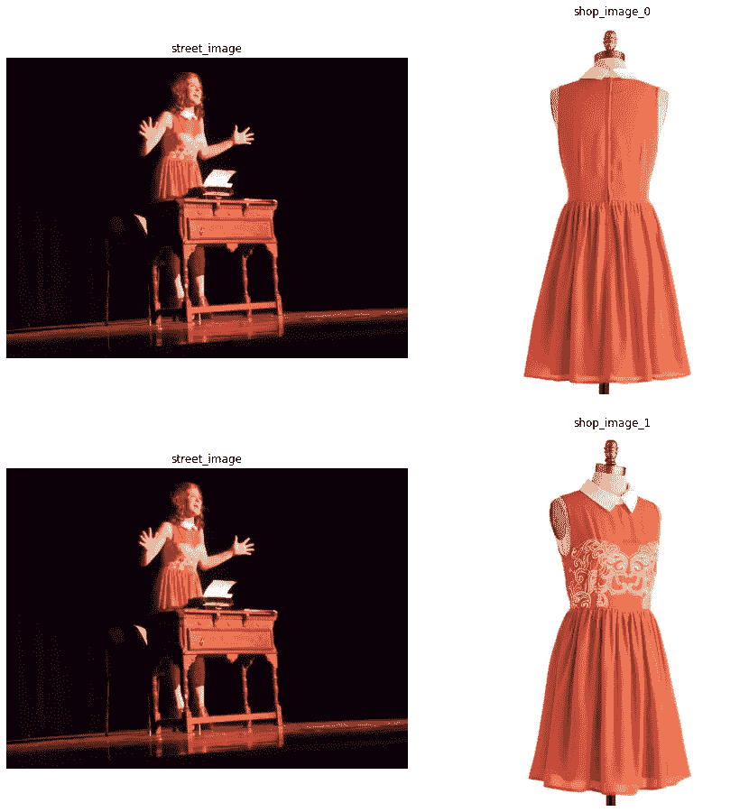

案例三

## 7.2.3]商店-街道交叉口

street_photo_id 和 shop_photo_id 必须是两个不同的集合，因此，如果我们取这两个集合的交集，我们必须得到一个空集。让我们使用集合运算来验证这一点。

```
print(‘Intesection set cardinality = ‘, len(set(meta_df_new[‘street_photo_id’]).intersection(set(meta_df_new[‘shop_photo_id’])))) ## Output
Intesection set cardinality =  0
```

## 7.2.4]照片 Url 数据框

我们将创建 photos.csv 文件，其中包含照片 id 和照片 url 等字段。我们正在创建此文件，以便可以轻松创建最终数据集。这个 csv 文件稍后将用于获取街道和商店图像的 URL。

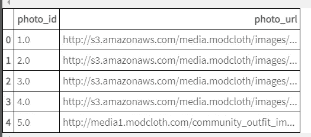

照片 _ 网址 _df

## 7.2.5]图像选择

由于有太多的图像，我们将只处理 30000 张图像，以便获得 30000 张。我首先想到的是随机获取 30000 张图像，但在这个过程中，我们可能会遇到这样的情况:我们会有街道图像，但相应的配对商店图像不存在，因此为了避免这种情况，我创建了 final_df 数据帧。这个数据帧将有商店 _ 照片 _id，商店 _ 照片 _ 网址，街道 _ 照片 _id 和街道 _ 照片 _ 网址和其他一些领域。为了下载图像，我们将遍历每一行，并行下载街道和商店图像。

> *为了获得所需的 df，我们将首先在 photo_id 和 street_photo_id 上将 meta_df_new 与 photo_df 连接，它将给出 street_photo_id 的 url，让我们将此列称为“street _ photo _ URL”*
> 
> *为了获得‘商店 _ 照片 _ 网址’,我们将在照片 _id 和商店 _ 照片 _id 上加入 meta_df_new 和照片 _ df*


连接后的 df(meta _ df _ new)

## 7.2.6]删除损坏的图像

使用数据集中提供的 Url，我无法下载一些图像，问题可能出在“我的驱动器”或“Url”中。我们需要正确地处理损坏的图像，我们需要一对图像来使模型工作，如果任何一个图像(街道或商店)损坏，我们必须从数据集中删除整行条目。首先，我打乱了 meta_df_new，这样我们就不会得到同一类的所有图像。我遵循的过程是循环直到 50000 次迭代，希望在 50000 次迭代中得到 30000 张图像。我使用多进程库来并行处理 url 请求，我第一次没有使用它，它花了 9 个小时来运行 30000 次迭代，但在使用池后，我设法在半小时内循环了 50000 次迭代。我做了并行 32 个进程，每个进程将采取一行数据帧，并检查是否商店照片 url 或街道照片 url 损坏或没有损坏，如果没有损坏，然后下载两个图像，并将 is_selected 字段设置为 1，表示这一行被选中。如果任何一个图像损坏，将 is_selected 设置为 0，并删除我们刚刚下载的图像，也就是说，如果错误出现在 shop_url 中，那么我们必须已经下载了 street_url，我们必须删除它以节省空间，如果错误出现在 street_url 中，那么没有要删除的内容，因为还没有下载任何内容。下面我提供了讨论逻辑的代码。

## 7.2.7]消除矛盾

此时，我们有一个 is_selected 字段，告诉我们该行是否被选中。但是，即使经过仔细处理，我还是有一些行的 is_selected 为 1，但是相应的街道图像不在 triplet_image 文件夹中。经过大量的调试，我设法找出了问题，问题是街道图像中可以有多种产品，所以在数据帧中存在具有相同街道 url 但具有不同商店图像的其他行。假设有一个 processX，在时间“t”它正在处理 rowX 命中街道和商店的 URL，并下载图像，它还将该行的 is_selected 设为 1。假设有另一个进程“processY”在时间“t + 10”处理 rowY，它具有与 rowX 的街道 url 相同的街道 url，但是具有不同的商店 url，不幸的是，它的 shop_url 关闭，并且“processY”未能下载相应的商店图像，根据我们的逻辑，当它失败时，代码将删除它的街道图像，但是被删除的街道图像也是 rowX 的街道图像。所以我们的代码最终删除了 rowX 的街道图像，这将在进一步处理图像时产生问题，我们必须处理这个问题。这个问题的解决方案很简单，我们将再次通过 df 循环每一行，我们将检查街道图像路径是否存在，如果不存在，我们将设置该行的 is_selected 为 0。

## 7.2.8]类别的最终分布

在过滤掉损坏的图像并只保留 30000 到 35000 张图像后，让我们验证最终数据集中类别的分布。最终数据中各种类别的分布与我们之前的分布相同。

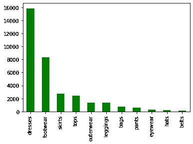

最终类别分布

## 可视化

让我们将数据集中的一些街道和商店图像进行可视化。它还帮助我们检查所有的处理是否正确。

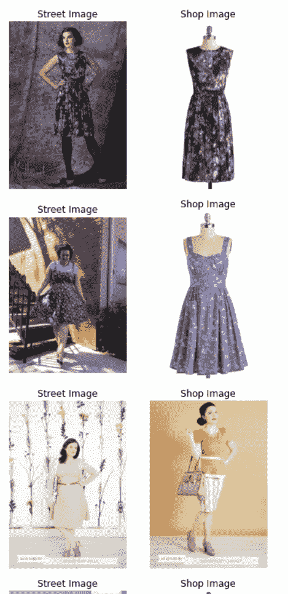

街头商店对

## 7.3]三联体训练

在训练时，我第一次从驱动器中读取图像，这导致了“I/O 错误”或有时“驱动器超时错误”,它太慢了。因此，我创建了 images_triplet 文件夹的 zip 文件 google drive 创建了 7 个 2GB 大小的 zip 文件，我将这些 zip 文件存储在 google drive 上，然后将它们解压缩到 colab 的磁盘中。现在，我不需要从驱动器上读取图像，节省了大量的培训时间。

我们在这里创建了三列 anchor_path(锚图像的路径)、pos_path(正图像的路径)、neg_path(负图像的路径)，以获取某个 rowX 的 neg_path。我首先创建 temp_df。该 df 包含所有与 rowX 类别相同的行，然后从 temp_df 中获取任意行的 pos path，并将其设置为 rowX 的 neg_path。帽子、皮带、eywear 等类别的图片很少，我选择删除它们。

一个锚定图像一次可以有多个类别，我们需要专注于单个类别，这样他们就可以提供顶部、左侧、高度、宽度值。使用这些值，我创建了两个点(x1，y1)[左上]和(x2，y2)[下]。我们将使用这两个点裁剪图像，并将此裁剪后的图像及其正面和负面图像发送到三元组网络。

在创建具有所有所需信息(例如 neg_path、anchor_path 和 pos_path)的数据帧之后。我通过从“tf.keras.utils.Sequence”类创建子类来创建数据管道。我还对数据集进行了如下扩充，这样模型就不会过度拟合。

```
self.aug1 = ia.Dropout(p=0.01)
self.aug2 = ia.GaussianBlur(sigma=(0.0, 3.0))
self.aug3 = ia.flip.Fliplr(0.8)
self.aug4 = ia.flip.Flipud(0.8)
self.aug5 = ia.Alpha((0.0,1.0),ia.AllChannelsHistogramEqualization())
```

让我们从数据生成器中获取一些数据样本，看看三元组模型将接收什么样的图像作为输入。

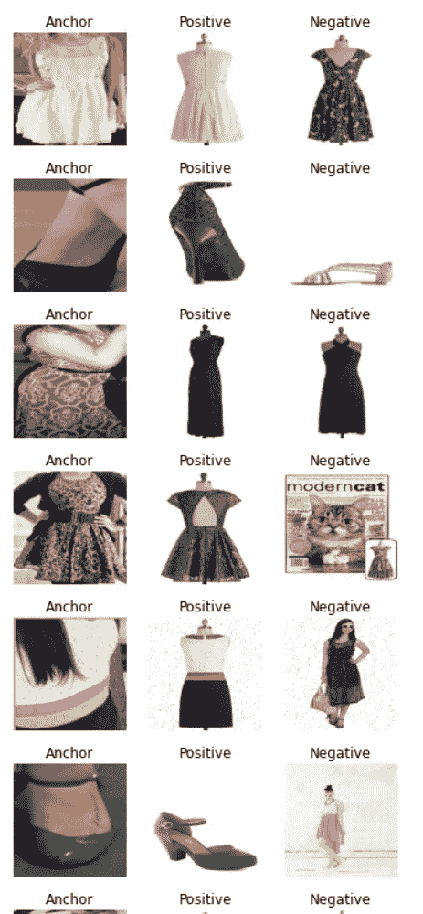

三元组训练样本

> *我分两个阶段训练模型:*
> 
> *在第一阶段，我保持学习率= 0.0001，保证金= 1，纪元= 10。*
> 
> *对于第二阶段，我保持学习率= 0.00005，余量= 1，纪元= 20*

```
Stage-I
model.fit_generator(train_gen, epochs = 10, steps_per_epoch = 150,  validation_data = valid_gen, validation_steps = 70, callbacks = [model_checkpoint])Stage-II
model.fit_generator(train_gen, epochs = 20, steps_per_epoch = 150,  validation_data = valid_gen, validation_steps = 70, callbacks = [model_checkpoint])
```

## 7.4]性能指标:

完成训练阶段后，我使用“准确性”性能指标来衡量模型性能。我保留了一些数据进行验证。在 valdiation 数据中，我有一些产品的街道图像，我们称之为 street_shoe_x，相应的商店图像，我们称之为 shop_shoe_matched。我预计模型必须将这些图像的嵌入放得更近，因此当我对 street_shoe_x 的嵌入和商店中所有鞋的嵌入(这也包括 shop_shoe_matched)取余弦相似度时，我应该得到 shop_shoe_matched 的最高余弦相似度，或者至少 shop_shoe_matched 必须出现在使用余弦相似度计算的与 street_shoe_x 最相似的鞋中。

利用这个概念，我将“准确性”定义为[命中/(命中+未命中)]。我首先将所有的商店图像输入到三元组网络模型中，并得到相应的嵌入，如下所示。任何一个 shop _ embeddings 都可以选择存储，因为它们都是同一个。

```
Input : (shop_image, shop_image, shop_image)
Output : (shop_embedding, shop_embedding, shop_embedding)
```

如果 shop_shoe_matched 是与 street_shoe_x 最相似的鞋，我们说我们有“命中”,否则我们说我们有“未命中”。我们将拍摄[BATCH_SIZE * 100]张图像并计算精确度。

```
Accuracy =  0.44916666666666666
```

## 7.5]结果

为了获得给定产品的推荐，我们将产品图像传递到网络并获得其嵌入。根据产品的类别，如鞋、裙子、包、服装，我们只采用属于产品类别的商店图像的嵌入。然后计算产品嵌入和过滤嵌入之间的余弦相似度。最后按照余弦相似度降序排序，得到 topK 个最相似的商店产品。

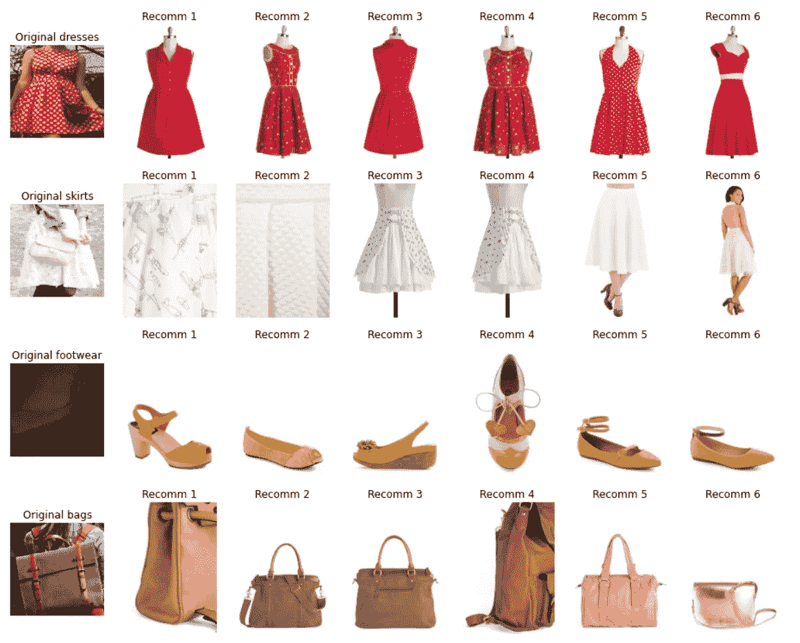

三重输出

# 8.预言

预测阶段有三个阶段，让我们一个接一个地看一下。下图是我们将要发送到掩膜 RCNN 模型进行预测的原始图像。

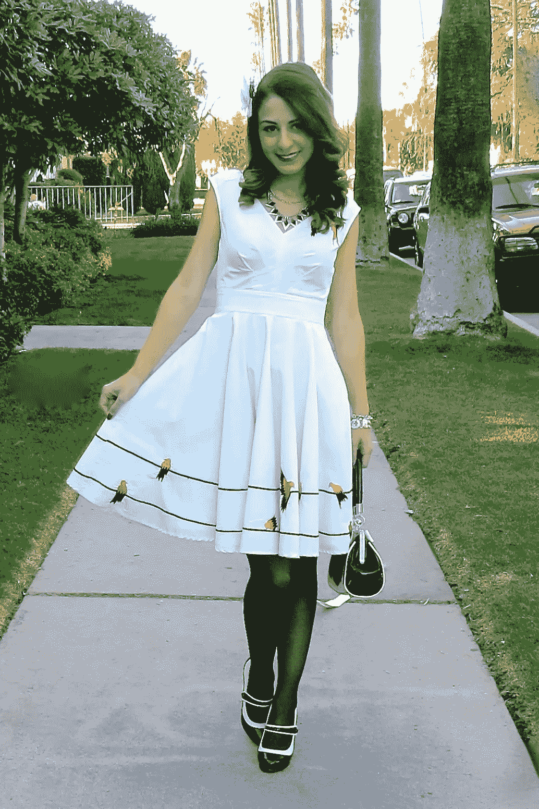

原象

> *A】屏蔽 Rcnn 输出*
> 
> *当经过训练的掩模 RCNN 模型接收上述图像作为输入时，它将为它成功检测到的每个实例给出类别标签、掩模和边界框。屏蔽 Rcnn 输出如下图所示。我们可以看到，模型已经成功地检测到感兴趣的产品的所有实例，如包、鞋、衣服、打底裤等。*

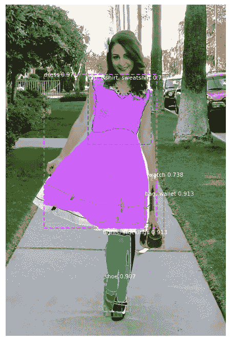

屏蔽输出

> *B】滤波输出*
> 
> *我们将对掩模 rcnn 模型的输出应用以下过滤器。第一个过滤器是移除置信度分数小于 0.75 的实例，也就是说，如果模型对某些实例不够有信心，则让该实例被移除。第二个过滤器是移除其要推荐的图像不存在于我们的数据集中的类别，因为用于训练掩模 rcnn 和三元组网络模型的数据集是不同的。在这种情况下，我选择移除不存在于三元组训练数据集中的类别。第三个过滤器是去除重复的实例，我们将保留具有最大置信度得分的实例。我们可以在过滤后的输出图像中看到，watch、top 等实例在应用过滤器后被删除。*

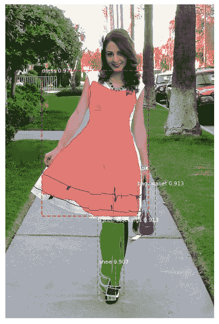

屏蔽输出滤波

> *C】最终输出*
> 
> *最后，产品类别的实例被馈送到三元组网络以获得嵌入。然后，这些嵌入被用于获得 topK 个最相似的产品，如前所述，我们将 K 保持为 6。使用 matplotlib 库绘制这些最相似的产品及其原始产品。*

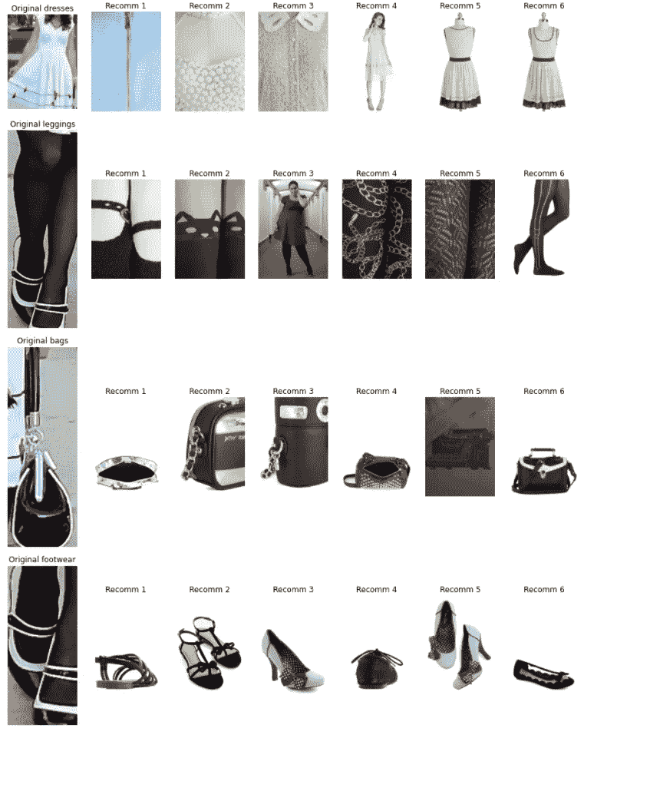

最终输出

# 9.部署

我已经在 Tensorflow 1.15.2 和 Python 3.7.10 中的 Google Colab 上训练和测试了我所有的模型。我用 streamlit 创建了我的应用程序的前端。我用过 st.markdown()、st.file_upload()、st.pyplot()等函数。我已经在本地部署了该模型，下面我提供了我的 streamlit 应用程序的视频演示。

SteamLit 应用演示

# 10.未来的工作

## 10.1]更新掩码 RCNN

当前的 Mask-RCNN 适用于 tensorflow 1.15.2 一旦 Mask-RCNN 的可靠 tensorflow 2.x 实现可用，我将更新我的代码。我在 tensorflow 1 中实现的三联体模型。x 和 2.x 两个版本都可以在我的 Git 存储库中获得。

## 10.2]添加姿态检测模块

由于缺乏数据，我跳过了论文中的姿态检测模块。一旦我获得了姿势检测的适当数据，我肯定会尝试将该模块添加到我的案例研究中。

## 10.3]掩模固定器模块

目前，该模型使用边界框信息从图像中提取产品实例，而不是使用 bbox，我尝试使用遮罩来提取产品实例，但它的性能稍差。我认为使用掩码进行提取时性能不佳的原因是，为给定产品实例生成的掩码没有与产品实例正确重叠它们或者没有与不属于产品实例的区域重叠，或者与不属于产品实例的区域重叠。

为了解决这个问题，将来我会尝试在屏蔽 RCNN 和三重网络之间增加一个模块。让我们称这个模块为蒙版固定器模块，这样蒙版固定器模块就可以修复重叠不良的蒙版。我们训练这个模块的方式将与训练传统图像分割模型的方式相同。训练数据将具有丢失了对象的某一部分的图像，并且对于对象的该丢失部分，相应的掩模将具有 1，而掩模中的其他像素将具有 0。该损失将与图像分割损失相同。这个模块的目标是为一个对象的缺失部分生成蒙版，一旦我们有一个对象的缺失部分，我们可以通过使用同一对象的非缺失部分的像素值来填充它。现在，当我使用“固定遮罩”从图像中提取产品实例时，我可以期待更好的结果。

## 10.4]处理嵌入

为了得到 topK，我们总是必须根据余弦相似性对嵌入进行排序。记住，排序发生在过滤嵌入上，也就是说，如果要计算推荐的产品属于鞋类，那么我们只取鞋类的嵌入，然后计算余弦相似度。在实时每个类别的商店图像可以在 lakhs，所以我们必须存储的嵌入也将在 lakhs，排序每个类别的嵌入 lakhs 将是一项耗时的任务。为了处理这个问题，我们可以使用基于树的方法来存储嵌入，例如 KDE、球树或基于散列的方法，例如位置敏感散列。这些技术肯定会提高给定产品类别获得推荐的时间。

## 10.5]一般改进

如果您有高计算能力的机器，您可以下载掩模 RCNN 的整个图像数据集以及三元组网络，并在整个数据集上训练模型。这将改善三元组的损失和掩模 RCNN 模型的 Map 得分。对于三元组网络，可以尝试不同的损失函数、不同的裕度值、在线、离线三元组挖掘，看看是否能改善损失。

> *感谢阅读整个博客。我希望这个博客清晰易懂，将来能帮助你为时尚产品创造最先进的推荐引擎。如果您有疑问或任何改进建议，您可以通过下面提供的链接联系我。*

代码的 Githhub 链接:【https://github.com/ranveerkln/Fashion_Git 

# 11.轮廓

[](https://www.linkedin.com/in/sachin-ranveer-b37360166/) [## Sachin Ranveer -数据工程师-Nykaa.com | LinkedIn

### 经验丰富的数据工程师，有在互联网行业工作的经历。熟练掌握亚马逊红移…

www.linkedin.com](https://www.linkedin.com/in/sachin-ranveer-b37360166/) [](https://github.com/ranveerkln) [## ranveerkln -概述

### 4 月 5 月 6 月 7 月 8 月 9 月 10 月 11 月 12 月 1 月 2 月 3 月 4 月 1 日星期三 Fri ranveerkln 在此期间没有任何活动。已创建…

github.com](https://github.com/ranveerkln) 

# 12.参考

[](https://www.appliedaicourse.com/) [## 应用课程

### 我们知道转行是多么具有挑战性。我们的应用人工智能/机器学习课程被设计为整体学习…

www.appliedaicourse.com](https://www.appliedaicourse.com/) 

[(124)讲座— 31 图像分割— III — YouTube](http://(124) Lecture - 31 Image Segmentation - III - YouTube)

【towardsdatascience.com 中型

[GitHub—sanku-lib/Image _ Triplet _ Loss:使用三重损失的图像相似度](https://github.com/sanku-lib/image_triplet_loss)

[https://arxiv.org/pdf/1703.06870.pdf](https://arxiv.org/pdf/1703.06870.pdf)