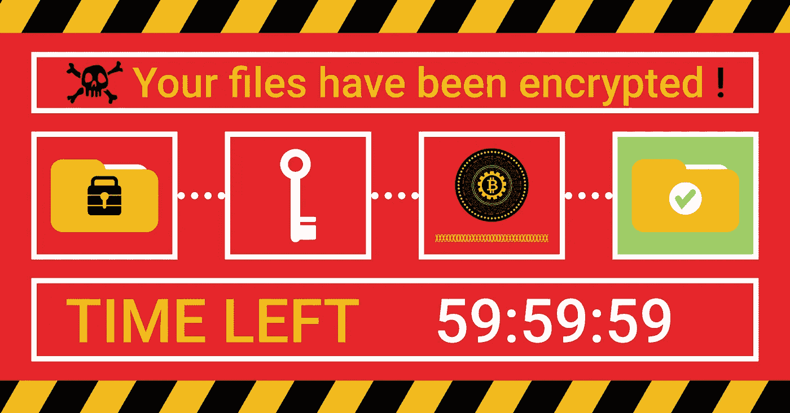

# 勒索病毒威胁能联合全球对手吗？这拿不准

> 原文：<https://medium.com/nerd-for-tech/can-ransomware-threat-bring-global-rivals-together-dont-bet-on-it-9e0a5b050306?source=collection_archive---------25----------------------->

针对勒索软件的斗争正在走向全球——也许吧。

安全与技术研究所的勒索软件任务组(RTF)上个月晚些时候发布了一份 81 页的报告，该报告得到了包括微软、思科、亚马逊网络服务和 FireEye 等巨头在内的数十家技术组织的支持，呼吁公共/私人联盟“扰乱勒索软件商业模式”，该报告称，这已经成为“全球范围内紧迫的国家安全风险”

参与 RFT 的政府机构包括美国司法部、国土安全部网络安全和基础设施安全局(CISA)、特勤局、联邦调查局、欧洲刑警组织和英国国家犯罪局。

几乎任何对勒索软件的力量、范围和持续破坏有模糊认识的人都可能会说，“是时候了。”因为攻击者使用它来加密受害者的文件，然后要求支付(通常是加密货币)以换取解密密钥或不公开被盗数据的承诺，这种做法多年来一直很流行。

事实上，勒索软件攻击导致[殖民地输油管道](https://www.politico.com/news/2021/05/08/colonial-pipeline-cyber-attack-485984)无限期关闭，这是通往美国东海岸的主要燃料补给线，产生了令人震惊的头条新闻，但本不应该震惊任何人。十多年来，专家们一直在警告此类袭击的风险。

这条管道从德克萨斯州的休斯顿到新泽西州的林登，全长约 5500 英里，输送汽油、柴油、喷气燃料和取暖油。政府关闭引发了对汽油价格飙升的担忧。根据 CISA 的说法，这次入侵是一个相对较新的俄罗斯勒索软件团伙“黑暗面”所为。

**祝你好运**

那么，一场旨在扰乱勒索软件商业模式的国际运动能防止这样的灾难性攻击吗？愤世嫉俗者可能会说，“祝你好运。”

因为报告中的关键建议(总共 48 条)之一是呼吁国际联盟“建立激励机制，引导民族国家不要为勒索软件罪犯提供避风港。”

这些激励措施没有具体说明，RTF 也没有回应置评请求。但想象俄罗斯、朝鲜和伊朗等敌对民族国家与其西方对手携手高唱“我们将战胜勒索软件”是一个重大挑战。

毕竟，这些国家不仅仅是勒索团伙的避风港。在某些情况下，他们赞助这些帮派。

Synopsys 软件完整性小组的首席科学家 Sammy Migues 指出，在控制 COVID 传播的基本原则上不可能获得普遍合作:戴口罩，洗手，社交距离。“这是生死攸关的事情，”他说，并补充说，世界各国也没有就核武器等其他生存威胁达成共识。

“这甚至不是白日梦，”他在谈到勒索软件的全球合作时说。“总会有罪犯的避风港，总会有间谍活动。即使我们彼此相爱，我们也不信任对方。”

他说，虽然许多建议在学术层面上是有道理的，但实际情况却是另外一回事。“谁真的会遵循 48 条建议？”他说。

尽管如此，米格斯和其他人表示，对勒索软件的一些关注，如果早就应该关注的话，仍然是受欢迎的。多年来，这一直是一个“紧迫的国家安全风险”。当它针对医疗保健机构和/或关键基础设施时(这种情况越来越多)，它可能会产生远远超出财务范围的后果，威胁目标的身体健康和安全。

用报告的话说，“尽管勒索软件是受利润驱动的，并且在传统意义上是‘非暴力的’，但这并没有阻止勒索软件攻击者经常危及生命。”

**每天 4000 次攻击**

数据安全和分析公司 Varonis 在一篇名为“[《勒索软件简史》，](https://www.varonis.com/blog/a-brief-history-of-ransomware/)”的博客文章中称，自 2011 年以来，这种攻击已经“发展到了鼎盛时期”，从 2011 年的约 6 万次攻击激增到 2015 年的 72 万次。现在，根据美国司法部的数据，平均每天[有 4000 起勒索软件攻击](https://www.justice.gov/criminal-ccips/file/872771/download)，每年约 146 万起。

一个名为“哔哔声电脑”的科技网站多年来一直在定期推出一个名为[“勒索软件一周”](https://www.bleepingcomputer.com/news/security/the-week-in-ransomware-april-9th-2021-massive-ransom-demands/)的专题。它从不缺少材料。

我在近三年前的一篇帖子中指出，在市政当局开始更频繁地遭受攻击后，一场[“勒索软件海啸”](https://www.forbes.com/sites/taylorarmerding/2019/07/03/get-ready-for-a-ransomware-tsunami/#10c4b7f12de9)即将到来——许多市政当局正在支付这些要求。

除了殖民管道袭击事件，最近几天还有头条新闻报道:

*   Scripps Health 的医院系统遭到了一次[勒索软件攻击](https://www.sandiegouniontribune.com/breaking/story/2021-05-02/scripps-hospitals-it-by-it-security-incident-but-patient-care-go)，中断了医疗服务，迫使其停止患者访问其在线门户网站，推迟预约，并将一些危重患者转移到其他医院。据圣地亚哥论坛报工会称，电子病历无法访问，迫使员工使用纸质病历。攻击还影响了遥测技术，即病人生命体征的电子监测，“这是现代医院长期以来一直自动化的一项关键功能，但如果有必要，也可以手动执行。”
*   勒索软件团伙 Babuk 威胁[泄露从华盛顿 DC 大都会警察局窃取的 250 数据](https://threatpost.com/babuk-ransomware-washington-dc-police/165616/)，包括警方报告、内部备忘录、被捕人员的面部照片和个人信息，其中一些可能会危及警方线人。

所以，是的，如果有办法让这种灾难性的疯狂停止，早就该这么做了。当然，问题在于 RTFs 的提议能否有效实施，以及它们能否奏效。

首先，他们希望改变破坏勒索软件商业模式的标准。

在勒索软件历史的大部分时间里，实施完善的安全措施来防止这些攻击，或者在攻击确实被攻破时，做好应对准备，是各个组织的主要责任。

现在他们应该很熟悉了:创建没有连接到你的网络的常规数据备份；在您的软件中构建安全性，并使其保持最新；培训您的员工识别网络钓鱼企图；将“最小特权原则”应用到员工身上，限制他们只能访问完成工作所需的内容；将你的网络分段，这样如果攻击者破坏了一个组件，他们就无法访问所有组件；通过虚拟专用网和保护性域名系统提高您的安全“卫生”。

RTF 的优先建议并没有完全放弃个人责任，而是将重点放在政府和私营部门组织的联合上。这些建议包括:

*   外交和执法努力的重点是“胡萝卜加大棒的方法，引导民族国家不要为勒索软件罪犯提供避风港。”
*   美国应该领导“一场持续、积极、全政府、情报驱动的反勒索运动，由白宫协调。”
*   政府应建立网络响应和恢复基金，以支持勒索软件响应和其他网络安全活动，要求组织报告赎金支付情况，并要求组织在支付前考虑替代方案。
*   发起一项国际努力，以开发“一个清晰、可访问、广泛采用的框架，帮助组织准备和应对勒索软件攻击。”
*   政府应该对加密货币实施更严格的监管，加密货币是勒索软件犯罪的一个促成因素。报告称，这应该包括“加密货币交易所、加密亭和场外交易‘柜台’，以遵守现有法律，包括了解你的客户、反洗钱和打击恐怖主义融资的法律”。

还有 40 多条建议，但这些都是最重要的。那么，网络安全社区对他们有什么看法呢？评论褒贬不一。

新思软件完整性小组的高级安全工程师 Boris Cipot 称之为“正确的前进方式”，但他补充说，这种方式来得很晚。他说，这些提案正在解决一场“正在发生的灾难”，如果软件开发标准、加密货币监管和关于攻击的信息共享“在过去被作为正常行动的一部分来处理，而不是现在由一个特别工作组来处理”，那么其中的大部分灾难本来是可以避免的

塔夫茨弗莱彻法律和外交学院(Tufts Fletcher School of Law and Diplomacy)网络安全政策助理教授约瑟芬·沃尔夫(Josephine Wolff)表示，许多建议“非常明智”，但他指出，真正的挑战是“弄清楚这意味着什么，才能创造激励措施，引导民族国家不要为勒索软件犯罪分子提供避风港，或者加强对加密货币部门的监管，或者扰乱勒索软件的商业模式。”

更不用说“这在很大程度上取决于有多少国家——以及哪些国家——加入进来。我很难想象俄罗斯或朝鲜会突然改变路线来遏制勒索软件，因为它们的政府与源自这些国家的一些主要勒索软件有着相当密切的联系，”她说。

Cipot 同意。“现实地说，在这方面没有成功的机会，”他说。“比如，俄罗斯追捕不危及俄罗斯国家或生活在那里的人的黑客的动机在哪里？”

“已知的情况是，恶意软件首先检查计算机的语言环境是否在俄罗斯，如果是，它就不会执行。所以黑客们确保俄罗斯当局对追捕他们不感兴趣。俄罗斯只是一个例子，”他说。

说到激励私营企业举报攻击和勒索支付，迄今为止政府的激励措施只有惩罚性的。去年 10 月，美国财政部的一份备忘录[警告](https://home.treasury.gov/system/files/126/ofac_ransomware_advisory_10012020_1.pdf)针对任何实体的“制裁风险”，包括金融机构、网络保险公司以及参与数字取证和事件响应的公司，“为代表受害者向网络参与者支付勒索软件提供便利”

RTF 呼吁建立一个响应和恢复基金来帮助组织寻找支付赎金的替代方案。但事实是，大多数组织都需要快速解密他们的数据，这样才能继续运营。他们不太可能有兴趣向政府机构申请一些他们可能会得到也可能得不到的恢复资金。

米格斯表示，针对勒索软件的战争可能会非常漫长，因为尽管关于它的知识和如何应对它的知识已经很成熟，但没有足够的合格人员来填补开放的网络安全工作，现有产品中的技术，从路由器到关键基础设施再到物联网，“目前无法适应不断演变的威胁模式。”

事实上，组织显然很难跟上已知的威胁。“仍然有成千上万的网站容易受到 [Heartbleed，](https://heartbleed.com/)”米格斯说，他指的是 2014 年公开的臭名昭著的软件漏洞。

Cipot 说，安全基础知识将比宏大的计划更有效。他说，“我宁愿把精力放在网络卫生上，然后与其他国家达成外交协议。”。