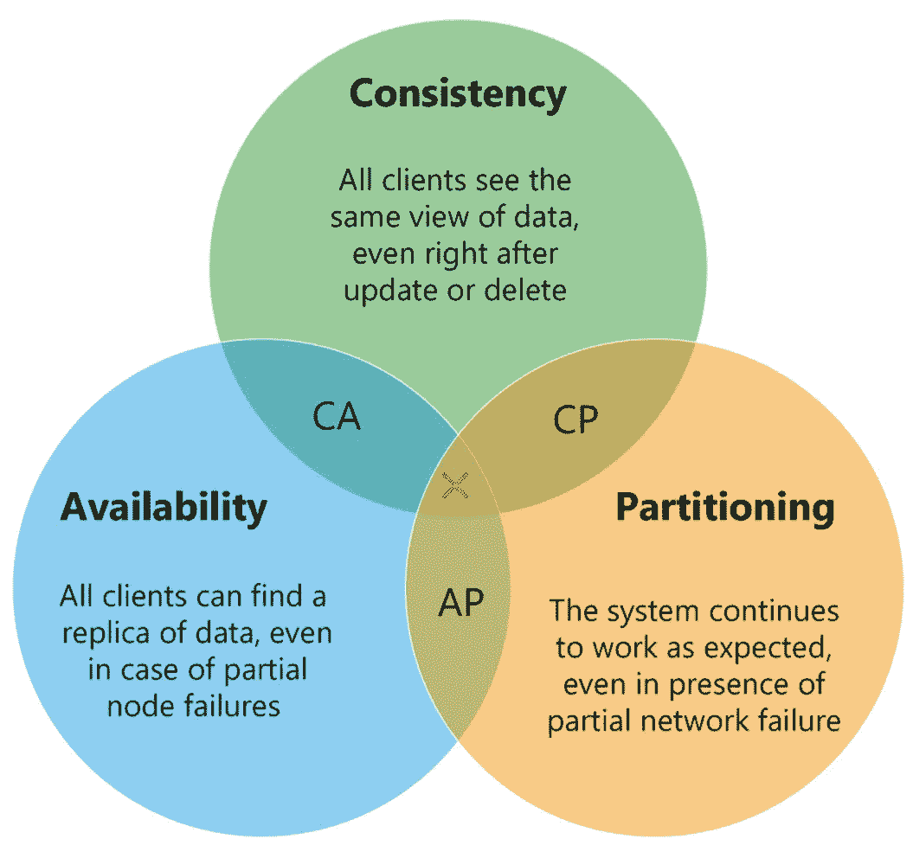

# 关注划分容差的 CAP 定理

> 原文：<https://medium.com/nerd-for-tech/cap-theorem-with-focus-on-partition-tolerance-1af4403cb35a?source=collection_archive---------2----------------------->

[https://www . researchgate . net/figure/Visualization-of-CAP-theory _ fig 2 _ 282679529](https://www.researchgate.net/figure/Visualization-of-CAP-theorem_fig2_282679529)

CAP 定理也称为布鲁尔定理，是一个用于分布式系统的概念。它说任何分布式系统只能提供三种保证中的两种(C，A & P)。这个定理被系统设计者用来在设计分布式系统时选择最佳的体系结构。

分布式系统是具有位于不同机器上的多个组件的系统，这些组件通信并协调动作，以便对最终用户表现为单个逻辑系统。

**一致性**

每次读取都会收到最近的写入。如果系统中有多个并行写入和读取，每个读取将始终返回正确的写入或系统上完成的最后一个写入。

因此，如果有 2 个节点用于读取，那么这两个节点应该彼此一致，以便获取正确的值。

**供货情况**

分布式系统中的可用性确保系统在 100%的时间内保持运行。无论节点的状态如何，每个请求都会得到响应(无错误)。这不能保证响应包含最近的写入(一致性)。

> 分区容差的概念经常被误解。我自己也很难理解。认为混淆是因为名字。

# **分区公差**

意味着作为一个系统，您的整个应用程序应该始终工作。系统中可能有两个节点失去了它们之间的连接。但是，这些节点将正常运行以执行其他任务；只是这两个节点本身不能相互通信。

这些示例基于主-主和主-从架构。所以请读一下这个:

**DB Master Master 架构:**

在主-主架构中，我们可以有多个跨区域的主。因为我们有多个主节点，所以读和写操作都可以在任何一个主节点上完成。

**数据库主从架构:**

在主从架构中，我们只有一个主节点，所有其他节点都是从节点。因此，我们为所有写操作选择主节点，而其他从节点是服务于读操作目的的手段。主节点负责通知所有从节点写操作。

*现在来理解分区容差，我们就以上面的主从和主从概念为例。*

*主-主*

假设我们总共有两个节点。两人都是高手。应用程序正在两个节点上进行读写操作。假设有其他应用程序只是出于读取目的而使用这些节点。让我们将节点命名为 A 和 B，如果应用程序在 A 中进行写操作，则 A 有责任将写操作通知 B；反之亦然。如果 A 和 B 的连接出现问题怎么办？A 和 B 节点工作正常，只是它们之间无法通信。这就是容错。节点 A 和 B 将无法相互通知写操作。

在这种情况下，我们可以选择可用性，也可以选择一致性。

可用性—如果我们让 A 和 B 都工作，就不可能有一致性，因为 A 和 B 不知道对各自节点所做的更改，因为它们之间没有联系。但是，节点 A 和 B 将可用。我们有可用性，没有一致性。

一致性—如果我们移除一个主节点，比如说一个；那么系统将是一致的，因为只存在一个节点，所以不需要关于写入的通信。然而，我们在可用性上有所妥协，因为现在只有一个节点可用。因此，我们有一致性，但没有可用性

*主从*

基于以上解释，这应该是清楚的。
在这种情况下如果我们失去了主人和奴隶之间的联系。从机永远不会知道主机上执行的写操作。对吗？因此，如果我们从系统中删除该节点，那么我们有一致性，但没有可用性。并且如果我们让从节点可用，尽管在节点和主节点之间不存在连接；然后，我们有可用性，但没有一致性。

**结论**

很难找到分区容差的简单实用的定义。所以我想写一本。所有的掌声和关注都受到高度赞赏。

快乐学习！干杯。