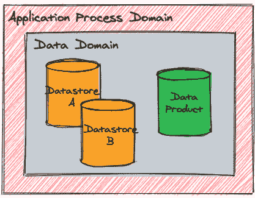
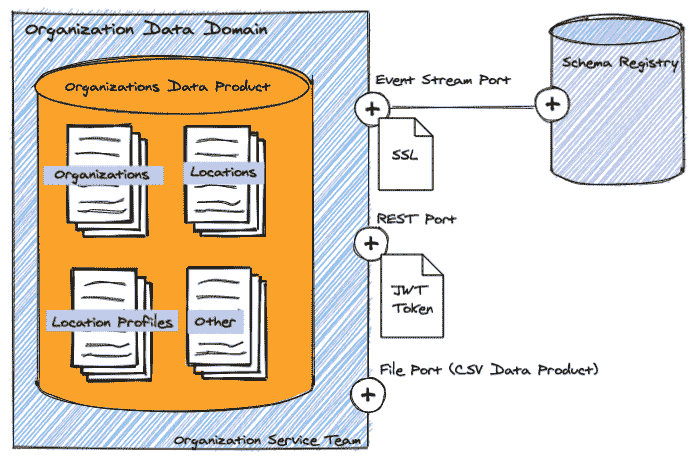

# 在数据网格中捕捉数据:原则(第一部分)

> 原文：<https://medium.com/nerd-for-tech/catching-data-in-a-data-mesh-principles-part-i-2b2e11e9e33a?source=collection_archive---------0----------------------->

## 深入了解数据网格架构范例如何帮助 Gloo 构建一个支持个人成长的平台。这是两部分中的第一部分，我们将解释我们如何在内部考虑网格以及我们实施的指导原则。

# 概观

在 [Gloo.us](http://Gloo.us) ，我们正在开发技术，将希望开始成长之旅的个人与他们寻求的资源、导师、精神团体和康复中心联系起来。我们有许多服务于不同需求的应用程序，这些应用程序需要后端服务的独特组合。我们已经创建了一个由许多异构流程、微服务、管道和数据存储组成的平台来支持这一点。该系统最重要的方面是数据，尤其是纵向数据跟踪和为种植者规划路径。此外，我们需要跟踪每个组织的产品和发展计划，并提出为社区提供最佳服务的建议。

人们可以采用一种平台架构，这种架构侧重于具有端点(例如 REST)的微服务，这些端点可以解决每个独特的支持流程和应用程序的需求。典型的例子可能是这样的:

*   数据管道可以提供访问其派生数据的服务
*   BI 团队可以获取数据以创建报告
*   核心对象微服务可以提供支持 ui 和其他支持者进程的端点

很快，这种方法可能会导致端点之间的关系变得越来越一对一，数据的组织或转换方式使消费和表示更容易。最终，服务膨胀，定义良好的特定用例被放入几个端点。(这种服务网格不应该与强调共享命令和控制的服务网格相混淆，这与服务端点的组成相反。)这个问题可以用几种方法来解决，但其核心是:协调服务需要来自彼此的数据，一个真实的源、领域和关注点的分离需要成为架构的核心。

这只是一个问题，但可以有很多。下一节给出几个其他问题的例子。

# 问题

平台架构的解决方案应该避免我职业生涯中一直困扰和沮丧的陷阱。最常见的陷阱是:

*   数据的大管道——随着用例数量和下游依赖性的增长，一个普遍的趋势是在管道内解决问题，而不是将问题转移到依赖的流程。这导致膨胀和复杂性，更不用说破坏用例之一的恐惧/风险。换句话说，数据的大管道。
*   湖中的数据——考虑到共享基础设施在 90%的工程组织中的重要性，我可能会在这个问题上捣乱。当“湖”数据存储导致访问争用、瓶颈设计/模式和复杂的数据表示时，问题就出现了。
*   瓶颈开发——在许多情况下，共享的基础设施和工具导致团队被专业知识隔离，这种方式导致团队无法满足用例，直到它被嵌入到管道中。将这些用例覆盖到*管道*中意味着您必须管理跨团队的依赖用例，这导致了对部署和大量测试的担心——即使是自动化也是痛苦的。这导致了团队间不必要的依赖。

这些问题的解决方案应该使团队能够在他们自己的领域中存储过程数据，并且以一种尊重其特定用例的方式存储，而不用担心在系统的其他部分中导致失败。这种方法很可能会导致数据冗余或重叠，但是，在根上，您仍然可以共享基础设施，比如带有应用程序进程索引的共享 ES 实例。

# 数据枢纽

如果我们将核心数据集的创建者从特定的下游应用程序或流程中分离出来会怎么样？这使得创建者流程或管道能够独立于其他团队，专注于构建核心数据集的最佳、最优表示。数据的属性，一个模式，从领域的角度考虑结果的完整上下文。数据从内部成为一个高度集中而完整的画面，成为一个*产品*。从这个基础上派生的任何数据集，如聚合或转换，都留给应用程序/流程域处理。数据域单独负责开发数据集的监管、规范化和内部转换。它是整体的，而不是定制的。我在这里绕过一些术语，因为我们称之为事物的东西是极其重要的，值得拥有它自己的一部分。

为了支持这个数据原则，我们将我们的架构方法从依赖的应用程序和流程中分离出来。数据网格模式的原则有助于我们实现这一预期结果。

# 输入数据网格

我们已经接受了数据网格的理念，以此来定义我们的架构，并为我们如何在 Gloo 解决数据连接的文化和理念提供支点。这导致了工程关键原则、通用语言、使能技术、所有权和团队责任的明确定义，以及我们作为公司想要的文化的明确定义的引入。我们通过强调*建设* it，而不是几个月来对可能发生的事情指手画脚，赢得了更广泛的认同和支持。这并不意味着我们没有预先获得广泛的支持——我们获得了，但我们的方法是“建立它，他们会来的”(当然，当成功时)。这可能有风险，但对我们来说是成功的，特别是考虑到我们帮助他人、接受想法和提供根本问题解决方案的基础文化。在过去的一个季度中，我们构建了一个数据网格，它现在是我们平台和架构愿景的核心组件。受 [Zhamak Dehghani](https://martinfowler.com/articles/data-monolith-to-mesh.html) 的启发，我们添加了自己的解释和方法来建造它，并转变建筑哲学。将组织和文化转移到网状思维的过程可能是艰难的——可能是向网状转变的最艰难的方面。实现网格的技术是可解决的。

数据网格方法的主要原则是组织结构/团队是首要问题，而不是物理连接或参考架构，但是，我们选择关注网格架构、定义、概念和创建，而不是重组，认为如果我们在数据产品和至少部分所有权上培训当前的组织结构，将有助于我们塑造未来的组织。我们创建了一个数据网格团队来帮助定义数据域、声明数据产品、推动团队所有权，最重要的是，建立支持作为快速启动工作的一种方式。我们的团队构建了基础设施来支持事件驱动的流以及与应用团队数据存储的连接。建立团队章程对于将拥有特定技术的团队的心态与在整个组织中提供价值的结果分离开来是非常重要的。

为了从整体上影响组织，我们专注于建立工程原则，明确定义一组术语，使用支持技术建立模式和框架，以及为数据网格团队和数据工程团队创建团队章程。

# 工程原则

我们的数据网格架构方法需要工程团队采纳一些关键原则。我们的团队正在向事件驱动的架构迁移，这使得我们思考数据方法的方式更加直观。我们的主要原则包括:

*   拥抱事件驱动的数据流。我们的数据会随着时间的推移而演变，也应该如此对待。快照通常在很长一段时间内被视为“当前的”。我们希望主动提供一系列变更，以便相关的应用程序能够始终使用最新的状态。
*   拥抱最终的数据一致性。应用程序团队必须注意，应用程序的数据存储是*而不是*事实的来源，并接受最终的一致性。我们流式传输数据状态更改，但是，在应用程序域中使用和转换数据存在延迟。需要记住异步模型，但实际上流非常快——通常是几毫秒，尽管我们有一些配置为 5 分钟的 JDBC 连接器。
*   拥抱你的数据和拥有它的责任。团队应该清楚提供事实(或数据产品)来源的责任，期望的质量，以及访问它(或数据端口)的方法的实现。应用程序域对数据的可用性和可访问性对于该域以满足其需求的方式消费、转换、丰富和存储数据的能力至关重要。访问端口应始终考虑消费者对其数据存储最终保持一致的期望。换句话说，永远要注意，这是*而不是*真相的来源。
*   拥抱新词汇。团队应该用普通的术语谈论他们的数据架构。包括应用程序流程域、数据端口、数据域等在内的新术语的定义是至关重要的第一步。下一节将深入探讨这个术语。

相信这些原则的工程团队将拥有实现数据网格的坚实基础。下一个最重要的步骤是在开发网格的各个方面时，为概念和对象定义一组术语并达成一致。

# 术语

体系结构中每个组件的名称，即使是概念性的，也是非常重要的。它是跨学科和应用程序团队交流的基础。在构建数据网格的情况下，责任和非责任是至关重要的，我们必须使用相同的语言。在 Gloo，我们引入了术语来帮助团队交流，并注意我们的架构方法。

**数据网**。主要数据节点的互连和协调的概念表示。数据网格的核心原则包括为网格上的数据建立清晰的权威数据源、所有权边界和治理。这不应该与用于实现网格的技术或技能混为一谈。

**数据网格平台**。用于促进通信、同步和访问数据网格上的数据的工具、技术和模式。

**数据产品**。被认为是数据网格中的提供者/生产者节点的单独的、权威的、管理的数据集。它是特定数据类型的真实来源，具有清晰定义的模式，代表数据的最佳视图。对数据产品的访问由数据治理策略通过**数据域**边界进行控制。如果一个应用程序、流程或系统产生了要在它的边界之外共享的数据，那么该数据就是网格上可用的数据产品。数据产品不应该与应用程序混为一谈。数据产品形成了数据类型的理想定义，而无需进行转换来满足产品的任何一个消费者或用户的需求。

**数据域**。一组数据产品，代表权威的事实来源和所有权边界。域边界是特定的类型定义。数据域可以提供一个或多个数据产品，并且可能包含用于创建网格上不可用的数据产品的支持数据。域内的数据可以通过**数据端口访问。**

**应用过程域。**应用程序流程域(APD)是系统或流程的逻辑分组，帮助应用程序实现业务目标。这个域可能由许多服务和数据存储组成，它们可能依赖也可能不依赖数据网格。数据可分为三种类型:从数据产品中消费的数据、为形成数据产品而生产的数据或应用程序内部的数据。

概念

源自外部数据产品的数据不再是数据产品，而是内部表示。它通常被聚合、转换或简化，以使其更容易被应用程序使用。最后一种类型是只在本地使用的数据，不基于任何外部数据产品。

**数据端口**。访问数据产品的数据的手段。端口可以是 SQL、ReST apis、Kafka 消息、Webhooks、Kafka 流或 KSQL。我们利用模式注册中心来跟踪版本。从概念上讲，它看起来像下图。我已经将数据治理映射到它上面…这个定义即将出现。

数据端口

**数据治理**。根据内部数据标准和策略，管理 data domain 中数据的可用性、可用性、完整性和安全性。在我们构建时，我们并没有试图从一开始就解决数据治理的所有方面，例如同意，尽管我们注意到了治理的完整视图。我们将数据治理定义为以下因素的集合:

*   可用性。及时、优质、可靠的访问。我们必须确保数据具有正常工作的数据端口。
*   同意。使用或撤销数据访问权。除了通过事件流进行联合删除之外，我们没有解决这个问题。
*   可用性。数据必须是可用的，并且处于一种可被流程域合理消费的结构中。我们定义模式并确保我们有数据端口。
*   数据一致性。假设数据是可访问的、高质量的和可用的，网格上的消费节点必须能够保持任何本地变量同步。此外，任何衍生数据产品都必须有一致的数据基础。我们使用事件驱动的架构来解决这个问题，但最终消费应用程序域负责通过任何满足其要求的方式保持数据同步。例如，消费数据存储可能是用于导入数据块的 S3 存储桶，其中应用程序域必须考虑它们希望导入的频率。
*   数据完整性。通过将数据隔离到特定的领域，我们缩小了关注点和控制范围，使质量更容易保持。
*   数据安全。数据域上的安全数据端口

**域名所有权**。数据网格范式的核心原则是域所有权。这在讨论中被强调了很多，并且几乎总是被放在打破数据科学、数据工程和产品工程团队之间的界限的背景下。解决这个问题需要一个独立的部分，但是本着简洁描述的精神，我们将领域所有权定义为一个团队/组织，它负责管理一个特定的、独立的数据产品，该产品在更广泛的组织中是有用的。拥有领域的团队与其他人一起定义模式，但最终所有者是数据上下文的专家。下游用例可以影响模式属性，但是任何业务逻辑都不应该成为数据产品的驱动因素。无论如何，这是我们的解释——您的里程可能会有所不同。

# 总结和下一步

第 1 部分的目的是讨论我们如何映射数据网格的概念，由[扎马克](https://martinfowler.com/articles/data-monolith-to-mesh.html)做了最好的阐述。在第 2 部分中，我们将深入探讨我们的架构愿景，以及它是如何被应用的。这篇文章涵盖了我们对如何在 Gloo 构建软件的解释、假设和基础。在更广泛的社区中，我看到了一些缺失:一个从技术角度而不是从组织角度实现数据网格的架构示例。当我们使用云供应商时，我们将他们视为帮助技术组件的成分，而不是主菜。他们的解决方案可能是一个核心的、关键的组件，但是如果它是特定于供应商的，我认为它不是一个示例架构。下一部分将涵盖我们为准备实现所采取的步骤(re:增量工程买入),并回顾一个反馈的示例架构。

 [## 如何从单一数据湖转移到分布式数据网格

### Zhamak Dehghani Zhamak 是 ThoughtWorks 的首席技术顾问，专注于分布式系统…

martinfowler.com](https://martinfowler.com/articles/data-monolith-to-mesh.html) 