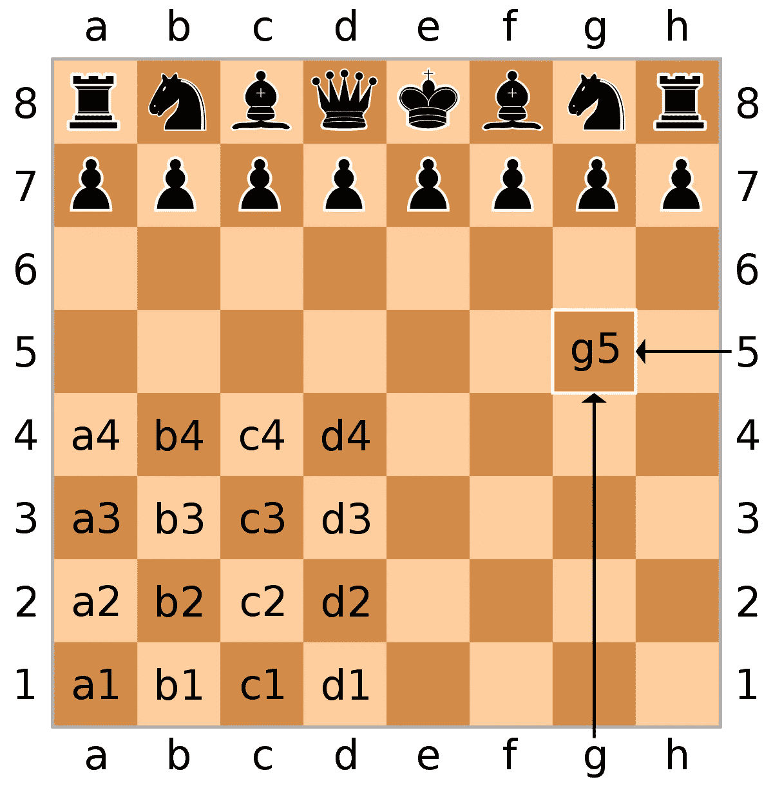
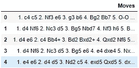
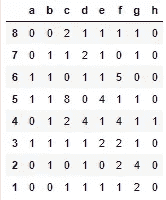
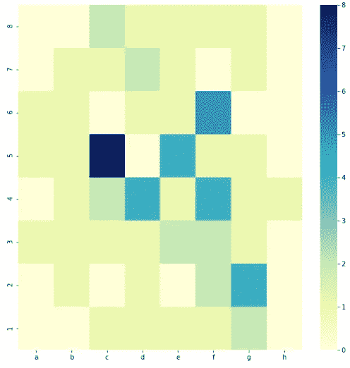
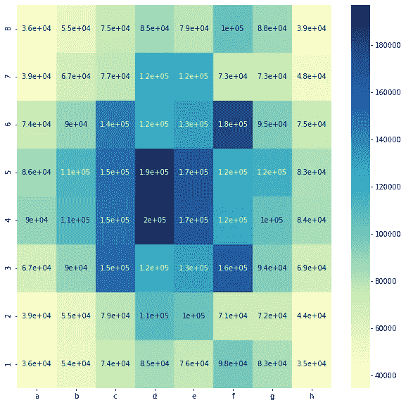
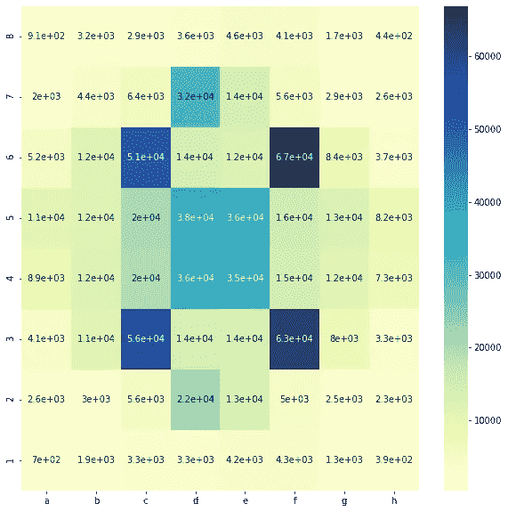
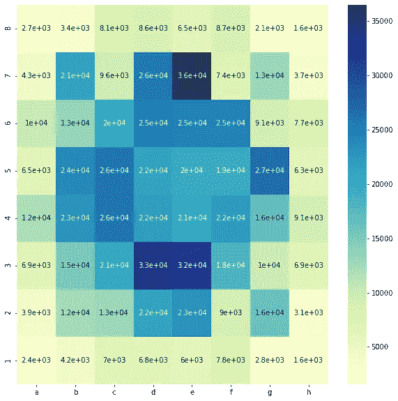

# 国际象棋热图——大部分活动发生在哪里？

> 原文：<https://medium.com/nerd-for-tech/chess-heatmap-where-does-most-of-the-action-take-place-52b2a007dfa2?source=collection_archive---------5----------------------->


哈桑·帕夏在 [Unsplash](https://unsplash.com?utm_source=medium&utm_medium=referral) 上的照片

C 它是在一个 8x8 的棋盘上演奏的。这个游戏没有隐藏的信息，玩家试图在思考、策略和计算上胜过对手，以赢得这场战斗。国际象棋与数学和数据有多种联系。例如，有一个所有高水平国际象棋游戏的数据库，有许多与国际象棋相关的数学难题，国际象棋引擎用数学方法评估国际象棋的位置等等。在这篇文章中，我们要做一个小项目。该项目将基于制作一个象棋游戏的热图。[**热图**(或**热图**)是一种数据可视化技术，以二维颜色显示现象的大小。热图将显示国际象棋游戏中最关键的方格。方块的颜色越深，它在游戏中就越重要。](https://en.wikipedia.org/wiki/Heat_map)

在我们开始工作之前，重要的是我们要熟悉棋盘符号和国际象棋的 **PGN** (便携式游戏符号)。在下一节中，我们将讨论这些内容:

# 棋盘符号和 PGN

棋盘由 64 个方格组成，每个方格由一个字母(A 到 H)和一个数字(1 到 8)标记。例如，如果我们要在棋盘上定位 g5，我们将从左到右垂直移动 5 个方格，水平移动“g”个方格，如下图所示:



国际象棋中的棋盘符号。来源:维基百科— [代数符号(象棋)](https://en.wikipedia.org/wiki/Algebraic_notation_(chess))

有了对记谱法的理解，我们可以很容易地熟悉 PGN。国际象棋比赛以 PGN 格式记录。PGN 包括游戏中的所有走法。下面是一个 PGN 的例子:

```
1\. c4 c5 2\. Nf3 e6 3\. g3 b6 4\. Bg2 Bb7 5\. O-O Nf6 6\. Nc3 Be7 7\. d4 cxd4 8\. Qxd4 O-O 9\. Rd1 Qc8 10\. b3 Na6 11\. Bb2 Nc5 12\. Ne1 Bxg2 13\. Nxg2 d6 14\. Ne3 Rd8 15\. b4 Ncd7 16\. Ne4 Ne8 17\. f3 a5 18\. b5 f5 19\. Nf2 Bf6 20\. Qd2 Nc5 21\. Nd3 Qc7 22\. Bxf6 Nxf6 23\. Rac1 Nfd7 24\. Ng2 Ne5 25\. Qe3 Rac8 26\. Ngf4 g5 27\. Nxc5 gxf4 28\. gxf4 Qxc5 29\. Qxc5 Rxc5 30\. fxe5 Rxe5 31\. Kf2 Rc5 32\. Rd4 e5 33\. Rh4 f4 34\. a3 Kg7 35\. Rg4+ Kf6 36\. Rcg1 Rxc4
```

对于一个对国际象棋一点都不熟悉的人来说，看到它可能会大吃一惊，但是一旦你知道棋盘上的符号和其他符号，理解 PGN 写的东西就一点也不难了。下面，我们将看到如何理解 PGN 的大部分动作:

1.  大多数情况下，最后两个字母表示棋子移动到了哪个方格。例如，Nf3 表示骑士移动到了方块 f3。如果第一个字母是大写，它显示了一个更有价值的棋子的移动(Q 代表皇后，N 代表骑士，B 代表主教，R 代表车，K 代表国王)，而棋子的移动就像他们移动到的方格一样。在上面的 PGN 中，c4 显示了一个棋子移动，其中一个棋子移动到了方块 c4。
2.  以“+”号结尾的移动意味着这是一次**检查**。在国际象棋中，当一个国王受到被俘获的威胁，被迫离开它的范围时，就会发生一次牵制。例如，Rg4+表示车移动到 g4 以交付支票。
3.  以“#”结尾的棋代表**将死**，玩家的国王受到威胁，但国王不能移动，因为所有其他方格都被对手的棋子覆盖。例如，Qf6#表示女王移动到 f6 以将死对手。
4.  一个**捕捉**在移动中用‘x’表示。例如，Bxc3 表示主教拿走了 c3 方块上的任何东西。如果一个棋子捕获了某个东西，它将从棋子移动到捕获的方格开始书写。例如，cxd4 表示“c”卒捕获了 d4 方块上的任何东西。
5.  用 O-O 表示短阉，用 O-O-O 表示长阉。
6.  最后，提升由 <square>= <piece to="" which="" the="" pawn="" is="" promoted="">表示。 [**晋升**国际象棋中的一个规则，要求达到第八等级的棋子由玩家选择的同色的主教、骑士、车或皇后替换。](https://en.wikipedia.org/wiki/Promotion_(chess)#:~:text=Promotion%20in%20chess%20is%20a,square%20on%20the%20same%20move.)例如，b8=Q 表示移动到 b8 的棋子被提升为皇后。</piece></square>

随着大部分规则的涵盖，我们现在可以理解大部分的国际象棋 pgn，并发挥出来。在 PGN 的理解下，我们准备开始我们的工作并进入程序设计阶段。

# 构建热图

我们将在一组游戏上构建我们的热图，并查看哪些方块在我们的数据集中处于最热状态。我将使用的数据集来自 [kaggle](https://www.kaggle.com/rishidamarla/chess-games) (你也可以通过稍微修改下面的工作来使用你自己的数据集)。但是首先，我们将只为一个游戏建立一个热图，看看它是什么样子的。

首先，我们将导入我们将需要的所有库:

```
import pandas as pd
import numpy as np
import seaborn as sns
import matplotlib.pyplot as plt
```

接下来，我们将使用 pd.read_csv 读取数据集，并删除所有不必要的列，因为我们只需要游戏的移动。

```
df = pd.read_csv('dataset/chess_games.csv')
to_remove_cols = list(df.columns)
to_remove_cols.pop() #Moves is our last column
df = df.drop(columns = to_remove_cols)
```

我们的数据集看起来像这样:



我们的数据集只包含移动

现在我们需要存储游戏中每个方块的信息。一个合理的方法是使用 python **字典。在那个字典中，我们将存储所有 64 个方块的信息，以及一个方块在移动中出现了多少次。下面的函数将为我们准备这样一个字典:**

```
def squares_dictionary_maker():
    dictionary = {}
    for i in range(8):
        for j in range(8):
            square = chr(97+i) + str(j+1)
            dictionary[square] = 0

    return dictionary
```

从上面的函数返回的字典如下所示:

```
{'a1': 0,
 'a2': 0,
 'a3': 0,
 ..
 .. for all the 64 squares}
```

我们将在最终的热图中使用整个数据集，但是为了测试，我们将使用一个游戏并创建它的热图。我们要用的游戏是上面我给你们看的 PGN 的例子。之后，我们将为所有游戏创建一个热图。

## 英雄功能

是时候创建我们的英雄函数了。我们的 hero 函数将根据一个正方形出现在我们的 PGN 中的时间来填充我们的字典。该功能将分割移动，检查条件和热图所需的所有重要内容。下面是我创建的英雄函数:

```
def board_heatmap(moves): #Fills the above created dictionary for 
    moves = moves.split(' ')
    moves = [move for move in moves if move.endswith('.') == False]
    for move in moves:
        if move.startswith('O-'):
            if move == 'O-O':
                index = moves.index(move)
                if index%2 == 0:
                    sq_dict['f1'] = sq_dict['f1'] + 1
                    sq_dict['g1'] = sq_dict['g1'] + 1
                else:
                    sq_dict['f8'] = sq_dict['f8'] + 1
                    sq_dict['g8'] = sq_dict['g8'] + 1
                moves[index] = ''
            elif move == 'O-O-O':
                index = moves.index(move)
                if index%2 == 0:
                    sq_dict['d1'] = sq_dict['d1'] + 1
                    sq_dict['c1'] = sq_dict['c1'] + 1
                else:
                    sq_dict['d8'] = sq_dict['d8'] + 1
                    sq_dict['c8'] = sq_dict['c8'] + 1
                moves[index] = ''
        elif move.endswith('+') or move.endswith('#'):
            if str(move[-3]) == '=':
                sq_dict[str(move[-5:-3])] = sq_dict[str(move[-5:-3])] + 1
            else:
                sq_dict[str(move[-3:-1])] = sq_dict[str(move[-3:-1])] + 1
        elif move.endswith('Q') or move.endswith('N') or move.endswith('B') or move.endswith('R'):
            sq_dict[str(move[-4:-2])] = sq_dict[str(move[-4:-2])]+1
        elif move == '':
            continue
        else:
            sq_dict[str(move[-2:])] = sq_dict[str(move[-2:])] + 1

    return True
```

本质上，我们的英雄函数做以下事情:

1.  拆分游戏的动作。
2.  检查一步棋的最后两个字符来检查一步棋被下到的方格。
3.  在短城堡(O-O)的情况下，首先将检查颜色(如果移动是由白色或黑色进行的)。如果是白棋，将考虑 f1 和 g1 的方块，如果黑棋玩过短城堡，将检查 f8 和 g8。(对长城堡也将进行同样的检查，其中将检查白色城堡的 d1 和 c1 以及黑色城堡的 d8 和 c8。).
4.  将死、检验和晋升的条件也被检查，并且字典被相应地填充。
5.  上面创建的字典将根据棋格来填充。例如，如果播放了 c4，那么我们字典中 c4 的键将增加 1。

## 创建热图

字典填满后，我们就可以制作热图了。我们将从字典中提取这些值，并对它们进行处理，以便根据它们制作热图。

包括的步骤有:

1.  取字典中的值，并用它们组成一个 np.array。
2.  将其重塑成一个 8x8 的 2D 阵列。
3.  操作行和列，使输出热图像棋盘一样有标签。为此，我们将转置并水平翻转数组。
4.  最后，我们将创建 2D 阵列的数据框，并为其制作热图。

这些步骤在下面的代码片段中完成:

```
def dict_formatter(dict):  #Making a 2d-array from our dictionary
    square_values = np.array(list(sq_dict.values())) 
    square_values = square_values.reshape(8, 8)
    sq_T = square_values.T
    sq_T = np.flip(sq_T, 0)
    return sq_Theatmap_frame = pd.DataFrame(dict_formatter(sq_dict)) #Making dataframe from 2d-array
heatmap_frame.index = ['8', '7', '6', '5', '4', '3', '2', '1']
heatmap_frame.columns = ['a', 'b', 'c', 'd', 'e', 'f', 'g', 'h']fig, ax = plt.subplots(figsize=(10,10))   
sns.heatmap(heatmap_frame, ax=ax, cmap='YlGnBu') #Making heatmap from the 2d array.
```

我们的游戏数据框架和热图如下:



我们的“2d”数据框



2d 数据框中的热图

从热点图中，我们可以看到 c5 的方块在游戏中受到了猛烈的攻击，f6 是第二个热点方块。

## 在数据集上应用热图

我们准备将上述过程应用于我们的完整数据集，并可视化热图。我们将更新字典，并使用 np.vectorize 将 hero 函数应用于数据集，因为这是在数据框上应用函数的最快方法之一。

下面的代码片段将对完整的数据集应用 hero 函数，然后我们将可视化热图。

```
sq_dict = squares_dictionary_maker()
np.vectorize(board_heatmap)(df['Moves'])heatmap_frame = pd.DataFrame(dict_formatter(sq_dict))
heatmap_frame.index = ['8', '7', '6', '5', '4', '3', '2', '1']
heatmap_frame.columns = ['a', 'b', 'c', 'd', 'e', 'f', 'g', 'h']fig, ax = plt.subplots(figsize=(10,10))
sns.heatmap(heatmap_frame, ax=ax, annot = True, cmap='YlGnBu')
```

数据集的热图如下所示:



完整数据集的热图

我们可以看到，最中央的方块:e4、e5、d4、d5 是大多数游戏中最常见的方块，c3、c4、c5、c6、f3 和 f6 的数量也不少。我们离中心越远，这些方块上的计数就越少。因此，我们可以得出结论，下棋的关键是在中间，而不是在侧翼(像在 a、b、h 档等边上)。)

## 延伸工作

这篇文章的目的已经达到了。现在，我们可以扩展我们的工作来做更有趣的事情，比如，我们可以检查哪块在哪个方块中最常见。比如稍微修改了一下我的英雄功能，我已经创建了骑士和主教的移动热图；骑士和主教移动最多的地方:



骑士的热图。常见的正方形:f3，f6，c3，c6



毕晓普的热图

你可以通过修改 hero 函数来创建每一件物品的热图。我会把这个留给你做练习。

## 关闭

我们已经成功地学会了创建一个象棋游戏的热图。这样的热图可以帮助我们了解棋子的某些常见模式以及它们在某些方格中的常见出现。我们也可以用这样的热图来分析我们自己的游戏。此外，我们可以对某些开局的游戏进行分组，创建此类游戏的热图并分析其模式。您可以自由地用我提供的所有代码片段自己进行试验，以测试一切。如果您感兴趣，下面是 GitHub 链接到这篇文章的笔记本:

[https://github.com/SadMadLad/chess-heatmap/](https://github.com/SadMadLad/chess-heatmap/)