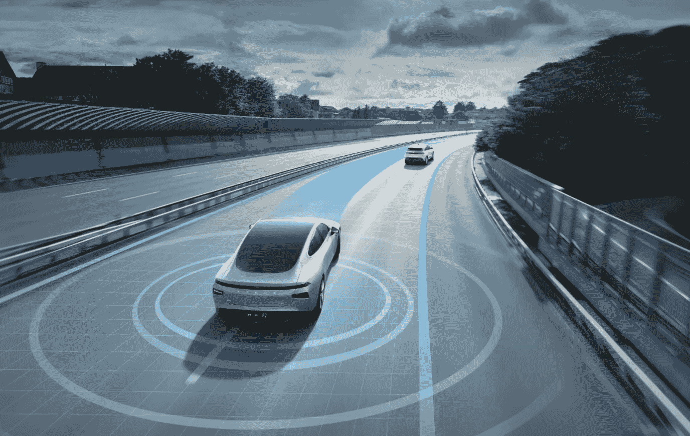

# 中国自动驾驶商业试点项目落地

> 原文：<https://medium.com/nerd-for-tech/chinas-commercial-pilot-project-of-autonomous-driving-landed-3aee02ad07ce?source=collection_archive---------5----------------------->

https://www.hncheshi.cn/qyxw/202106/62955.html

全国首个自动驾驶出行服务商业试点项目于 2021 年 11 月 25 日在北京开启。第一天向公众发布充电服务时，一位北京居民使用百度的 Apollo 自动驾驶出行服务平台“胡萝卜跑”完成了首次支付。这是北京开始自动驾驶试点项目以来的第一笔订单。

## **更多应用场景即将解锁**

百度和小马。艾成为第一家开展商业试点服务的公司。在这个阶段，它们将位于北京经济技术开发区(60 平方公里)，车辆不超过 100 辆。

目前，装卸服务要求乘客步行到固定的车站。站与站之间的距离是 300 到 500 米。乘客可以步行到达。固定站是为了避开非法停车场、绿化带、事故高发地，考虑到乘客的安全。

据了解，百度和小马。艾成为首批开展商业化试点服务的企业。目前百度的收费标准是“起步价 18 人民币，每增加一公里 4 人民币”。从 11 月 26 日起，小马人工智能的统一价格为 4.9 元人民币。

自动驾驶商业化试点服务的定价方法参考私家车和在线叫车服务的定价方法。这是很好理解的。和打车软件一样，这个阶段需要用户尝试和体验整体服务。只有获取更多的信息，才能进一步完善自动驾驶的数据收集。

## **智能车吹响下半场哨**

技术、成本、政策等。，是制约自动驾驶大规模商用部署的主要因素。目前，自动驾驶公司已经进入了后半程，整个行业已经从技术验证和产品研发进入商业化阶段。

北京开始许可自动驾驶服务的商业化，以验证商业模式的可行性。因此，自动驾驶试点项目打通了从 R&D 到商业化的完整闭环，将鼓励和引导自动驾驶出行服务商业模式的探索和创新。

根据行业主流观点，认为到 2025 年，自动驾驶出租车全生命周期的成本可以和传统出租车持平。2025 年后，自动驾驶出租车的价格将低于传统出租车。或许它将开始大规模取代传统出租车。

商用 pilot 中的每辆自动驾驶汽车都配备了一名安全员。从试点开始到未来自动驾驶的大规模运营，关键是要攻克自动驾驶安全相关的核心技术，逐步将安全驾驶员从车上撤出，并降低或消除安全员的成本，形成商业盈利闭环。

## 对数据标签的需求持续增长

自动驾驶的主流算法模型主要基于有监督的深度学习。它是一种算法模型，推导出已知变量和因变量之间的函数关系。需要大量的结构化标记数据来训练和调整模型。

在此基础上，要想让自动驾驶汽车变得更加“智能”，形成可在不同垂直落地场景下复制的自动驾驶应用商业模式闭环，模型需要有海量、高质量的真实道路数据支撑。

在自动驾驶领域，数据标注场景通常包括变道超车、通过路口、无红绿灯控制的无保护左右转弯，以及一些复杂的长尾场景，如车辆闯红灯、行人过马路、路边以及违规停放的车辆等。

现在的人工智能也叫数据智能。在这个发展阶段，神经网络的层数越多，需要的标记数据量就越大。

对于深度学习来说，数据只有贴好标签才有意义。

# 结束

将你的数据标注任务外包给 [ByteBridge](https://tinyurl.com/442nbtpu) ，你可以更便宜更快的获得高质量的 ML 训练数据集！

*   无需信用卡的免费试用:您可以快速获得样品结果，检查输出，并直接向我们的项目经理反馈。
*   100%人工验证
*   透明标准定价:[有明确的定价](https://www.bytebridge.io/#/?module=price)(含人工成本)

**为什么不试一试？**

资料来源:https://xw.qq.com/cmsid/20211126A01GQ800?f=newdc