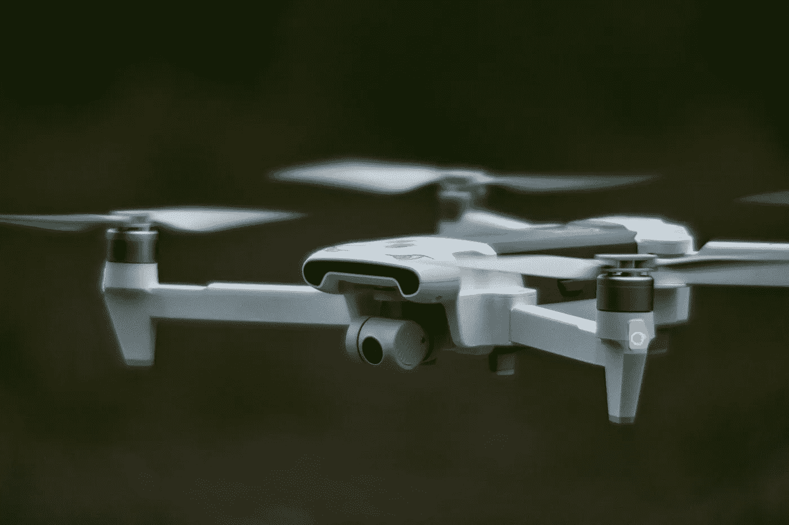

# 数据标签服务如何赋能无人机智慧物流？

> 原文：<https://medium.com/nerd-for-tech/chinese-leading-e-commerce-service-platform-meituan-stirs-up-the-unmanned-aerial-vehicle-market-abf34a840879?source=collection_archive---------9----------------------->

## 中国领先的电子商务服务平台搅动无人机市场

# 智慧物流将进入无人机时代

人们坐在家里，他们的饭菜从天而降。

这是无数物流无人机厂商渲染的未来场景。自智能物流成立以来，顺丰、JD.com、阿里等中国企业都在积极探索物流无人机的研发和商业应用。

## 美团无人机(中国领先的电子商务服务平台)

7 月底，美团无人机与深圳湾 SIC 超级总部中心签约，完成无人机配送商圈试点运营机制，包括在建筑设计上整合城市低空物流网络的自动化机场设施。**作为载体，服务周边 3 公里商圈居民需求。**届时，用户只需在美团 APP(送餐 APP)上下单，10 分钟就能收到 SIC 超级总部送来的物品。

“科技变革是未来城市生活不可或缺的服务”，美团无人机负责人表示，美团、深圳地铁、万科共同打造的领航无人机配送商圈，是为了提升城市数字化配送效率，为周边用户提供更优质的服务。

## 京东无人机(中国领先的电子商务服务平台)

早在 2015 年，京东无人机团队成立，旨在打造“干线、支线、末端三级无人机+通用航空物流体系”，满足**在不同应用场景**降本增效的目标。

京东智慧物流负责人刘表示，目前，人口红利正在减少，劳动力成本正在增加。从农村出发，用技术解决农村物流成本高的问题。保证了 JD.com 在农村电商的道路上走得更快更好。

为了建设终端线路，更好地做好快递服务工作，JD.com 目前提出 5 年内建设 1 万个机场，实现 100 万架无人机的配送计划。

## **无人机将快速应用**

"**预计 2023 年，无人机将迅速应用于我们的行业。**“国家邮政局中国政策法规司巡视员金兵透露，目前全国每天有 3.3 亿件快递，预计 5 年后可能达到每天 10 亿件。

需要大量的交通工具和各种联网方式。对于交通不便的偏远山区和农村，如果要求 100%的人力配送，成本难以估算。此时，**成本更低的无人机是农产品配送到城市，工业品配送到农村的最佳方式**。

事实上，顺丰已经在四川西部和云南北部的部分地区实施了这种产业化运营模式，并在山西榆林建设了大型物流无人机运营基地，服务于山西、甘肃、宁夏、青海等地的航空物流运营网络。

## **相比京东、顺丰，美团的无人机物流更倾向于城市物流配送。**

美团在 2017 年开始了无人机送货项目。**截至今年 6 月，已完成 2500 架无人机送货订单**。到今年 7 月，深圳湾 SIC 超级总部中心完成无人机送货商圈试点示范合作协议。

在年初的 2021 世界人工智能大会上，美团展示了无人机送货研发成果。美团副总裁、无人机业务负责人毛一年表示，美团计划实现无人机配送的大规模商用。

**然而，无人机物流的发展真的这么顺利吗？**

**从国际角度来看，并不**。

亚马逊是最早开展无人机物流的公司。在技术和运营上应该是相当成熟的。然而，无人机送货项目“逐渐崩溃”的消息也时有报道。此外，德国 DHL 快递公司也表示，已经停止“parclecopter”小型物流无人机快递项目。

**那么，美团能否在 5 年内实现无人机配送的大规模商用？**

北京航空航天大学无人系统研究所工程师杨炯说:“无人机的后勤需要从三个方面考虑:**飞机、空间管理、机场**。”

**首先是飞机。**无人机送货最后一公里需要考虑飞机在密集人群中的应用。这对飞机本身的可靠性有很高的要求。

比如飞机来回交付有多少次飞行是无故障的，任务完成率是多少？目前，没有人能准确地确定这些参数。也就是说，目前的飞机还处于测试或者离研究阶段还很远，还没有到大规模商业化的阶段。

**其次是空间管理**。这涉及到全面的城市规划问题，包括市政、交通和公共安全。

“城市里环境复杂，各种建筑和地形遮挡，电线干扰。如果要在城市大规模商用无人机，如何实时监控和追踪飞机的踪迹和位置？

在飞机出现故障后，如何确定飞机的状态并与城市的市政交通和市政警察合作，需要进一步的指导方针。如果不解决这些问题，无人机的大规模商业化还有待验证。”杨炯分析道。

至于机场问题，比较简单。只是需要一个大规模的管理点来明确飞机的起降位置，同时保证这些飞机的正常维护和存放。

**这样看来，无人机物流的大规模配送还是需要一步一步来实践的。**不过单从无人机行业来看，人们还是很看好它的前景的。毕竟无人机物流已经到了“蓄势待发”的阶段。许多行业参与者正在共同推进，以实现无人机物流的规模化。无人机配送大规模发展只是时间问题。

# 人工智能的基本要素——无偏倚的训练数据

正如三角形需要三条边来稳定其形状一样，人工智能也将需要所有三个要素来完善自己:算法、无偏见的训练数据和训练过程。

这三个要素中，算力是技术设施的能力，算法是工作方法，数据是优化算法的基础。换句话说，前两个是装备和能力。数据是人工智能可以学习的材料。

在人工智能系统中，数据有着重要的作用。因此，从谷歌和微软到普通个人开发者，所有开发者都非常重视高质量的标签数据。

在当前的人工智能应用实践中，不同水平的数据质量显示出人工智能解决方案的价值有着非常明显的差距。高质量的 AI 数据会让人工智能的效率最大化，而低质量的 AI 数据不仅不可能提高效率，还会在一定程度上阻碍人工智能的进化。

## 快递中常见的标签类型

*   **物体识别**
*   **视频中的物体跟踪**
*   **工业机器人导航**
*   **机器人手臂引导**

① **机器人分拣和材料处理，如包裹递送、仓库库存处理**

② **QA 检查、维护**

*   **裂纹检测**

# 结束

将你的数据标注任务外包给 [ByteBridge](https://tinyurl.com/5y99984x) ，你可以更便宜更快的获得高质量的 ML 训练数据集！

*   无需信用卡的免费试用:您可以快速获得样品结果，检查输出，并直接向我们的项目经理反馈。
*   100%人工验证
*   透明和标准定价:[有明确的定价](https://www.bytebridge.io/#/?module=price)(包括人工成本)

为什么不试一试？

来源:[https://www.163.com/dy/article/GILMKPNU0552HYDR.html](https://www.163.com/dy/article/GILMKPNU0552HYDR.html)