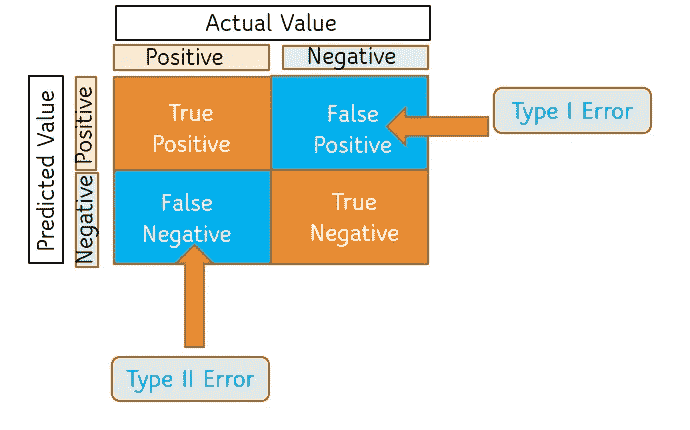

# 阶层失衡问题及其对策。

> 原文：<https://medium.com/nerd-for-tech/class-imbalance-problem-and-ways-to-handle-it-4861a195398a?source=collection_archive---------0----------------------->

机器学习中的分类指的是预测建模问题，其中为给定的输入数据预测类别标签。标签或目标可能属于两个类别或两个以上的类别。

当大部分数据属于一个类别标签时，就会出现类别不平衡。两类分类和多类分类都会出现这种情况。机器学习算法假设数据是平均分布的。所以，当我们有一个类别不平衡时，机器学习分类器往往更偏向于多数类别，导致少数类别的错误分类。这是因为传统的机器学习算法成本函数不断地试图优化诸如错误率之类的量，而没有考虑数据分布。

查看 python 代码来分析类不平衡数据集[这里](https://github.com/SandKrish/Classification_Prediction/blob/main/imbalance-insurance-data-analysis.ipynb)。

# 阶级失衡到什么程度？

要考虑两个因素 [balance_accuracy_score](https://scikit-learn.org/stable/modules/generated/sklearn.metrics.balanced_accuracy_score.html) 和 [accuracy_score](https://scikit-learn.org/stable/modules/generated/sklearn.metrics.accuracy_score.html) ，以了解该类不平衡的程度。

balanced_accuracy_score 计算平衡精度，用于处理二元或多类分类问题的不平衡数据集。它被定义为在每一类中获得的平均回忆。

而准确度分数是准确度分类分数。对于平衡数据集，这两个准确度分数之间的差异将为零。也就是说，对于平衡数据集，balanced_accuracy_score 与 accuracy_score 相等。

# 处理不平衡班级的方法

## 1.改变性能指标:

对于不平衡数据集，机器学习模型将预测所有预测的多数类的值，并实现高分类精度，即使它对于少数类来说是一个坏的分类器。这被称为**精度悖论。**

为了克服这一点，需要考虑其他性能指标进行评估，如混淆矩阵、精确度、召回率、F1 分数和 ROC 曲线下面积。

**混淆矩阵**用于总结分类算法的性能。它包含:

*   真阳性:阳性结果被正确预测为阳性。
*   真阴性:阴性结果被正确预测为阴性。
*   假阳性:阴性结果被错误地预测为阳性。
*   假阴性:阳性结果被错误地预测为阴性。

**混淆矩阵**

第一类错误(假阳性)也称为第一类错误，是测试过程中错误地拒绝零假设。这是当一个阴性结果被错误地预测为阳性。第二类错误也称为第二类错误，是错误地接受检验过程中的无效假设。这是当一个积极的结果被错误地预测为一个消极的。

精度告诉我们是否已经预测到一个积极的结果，以及我们有多少把握它会是真正积极的。数学上我们可以说，它是所有积极预测中真正积极的比例。

**回忆**是真阳性在所有实际阳性元素中所占的比例。回忆也称为真正的阳性率。

**F1 得分**是准确率和召回率的加权调和平均值。

**ROC 曲线下面积:**接收器操作特性(ROC)曲线总结了分类器机器学习算法在真阳性和假阳性错误率之间的一系列折衷上的性能。对于 ROC 曲线，AUC 用作性能指标。ROC 曲线下的面积表示模型区分两类观察值的可能性。

## 2.随机重采样:

它由少数类的**过采样和多数类的**欠采样组成。****

让我们考虑一下，如果我们的目标有 20，000 条记录，19，900 条记录属于多数类，100 条记录属于少数类。

在**少数类的过采样中**更多的记录被添加到少数类，这样它就等于多数类的记录。对于我们的例子，一旦过采样完成，少数类的记录将是原始多数类记录的 19，900 倍。

当数据集不太大时，建议使用。这种方法的主要缺点是会导致过度拟合。

在**多数类的欠采样中，**来自多数类的记录被随机移除。对于我们的例子，一旦欠采样完成，多数类记录将等于 100，这与原始少数类记录相同。因此，显而易见，欠采样将导致信息丢失，因此建议对大型数据集使用欠采样，因为即使我们丢失了一些信息，也不是什么大事。

此外，欠采样还会导致测试集的欠拟合和泛化能力差。

## 3.SMOTE:合成少数过采样技术:

SMOTE 根据已有的记录为少数民族创建合成元素，以实现少数民族和多数民族之间的平等平衡。它从少数类中随机选取一个点，然后计算该点的 k-最近邻。

根据所需的过采样量，从 k 个最近邻居中随机选择邻居。合成点被添加到所选点及其相邻点之间。

SMOTE 将比随机欠采样更准确，因为我们没有删除任何记录，所以所有信息都会保留。但是需要更多的时间来训练模型。

## 4.算法集成技术；

在这里，我们可以使用 n 个不同的分类器，它使用 n 个不同的训练模型来解决同一问题，并聚合它们的预测。它总是比用于集成的单个分类器具有更高的精度。随机森林算法由许多决策树组成，并利用集成学习。

算法集成技术的主要目标是提高性能并为复杂问题提供解决方案。

## 5.使用基于树的算法:

决策树学习是一种预测建模方法。它用于解决统计学、数据挖掘和机器学习中的分类问题。它有一个倒置的树状结构，代表决策或用于决策。因此，它通常在不平衡数据集上表现良好，因为树状层次结构允许它们从两个类中学习。

## 6.XGBoost —极端梯度增强

XGBoost 是极端梯度增强的简称。

梯度提升是一种强大的集成机器学习算法，它结合了许多分类器来提供高性能和解决复杂问题。XGBoost 是一个梯度推进决策树系统的改进和定制版本。它实现了并行处理，因此具有很高的执行速度。它有一个内置的机制来处理丢失的数据。

在梯度推进中，通过最小化误差梯度来一次一个地拟合决策树。一旦遇到负损失，它就停止分割节点。但是 XG Boost 分裂到指定的最大深度。然后，它向后修剪树，删除冗余的比较或子树。

使用 R 和 Python 中的 XGBoost 包可以实现极端的梯度增强。

**感谢阅读！！！！如果这篇文章对你有帮助，欢迎鼓掌，分享和回复。**

## 参考

## https://arxiv.org/pdf/1106.1813.pdf