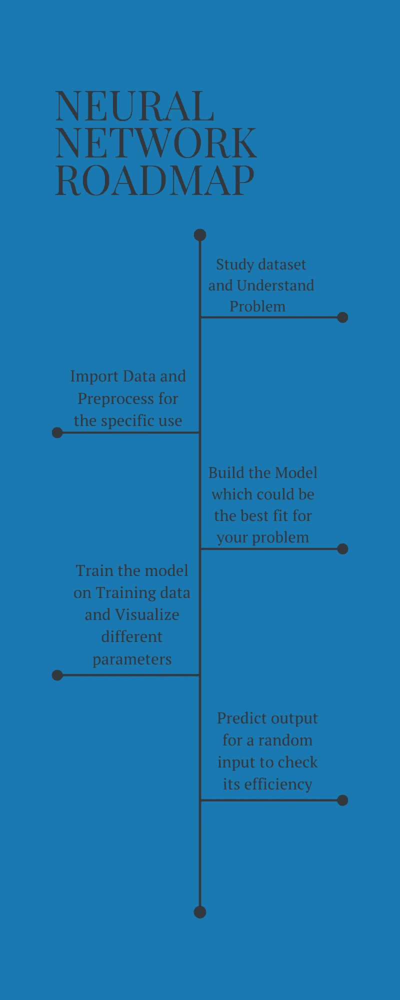
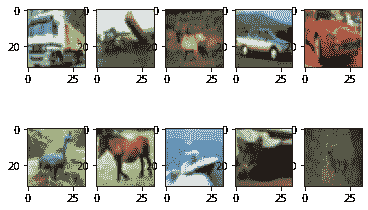
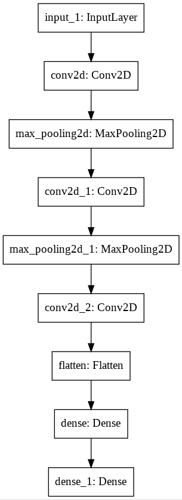
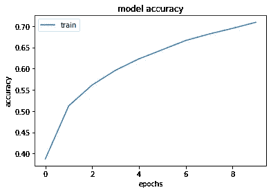
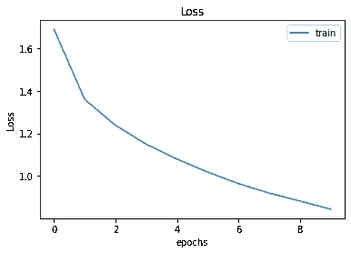
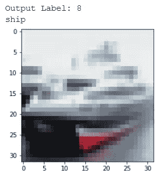

# CIFAR-10 分类

> 原文：<https://medium.com/nerd-for-tech/classification-on-cifar-10-32abe456302?source=collection_archive---------5----------------------->

早些时候，我们在我以前的博客中讨论过深度学习和神经网络，我们正在掌握这种算法的道路上，首先我们理解了直觉，然后是它背后的数学，现在我们最终将看到它通过 Python 的实现。

概述我们的实施流程通常是如何进行的。

来源:www.canva.com

## 理解数据

为了理解神经网络的实现，我们首先必须了解我们使用它来解决什么类型的问题，以及我们实际上是在什么类型的数据上使用我们的网络。

这个 [CIFAR-10 数据集](https://www.kaggle.com/c/cifar-10)是不同图像的集合，是机器学习和计算机视觉实践的一个非常基本和流行的数据集。CIFAR-10 数据集包含 10 个不同类别的 60，000 幅(32x32)彩色图像。这 10 个不同的类别代表飞机、汽车、鸟、猫、鹿、狗、青蛙、马、船和卡车。每个类有 6000 张图片。因此，我们计划实现一个网络，用于将测试图像分类到这 10 个类别中。

来源:CNN VS. CIFAR-10 作者 jesse_geman

CIFAR-10 数据集中的这些图像是(32 x 32)分辨率和彩色图像，这意味着它们是 RGB 格式的。因此，每个图像的形状都是(32，32，3)，其中 3 代表它的通道数-RGB、红色、绿色和蓝色。该数据集中的每个图像都是这三种颜色图像的混合。所有这些图像都是像素形式的，例如在这个特定的数据 32 x 32 中，意味着 3 个不同通道的 32 x 32 像素值的矩阵。

来源:[geeksforgeeksmatlab-RGB-image-representation](https://www.geeksforgeeks.org/matlab-rgb-image-representation/)

因此，我们得出结论，我们将用于神经网络实现的数据有 60，000 个(32，32，3)形状的图像和 10 个要分类的输出类。现在，我们将看到 python 中的这个实现。

## 必需的库

一个 **Python 库**是一个可重用的代码块，你可能想把它包含在你的程序/项目中。与 C++或 C 语言相比， **Python 库**不属于 **Python** 中的任何特定上下文。因此，为了执行强大的任务，我们需要利用一些高度兼容和易于使用的库。下面列出了我们执行这个问题所需的库。

## 加载数据

对于任何 ML 或 DL 问题，我们的第一步都应该是加载和可视化我们要使用和预测的数据。这里，我们已经加载了在前面的步骤中从 [tensorflow.datasets](https://www.tensorflow.org/datasets) 导入的 cifar10 数据集，并且我们已经将数据直接加载到训练集和测试集中，因此不需要进一步的外部拆分。

## 可视化输入数据

在这里，我们只是可视化输入数据，在下面的代码片段中，我们制作了一个子图，用于绘制训练数据中的前 10 幅图像。

为图像创建的子情节

## 标准化数据

现在，在刚刚加载数据集后，我们必须对其进行归一化，以获得统一的要素和更好的预测。在这里，我们还将数据类型更改为“flot32”类型，这样做是因为 tensorflow 只接受这种格式的输入。

## 构建模型

现在到了我们计划中最重要的部分，建立一个模型来实现我们的目标，在这个问题中分类成 10 个不同的类。因为在这种类型的问题中，有单个输入和单个输出，我们可以添加不同的层，并按照定义的顺序进行分类，这里我们不需要给出多个单独的输入或输出，因此完整的模型可以按顺序工作。在这个例子中模型共有 9 层，如 Input，Conv2D，MaxPooling2D，Flatten，Dense。每一层都有自己的超参数，我会在接下来的博客中深入讨论，但我建议你们去官方的 tensorflow 文档页面:

 [## API 文档| TensorFlow Core v2.5.0

### 从 Google I/O 观看主题演讲、产品会议、研讨会等，查看播放列表[{ "type ":"拇指向下"，" id"…

www.tensorflow.org](https://www.tensorflow.org/api_docs) 

通过这种方式可以更好地理解所有的层和不同的超参数，这将对你们有很大的帮助，并且肯定会扩展你们与特定层相关的思维和知识。回到我们的示例模型，您可以看到，在模型的最后一层，我们使用了一个密集层，其中的参数为 10，这意味着通过该层传递信息后的输出大小将为(10)的格式。我们必须分为 10 类，因此在通过这一层后，它会创建一个长度为 10 的向量，给出 10 个不同的值，该向量会通过一个 Softmax 函数，该函数会将向量的每个值转换为概率，因此我们可以轻松选择最高的概率并预测特定的指数类。同样在结尾,' model.summary()'用于打印构建模型的完整摘要。

这部分代码用于以非常有效的方式绘制模型(逐层),并且将绘制的模型保存到上述格式的文件中(例如:。png，。jpg)放在您工作所在的目录文件夹中，稍后可用于模型可视化。

模型

## 编译模型

我们已经为分类建立了模型，现在下一步将是 model.compile 函数，其中我们可以提到在我们的模型上训练数据时要使用的不同度量、损失、优化器。这里，我使用了[稀疏分类交叉熵](https://www.tensorflow.org/api_docs/python/tf/keras/losses/SparseCategoricalCrossentropy)损失，重要的是，我给出了(from_logits = True)作为关键参数，这是因为我们没有给出 [Softmax](https://www.tensorflow.org/api_docs/python/tf/keras/activations/softmax) 作为我们模型中最后一层的激活函数。因此，这个参数表明最后一层的输出不是概率格式的，所以先转换它，然后再继续。此外，我们使用了优化器参数，因此，优化器基本上是用于改变神经网络属性(如权重)的算法或方法。最后初始化准确性度量以检查准确性值。

## 培训模式

现在我们必须训练我们的模型，为此 tensorflow 有一个名为 model.fit 的函数，它负责训练，并有一些重要的参数作为输入，包括训练数据、批量大小和时期。批量大小是一个超参数，它定义了在更新内部模型参数之前要处理的样本数，而时期数是一个超参数，它定义了学习算法将处理整个训练数据集的次数。因此，这将使用所提到的时期的输入数据来训练我们的模型，并在每个时期之后返回损失和准确度值。我们将它存储在一个名为 model_history 的变量中，这样我们就可以在以后访问我们的准确性和损失值，以便可视化它们。

## 肉眼观察

这是最重要也是最吸引人的部分，在实现了每一个片段之后，你将能够理解它实际上是如何工作的，但是可视化让一切变得更容易理解。请记住，我们将训练好的模型保存在 model_history 中，我们这样做是因为现在我们将可视化每个时期的那些结果(准确性和损失)。对于可视化，Matplotlib 是一个非常有效和有用的库。

训练数据的模型准确度图

同样，我们也可以看到每个时期后产生的损失。

训练数据丢失

我们在这个 CIFAR10 数据集上实现了一个小模型，通过它我们在训练数据上获得了 70%的最大准确度，这不是一个很好的结果，但对于理解神经网络的实现来说，这是可以接受的。在制作模型时可以包含更多的概念，如实现[回调](https://www.tensorflow.org/api_docs/python/tf/keras/callbacks)，使用[数据集 api](https://www.tensorflow.org/api_docs/python/tf/data/Dataset) ，在每一层后可视化输出，但我没有在这篇博客中包括所有这些，因为我想保留这一个神经网络的基本实现，但肯定会提出一些令人兴奋的博客来涵盖所有这些。

## 做预测

我们已经实现了完整的模型，并可视化的准确性和损失。如果我们已经建立了一个模型，将图像分为 10 类，我们也应该知道如何预测随机输入的图像。

这里我们试图预测测试数据集中随机输入 x_test[1]的输出标签。在这里，model.predict 函数用于通过我们的网络传递该图像来获得输出，并给出最终的数组作为输出。然后使用“argmax”函数从数组中获取最大值，并将其存储为 n。这个 n 是我们从为标签创建的列表中计算的预测标签的索引。

## 结论

在这篇博客中，我试图涵盖一个基本神经网络的整个实现，并在训练数据上可视化模型的准确性和损失。最后，我们还预测了模型的随机输入，我们的模型表现准确，并给出了准确的预测。当我们学习深度学习的概念时，我们必须深入挖掘才能完全理解。这是一个非常初级的模型，我用在这个博客上是为了让你最大程度的理解。在接下来的博客中，我将尝试涵盖一些复杂的网络架构，并找出提高我们的准确性和理解它们的方法。此外，我还提供了[链接](https://github.com/SiddharthKalla/CIFAR_sequential_model)来完全访问这段代码，这样你就可以重新实现并正确理解它。

希望我能提供一些有价值的东西，请留下你的回复和快乐学习！！