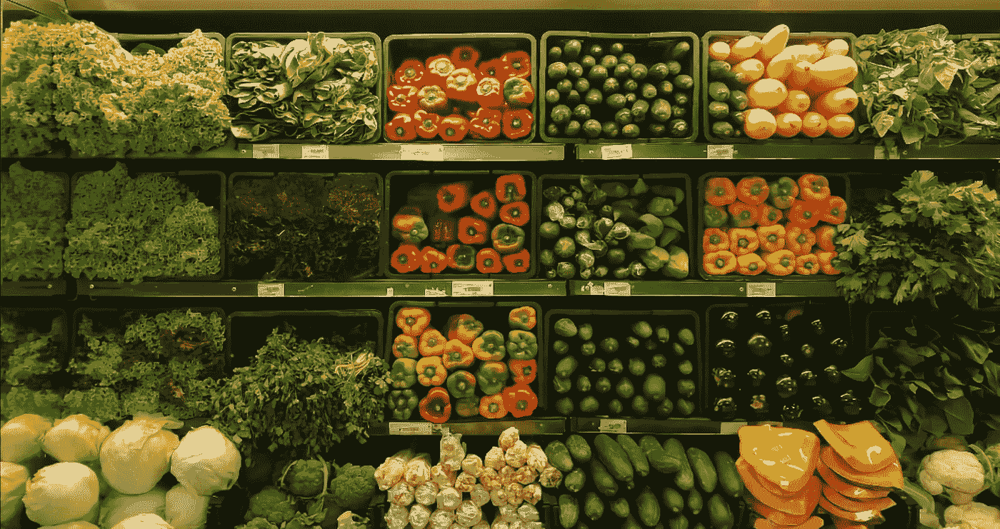

# 机器学习中的聚类。

> 原文：<https://medium.com/nerd-for-tech/clustering-in-machine-learning-2537942d63bd?source=collection_archive---------14----------------------->

学分: [Unsplash](https://images.unsplash.com/photo-1542838132-92c53300491e?ixid=MnwxMjA3fDB8MHxzZWFyY2h8Mnx8dmVnZXRhYmxlJTIwbWFya2V0fGVufDB8fDB8fA%3D%3D&ixlib=rb-1.2.1&w=1000&q=80)

让我们从一个例子开始。你可能在超市里看到过相似的蔬菜是如何被分组放在一个区*(上图)*。如果你想让机器来做，机器首先需要找到模式，识别相似的模式，并把它们放在一起。这就是聚类的含义*(简单来说)*，它识别模式并将它们分组为簇。

今天，我们将学习一种不同的 ML 方法。在 ML 中，我们基本上采用数据集，用数据训练模型，并预测结果。当数据被标记/监督时，这很容易。但是无监督的数据呢？在现实世界中，有很多数据集是没有标记的，我们需要方法来处理这类数据。这就是集群的用途。

在开始聚类之前，让我们先了解一下无监督数据的实际含义。

# ***无监督数据:***

正如我前面提到的，无监督的数据意味着无标签的数据。人工智能应该利用这些数据，通过自我学习来总结模式。它基本上是自己做观察，自己下结论。使用这些数据的好处是，AI 可以在数据集中找到异常和缺陷。由于这没有标记数据，这使得我们的工作更容易。

我们可以用两种方式处理无监督数据:

1.  ***聚类*** *(查找模式并将它们分组)*
2.  ***关联*** *(它发现一个数据项对另一个数据项的依赖性，并将它们映射以确定有意义的结论/洞察。)*

今天，我们只关注集群。

# ***聚类:***

聚类用于对数据集中的模式进行分类，并将相似的模式分组。术语*‘集群’*描述相似模式的群组。这些模式被表示为一个度量向量或多维空间中的一个点。在找到模式之后，使用各种距离度量来找到这些模式之间的不同点和相似点。

***聚类的阶段:***

1.  代表一种模式。
2.  为数据集域适当地定义模式。
3.  相似模式的聚类或分组。
4.  数据抽象*(如果需要)*。
5.  评估输出*(如果需要)*。

聚类有几种类型的技术可以使用。但是没有一种普遍适用的聚类技术。任何技术的评估也依赖于领域。建议用户在选择聚类算法时充分了解所使用的技术，并具备一些领域知识。

***聚类可以进一步分为:***

**A)层次聚类算法:**

在*分层方法*中，有一个嵌套的模式分组。如果考虑单一模式，然后最终分组形成聚类，则称为*凝聚/自下而上*方法。如果一个大数据集被分解成不同的聚类，那么它被称为*分裂/上下*方法。大多数分层方法是*单链接*和*完全链接*算法的变体。最近邻算法就是一个例子。

**B)分区方法:**

在这种方法中，数据集被分解成一组不相交的聚类。首先，将数据集划分为 k 个聚类，并对它们进行迭代改进以获得高质量的聚类。用于提高质量的功能有*误差平方和(SSE)、质心、*等。分区算法比大型数据集更有优势。著名的 K 均值聚类就是这种方法的一个例子。

**C)基于密度的方法:**

基于密度的聚类或 *DBSCAN(带噪声的基于密度的空间聚类应用)*方法首先选择“最密集”区域的聚类。在选择“最密集”区域时，需要考虑两个因素；一是密集区域的半径，二是这个区域的最小邻居数。如果任何一个点对于集群来说都是不可到达的，那么这个点就被称为*离群点。*该区域的中心点称为*核心*。边界处的点称为*边界*点。从“最密集”区域，我们将它与数据集中的其他点进行比较，并定义它是否属于该区域(*离群值*不属于该聚类)。*边界*点被认为是区域的一部分)。如果没有更多的数据点属于该区域，它最终被定义为相似模式的聚类。

**D)基于网格的方法:**

基于网格的方法将对象空间分成多个单元以获得网格状结构，并且将聚类应用于该结构。STING 就是这种方法的典型例子。

*作者，****SMRUTHI R paladi***

参考资料:

1.  [用 Python 实现的 10 种聚类算法](https://machinelearningmastery.com/clustering-algorithms-with-python/)

2.[机器学习中的聚类](https://www.geeksforgeeks.org/clustering-in-machine-learning/)

3. [KNOWM](https://knowm.org/introduction-to-clustering/)