# 利用 K-Means 聚类 NBA 球员

> 原文：<https://medium.com/nerd-for-tech/clustering-nba-player-using-k-means-7b568830edfd?source=collection_archive---------8----------------------->

今天的篮球运动已经和十年前完全不同了。如今，随着更多的全能球员和全能位置的出现，它有了更多的全能打法。旧的游戏着重于玩家的同步旋转和移动，而在今天的游戏中，玩家跑得更快更敏捷。那里仍然有旋转，但是运动速度不同。今天的比赛也有很多 3 分投篮。

篮球运动的发展也影响着其他领域，尤其是球员的位置。篮球有传统的 5 个位置，即组织后卫、得分后卫、小前锋、大前锋和中锋。中锋和大前锋通常由篮板球技术高超的大个子球员担任。在今天的比赛中，大个子们也有能力投篮，甚至三分球。他们不需要总是在油漆区移动，他们可以轻松地移动油漆，要求球，拍摄 3 分。所以，每个位置的限制完全改变了。

有趣的是，布拉德·史蒂文斯也陈述了凯尔特人主教练的相似之处。根据 B [leacher 报道](https://bleacherreport.com/articles/2720250-brad-stevens-says-celtics-have-3-not-5-positions-now)，布拉德·史蒂文斯说凯尔特人不再打 5 号位了。取而代之的是，球队现在打 3 个位置。根据他的陈述，这些位置是控球者，边锋和大个子。

> 我再也没有那五个位置了。现在可能简单到三个位置，你可以是控球者，边锋或者大个子。真的很重要。随着岁月的流逝，我们变得更加多才多艺。——布拉德·史蒂文斯，美联社的佩尔·卡里姆·科普兰

金州勇士队还发明了一种新的篮球游戏，他们能够专注于斯蒂芬库里和克莱·汤普森的小球。他们的超级巨星斯蒂芬·库里被认为是得分后卫，但他也像克莱·汤普森和凯文·杜兰特一样有很高的得分技巧。

这个现象引起了我的兴趣。布拉德·史蒂文的有意义吗？还是只是虚张声势？作为一名数据科学家，我想从数据的角度来分析。如何用统计数据解释布拉德的新篮球位置？

另一方面，本文还展示了一个如何在体育领域(尤其是篮球)实施数据科学的简单示例。

为了实现这个目标，我使用了一种无监督的机器学习方法进行聚类。由于数据集不包含任何标签，所以聚类是最合适的方法。您可能听说过一些聚类方法，如 KMeans、层次或基于密度的带噪声应用程序空间聚类(DBSCAN)。然而，我更喜欢使用 KMeans，因为它的算法非常简单，速度也更快。

布拉德的陈述发生在 2017 年 7 月，因此解释客观情况的最佳统计数据是当时的数据。幸运的是，有一个 NBA 2017-2018 赛季的统计数据集已经在 Kagle 上发布。你也可以在这里访问数据集[。](https://www.kaggle.com/mcamli/nba17-18?select=nba.csv)

数据集总共包含 59 个列或属性。然而，并不是所有的都要经过 KMeans 算法的训练。手动选择了一些我认为最有代表性的属性。这些属性通常解释了篮球运动员的进攻或防守技巧。

进攻属性是投篮命中率(FG)、投篮命中率(FGA)、投篮命中率(FG%)、3 分投篮命中率(3P)、3 分投篮命中率(3PA)、3 分命中率(3P%)、2 分投篮命中率(2P)、2 分投篮命中率(2PA)、2 分命中率(2P%)、罚球命中率(FT)、罚球命中率(FTA)、罚球命中率(FT%)、得分(PTS)、助攻(AST)和进攻篮板(ORB)。

而防守属性则是防守篮板(DRB)、盖帽总量(BLK)、抢断总量(STL)、失误总量(TOV)。根据进攻和防守属性，KMeans 聚类算法会尝试将 NBA 球员分成 3 组。

在实现 KMeans 集群之前，我首先预处理数据集以删除未使用的数据。预处理步骤大致如下图所示。

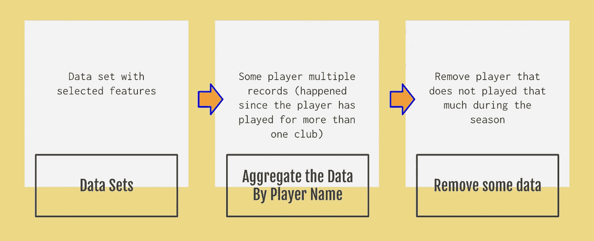

预处理步骤

前面已经解释了预处理步骤的第一步。在那之后，我聚集了基于玩家的数据集。这样做是因为，在一个赛季中，有球员为不止一个 NBA 俱乐部效力。这样一来，这组球员就有了多项表现统计。

最后，我剔除了那些在一个赛季中上场时间不多的球员。我想重点分析一下经常打球的 NBA 球员。因此，一个赛季中出场次数不超过总场次 25%的球员将被从数据集中删除。大致接近，我只用了 2017-2018 赛季上场时间超过 1000 分钟的球员。

下面是我移除一些玩家后，整个数据集与数据集的直方图对比。直方图显示总分钟数。在左图中，我们看到了一个显著的峰值，总上场时间不到 1，000 分钟。移除这些数据后，我得到了右边的图，它看起来更适合高斯分布的数据，甚至稍微向左倾斜。对于 KMeans 算法，高斯分布的数据更适合分析。

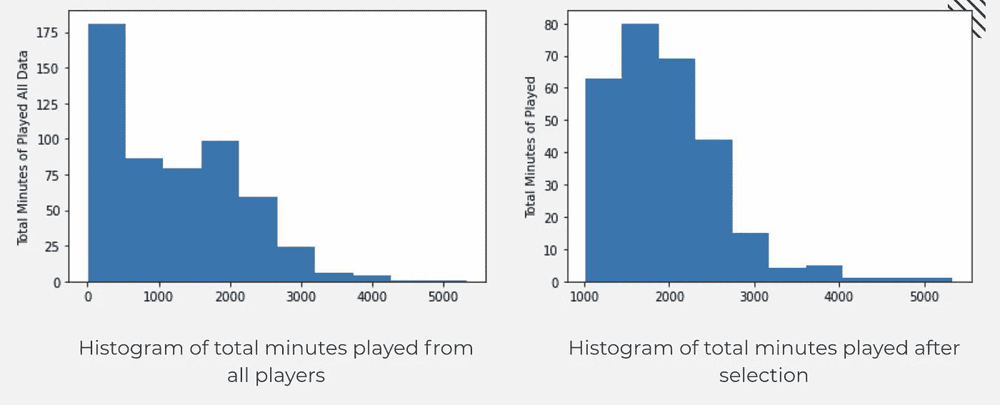

另外，这里是数据集中每个攻击性属性的散点图和直方图。可以看到，除了 3P%、英尺%和 AST 之外，大多数属性的数据也是高斯分布的。

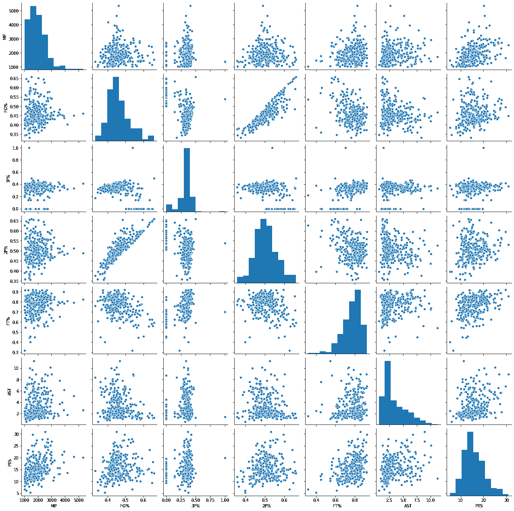

攻击属性的分布

而下面是数据集中防御属性的散点图和直方图。类似于进攻属性，这里的大多数属性也有高斯分布，除了 DRB 和 BLK。

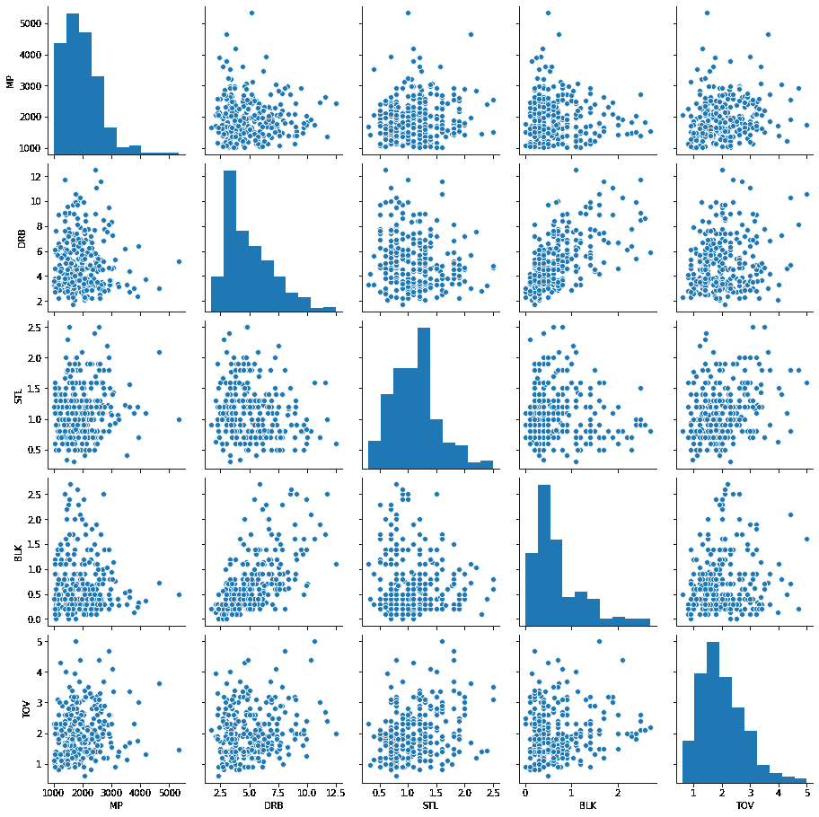

防御属性的分布

您可以检查以下每个属性的相关值

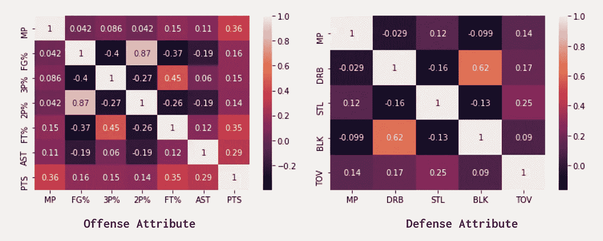

每个属性的相关值

下一步是实现 KMeans 聚类算法。这个算法要求我们定义聚类的数目。为此，我使用了肘法。肘方法是一种启发式方法，用于确定数据集中的聚类数。该方法包括将解释的变化绘制为聚类数的函数，并选取曲线的拐点作为要使用的聚类数。下图是肘部的结果。

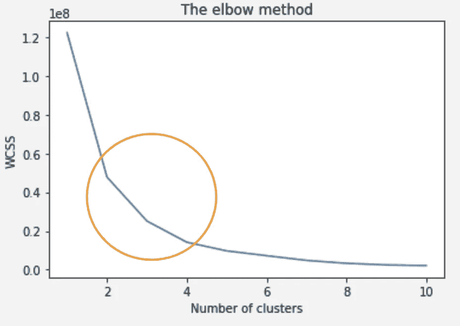

定义聚类数的肘方法图

当图中的线开始倾斜时，就是适当的聚类数。使用上面的图表，我们知道线开始倾斜，无论是在第 2 组还是第 3 组。这里，我选择 3 作为 KMeans 算法的聚类数，因为这符合 Brad 的说法。

这是根据 KMeans 分类结果的属性组散点图。

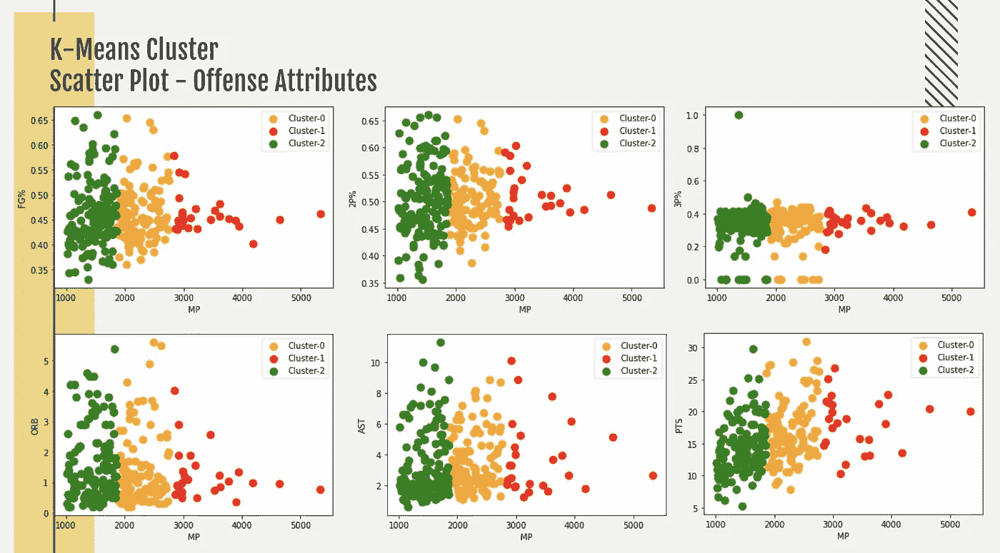

从进攻属性看聚类结果

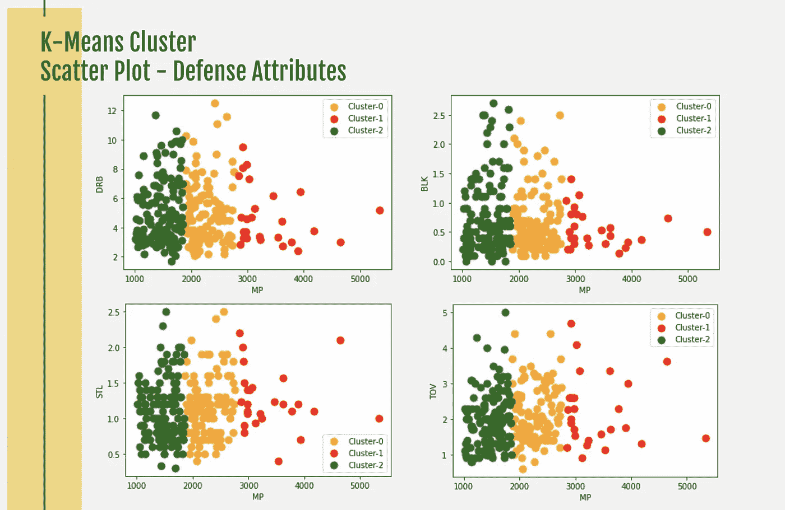

从防御属性看聚类结果

无论是进攻还是防守，结果都非常相似。最后一步是解释每个聚类结果。你可能想先检查一下这个条形图。

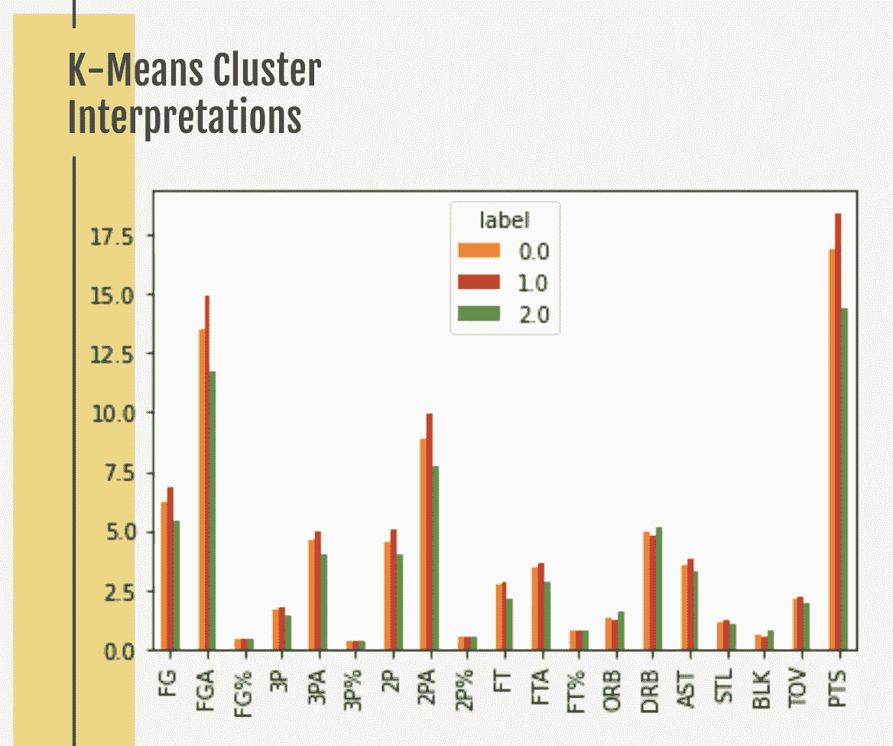

按属性比较每个分类

粗略地看，集群 1 中的玩家压倒了其他集群。让我们来看看更多的细节。

# 解释群组-0

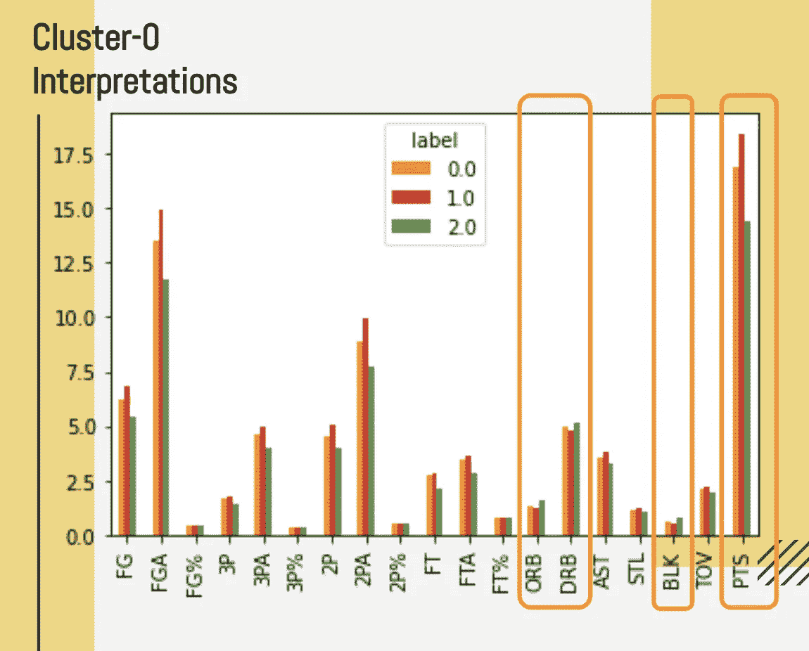

群集 0 中的焦点

从上面的图表和对这三个属性的关注，可以看出集群 0 的玩家在 ORB、DRB、BLK 和 PTS 都有很好的数量。尽管仍然低于集群 1 中的玩家，但是，差异并不显著。我认为这个群体中的球员在得分方面有很好的技术，但在防守方面也有很好的感觉。因为他们的圆球数和 DRB 数都没那么差。总的来说，这类球员是攻防兼备的球员。让我们看看该集群中的一些玩家及其统计数据。

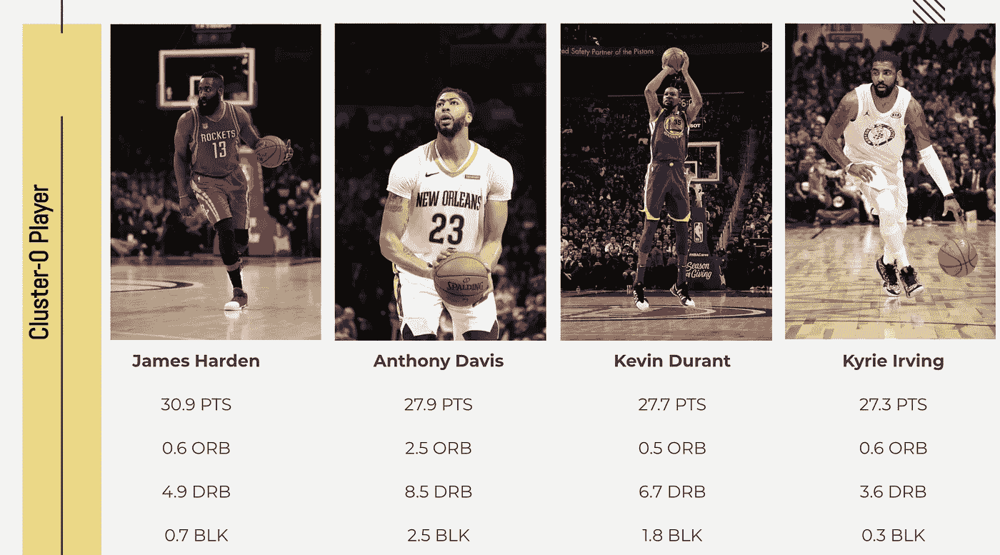

Cluster-0 中的一些玩家

# 口译分组-1

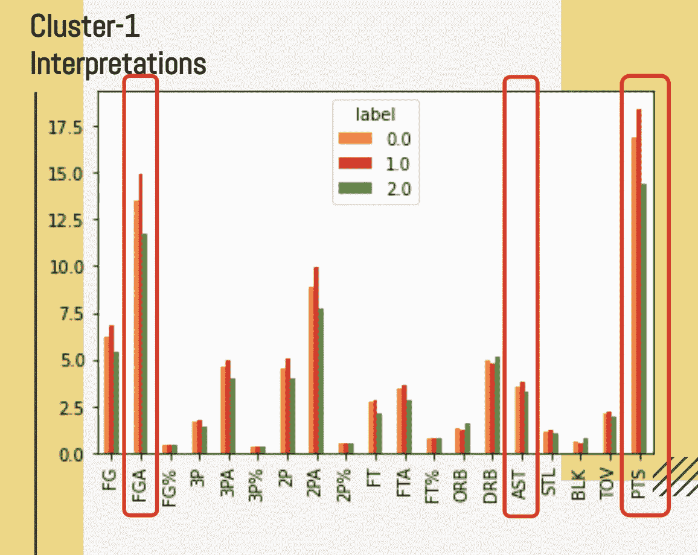

你也可以从上面的图表中注意到，这个集群中的玩家在一些进攻属性上有着特殊的数量。他们是联盟中最好的得分手，创造了 2PA 和 3PA 最多的投篮机会。我认为这些球员是队里的普通队员。他们创造变革，但有时也会执行变革。不是典型的大个子，因为他们的球数丹 DRB 低于集群 0 的球员。该集群中的一些参与者包括:

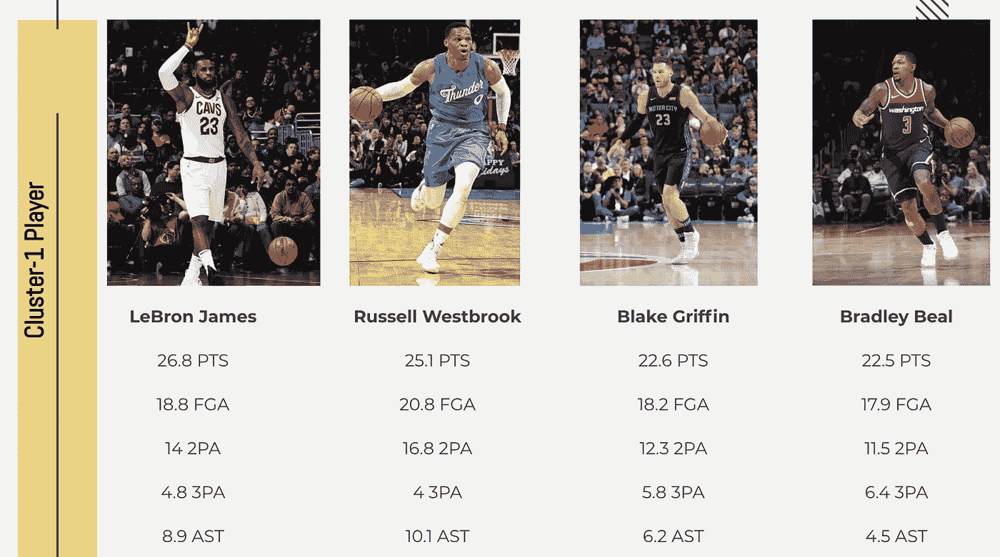

集群 1 中的一些玩家

这是有道理的，因为有一些著名的名字，如勒布朗詹姆斯和拉塞尔·维斯特布鲁克，他们的技术与集群 1 中的特征完全匹配。

# 口译组-2

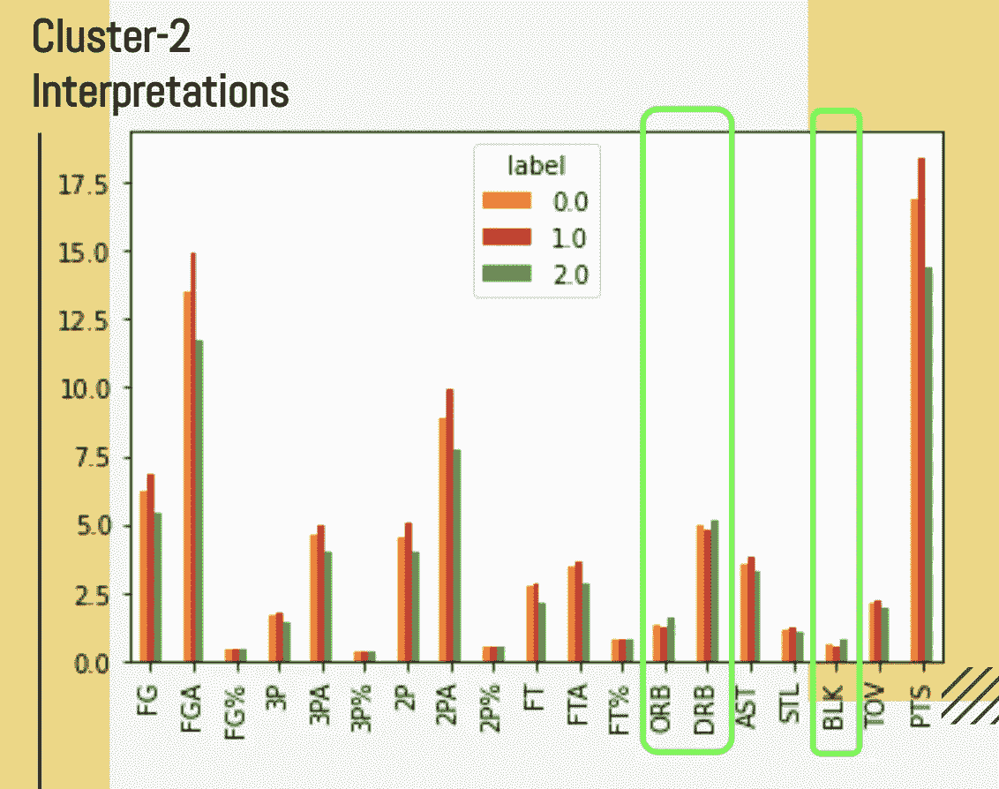

最后，还有来自集群 2 的玩家。这个玩家在 ORB、DRB 和 BLK 的数量最多。很容易，这一组大部分都是大个子球员。我认为他们是联盟中保护篮筐最好的防守者。让我们来看看这一组的一些选手。

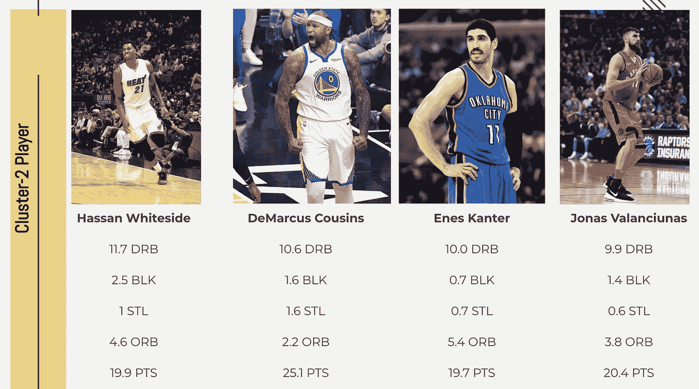

集群 2 的一些玩家

KMeans 聚类的结果及其解释非常有趣。不知何故，结果代表了布拉德的说法。根据 Brad Steven 的陈述和我们的 KMeans 聚类结果，似乎持球球员与第 1 类中的球员相似。这类球员是地板普通型，有分球能力，也有得分能力。侧翼球员和集群-0 的球员相似，因为他们更全面。他们能打进攻和防守。Cluster-3 在布拉德·史蒂文看来代表了一个大男人玩家。这位球员拥有最高的防守意识和非凡的盖帽数量。

我个人对这个结果很满意。即使使用最简单的算法，但结果给了我们相当客观的理解。希望我的这篇文章能让你开心，但也给出了一个如何在篮球领域实现数据科学的简单例子。

谢谢！