# 用 Next.js 和 Nodemailer 编写联系人表单

> 原文：<https://medium.com/nerd-for-tech/coding-a-contact-form-with-next-js-and-nodemailer-d3a8dc6cd645?source=collection_archive---------0----------------------->


沃洛季米尔·赫里先科在 [Unsplash](https://unsplash.com?utm_source=medium&utm_medium=referral) 上的照片

嘿！想用一个电子邮件联系表单来整理你的文件夹吗？或者给客户一种不用离开你的网站就能直接联系你的方法？幸运的是，用 Next.js 和 Nodemailer 建立一个简单的电子邮件联系表单很容易。让我带你走一遍。

为了清楚起见:这是一个如何编写自定义电子邮件联系表单的教程。最后，您将能够在您的站点上嵌入一个表单，该表单接收用户的姓名、电子邮件和消息(以及您可能需要的任何其他信息)。)并将包含该信息的电子邮件发送到 Gmail 地址。那可以是你的 Gmail，一个用户放进去的 Gmail，你可以向多个地址发送相同的消息，或者用一个动作向几个账户发送定制的消息。

我假设您对 Javascript、Node 和 Next.js 有基本的了解。您也可以使用 plain React 或任何其他前端框架来完成这项工作，但是我使用 Next，因为它为我们处理服务器代码。

如果你想看这样一个表格的工作示例，请查看我的文件夹底部的联系表格[这里](https://elyssa-winch.herokuapp.com/)！

## 第一步:创建下一个应用

打开您的终端到您选择的文件夹，并创建您的 Next.js 应用程序。你知道这是怎么回事——只需输入终端:

```
*npx create-next-app*
```

你应该最终得到一个典型的入门 Next 应用

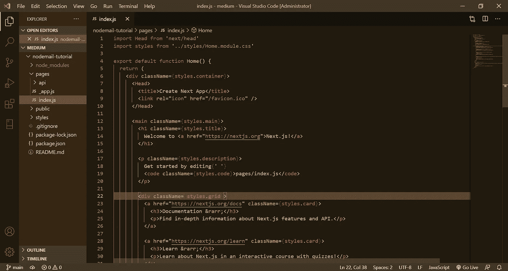

## 第二步:添加表单

一旦你完成了应用程序，清理下一个样板代码，这样你就有了一个漂亮干净的下一个应用程序。

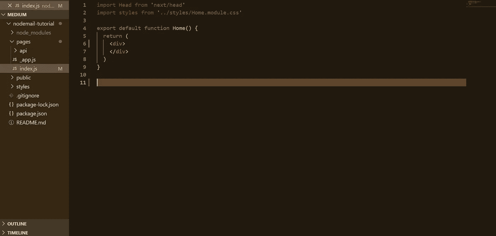

离开这里，样板

现在，添加一个表单，该表单应该包含用户名、电子邮件和消息的输入字段。当然，还有一个提交按钮。

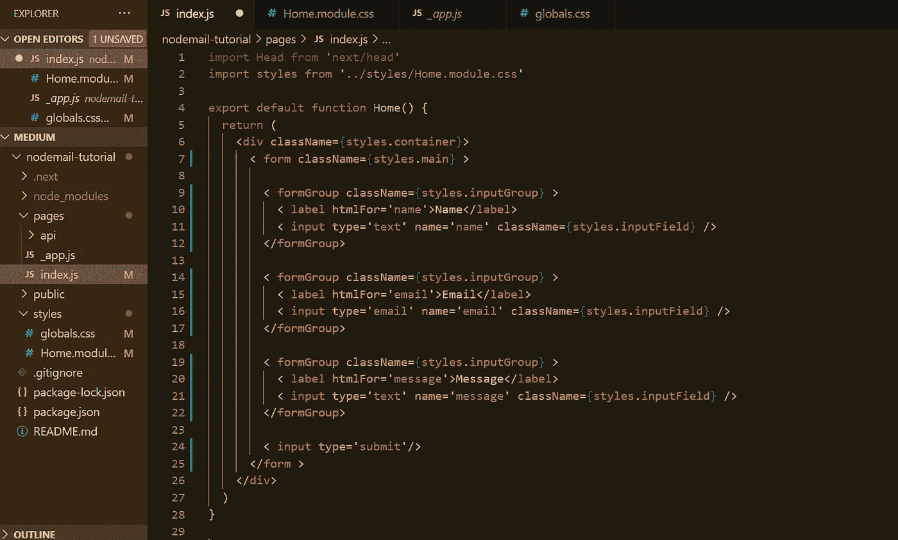

在 React 和 Next 中处理标签时，记得使用 htmlFor！

```
<div className={styles.container}>
  < form className={styles.main} > < formGroup className={styles.inputGroup} >
    < label htmlFor='name'>Name</label>
    < input type='text' name='name' className={styles.inputField} />  
  </formGroup> < formGroup className={styles.inputGroup} >
    < label htmlFor='email'>Email</label>
    < input type='email' name='email' className={styles.inputField} />
  </formGroup> < formGroup className={styles.inputGroup} >
    < label htmlFor='message'>Message</label>
    < input type='text' name='message' className={styles.inputField} />
  </formGroup> < input type='submit'/>
  </form >
</div>
```

我还在表单中添加了一点样式，只是为了在我们进行的过程中更容易查看。

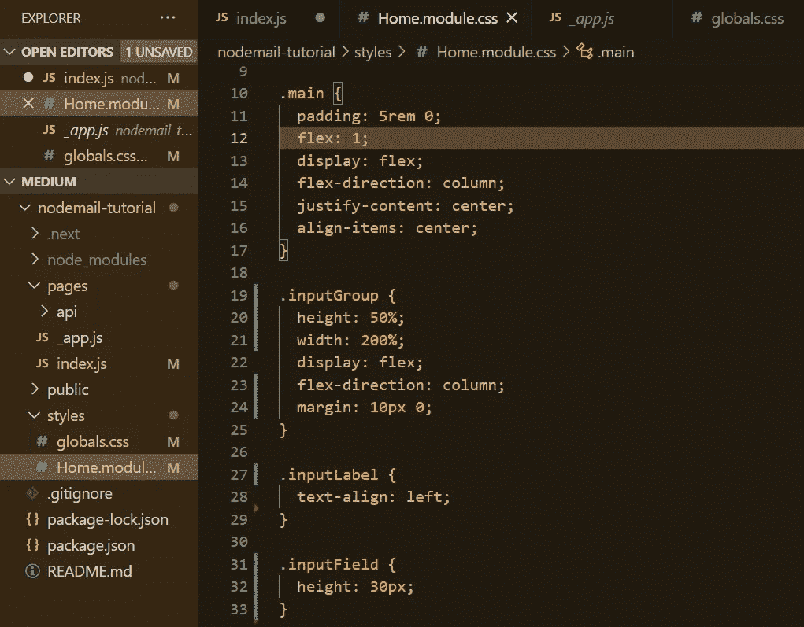

```
.inputGroup {
  height: 50%;
  width: 200%;
  display: flex;
  flex-direction: column;
  margin: 10px 0;
}.inputLabel {
  text-align: left;
}.inputField {
  height: 30px;
}
```

最后，你应该有一个类似这样的表单(好吧，假设你复制了我的样式。)

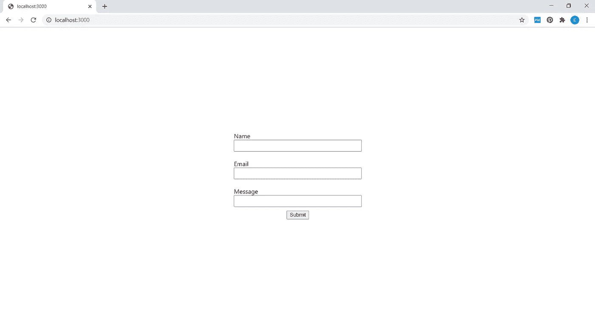

酷！现在我们继续。

## 第三步:设置前端功能

在我们尝试将它插入任何花哨的东西之前，让我们的前端工作起来。为了保存用户给我们的输入，我们需要从 React 导入 useState，所以我们先从这里开始。

在导出函数之外，编写:

```
import { useState } from 'react'
```

在导出的内部，但在返回的外部，写下:

```
const [name, setName] = useState('')
const [email, setEmail] = useState('')
const [message, setMessage] = useState('')
const [submitted, setSubmitted] = useState(false)
```

按顺序:这些是状态变量，用于保存用户名、电子邮件和消息，还有一个布尔值，用于标记消息是否已提交。现在我们需要将这些值从输入字段传递给状态变量。先说 onChange 函数。

“onChange”是我们在 HTML 标记(如输入字段)中设置的一个属性，每当标记的值改变时，它就会运行一个函数，例如，当用户在一个空框中键入他们的名字时。在这个 onChange 函数中，我们可以使用状态变量 setter 函数将更改后的输入字段的值传递给 state，从而捕获用户输入。

因此，让我们将 onChange 函数添加到名称、电子邮件和消息中。例如，我们的姓名输入应该是:

```
< input type='text' name='name' className={styles.inputField} />
```

收件人:

```
< input type='text' onChange={(e)=>{setName(e.target.value)}} name='name' className={styles.inputField} />
```

“onChange = {(e)= > { setName(e . target . value)}”是这里重要的一行。它告诉 Next，当这个输入字段注册一个变更时，它应该运行这个匿名函数。我们的' e '变量保存了关于事件的信息，我们需要将它传递给 setter，以便捕获输入字段的值。e.target.value 获取该值，并将其设置为 state 中 name 变量的新值。

现在对电子邮件和消息字段进行同样的操作。

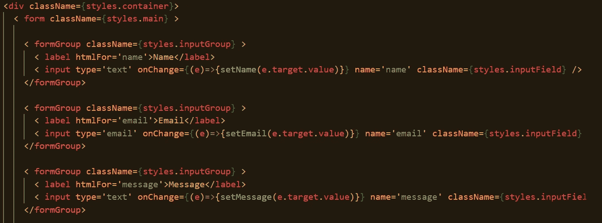

记住将“setName”分别改为“setEmail”和“setMessage”

酷！现在我们可以通过使用我们的开发工具在浏览器中检查我们的状态值来测试这一点。打开你的应用程序，在输入框中输入一些东西，看看你的状态变量是否反映了你的输入。

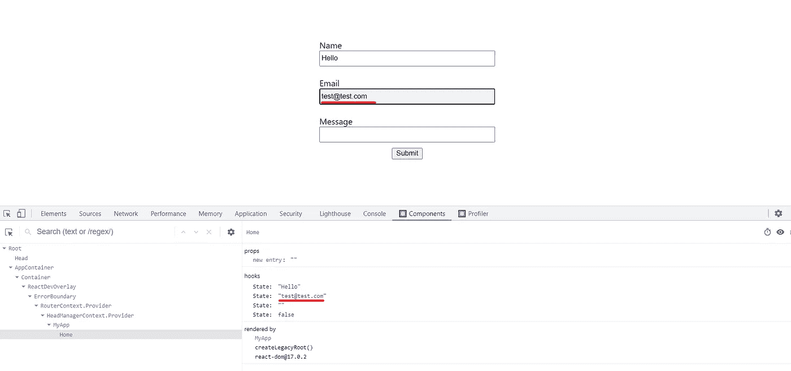

非常有用。所以我们成功地接受了用户的输入。现在我们该拿它怎么办？

## 第四步:处理提交

当用户点击提交按钮时，我们需要获取他们给我们的信息并对其进行处理。一个表单获取数据，然后不采取任何行动就把它转储出去，这是一个非常无用的表单，对吗？

因此，现在我们需要引入 Fetch，以便将这些数据传送到某个地方。(如果你愿意，你可以使用 Axios，或者任何其他替代品，但是为了简单起见，我坚持使用 Fetch。)我们所需要的是，当用户提交时，获取他们的数据并将其发布到 API。

在函数组件中，但在返回之前，创建一个新函数:

```
const handleSubmit = (e) => {
  [ Code goes here, eventually ]
}
```

除了事件之外，我们不需要传递任何东西给这个函数——它需要的任何东西，它都会从状态中提取。在它的内部，创建一个名为 data 的对象来存储我们的状态变量。哦，还有一个 e.preventDefault()，这样页面就不会每次都重新加载了。

```
const handleSubmit = (e) => { 
  e.preventDefault()
  console.log('Sending') let data = {
    name,
    email,
    message
  }
})
```

现在，让我们添加获取请求:

```
const handleSubmit = (e) => { 
  e.preventDefault()
  console.log('Sending')let data = {
    name,
    email,
    message
  }fetch('/api/contact', {
    method: 'POST',
    headers: {
      'Accept': 'application/json, text/plain, */*',
      'Content-Type': 'application/json'
    },
    body: JSON.stringify(data)
  })
})
```

这些都在做什么？这是一个对 url '/api/contact '的 Fetch 调用，我们稍后会讲到。我们需要它发布到那个 url，并且我们需要发送数据对象的 JSON，它包含用户信息，比如姓名和电子邮件。

最后，我们希望处理当调用被返回时应该发生什么，这样我们就可以向用户显示他们的操作通过了:

```
const handleSubmit = (e) => { 
  e.preventDefault()
  console.log('Sending')let data = {
    name,
    email,
    message
  }fetch('/api/contact', {
    method: 'POST',
    headers: {
      'Accept': 'application/json, text/plain, */*',
      'Content-Type': 'application/json'
    },
    body: JSON.stringify(data)
  }).then((res) => {
    console.log('Response received')
    if (res.status === 200) {
      console.log('Response succeeded!')
      setSubmitted(true)
      setName('')
      setEmail('')
      setBody('')
    }
  })
})
```

在 Fetch 调用结束时使用. then 链接，我们将值重置回 null，并将 submitted 设置为 true。

现在，最后，让我们将 handleSubmit 函数包装在 Submit 按钮的 onClick 中。

```
< input type='submit' onClick={(e)=>{handleSubmit(e)}}/>
```

每当我们单击 Submit 时，这将运行 handleSubmit 函数，因此用户输入将被收集并通过 Fetch 调用发送到我们的/api/contact url。

让我们打开控制台，输入一些信息，然后点击 submit 来测试一下。我们应该得到一个“发送”日志，但没有别的，因为 Fetch 当前正在发送到一个不存在的 URL。

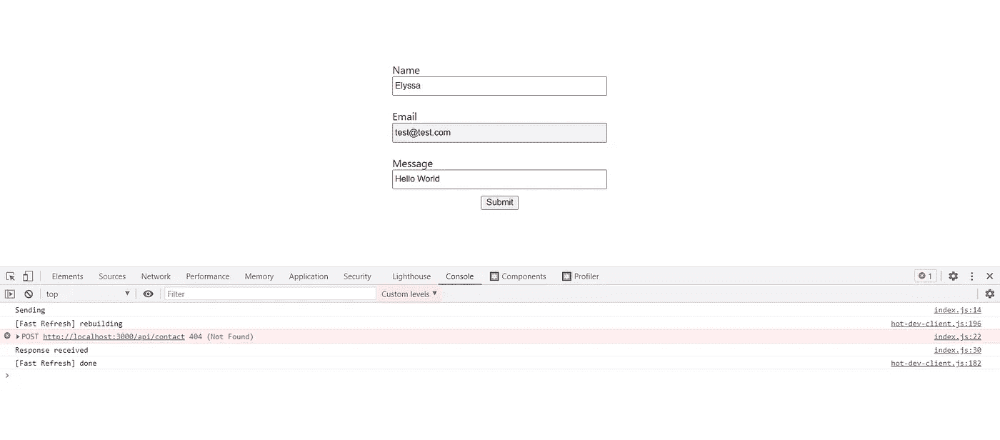

我们得到了一个“发送”——这很好！—和一个 404 错误。好吧！实际上，这正是我们想要的。检查 404 消息—它是否发布到/api/contact url？如果是这样，那正是我们希望看到的。

这是前端。后面怎么样？我们如何清除 404 错误并开始发送电子邮件？

## 第五步:构建 API 路径

让我们使用 Next 简单易用 API 功能为我们的获取构建一个端点。在 API 文件夹中，创建一个名为 contact.js 的新文件

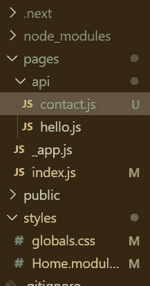

现在，在 contact.js 内部，创建一个新的导出默认函数，以(req，res)作为参数，并让它的控制台日志 req.body:

```
export default function (req, res) {
  console.log(req.body)
}
```

现在，让我们测试我们的应用程序组件是否正常通信。启动你的应用程序，返回你的表单，提交你的信息。现在，您的控制台中应该不会出现 404 错误。但是，您应该得到的是您提交的姓名/电子邮件/消息显示在您的终端日志中:


您的表单提交现已成功发布到您的 API 路线！现在我们可以用这个输入做任何我们想做的事情。不用担心给用户太多敏感信息，比如我们的电子邮件密码。进入下一步！

## 第六步:但是 Nodemailer 怎么办

对于 Nodemailer 的教程，到目前为止我们还没有使用过 Nodemailer。现在改变了！安全地藏在我们的服务器中，我们可以开始接收 Nodemailer 并实际发送一些电子邮件。首先，下载 Nodemailer。在终端中，写下:

```
npm i nodemailer
```

现在，在 contact.js api 路径中，导入 Nodemailer，并使用 nodemailer.createTransport()创建一个名为“transporter”的对象

```
export default function (req, res) { let nodemailer = require('nodemailer')
  const transporter = nodemailer.createTransport({}); console.log(req.body)
}
```

transporter 对象本质上是存储所有关于我们希望如何发送电子邮件的信息的对象——我们使用什么帐户？什么供应商？什么港口？我们将在 transporter 对象上定义所有这些，如下所示:

```
 const transporter = nodemailer.createTransport({
    port: 465,
    host: "smtp.gmail.com",
    auth: {
      user: 'demo@demo.gmail',
      pass: 'password',
    },
    secure: true,
  })
```

下面是这个传输器的主要特性:端口、主机和身份验证。端口是指电子邮件将使用的通信“通道”——465 用于 SMTP 通信，我们在它下面的“主机”行中指定了它。所有这些对我们在这里做的事情都不是非常重要，但是如果您有兴趣了解更多，请研究端口 465 和 SMTP。

然而，我们真正关心的是 auth。请注意，它包含“用户”和“通过”属性—这是我们将发送电子邮件的帐户的用户名和密码。

是的—出于明显的安全原因，用户不能从他们的直接帐户*向我们发送电子邮件。然而，我们能做的是，通过我们创建的一个虚拟账户，把他们的信息通过电子邮件发送给我们自己。你可以只输入你的个人 Gmail 和密码，直接给自己发送这些邮件，但是为了保护你的个人账户，我建议你创建一个一次性邮箱，它的唯一目的就是发送这些邮件。这样，如果帐户被泄露，您的个人信息仍然受到保护。*

因此，让我们暂停编码，进入下一步:设置虚拟帐户

## 第七步:创建账户

像创建任何 Gmail 帐户一样创建您的虚拟 Gmail 帐户，只需进入 Gmail 并创建即可。除了一个例外，你的机器人账户和普通的 Gmail 没有什么区别。

创建帐户后，您需要调整其安全设置以允许编程访问。否则，即使你的代码运行良好，Gmail 仍然会认为这是一个安全漏洞而阻止邮件。我们必须告诉 Gmail 允许不太安全的帐户访问，这是为什么使用一次性手机而不是个人手机是个好主意的另一个原因。

在帐户页面上，点击右上角的图标，然后点击管理您的 Google 帐户:

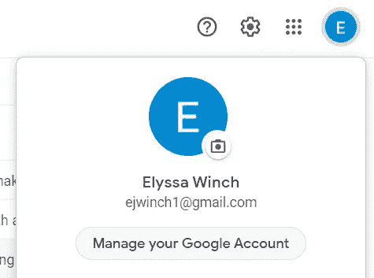

现在，转到左侧的安全选项卡，向下滚动，直到您看到标题为“应用程序访问不太安全”的部分将其设置为允许。

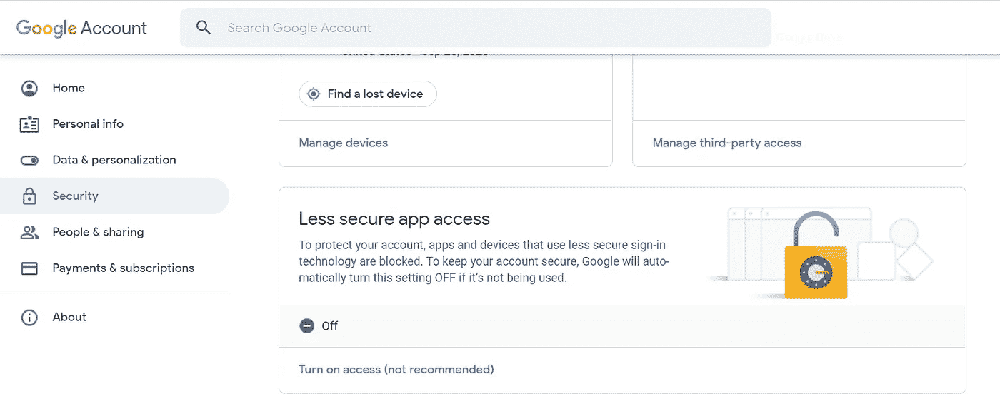

现在，我们已经设置了帐户，允许编程访问。但是我们不是应该多采取一项安全措施吗？考虑一下我们一次性帐户的密码:它是一次性的，当然，但是我们真的想把它的密码粘在我们的代码里吗？纯文本的？

为了给我们的帐户增加一点安全性，我们需要设置我们的 API 路由，将密码作为环境变量引入。所以，让我们请来了我们的老朋友，多腾芙。

在“终端”的项目文件夹中，键入:

```
npm i dotenv
```

然后，创建您的。env 文件包含

```
touch .env
```

接下来，在你的。环境文件，写入:

```
password=Whatever your account password is
```

最后，在 contact.js API 路径的顶部，导入您的。env with:

```
require('dotenv').config()
```

并从。包封/包围（动词 envelop 的简写）

```
const PASSWORD = process.env.password
```

我们是金色的！如果您正在将这段代码共享给 github，请记住包括。忽略你的 git 中的 env。如果您将应用程序部署到实时站点，请记住将您的密码作为环境变量！

好吧。现在让我们开始发送一些电子邮件。

## 第八步:把所有东西放在一起

因此，我们已经设置好了一次性帐户，我们的表单接收输入，我们的 API 将输入发送回服务器端。最后要做的就是让它正常工作，对吗？

回到 contact.js 代码，我们必须做最后两件事:创建我们想要发送的电子邮件，然后我们必须发送它！先说第一个。在您的传送器对象下方，写下:

```
 const mailData = {
    from: 'demo@demo.com',
    to: 'your email',
    subject: `Message From ${req.body.name}`,
    text: req.body.message,
    html: <div>{req.body.message}</div>
   }
```

我们创建了一个新对象，名为“mailData”，它包含五个字段:发件人、收件人、主题、文本和 HTML。似曾相识？这些是电子邮件的输入字段—

发件人是发送它的地址(我们的一次性帐户)。

收件人是收件人(如果您想将邮件发送给几个人，您可以指定多个收件人。)

主题是电子邮件将发送的主题。

文本是消息的纯文本主体，HTML 允许使用

标签等进行格式化。

感谢 API 路由，我们可以获取用户在联系表单页面上输入的信息，并将其注入到我们想要发送的电子邮件中。只需对每个变量分别使用 req.body.name、req.body.email 和 req.body.message(当然，如果您有任何自定义变量，请使用相同的 req.body.[variable name]格式。)

我们还可以在 HTML 属性下随意设置内容的样式，以使其更具可读性。我的建议是包含用户的消息、姓名和电子邮件，这样您就可以在闲暇时跟踪消息。想象一下，如果你给用户发了一封没有附件的邮件，你将永远无法再联系到他们。

现在，我们已经配置了发送者和它需要发送的电子邮件。最后一个主要部分实际上是发送电子邮件！幸运的是，这只是一个简单的函数调用。在您的 mailData 对象后，写入:

```
transporter.sendMail(mailData, function (err, info) {
  if(err)
    console.log(err)
  else
    console.log(info)
})
```

该函数将发送电子邮件，如果出现任何类型的错误，它会将该错误输出到控制台进行故障排除。

最后，因为这都是通过 API 调用实现的，所以我们需要用. send 结束路由，这样我们的前端就知道调用是否成功了。就在函数关闭之前，写下:

```
res.status(200)
```

这是最后一段代码。总的来说，你的整个 contact.js 应该是这样的:

```
export default function (req, res) {
  require('dotenv').config()

  let nodemailer = require('nodemailer')
  const transporter = nodemailer.createTransport({
    port: 465,
    host: "smtp.gmail.com",
    auth: {
      user: 'demo email',
      pass: process.env.password,
    },
    secure: true,
  }) const mailData = {
    from: 'demo email',
    to: 'your email',
    subject: `Message From ${req.body.name}`,
    text: req.body.message + " | Sent from: " + req.body.email,
    html: `<div>${req.body.message}</div><p>Sent from:
    ${req.body.email}</p>`
  } transporter.sendMail(mailData, function (err, info) {
    if(err)
      console.log(err)
    else
      console.log(info)
  }) res.status(200)
}
```

我们走吧！如果连接正确，您应该能够自动发送一封包含联系人表单中用户输入的电子邮件。试着自己测试一下，把你自己的电子邮件写在联系表单页面，提交，然后等着看你的电子邮件收件箱里有没有收到提交的邮件。

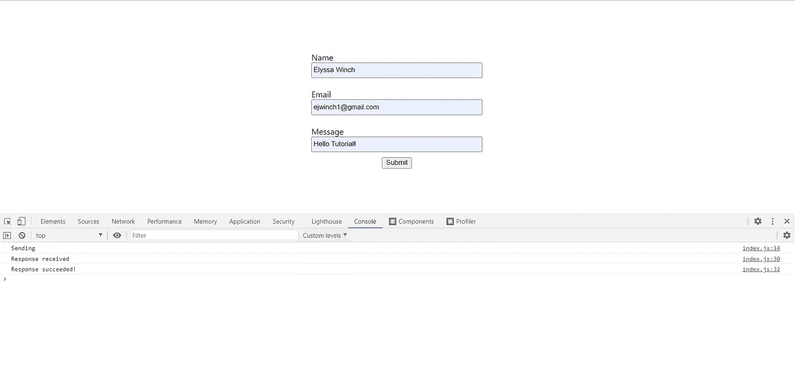

对于前端，您也可以对此进行扩展——首先，您可以将用户输入字段重新设置为空，并在成功响应时显示一条消息，只是为了向用户添加一些额外的通信，这一切都已完成。你可以在你的电子邮件中设置 HTML 格式，让它看起来更加美观。或者你可以庆祝你的联系方式让用户在你的网站上呆得更久一点！也许他们会在关键时刻买些东西——点击提交需要五秒钟，谁知道呢。

如果你已经走了这么远，并且成功了，那么恭喜你！如果你想看一眼我的完整代码，你可以在 Github [这里](https://github.com/ElyssaW/contact-form-tutorial)找到它。如果你喜欢我写的东西，在 [Linkedin](https://www.linkedin.com/in/elyssa-winch/) 上给我发消息，或者在我的[文件夹](https://elyssa-winch.herokuapp.com/)里用我自己的时髦联系表格给我打电话！

感谢您的阅读，祝您编码愉快！

[*Github 代码*](https://github.com/ElyssaW/contact-form-tutorial)