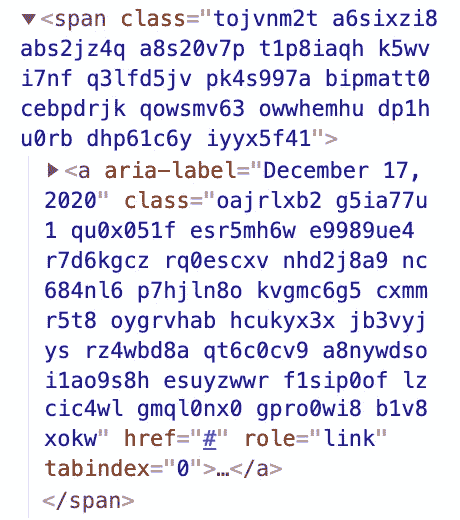

# 使用硒和美丽的汤从脸书收集公共数据

> 原文：<https://medium.com/nerd-for-tech/collecting-public-data-from-facebook-using-selenium-and-beautiful-soup-f0f918971000?source=collection_archive---------0----------------------->

尽管有 API，但从脸书获取数据变得越来越困难——即使是最透明、公开的基本信息。基本上，如果没有应用审查，你不拥有的任何东西都不可能得到，这使得那些需要社交媒体数据进行学术研究的人的生活很困难，因为应用的开发往往无法实现或不相关，更不用说更复杂的审查过程了。由于不满足于闭门造车，我再次着手从公开的脸书页面自动获取数据。现成的工具，比如这个 [FB 页面抓取器](https://github.com/kevinzg/facebook-scraper)，在获取标准帖子和基本元数据方面很有用，但在其他用例中很有限，比如我手头的这个——从一个公共页面获取评论以及所有评论和回复，比如这个[好莱坞环球影城](https://www.facebook.com/UniversalStudiosHollywood/reviews)页面。这些审查数据对竞争对手或基准分析非常有帮助；可以通过进行文本分析或检查评论者之间的互动来产生见解，每个评论者都有一个可访问的社会档案和不同的社会影响力——这是社交网络实现的另一层分析。

在花了相当多的时间剖析脸书的页面结构并试图找出几十种变通方法后，这篇文章将作为我自己的过程总结和任何想定制和构建自己的抓取器的人的代码展示(截至目前)。这当然是一项正在进行的工作，就像网络抓取一样。网站正在参与其中(尤其是 FB ),更好、更聪明的方法总是可用的。下面的过程对我来说是有意义的，但可能不是最优雅或最有效的。我把它留在这里，让任何访客或我未来的自己去改进！

收集脸书数据的痛点包括:1)从一开始就需要登录——这是无法回避的；2)点击许多按钮以获得足够的(和可用的)数据，主要有两种类型——“查看更多”和扩展评论/回复(在评论/回复中也有“查看更多”)；3)不仅很难区分我们想点击的按钮和不想点击的按钮(FB 的 HTML 类命名从一开始就很不直观)，而且还很容易意外地点击一个不想要的按钮，让你完全偏离轨道(对我来说，这意味着必须重新开始——我还没有找到一个优雅的方法来解决这个问题)；

4)像许多社交媒体网站一样，没有分页，而是无限滚动，这可能会加载相当缓慢且不可预测；5)文章在滚动后很快“过期”，留下一个空白空间，只有几个活动的文章，如果你试图保存 HTML 的话(这些陈旧的文章仍然存在，只是看不见，所以这可能是一个问题，也可能不是，取决于你的需要)；

以及 6)令人讨厌的隐藏 URL(那个“#”)，其仅当被悬停在活动页面上时才变得活动。我相信这个列表会更长，但我们先把它留在这里。

与此同时，所有这些数据都是公开的，可以在屏幕上看到，但手动收集需要太多的时间和精力。没有 API 访问，抓取就成了唯一可行的途径。因此，下面的代码提出了一个过程，使得从这个庞大的宝库中获取至少一些可用的文本数据成为可能。

在我们开始之前，一如既往，获取正确版本的 [Chrome 驱动程序](https://chromedriver.chromium.org/downloads)，并将其放在同一个文件夹中(或者提供一个路径)。然后，我的目的要求包括:

# 登录

首先，我们需要为登录凭证创建一个 txt 文件，其格式对应于您的 read file 函数的设置(如果作为一名独狼，您不担心共享代码和泄露凭证，您当然可以直接在脚本中键入凭证)。

> 电子邮件= "你的电子邮件"
> 密码= "你的密码"

实际登录过程如下:

# 展开

登录后，过程很简单。我们需要先打开评论和(2 类)回复，然后点击展开所有折叠的文字，滚动到底部等待更多帖子加载，最后根据终止条件保存页面来源。因此这些功能在下面的一般方案中:

一些注意事项:

1.  创建 getBack()函数是为了解决点击不想要的页面的未解之谜。理论上，可能是我的按钮 xpath 不够具体。但是经过多次实验，不必要的点击仍然存在，并且没有模式可以被发现和修复(永远不要持续误点击一个元素)。因此，我所能做的就是自动点击返回，并在每次发生时让浏览器返回到目标页面。
2.  递归回复函数可以用来代替我任意指定的 3 次尝试。我只是觉得这样做更容易，也足够了。
3.  在 FB 页面上，可以使用上面的 xpath 来标识每个审查块。它们一旦加载就存在，即使旧的不再可见(也就是说，评论的数量只会增加，除非因为误点击而偏离轨道，不得不返回)。我发现这是一个可靠的方法，可以通过滚动来查看我们已经获得了多少评论。
4.  根据目标，可以尝试许多终止条件。除了上面显示的一个——一旦达到一定数量的评论，用户可以在滚动后不增加评论数量或不增加页面长度。这些方法的风险是，有时页面加载太慢，可访问数据的增长可能会无限期地停滞。不过，我使用的方法有一个警告:我知道评论的总数，并使用了这个数字，但不知何故这个数字变了——当它变小时更具破坏性，所以在所有工作(花费数小时)之后，它可能会永远停留在那里，一个评论就结束了…

以上公布的功能详情如下:

标准的点击经常向我抛出不可点击的或者不可交互的错误。最终使它工作的是 ActionChains，它对于创建从悬停在元素上到单击的顺序非常有用。但有时，它也会失败(可能有弹出窗口覆盖按钮)，并且不知道具体原因。单击()；"，我)似乎强大到足以克服这一点。

我花了太多的时间在 archiveAtEnd()函数上，以便在记录 HTML 时可以看到所有的帖子。它不仅包括小心翼翼地来回移动一系列帖子来加载它们，而且作为一个额外的故障保险还需要两个这样的 HTML-“截图”三个帖子。事实证明，如果您只需要获取文本数据，那么您所需要做的就是在所有内容都被展开和加载后保存最终的 HTML 文件。即使当它们不可见时，您仍然可以使用 BeautifulSoup 很好地提取所有内容——虽然对于证据保存、验证或调试来说不是很好。

# 提取和组织数据

一旦我们保存了最终的 HTML，我们就可以继续使用 Beautiful Soup 从混乱的 HTML 代码中提取我们想要的数据。具体到站点和手头的任务，下面的代码不值得过多解释——除了找到正确的锚点和必要的转换步骤之外，没有什么值得注意的。棘手的部分包括两种类型的评论文本(常规文本和“故事”——粗体、较大字体的文本)，两种类型的用户名(常规用户名和链接中只有 id 的用户名)，以及将原始日期(例如 21h、6d)转换为一致的日期时间格式。

由于多层回复的复杂性，我将评论和评论/回复分为两个数据框。为了避免过多的重复数据，第二个表仅通过 id 与审查相关联:

# 奖金

你可能已经注意到我遗漏了一点——每篇文章的散列链接。为此，我们需要做的就是将鼠标悬停在 date 元素上来激活 href 属性，然后在浏览器自动化过程中保存它。它需要在每次滚动之后完成，或者在所有滚动之后完成(并加载所有的 review 元素)，然后设置一个 scrollIntoView 机制来再次激活每个元素。下面的代码显示了前者——它可以被插入到上面的 while 循环中，或者只通过滚动过程重新开始，而不需要所有的点击和扩展，因为点击和扩展可能会重定向页面并破坏整个企业。

动态页面的困难在于，我们不确定哪些评论是当前加载/可点击的，因此在列表中被捕获。肯定会有重复和遗漏。通过简单的逻辑可以避免重复，但是省略使得很难映射回其他数据。幸运的是，文章链接本身也包含用户信息，我们可以使用这些信息进行合并。同样，有两种类型的用户链接——一种带有用户 id，另一种带有用户名，这两种链接都应该与我们在上面的评审表中收集的内容相对应:

就是这样。几百条评论全是你来分析的！