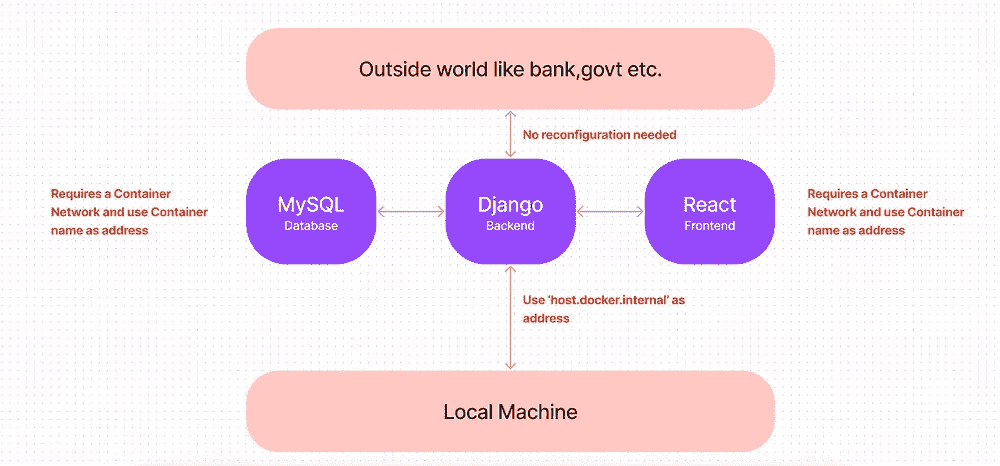

# 容器中的通信

> 原文：<https://medium.com/nerd-for-tech/communication-in-containers-583187155969?source=collection_archive---------0----------------------->

我们选择码头工人是因为隔离和分离。但是没有交流，任何应用程序都是不完整的。我所说的交流是指 API。**通信**可以是外部(web)、本地主机，或者容器之间。

假设我们用一个像 **MySQL** 、 **Django** 这样的数据库作为后端，而 **React** 作为前端构建了一个应用程序。当我们容器化应用程序时，我们分别容器化数据库/后端/前端。这是惯例，事实上，很难配置一个容器来完成多项任务。

总的来说，这个应用程序需要与数据库沟通-后端-前端。此外，还有一种情况是，您需要与银行/政府等公共 API 进行通信，以获取详细信息。因此，通信仍然是任何应用不可或缺的一部分，也是 dockers/containers 等环境技术不可或缺的一部分。

*当您的容器想要与任何万维网通信时，我们不需要在容器设置中重新配置任何东西。*

当您想要与本地机器通信时，将 URL 中的' **localhost** '替换为' **host。码头工人。内部**'。这是主要用于开发阶段的用例。

容器之间的通信是使用最广泛的情况，因为它与 docker 技术用例一致。

这种交流有两种方式:

1)通过“inspect”命令手动查找 IP 地址并获取 IP 地址。我们不能每次都这样做，因为容器会被替换和重新创建。因此 IP 地址会变成动态的，每次我们都需要检查才能找到 IP 地址

```
docker inspect
```

2)使用 Docker network 命令，并将所有容器放在同一个网络中。这可以通过以下方式实现

```
docker network create [network_name] docker run -network [network_name] -name [container_name_1] [image_name_1] docker run -network [network_name] -name [container_name_2] [image_name_2]
```

这里，两个容器将在同一网络上。仅使用容器名称进行交流。Docker 自动解析 IP 地址。



*原载于 2022 年 5 月 10 日 https://www.pansofarjun.com*[](https://www.pansofarjun.com/post/communication-in-containers)**。**