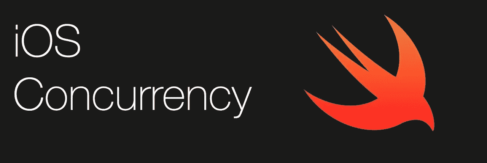
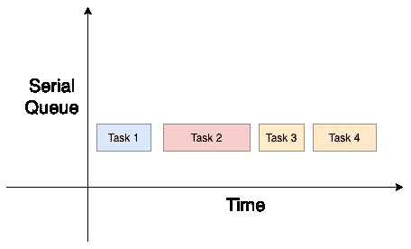
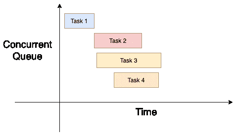
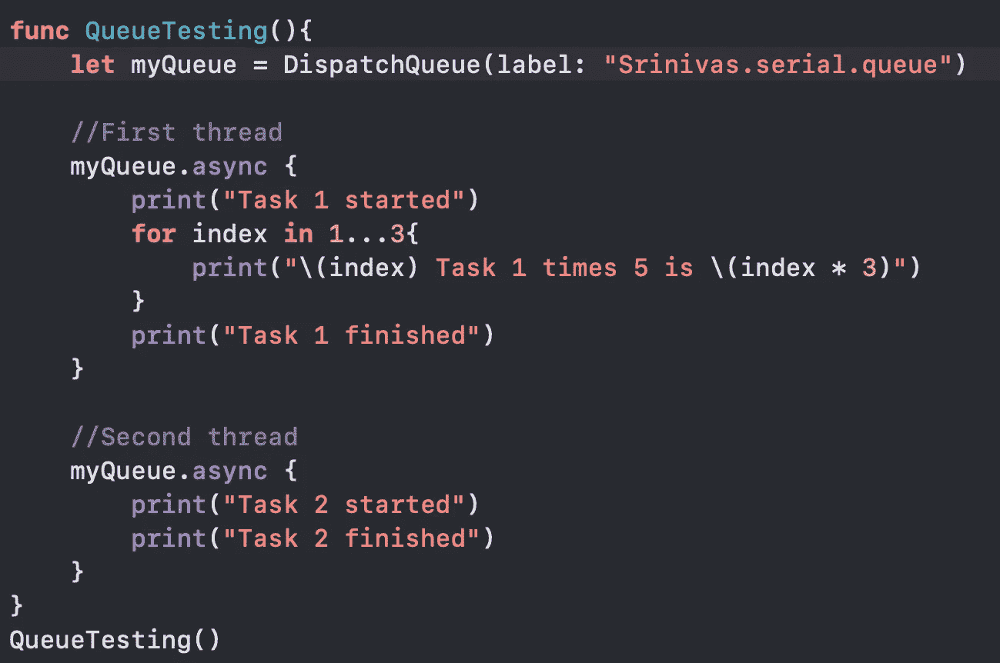
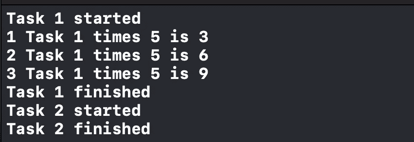
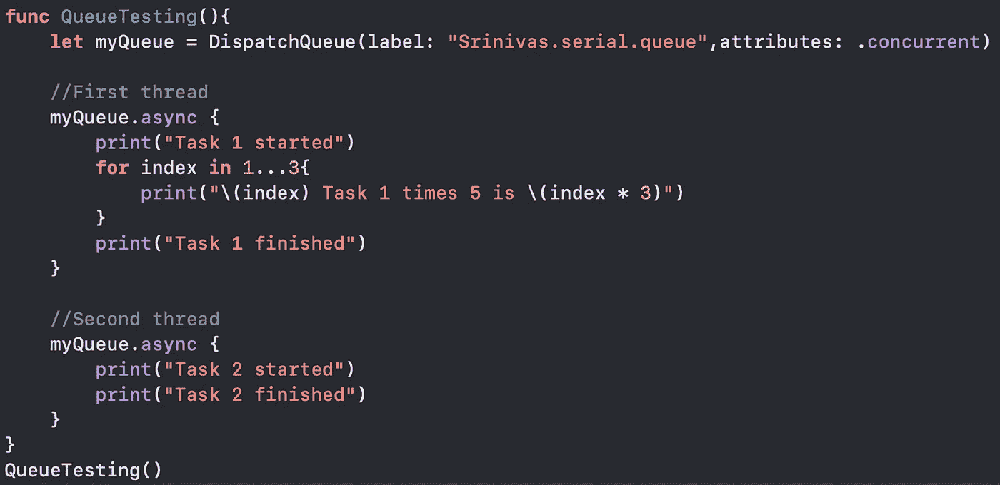
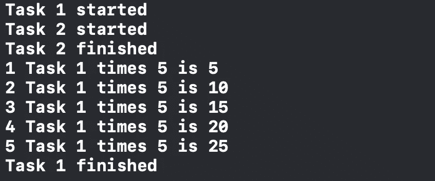

# 并发，同步，异步，串行，并发

> 原文：<https://medium.com/nerd-for-tech/concurrency-sync-async-serial-concurrent-76c1ebc75577?source=collection_archive---------1----------------------->

这是一个非常有趣的概念，如何在我们的程序上执行任务，以便应用程序可以在我们的手机上顺利运行。今天我想到了一些棘手而有趣的 iOS 概念。让我们深入研究一下。

# 什么是任务:

首先让我们理解什么是**任务**，在编程语言中，任务仅仅意味着一些代码块，它们将执行特定的工作。作为一名开发人员，如果你想执行一个任务，那么你需要将任务放入一个**队列**。众所周知，队列本质上是 **FIFO** ，根据 iOS 架构(先进先出)，FIFO 仅用于开始任务执行，而不用于结束执行部分，这意味着首先放入队列的任务将首先开始执行，但任务结束执行部分不取决于 FIFO 顺序，而是取决于任务的复杂性。好了，现在队列被进一步分配到**线程中。然后线程会根据你手机中 CPU 内核的数量来处理我们的任务。**

所以首先让我了解每个主题，然后我会分享一个极好的例子来更好地理解，请继续关注我:)

# **什么是并发，它有什么用:**

并发意味着一个应用程序同时(并发地)在多个任务上取得进展。确保你的应用程序尽可能平稳运行，并且移动用户永远不会被迫等待一些工作完成，这一点至关重要。

# 同步和异步:

当我们同步调用一些任务**时，这意味着发起该操作的线程将等待任务**完成**后再继续**另一个任务**，但是当我们异步**放置任务**时，这意味着线程**不会等待该任务完成**，而是开始同时执行分配给它的其他任务。**

# **串行和并发队列:**

只有两种方式**，您可以在**串行队列**或**并发队列**中提交您的任务。在串行队列中，只有一个线程存在。因此，任务将在一个线程中执行，并等待它完成，然后另一个线程将执行。但是在并发队列中，存在多个线程，这有助于同时执行多个任务，但是根据任务的复杂性，执行完成，如果任务不太复杂，则它将比相对复杂的任务更早完成。**

********

# **我们不要混淆异步和并发:**

**非常令人困惑的是，异步和并发的工作方式类似，两者同时执行一个任务。不，不是，让我为你澄清一下。**

**Async 是一种执行任务的方式，concurrent 是一种帮助执行任务的队列。为了更好地理解，我们来讨论一下各种情况下的执行顺序。**

****情况 1(串行+同步):**如果你正在向一个**串行队列**提交 3 个**同步**任务，意味着每个任务将在一个单独的线程中执行，并等待其他任务逐一完成。它将以**有序**的方式执行。**

****情况 2(串行+异步):**如果您向一个**串行队列**提交三个**异步**任务，这意味着每个任务必须在下一个任务开始之前完成，因为只有一个线程可用，尽管任务是异步的。所以它也将以**有序**的方式执行。**

****情况三(并发+同步):**如果你正在向一个**并发队列**提交一些**同步**任务，意味着该队列可以同时执行任务，但任务是同步的(它会等待其他任务完成)，这就是为什么操作会以**有序**的方式执行。**

****情况 4(并发+异步):**如果你正在向一个**并发队列**提交一些**同步**任务，意味着该队列可以同时执行任务，但是任务是异步的，这就是为什么操作会以**无序**的方式执行。**

# ****让我们用一个例子来简化这一切:****

**让我们制作一个串行类型的**队列**，并给它分配一些任务，看看它将如何执行。由于默认情况下我们没有在 **Dispatchqueue** 参数中提供任何属性类型，因此它被视为**串行队列**。**

****

**输出将在下面提到，因为它的串行类型，它等待第一个任务完成，然后其他执行将开始。**

****

**让我们创建一个并发类型的队列，并给它分配一些任务，看看它将如何执行。**

****

**输出将在下面提到，因为它是并发类型，它不等待任务完成，它随机执行并根据任务的复杂性完成，因为任务 2 没有任务 1 复杂，任务 2 开始并立即完成。**

****

**就这样，伙计们，感谢阅读😄**