# 配置 AWS ASG 并测试策略

> 原文：<https://medium.com/nerd-for-tech/configuring-aws-asg-and-testing-the-policy-32ef2cf3a213?source=collection_archive---------10----------------------->

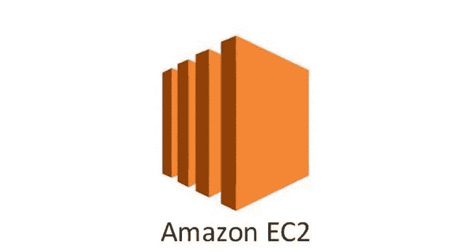

亚马逊的 EC2 标志

本实验将逐步演示如何配置 AWS 自动缩放组，以及如何进行测试以确保遵循您创建的策略。我们需要了解本实验室的以下内容:

1.  如何配置 EC2 服务器
2.  什么是引导以及如何引导 EC2 服务器
3.  什么是 Apache 服务器，如何将它安装到您的 EC2 服务器上
4.  什么是自动扩展组/自动扩展策略，它们的确切用途是什么
5.  如何测试您的自动缩放策略

好吧，正如我 5 岁的儿子会说的，“让我们开始这个派对吧”

# **步骤 1:配置 EC2 实例并引导它运行 Apache**

在我们开始自举 EC2 实例之前，请记住您将需要一个 VPC。在 AWS 允许您配置 EC2 实例并让它访问互联网之前，应该提前完全配置和加载 VPC(包括互联网网关和路由表)。

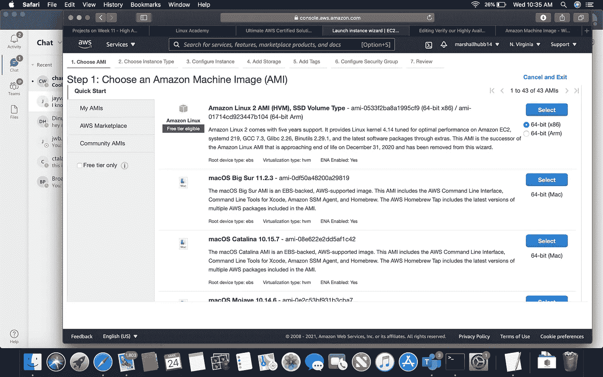

一旦您的 VPC 启动并运行，接下来要做的事情就是通过在 AWS 搜索栏中键入 EC2 并选择 Launch Instance 来创建您的实例。页面加载后，选择您想要用于实验的 AWS AMI (Amazon 机器映像)。这一步很重要，因为它将决定在引导实例时使用什么命令，请谨慎选择。

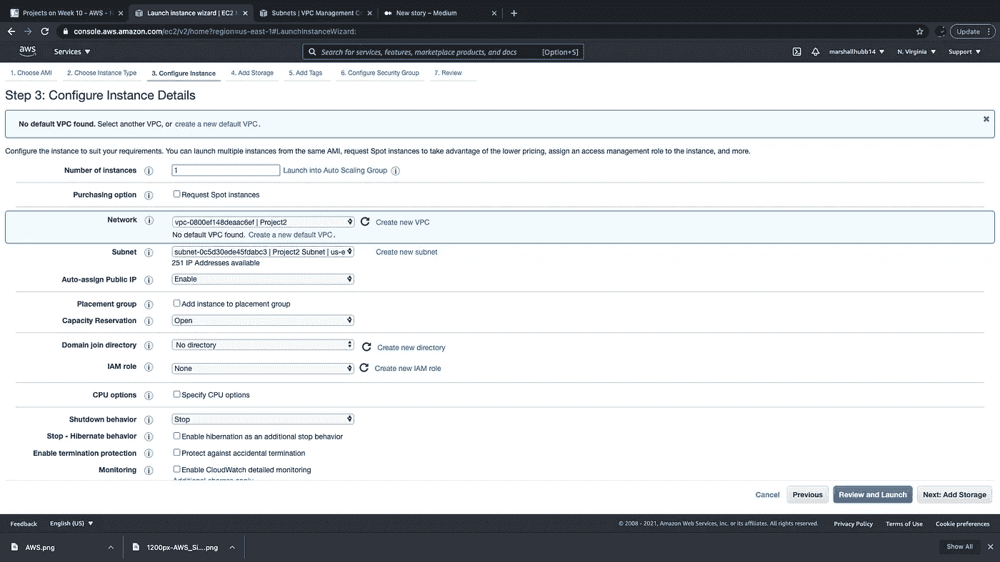

下一步是选择你的 VPC，公共子网和**启用**你的“自动分配公共 IP”设置。

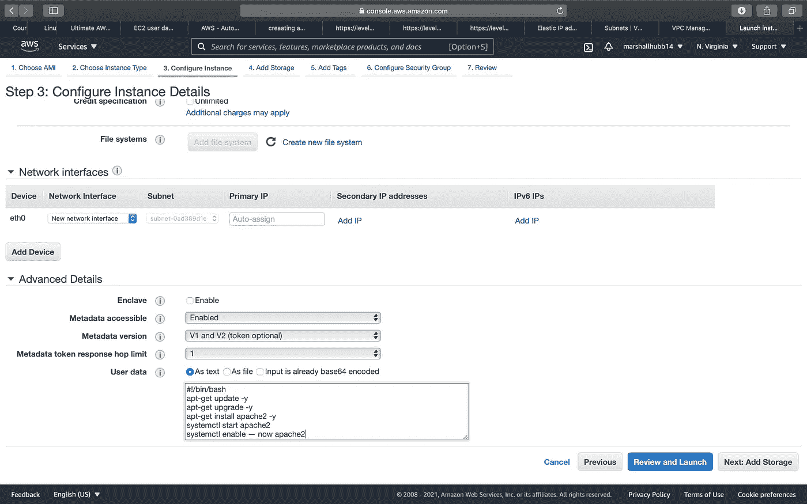

这里我们将开始引导我们的实例来自动运行 Apache，一个开源的 web 服务器。将上述脚本输入到“用户数据”框中，并将其保留为文本。请记住，您选择的 AMI 将决定您使用的命令。例如，在 AMI 2 中，您通常会使用“yum”命令。在本实验中，我选择了 Unbutu AMI，并运行了以下“apt-”命令:

*#！/bin/bash*

*apt-get update -y*

*apt-get 升级-y*

*apt-get 安装 apache2 -y*

*systemctl 启动 apache2*

*systemctl 启用—现在是 apache2*

页面配置完成后，继续下一步。

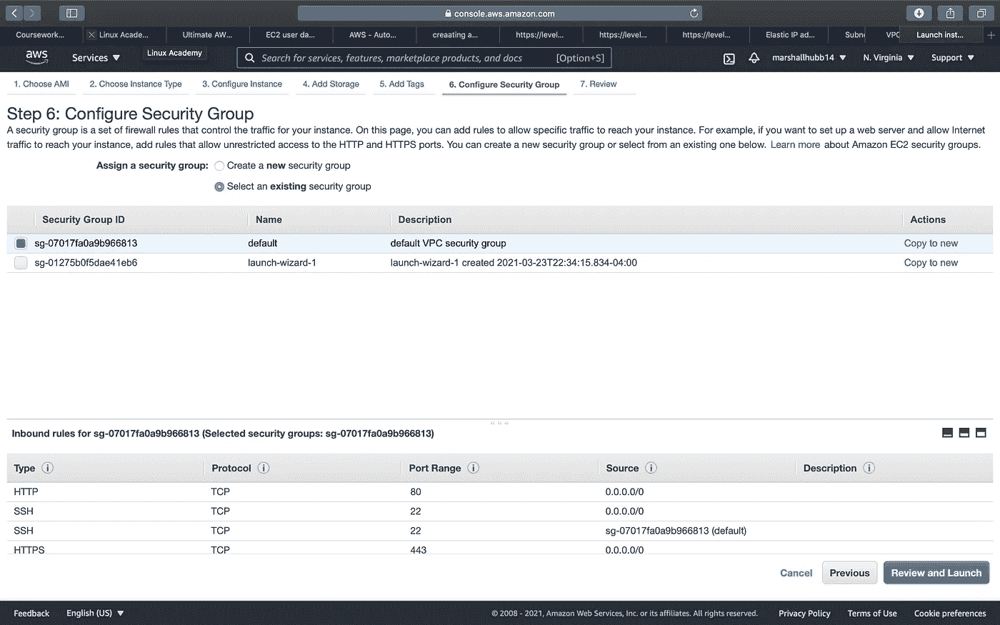

这一步很重要。配置您的实例的 SG 将决定您如何与您的实例交互(只要能够 SSH 到它),以及它是否会打开端口 80 来托管您的 Apache Web 服务器。我选择利用 SSH、HTTP 和 HTTPS(这对这个项目来说不是必需的)。当一切都被选中时，**检查并启动**您的实例。

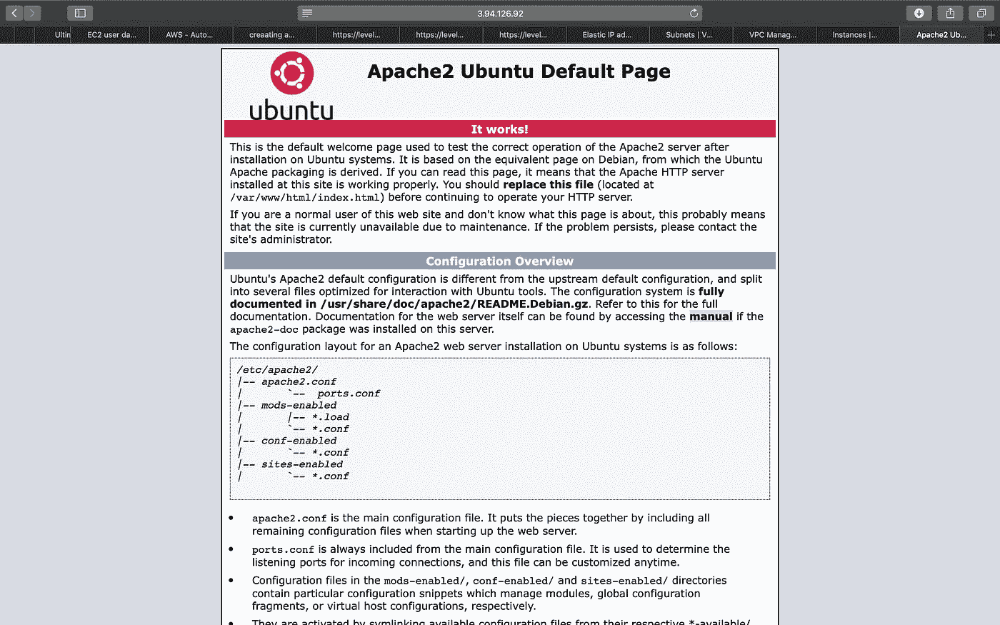

检查你的工作。在您的实例启动之后，我们将检查以验证它确实能够成功启动 Apache。我选择复制我的实例公共 IP 地址，并将其粘贴到搜索栏中。如果你收到这个页面，你可以继续。

# 第二步——创造你的形象

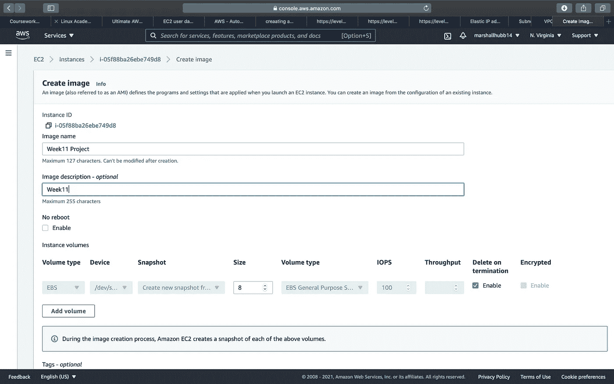

对于这一步，单击我们刚刚创建的 EC2，并选择 Actions 选项卡。一旦你这样做了，向下滚动标签到模板，并选择“创建图像”。这将为本实验的其余部分创建 EC2 的映像，以便自动缩放组的实例可以复制此特定实例的配置。确保你给它一个名字，然后点击右下角的“创建图像”。

# **步骤 3-配置您的发布模板**

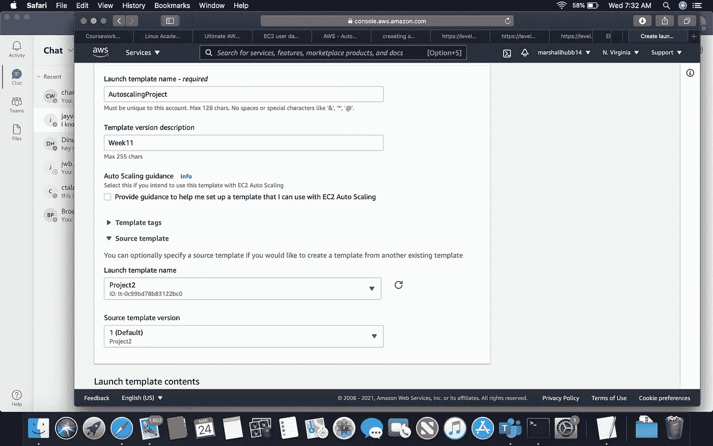

我们将着手的下一步是“发布模板”。这只是指定了实例配置信息。要找到它，请滚动到 EC2 控制台的左侧，然后向下滚动，直到找到“启动模板”。点击它，然后按下突出显示为橙色的**启动模板**。一旦你这样做了，你应该在这个屏幕上，我直接贴在上面。我们将为该模板命名，以备将来使用，并使用我们在上一步中刚刚创建的内容选择模板和模板版本。在选择右下角的“创建启动模板”之前，请验证您的密钥对和安全组是否正确。

# **第四步** - **创建你的目标群体**

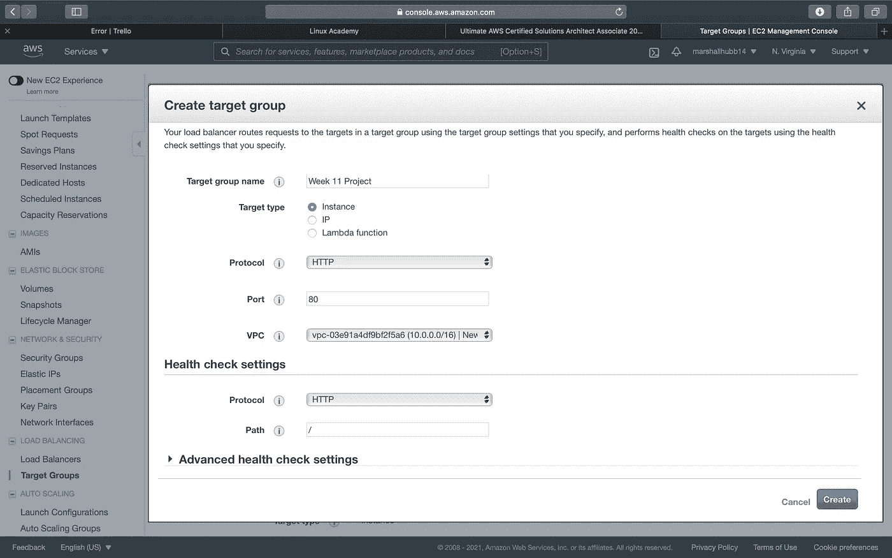

对于这一步，我们将滚动回到 EC2 控制台的左侧，并向下滚动目标组。选择您的目标名称，然后选择右下角的“创建”。目标组只是告诉负载均衡器将流量定向到哪里。如果出于某种原因，你得到一个“错误加载信息”，尝试切换回旧的 EC2 体验。我发现这一步帮助我完成了实验的这一部分。

# **步骤 5-配置您的自动缩放组**

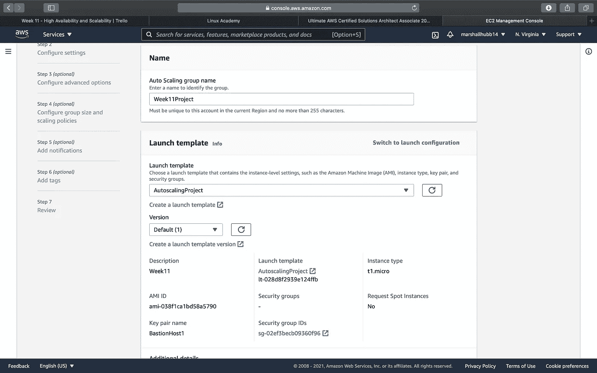

要执行此步骤，请滚回 EC2 控制台的左侧并向下滚动，直到找到**自动缩放组**并点击它。自动伸缩组(ASG)只包含 Amazon EC2 实例的集合，这些实例被视为一个逻辑分组，用于自动伸缩和管理。进入该页面后，为您的小组命名，并选择我们刚刚创建的**启动模板**，确保一切正确无误，然后进入下一步。

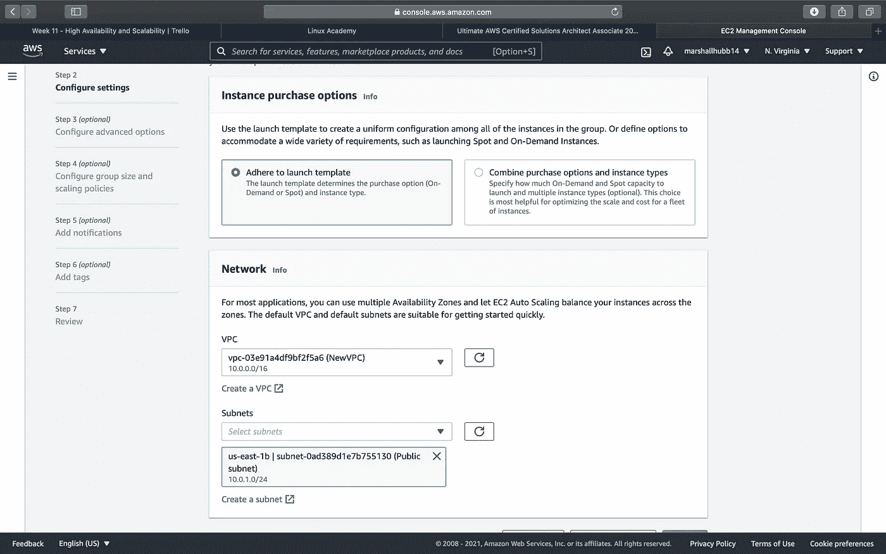

在这里，您将选择“坚持启动模板”,并选择您的 VPC 和您的子网。确保您选择了公共子网。如果您需要另一个，这里有一个创建它的选项。

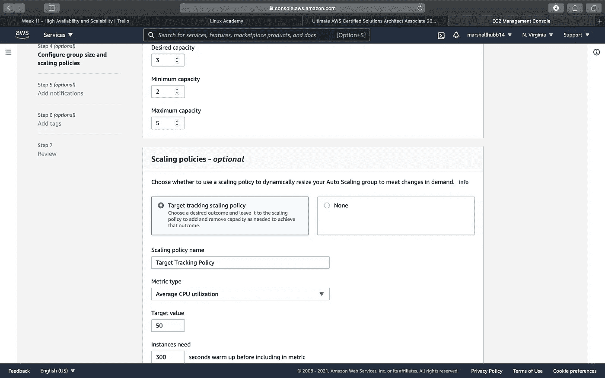

我将“高级设置”保留为默认设置，并继续配置组大小。对于所需的容量，我选择 3，对于最小容量，我选择 2，对于最大容量，我选择 5。这将允许 ASG 扩展以适应变化，同时仍然保持我们的最小和最大容量。我还选择“300”作为预热所需的秒数，因为这是 AWS 的建议。我将其他一切都保留为默认设置。

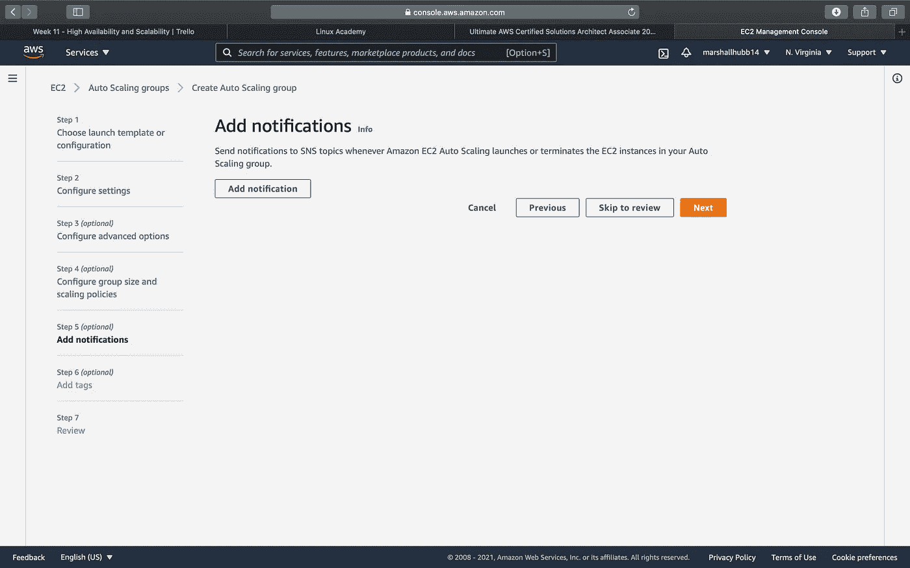

尽管我没有在这个实验中添加任何通知，但这将是现实应用程序中的关键一步，只要您的 ASG 启动或终止 EC2 实例，就会直接得到通知。

# **第 6 步-测试你的 ASG**

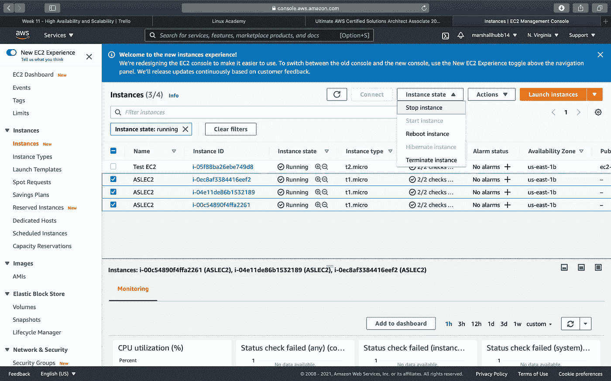

到达这一步后，我们将单击刚刚创建的每个 EC2，然后转到“实例状态”并选择**停止实例**。这样做的目的是看看 ASG 是否会在 300 秒检查后捕获它，并根据我们刚刚创建的缩放策略创建更多实例。

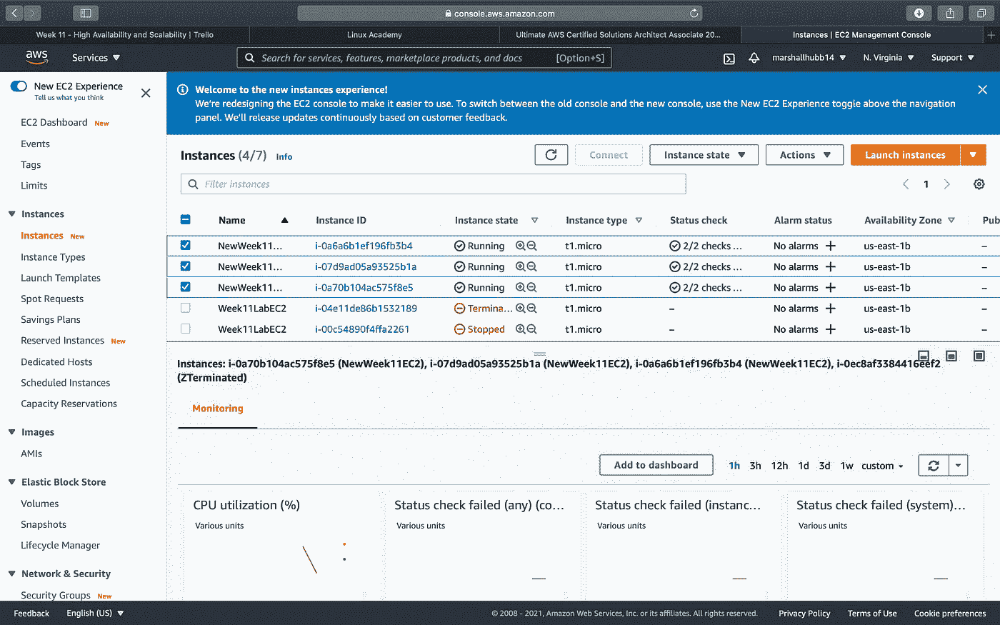

在这里，您将看到，由于所创建的策略，ASG 成功创建了新实例。

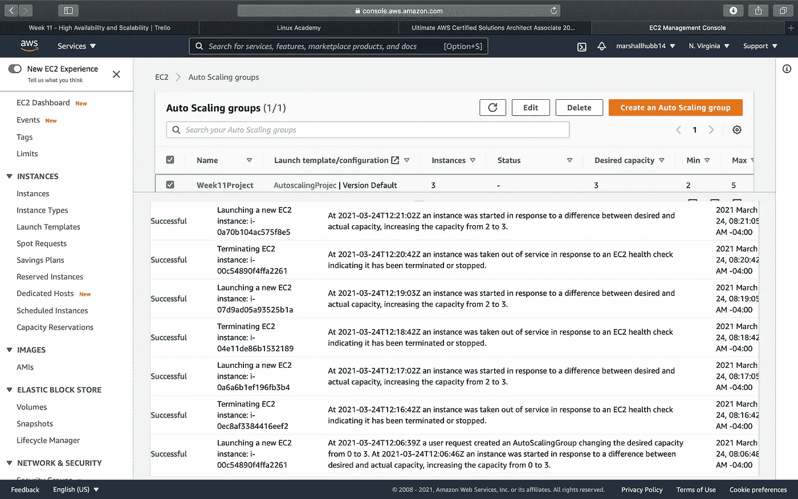

现在，让我们回到 EC2 控制台左侧的“Auto Scaling Groups ”,选择您创建的 ASG，然后单击“Activity”选项卡。在这里你会看到你的 ASG 到底在做什么。这也是确保您的 ASG 遵循您之前创建的策略的好方法。您可以在我的活动中看到，一旦我停止了最初的 ASG 实例，ASG 就会立即创建更多的实例。

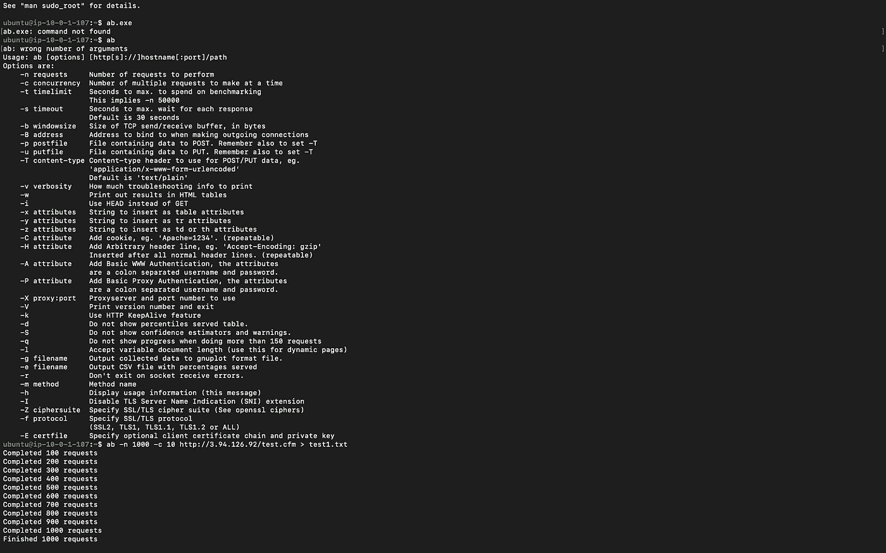

下面是一个额外的步骤，因为它只需要不到几分钟就可以完成。现在，我们将登录到 CLI 并连接到每个实例来测试它们。对于我的 CLI，我使用了 Mac 终端，但是您可以使用已经内置到您的实例中的 AWS 实例连接，或者运行 Puddy for Windows。至于实际的测试，我们将使用 Apache Bench，它会在您安装 Apache 后预加载到您的服务器中。Apache Bench 只是一种测量服务器性能的方法。一旦您连接到您的第一个实例，我们将从运行命令“ab”开始，这样您就可以看到测试您的实例所需的选项。我使用了命令“a b-n 1000-c 10【http://3.94.126.92/test.cfm>test1 . txt ”,这意味着我们一次发送 10 个请求，速度越快越好，当达到 1000 个请求时就会停止。这个测试没有返回任何失败的请求，这意味着我们成功了。