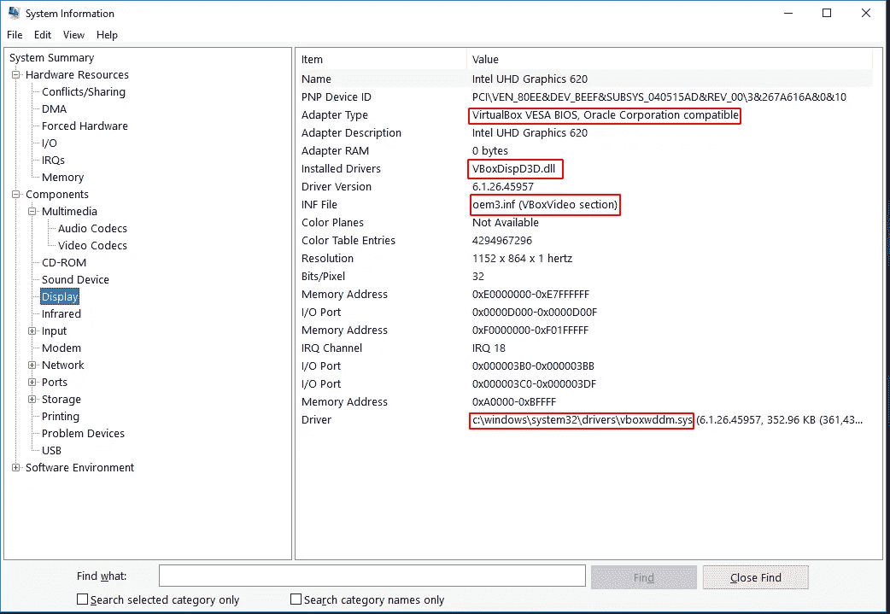
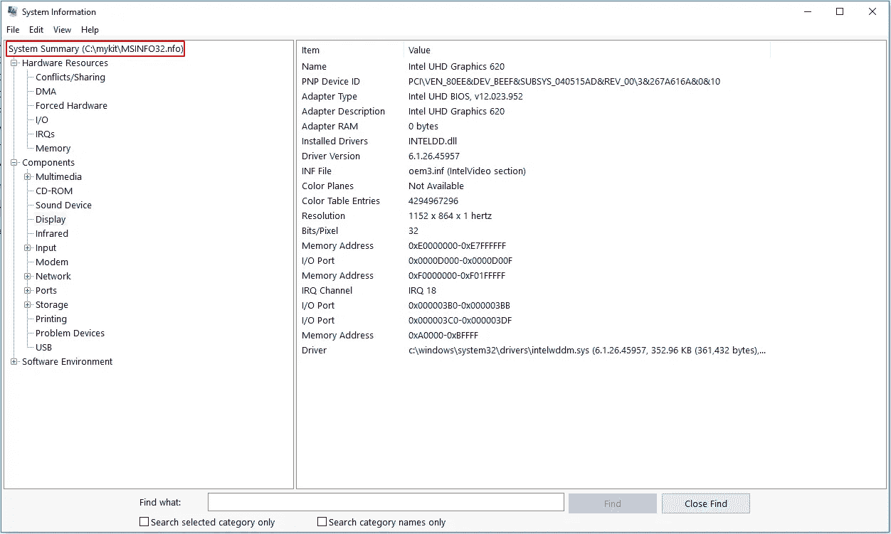
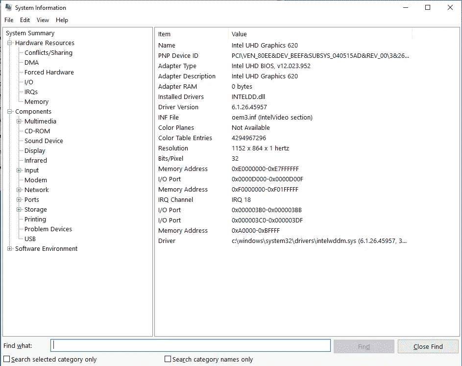

# 为诈骗配置 VirtualBox:第 2 部分

> 原文：<https://medium.com/nerd-for-tech/configuring-virtualbox-for-scambaiting-part-2-d075598a27d?source=collection_archive---------5----------------------->

在上一篇文章(https://medium . com/nerd-for-tech/configuring-virtualbox-for-scambaiting-part-1-15da 011 adea 0)中，我们介绍了什么是 Scambaiting，以及帮助掩盖 VirtualBox 的一些初始步骤，以便它不会立即将游戏泄露给骗子。在本文中，我们将继续这个过程。

正如在以前的文章中提到的，MSINFO32 中的一些信息会很快泄露给我们。MSINFO32 是一个内置的 Microsoft 实用程序，提供有关计算机的有用信息。不幸的是，这些信息中的一些非常明显地暴露了 VirtualBox:

一个 MSINFO32 会泄露我们的一些方法的例子

虽然通过对注册表的进一步修改，可以清除其中的一些内容，但是使用这种技术不可能隐藏所有内容。我们需要采取不同的方法…

在研究如何实现这一目标时，我发现了一些有趣的事情。MSINFO32 允许您将系统配置保存到扩展名为. NFO 的 XML 文件中，然后在以后加载该文件。这似乎是一个有用的途径。如果我们可以制作一个 NFO 文件，然后根据自己的意愿进行修改，然后强制 MSINFO 总是加载我们的 NFO 文件，而不是显示实际的、实时的系统信息，会怎么样？

这正是我最终选择的方式，尽管我们还需要更多的技巧来使它看起来更有说服力。现在，如果你正在跟进，你会想去文件->保存…在 MSINFO32 在你的诈骗虚拟机和保存当前信息到一个. NFO 文件。虽然这个路径现在没有任何意义，但是您会希望将这个文件保存到:“C:\mykit\MSINFO32。NFO”。在随后的文章中，我将解释为什么这个路径是重要的，但现在只知道它必须用 rootkit 来隐藏这些文件。只需在“C:\mykit”下创建文件夹，并放置上面提到的 MSINFO32。NFO 文件在这个文件夹里。

现在，您应该在文本编辑器中打开该文件(您可以使用记事本)。搜索字符串“VirtualBox”(不区分大小写)和“vbox”(也不区分大小写)，并修改所有出现的内容，使其与您之前的假硬件配置文件一致。对于 Virtualbox 服务条目和启动项目，您可以简单地删除这些条目。请记住，你花越多的时间使它看起来合法，虚拟机就越能更好地支持骗子的调查。修改完文件后，双击它以在 MSINFO32 中打开它，并验证所有信息都已加载并且看起来令人信服:

修改后

从上图可以看出，所有的入罪记录都被清理了，但是又出现了一个新的问题。在“System Summary”旁边，我们现在可以看到一个文件已加载。这就是我之前提到的一些“其他技巧”发挥作用的地方…

为了在 MSINFO32 运行时加载文件，我们将利用 Microsoft Debugger 注册表设置首先加载我们自己的可执行文件。“HKLM \软件\ Microsoft \ Windows NT \ current version \图像文件执行选项”注册表位置旨在配置各种设置，这些设置在特定可执行文件启动时应用于它们。通过在“msinfo32.exe”子项下添加一个“调试器”键/值对，我们可以指定一个“调试器应用程序”在调用 msinfo32.exe 时运行。正常情况下，合法的调试器会启动预期的可执行文件并继续调试它。只使用这个选项，我们可以用我们的。NFO 档案。不幸的是，仅仅这样是不行的，因为我们会陷入调试器的循环中，msinfo32.exe 的每个实例都会导致“调试器”再次产生。即使我们用一些聪明的启动脚本黑客技术来解决这个问题，它仍然不能解决 MSINFO32 显示它所调用的文件名的问题。为了解决这些问题，我编写了以下工具:[https://github.com/shellster/SpoofMSINFO32/](https://github.com/shellster/SpoofMSINFO32/releases/tag/v1.0.0)

该工具将在调用 MSINFO32 时执行，然后通过带有特殊调试器标志的 CreateProcess 执行 MSINFO32。这可以防止在这个新实例上调用注册表挂钩。在 CreateProcess 调用中，程序还将传递我们的假信息的路径。NFO 档案。完成后，最后一个技巧是使用 SendMessageW 和一些跨进程的黑客技术来更新 MSINFO32 顶部的标签，以隐藏我们正在加载一个. NFO 文件而不是显示实时系统数据的事实。如果你对细节感兴趣，请查看代码(虽然不要太密切，因为它不是一个纯粹的艺术作品)。

对于其他人来说，你只需要进入发布页面:[https://github . com/shellster/spoofmsinfo 32/releases/tag/v 1 . 0 . 0](https://github.com/shellster/SpoofMSINFO32/releases/tag/v1.0.0)

下载两个可执行文件和“install.ps1”文件，并将它们放在我们上面提到的虚拟机上的“C:\mykit”文件夹中。现在是在虚拟机中禁用 Defender 的好时机，因为由于我们正在进行的跨进程黑客攻击，Defender 可能会开始捕获这些文件。所有文件准备就绪后，启动提升的 PowerShell 提示符，导航到“C:\mykit”，然后执行 install.ps1 脚本来设置调试器注册表项:“powershell get-content。\install.ps1 | IEX "

现在，通过尝试运行 MSINFO32 来测试安装是否成功。在它运行之后，您应该会看到您的假数据，而不会在左侧面板中看到“系统信息”旁边的文件名:

MSINFO32 信息欺骗正常工作

恭喜你！你现在离一个令人信服的诈骗虚拟机又近了一步。在下一篇文章中，我们将讨论下一个会泄露我们身份的内置系统工具(dxdiag ),以及如何隐藏 VirtualBox 托盘图标。在接下来的文章中，我们将最终讨论我编写的 rootkit，它隐藏了大多数其他指标。