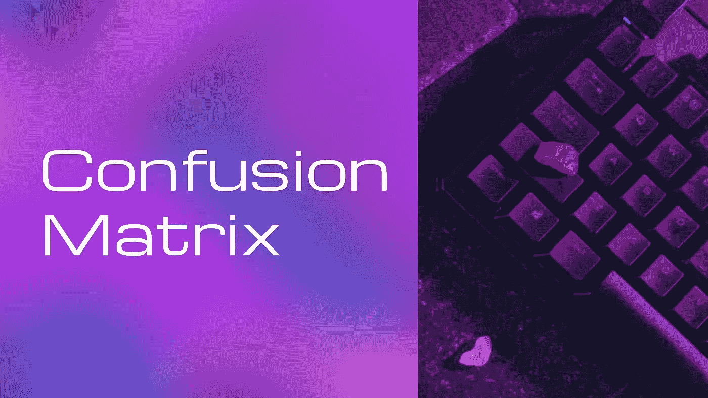
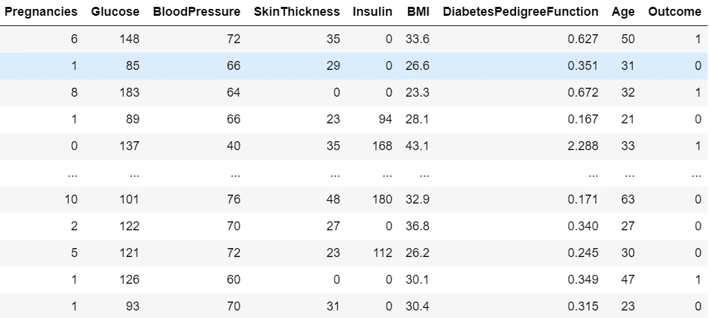
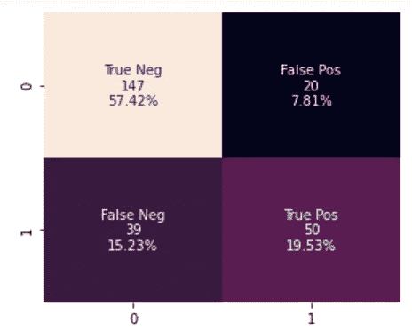
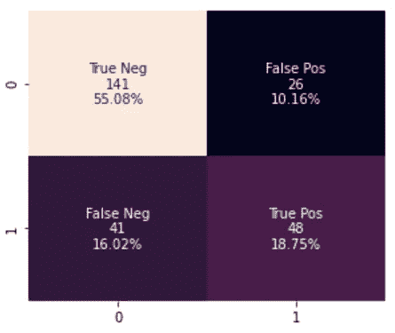
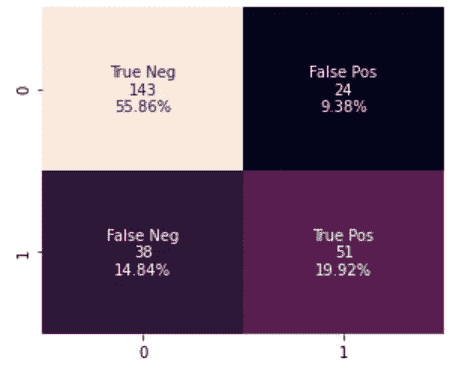

# 揭开困惑的神秘面纱！！！

> 原文：<https://medium.com/nerd-for-tech/confusion-matrix-demystify-the-confusion-5d7f4801ad4f?source=collection_archive---------3----------------------->

信用:canva.com

当我开始学习数据科学并成为数据分析师时，有时会让我感到困惑的概念之一是混淆矩阵。这个概念在分析模型时起到了非常关键的作用，本文是我对混淆矩阵的理解。在这篇文章中，我将向你介绍混淆矩阵的概念，并解释它如何评估你的模型的性能。

让我们以如下所示的简单糖尿病数据集为例，对数据进行分类。

皮马印第安人糖尿病数据库

数据“妊娠”、“血糖”、“血压”、“皮肤厚度”、“胰岛素”、“身体质量指数”、“糖尿病患者的血糖水平”、“年龄”、“结果”栏。“妊娠”、“血糖”、“血压”、“皮肤厚度”、“胰岛素”、“身体质量指数”、“糖尿病血糖功能”、“年龄”是独立变量，*“结果”是因变量，其*取布尔值 0 和 1。0 表示非糖尿病，1 表示糖尿病。

为此，我们可以使用逻辑回归、朴素贝叶斯、随机森林或其他方法。我们根据给定的数据训练了分类模型。现在，我们需要做出决定，即选择哪个模型。我们需要评估这些模型，以便选择正确的模型。

# 如何评价一个机器学习模型的性能？

在训练模型之前，我们将数据分为训练数据集和测试数据集。

列车测试分离

我们用训练数据集训练我们感兴趣的所有方法，然后在测试数据集上测试每个方法。为了评估哪种方法效果最好，我们需要总结每种方法如何在测试数据集上工作。为每个方法创建混淆矩阵是一种流行的方法。

混淆矩阵

在混淆矩阵中，行对应于机器学习模型预测的内容，列对应于实际值。现在让我们理解术语 TP，FP，TN，FN。

**真阳性:**

解释:你预测一个人有糖尿病，而他/她确实有。

**真阴性:**

解释:你预测一个人没有糖尿病，而他/她实际上没有。

**假阳性:(类型 1 错误)**

解释:你预测一个人有糖尿病，而他/她实际上没有。

**假阴性:(2 型错误)**

解释:你预测一个人不是糖尿病患者，而他/她实际上是。

当我们将 KNN 应用于测试数据时

困惑矩阵:KNN

在 256 个值中，模型能够正确识别 50 个实际上是糖尿病(TP)的患者。147 名患者被正确识别为非糖尿病患者(TN ),类似地，20 名和 39 名患者被正确识别为 FP 和 FN。

当我们对测试数据应用逻辑回归时

混淆矩阵:逻辑回归

在 256 个值中，模型能够正确识别 48 个实际上是糖尿病(TP)的患者。141 名患者被正确识别为非糖尿病患者(TN ),类似地，26 名和 41 名患者被正确识别为 FP 和 FN。

当我们对测试数据应用 SVC 时

混淆矩阵:支持向量分类

在 256 个值中，模型能够正确识别 51 个实际上是糖尿病(TP)的患者。143 名患者被正确识别为非糖尿病患者(TN ),类似地，24 名和 38 名患者被正确识别为 FP 和 FN。

通过比较这三个混淆矩阵，我们可以说，如果要建立一个可以用来预测糖尿病患者的模型，KNN 模型效果最好。然而，这并不是选择完美模型的正确方法。

> 混淆矩阵的大小取决于目标变量的取值个数。

有了这个，我认为我们在一个正确的地方来讨论准确性，精确度，召回，F1 分数。

# **准确度**

准确度是最直观的性能度量，它只是正确预测的观测值与总观测值的比率。有人可能会认为，如果我们有高精度，那么我们的模型是最好的。是的，准确性是一个很好的衡量标准，但只有当你有对称的数据集时，假阳性和假阴性的值几乎相同。因此，您必须查看其他参数来评估您的模型的性能。**在我们的案例中，数据是不平衡的，所以我们不能只考虑准确性。**

所有三种模型的准确性

# 精确

精度是正确预测的正观测值与总预测正观测值的比率。这个指标回答的问题是，在所有被标记为糖尿病的患者中，有多少人实际上被标记为糖尿病？高精度与低假阳性率相关。

精确

所有三种糖尿病标签模型的精确度

# 回忆(敏感度)

召回率是正确预测的正面观察值与实际类别 1 中所有观察值的比率。回忆回答的问题是:在所有实际患有糖尿病的患者中，我们标记了多少？

回忆

召回标签为糖尿病的所有三种模型

从上表我们可以推断，56%的糖尿病患者被 KNN 模型正确识别。同样，54%和 57%的糖尿病患者被逻辑回归和 SVC 模型正确识别。

# 精确和回忆:一场拉锯战

为了全面评估一个模型的有效性，你必须检查的精确度和召回率。不幸的是，精确度和召回率经常处于紧张状态。也就是说，提高精度通常会降低召回率，反之亦然。

# **特异性**

特异性(SP)计算为正确的阴性预测数除以阴性总数。它也被称为真实负利率(TNR)。特异性越高，模型越好。

特征

所有三种模型对标记糖尿病的特异性

特异性告诉我们，88%的非糖尿病患者被 KNN 模型正确识别。类似地，84%和 85%的非糖尿病患者被逻辑回归和 SVC 模型正确识别。

# F1 分数

如果你心中有一个明确的目标，比如“精准为王”。我不太在乎回忆，那就没有问题。精度越高越好。但是如果你没有这么强的目标，你会想要一个组合的指标。那是 F1 的分数。F1 分数是精确度和召回率的加权平均值。因此，这个分数同时考虑了误报和漏报。直观上，它不像精确度那样容易理解，但 F1 通常比精确度更有用，尤其是如果你有一个**不均匀的等级分布**。如果假阳性和假阴性具有相似的成本，则准确性最好。如果误报和漏报的代价相差很大，最好同时看精度和召回率。

F1 分数

f1-所有三种标记糖尿病模型的得分

# 多类分类的混淆矩阵

混淆矩阵的大小取决于类别的数量。例如，如果因变量有 2 个标签(糖尿病或非糖尿病)，混淆矩阵将为 2×2 大小。如果标签是 3，大小将是 3x3。让我们假设我们正在构建一个图像分类用例。给定一幅图像，该模型应该识别水果苹果或香蕉或芒果。模型的混淆矩阵是

3x3 混淆矩阵

**精度:**现在我们来谈谈如何计算 3x3 混淆矩阵中的精度、召回率和特异性。

我们知道 Precision = TP/(TP+FP)，所以对于 Precision(Apple) true positive 将实际的 Apple 预测为 Apple，即 120，该列中剩余的两个单元格，无论是香蕉还是芒果，都会产生误报。因此

精度(苹果)=120/(120+102+93)=0.38

同样的，

精度(香蕉)=230/(16+230+77) = 0.71

精度(芒果)=170/(32+92+77) = 0.84

> **在计算较大混淆矩阵的召回率和特异性时，最大的不同是没有单一的值适用于整个矩阵。**

**回忆:**

我们知道 Recall = TP/(TP+FP)，因此对于 Recall(Apple)，真正值将是预测为 Apple 的实际 Apple，即 120，而假负值将是 16+32。

回忆(苹果)=120/(120+16+32)=0.71

同样的，

回忆(香蕉)=230/(230+102+92) = 0.54

回忆(芒果)=170/(170+93+77) = 0.50

**特异性:**

我们知道 Recall = TN/(TN+FN)，所以对于特异性(Apple)来说，真阳性将实际的 Apple 预测为 Apple，即 120，而假阴性值将是 16+32。

特异性(苹果)=(230+77+92+170)/((230+77+92+170)+(16+32))= 0.92

同样的，

特异性(香蕉)=415/((415)+(194)) = 0.68

特异性(芒果)=468/(468+170) = 0.73

# 结论

假设目标变量是一个二进制标签。

*   **平衡类:**在这种情况下，F1 分数实际上可以忽略，误分类率是关键。
*   **不平衡的类，但两个类都很重要**:如果类分布是高度偏斜的(比如 80:20 或者 90:10)，那么一个分类器可以简单地通过选择多数类来获得较低的误分类率。在这种情况下，我会选择在两个类上都获得高 F1 分数以及低误分类率的分类器。F1 值低的分类器应该被忽略。
*   **不平衡的类别，但是一个类别比另一个类别更重要:**例如，在糖尿病患者分类中，正确地将患者数据标记为糖尿病患者比标记为非糖尿病患者更重要。在这种情况下，我们将选择仅在重要类上具有良好 F1 分数*的分类器。*

你可以在这里找到代码[。](https://github.com/kumarsrikant/Confusion-Matrix)