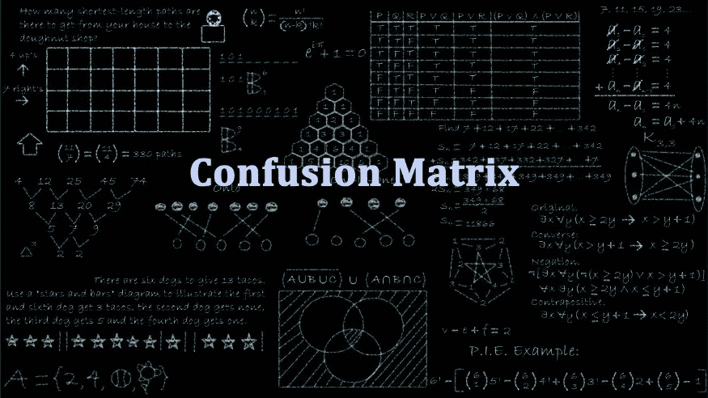

# 机器学习中的混淆矩阵

> 原文：<https://medium.com/nerd-for-tech/confusion-matrix-in-machine-learning-ef268aa794cf?source=collection_archive---------6----------------------->

# **简介**

当我们用数据开始我们的机器学习分类问题时，我们总是试图为我们的数据获得最佳模型。但是等等，我们如何决定，我们的模型对于我们给定的数据是否正确。这里出现了描述分类模型性能的混淆矩阵。
首先，我想问一个很常见的问题，很多人都会犯这个错误，即准确性是否足以决定一个模型对任何数据都是最好的。

毫无疑问，准确性是一个需要考虑的重要指标，但有时它并不能描述全貌。因为我们需要我们的模型比给我们高精度更健壮。通过健壮模型，我的意思是为我们的模型的所有类预测最好的可能值。

有时当我们训练我们的模型时，我们的数据例如被认为是 2 个班级，男生和女生，它包括 97000 个男生和 3000 个女生。假设我们有一个模型，它可以正确地对每个测试数据进行分类，从而使我们的准确率达到 97%。但与此同时，如果我们在一些真实的女孩数据集上测试我们的数据，我们的模型将会失败，即使在如此巨大的准确性之后。这是因为在我们的训练模型中男孩的比例很高，这导致数学落后于训练有利于男孩预测的特定类型的变量。现在让我们进一步看看混淆矩阵是如何帮助我们处理这个问题的。
博客路线图:简介- >基本术语- >混淆矩阵示例，解释了每个指标(准确性、错误率、召回率、召回率、精确度、F1 分数、Fβ分数、特异性、FPR)

本博客旨在回答以下问题:
*1。混淆矩阵理论。
2。为什么使用它。
3。关于准确性、F1 分数、精确度、召回率和更多指标。*

在开始混淆矩阵之前，我们将浏览基本术语及其含义，以便更容易和更有效地理解进一步的概念。

分类矩阵中的基本术语:

我们将通过制作一个场景并查看哪个案例位于哪个行话中来理解所有行话。场景:你接受了新冠肺炎测试。
帮助我记住所有这些类似术语的一个提示是，右边是以肯定/否定形式书写的预测值，左边是以真/假形式书写的预测值。用这种格式想象每一句行话，它将会永久地留在你的记忆中，不会有任何混乱。此外，当我解释时，我会解释如何将其中的一两个形象化。

**真正(Tp):** 当实际事件为真且预测也为真时。(Actual= 1，Predicted=1)
考虑场景的例子:你有 covid，你预测它你有 Covid。
***可视化:*** 你的预测为正意味着预测值=1(Covid)，你的实际值相对于你的预测值为真。因此 Actual=1(Covid)。
**真否定(Tn):** 当实际事件不真实，预测不真实时。(Actual= 0，Predicted=0)
考虑场景的例子:你没有 Covid，你预测正确。
***可视化:*** 你的预测为负意味着预测=0(非 covid)而你的实际值相对于你的预测均值实际=0(非 covid)是真实的。
**假阳性(Fp):** 当实际事件为假而你预测为真时。(实际= 0，预测=1)。也称为第一类错误。
考虑场景的例子:你没有 covid，你预测你有 Covid。
**假阴性(Fn):** 当实际事件为真而你预测为假的时候。(实际= 1，预测=0)。也被称为第二类错误。
考虑以下场景的示例:您有 covid，但您预测您没有 Covid。

为了检查 Tp，Tn，Fp，Fn 中哪个预测值是真的，你可以在预测值和实际值之间取 Xnor。并且可以断定 Tp 和 Tn 是正确预测的。
现在，我们将看到一些新的分类指标术语，下面给出了每个术语中的混淆矩阵示例:
帖子图片

**1。准确性:**准确性告诉我们多长时间一个模型能给我们正确的预测。它是通过正确预测的样本分数计算的(即(Tn + Tp)/(Tp + Tn + Fp + Fn) )
在上述示例中，精确度= 150/165(即 90.91 %)

**2。误差率:**误差率告诉我们多长时间一个模型给我们一个错误的预测。它是通过预测错误的样本的分数来计算的(即(Fn + Fp)/(Tp + Tn + Fp + Fn) )
在上面的示例中，准确度= 15/165(即 9.09 %)
误差= 1-准确度

**3。回忆(敏感度):**回忆是你已经正确预测的真实事件的分数。
换句话说当实际值为真(正值)时那么预测值正确的频率，就是回忆。
计算方法:Tp / (Fn + Tp)
在上面的例子中，召回率= 100/105(即 95.24 %)
从公式中我们可以看出，Tp 在这种情况下既可以是 0 也可以是 1，因此我们可以得出召回率将在 0 到 1 之间，包括 0 和 1。它告诉我们，当所有的实际值都是正数时，我们的模型有多好。
现在考虑当 recall=1 或 recall = 0 时的两种情况。
当 Recall=1 时，这意味着模型可能足够好，可以正确预测所有实际值。如何如此，将进一步讨论。
当 Recall=0 时，这意味着模型被破坏，并且当实际值为真时不能做出单个正确的预测。现在问题来了，如果准确性为我们提供了所有这些信息，我们为什么还需要回忆呢？
为了回答这个问题，让我们考虑一个更容易理解的例子。
考虑一条狗的分类问题。假设我们有 85 个 not dog(即 0)实例和 15 个 dog(即 1)实例。现在让我们假设，由于我们的模型背后所涉及的数学差异，所有预测都不符合，或者我们可以为 0。
精度为 85/100=85%
如果只检查精度，那么模型的精度确实很高。现在让我们检查一下召回。
Recall=0/15=0
我们得到 Recall=0，这意味着模型被破坏，当实际值为真时，它甚至不能正确分类单个数据点。
由此可见，回忆对于评论车型性能是多么重要。
此外，这也表明仅仅依靠准确性并不是评估模型的最佳方式。因此，我们可以得出结论，我们不想要高价值的召回。但是，如果它的值真的很高并且接近 1
呢？如果 Recall=1，那么只有当模型正确地预测了所有实际的真实值时才是可能的，这将导致低精度。那么问题来了，什么是精度？

**4。Precision:** Precision 是预测的阳性事件中实际为阳性的部分。
换句话说，它意味着我们的模型被预测为真并且是正确预测的概率。
计算方法:Tp / (Fp + Tp)
在上面的例子中，召回率= 100/110(即 90.91 %)
这意味着我们必须最大化模型的精度，但是如果精度太高，或者我们可以说接近 1，那么由于大量的假阴性，模型将具有非常低的召回率。那么我们由此可以得出什么结论呢？我们必须平衡查全率和查准率，因为最大化一个会最小化另一个。也有一些情况，或者我们可以说数据集，我们必须最大化其中一个而不是其他，因为它不会影响其他。但它与博客无关，所以我不会深入讨论它的细节，只是为了将来如果有这样的数据集出现的话。
为了获得精确召回情况下的更多“组合”表达，我们考虑另一个称为 F1 分数的指标。

**5。f1-得分:**它是精确度和召回率的调和平均值。它被解释为精确度和召回率的加权平均值。
F1 得分= 2*(召回率*精确度)/(召回率+精确度)
在上面的示例中，F1 得分= 2 *(100/105 * 100/110)/(100/105+100/110)
= 0.93
我们不使用简单平均值，而是使用调和平均值，因为它会惩罚极值。如果我们认为 precision 为 1，recall 为 0，则平均值为 0.5，但 F1 值为 0。F1 分数同等重视精确度和召回率。这里出现了图片 Fβ度量，其中β可以被调整，以给它们中的任何一个精度或召回更多的权重。
因此，如果我们想要一个具有最佳召回率和精确度值的平衡分类模型，那么我们尝试最大化 F1 分数。
F1 分数是 Fβ指标的一种情况，现在让我们了解一下一般情况。

**6。Fβ-Score:** 它也是一个指标，相同的 F1 分数只是在精确度和召回率没有得到同等重视的情况下有所不同。它允许我们给他们任何一个更多的权重。
后图
最常用的β值有，β = 0.5，1，2
在上面取β=1 的例子中，它等于 F1-Score，把它放在β位就可以计算出任何值。

7。特异性:又称真阴性率。它实际上是正确的消极预测。它告诉我们，我们的模型在正确预测错误值方面有多棒。
特异性= Tn/(Tn + Fp)
在上述示例中，特异性=50/60(83.3%)

**8。假阳性率(FPR):** 误归类为阳性(即假阳性)的假事件数与实际假事件总数之比。
因此，FPR 告诉我们，当实际值为假时，模型对数据的分类是多么错误。
换句话说，如果我们只看负面(错误)，那么模型将它们归类为正面(正确)是多么错误，这就是 FPR。
FPR = Fp/(Fp + Tn)
上例中假阳性率(Fpr)=10/60(16.67%)。我希望所有对混淆矩阵有深刻理解的基础知识对你来说都是清楚的。继续阅读，继续努力。

你可以通过
LinkedIn:[https://www.linkedin.com/in/nikhil-agarwal-4881a9195/](https://www.linkedin.com/in/nikhil-agarwal-4881a9195/)
Gmail:[nikhilagarwal82537@gmail.com](mailto:nikhilagarwal82537@gmail.com)
Github:[https://github.com/nikhil24agarwal](https://github.com/nikhil24agarwal)
感谢阅读！