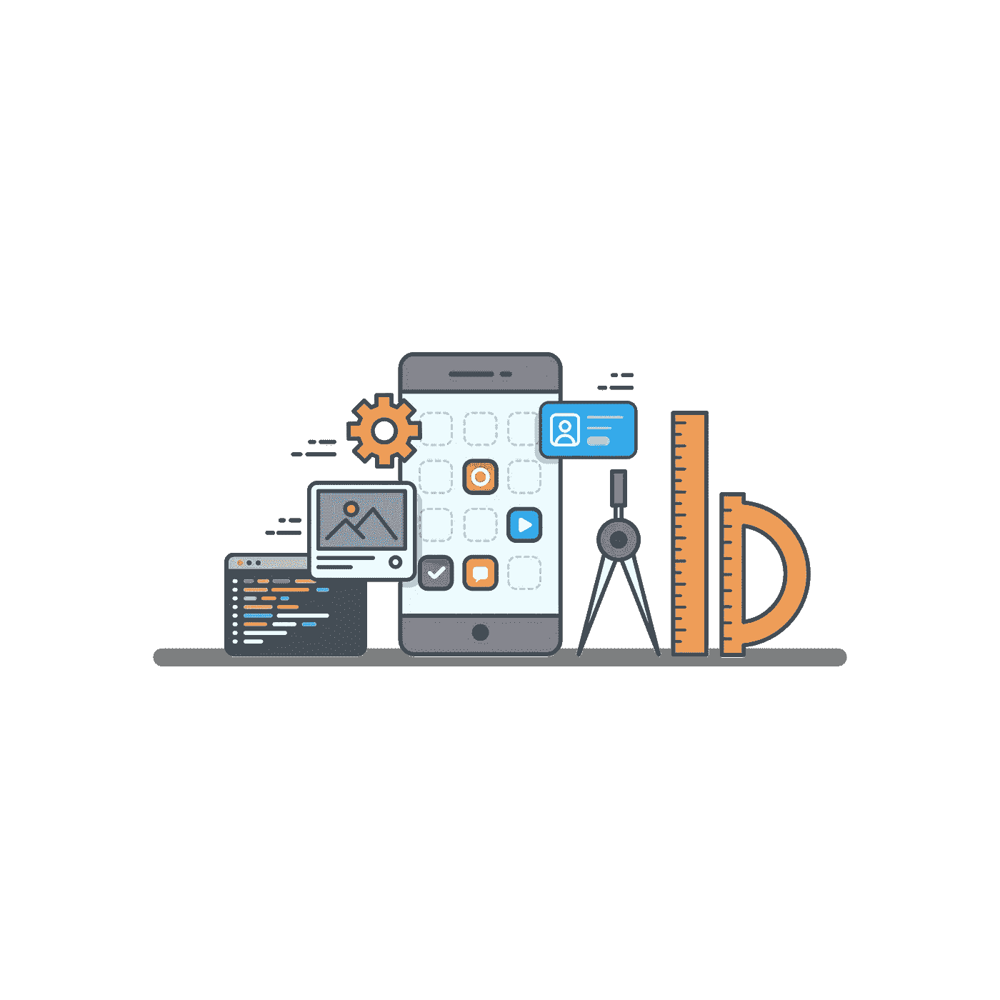

# 高效移动应用开发的注意事项

> 原文：<https://medium.com/nerd-for-tech/considerations-for-an-effective-mobile-app-development-fcc7dce18d21?source=collection_archive---------18----------------------->

[https://vijayverma.co/](https://vijayverma.co/)

为您的移动应用程序开发选择正确的技术可能取决于多种因素，因为这是任何企业有效利用资源的关键，所以考虑您的选择不应该是一个微不足道的过程。

作为一名开发人员，如果我明天开始创业，把移动应用作为主要产品，我的决策过程会是这样的。我会尽量保持客观，但恐怕我无法掩饰我是科特林多平台(KMP)的忠实拥护者。

# **你的第一个问题:原生还是跨平台？**

我想说这是构建移动应用时的传统问题，这是一个**效率**与**质量的问题。**

## **为什么要跨平台？**

为了简单起见，我将假设目前 Flutter 和 React Native 在 Android 和 iOS 上的性能等同于原生解决方案。
在所有平台之间进行深入的性能比较，涵盖多个用例是一项艰巨的任务，它只能提供框架的快照，并且很可能会很快过时。本文的范围是为您提供关于框架的目的及其发展方向的长期展望。

那么，使用跨平台解决方案的最大好处是什么:

*   你将获得 **1 个源代码**和 **2 个应用** (android & iOS)，一般来说，这将导致大约**2 倍的效率**或 **50%的成本**
*   平台之间没有同步成本(我稍后将回到这一点)

关于这种方法，我最大的担心是跨平台解决方案的思想，你可以用同样的方式对待两个不同的平台，它们有相似之处。这在我看来，就和认为把同样的教育制度应用到两个兄弟姐妹身上会有同样的结果是一样的。

现在，我们基于这种思想的跨平台框架将提供平台之间的桥梁，所以基本上它们会为您做出所有特定于平台的决定。另外，如果其中一个平台有了新特性，你也需要等待框架来支持它。我知道可用的框架提供了一种编写特定于平台的东西的方法，但是当框架在某个地方流血时，这是最后的伤口敷料，并且它会让您付出代价(您的团队可能不是本地专家，并且在大多数情况下与这种本地代码的互操作性不是最好的)

这种意识形态就是为什么我认为即使不是现在，项目也可能会遇到一些质量障碍，因为:

*   我不认为 **Android** 或 **iOS** 有或会有任何严格遵循彼此的意图，这将导致两个平台上不同的特性和能力，并且框架要跟上平台会变得非常困难。
*   你不能完全控制平台的特定部分，你必须依赖于框架。而且一些 UI 决定必须是特定于平台的(除非你是野蛮人并且不介意在 iOS 设备上放置 FAB)

尽管如此，我确实喜欢 Flutter，我也容忍 React Native，因为考虑到他们的方法的限制，他们做得相当好，我也可以理解为什么用两个原生应用程序而不是一个跨平台的应用程序看起来像是从商业角度祈祷质量的溢价。

## 原生解决方案有什么问题？

有点像用大炮打麻雀。为什么？因为假设你的 Android 和 iOS 应用程序是**70–80%**相似的，现在你最终实现了同样的东西两次，这样你就可以更好地控制两个平台之间的**30–20%**差异。
我最大的问题甚至不是你实现同样的东西两次，而是确保两个平台同步所需的巨大努力。无论你的团队有多优秀，沟通有多高效，他们仍然会花时间调整平台。我认为人们倾向于低估这一方面，主要是因为它很难衡量，但它可能会成为一个消耗团队效率的怪物。

所以知道了所有这些，你应该在做决定的时候记住你的两个主要约束条件，效率和质量:

1.  如果你有一个**无止境的预算**和你**只关心质量**，那么一定要完全本地化。
2.  如果你是一家初创公司，你有**有限的预算**，你只是想要一个 **MVP，**然后可能跨平台看起来是目前为止最好的决定，但你是一个有远见的人，你正在考虑下一步:你的 MVP 带来了钱，突然你开始关心质量，你非常关心。在这一步有一个风险，如果你遇到跨平台的障碍，你需要用本地语言重写你的整个应用。
3.  如果你没有偏好，你想要两者兼得，你想要最好的质量/成本比。你必须接受这样的想法:在本机或跨平台之间，你要么选择效率，要么选择质量。

# 科特林多平台救援

这个野兽有潜力带给你最好的**性价比** **比**。为什么？

*   你得到了你的原生代码，你可以利用不同平台的力量，这给你带来了原生质量。
*   是否和跨平台一样高效？不，但也差不多了。你可以共享任何你的非平台特定代码(通常达到 **80%** ，如果你想滥用它的用途，也有共享 UI 的方法)。

Kotlin Multiplatform 不想统一两个不同的平台，它只是给你工具来分享你认为两个应用程序的共同部分。

我必须在这里提到一句被广泛引用的话(主要是凯文说的):

> 共享 UI 是一部痛苦和失败的历史。共享逻辑是计算机的历史。凯文·加利根

## 锦上添花

有了 Kotlin Multiplatform，你不仅仅局限于 Android 和 iOS，你可以在多个不同的平台之间共享代码，比如后端、web、windows、linux、mac

## 如果我不是从零开始呢？

那么你可能有两种情况:

1.  你之前选择了**跨平台**，你对质量不满意。通过转换，你肯定会增加你的短期成本，因为你要么必须培训你的团队，要么得到一个新的团队，你肯定需要重写你的整个应用程序。
2.  你选择了本地，但是你发现这种方式的成本对你来说太高了。你深吸一口气，选择专注于 Android，然后你要么培训你的团队，要么雇人将可用的代码迁移到 KMP 设置，然后完成剩余的 20-30-40%的 UI 或 iOS 上的其他平台细节。

## 你需要有足够记录的东西

有道理，你想要的东西是经过验证的，没有那么大的风险。
首先，我会查看可用的[案例研究](https://kotlinlang.org/lp/mobile/case-studies/)，如果你仍然不能 100%信服，那么我会考虑以下策略:

专注于机器人，尝试在 KMP 设置它。最糟糕的情况(概率很低)你将最终拥有一个原生 Android 应用，而你必须从 0 开始做一个 iOS 应用。
从好的方面来看，如果你成功完成了 KMP(这种情况发生的概率要大得多),你可以节省很多钱。

现在我已经简化和概括了我思考过程的一些部分，因为涵盖一个项目的所有细节是极其困难的。
如果你有疑问，或者觉得有些东西不适合你的项目，我随时欢迎就这些话题进行讨论，请发表评论或随时与我联系( [LinkedIn](http://www.linkedin.com/in/róbert-nagy-037a96b6/) ，nagyrobi144@gmail.com)