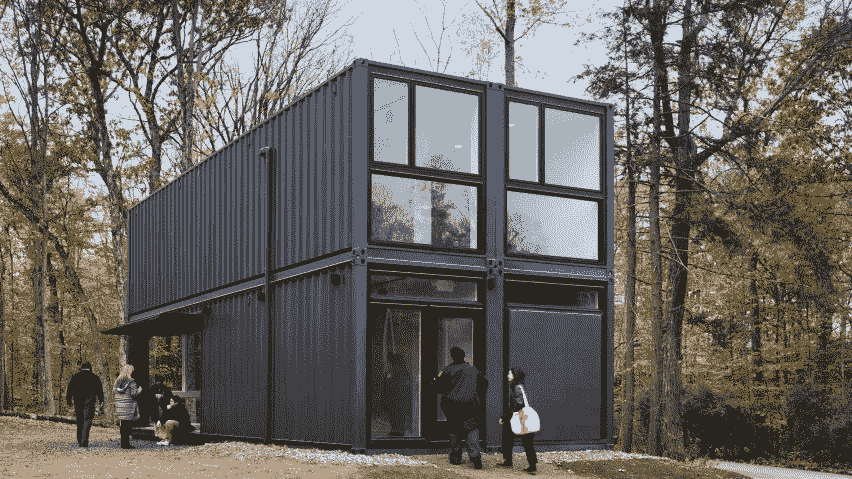
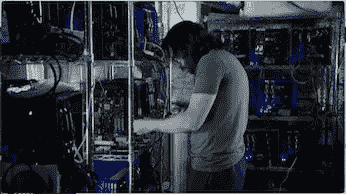
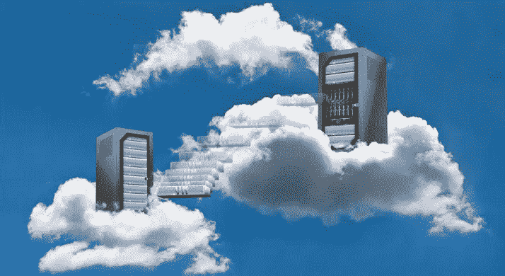
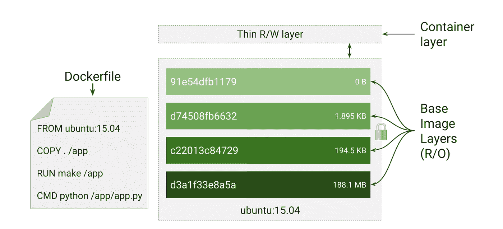
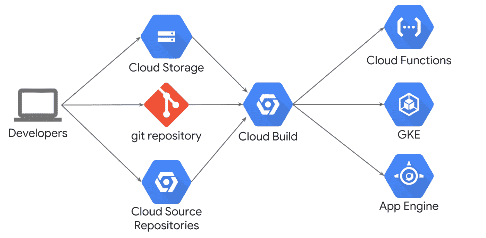

# 让我们谈谈:Google 云平台中的容器和 Kubernetes 第 1 部分

> 原文：<https://medium.com/nerd-for-tech/containers-and-kubernetes-in-google-cloud-platform-c178aae0cb35?source=collection_archive---------4----------------------->

近年来，容器的使用在云中应用程序和其他广泛编排的适当管理中变得非常有用。

> 根据定义，容器是在命名空间内执行的运行时进程，命名空间是由 cgroups 和各种其他 LSM 和安全特性管理的资源，以确保运行时完全的进程隔离。

让我们做一个头脑想象和想象的练习；看着上面的容器，想象它嵌入了自动化流程，如自动门、自动烹饪、自动厕所、自动自助餐系统、智能厨房、智能咖啡机和许多其他你可能喜欢的自动化操作——只要在你的脑海中记住这个画面。那么很明显你是人类，这个容器被放置在天空的某个地方，通过某种能源和互联网来运行操作——酷吧？现在，这正是在您的应用程序运行中涉及容器和 Kubernetes 时的情况——虽然容器是 Kubernetes 或其他产品的同义词，但天空是您的公共云的同义词(Amazon Web Services、Goole Cloud Platform、DigitalOcean、Azure 和其他产品),人(或者更确切地说，您)是应用程序、互联网和电源的同义词，最后，自动化操作是 pod、应用程序维护、停机干预、依赖性更新和许多其他产品的自动化修复的同义词。

> Google 说,“容器允许你把你的应用程序和它的依赖项打包到一个简洁的清单中，这个清单可以被版本控制，允许你的应用程序在你的团队中的开发者和你的集群中的机器之间简单的复制。正如软件库如何将代码打包在一起，允许开发人员抽象出用户认证和会话管理等逻辑一样，容器允许将应用程序作为一个整体打包，抽象出操作系统、机器甚至代码本身。

**应用程序和容器的历史记录**

喝一杯咖啡，让我们沿着记忆之路漫步，跟随容器编排和应用程序管理之旅中的一些重要亮点。

1.  回想一下构建家庭服务器的早期，在单独的物理机器和操作系统上运行每个应用程序(附注:它的缺点是速度慢、机器多、过热和其他一些令人不舒服的情况)。

图 1.0“硅谷”系列中的家庭应用服务器图像

2.接下来，请回忆一下虚拟机时代，在这个时代，您可以在同一台物理机上部署应用程序及其依赖项(注:它的缺点是在试图将其操作挤入一台虚拟机时运行，另外，如果一个应用程序的依赖项需要更新，它可能会影响虚拟机上运行的其他应用程序，这非常令人沮丧)。

图 2.0 云中的虚拟机分类

3.此外，行业发展到了创建一个容器的时代，该容器承载应用程序代码及其可能的依赖关系，该容器始终是可扩展的和轻量级的，而不用担心硬件或虚拟机管理程序—这种模式非常具有创新性，因为它确保同一操作系统可以同时运行硬件上的所有内容。详细拿容器来说，这里把应用程序及其依赖关系称为一个 [**映像**](https://searchitoperations.techtarget.com/definition/container-image)；简单来说， ***容器只是运行一个图像的实例。*** 不用担心运行，容器可以帮助应用流畅运行。 ***容器使用了几种 LINUX 技术，其中一些包括:***

*   ***进程:*** *一个正在运行的程序实例称为一个* ***进程*** *。每次运行 shell 命令时，都会运行一个程序并为其创建一个进程。Linux 中的每个进程都有一个* ***进程 id****(****PID****)并且与特定的用户和组帐户相关联。*
*   ***Linux 名称空间:*** *这有助于容器使某些东西可见，如 ID 号、IP 地址等。换句话说，它们是 Linux 内核的一个特性，对内核资源进行分区，使得一组进程看到一组资源，而另一组进程看到一组不同的资源。* ***一些流行的例子包括进程隔离(PID 命名空间)、网络接口(net 命名空间)、Unix 分时系统(uts 命名空间)、用户命名空间、挂载(mnt 命名空间)和进程间通信(IPC)***
*   ***控制组:*** *这是另一种技术，用于控制应用程序可以利用的资源，如 CPU 时间、带宽等。可以用*[***systemd***](https://www.redhat.com/sysadmin/cgroups-part-four)*进行广泛管理。在其他新闻中，控制组在管理 Kubernetes 工作负载方面非常重要，这反过来促进了更好的容器编排。控制组的一些其他功能包括当容器中出现竞争时决定优先级，控制读/写访问，然后提供在给定系统上运行的高级进程帐户信息的可能性。*
*   ***联合文件系统:*** *联合文件系统将应用程序及其依赖关系封装到一组干净的最小层中。* ***通俗地说，它是任何容器的积木。*** *多年来，它被用来解决两大难题；* ***低效的磁盘空间利用和自举延迟*** *都在常规文件系统中。它的一些独特的属性包括* ***它的多个层的逻辑合并、只读的下层、可写的上层、从上层开始读取而不是从下层开始读取的潜力、然后是写入时复制(CoW)功能以及最后通过空白文件从下层目录移除的模拟。***

向前迈进……

图 3.0 带有基本图像扫视的容器视图

在构建这些容器时，基础层可以像 Ubuntu 层一样下载，如图 3.0 所示(例如，一个回购网站是 gcr.io，这是一个用于基础映像的 google 注册表)。构建容器的其他方式包括使用云构建、使用 docker push 的本地构建以及构建包。由于这不是一篇教程或操作方法文章，我建议你查阅 [**文档**](https://cloud.google.com/run/docs/building/containers) 以获得关于如何实现该过程的更多细节，相信我，它非常简单——只需按照步骤操作即可。下面的图 4.0 显示了云构建的结构及其运行方式。 ***根据定义，它是在 GCP 基础设施流程*** 中执行构建的服务。*它能够从云存储、云资源存储库、GitHub 或任何其他版本控制空间导入源代码，根据指定的偏好执行构建，并生成工件，如 Java 档案，甚至是 docker 容器，如本文所要求的。*

云构建将您的构建作为一系列的*构建步骤*来执行，其中每个构建步骤都在 Docker 容器中运行。云构建的美妙之处在于，您可以使用受支持的构建步骤，或者根据项目编写自定义的构建步骤。你可以查看一下 [**文档**](https://cloud.google.com/build/docs) 中的一些操作步骤，相信我，这很简单。

图 4.0 云构建结构及其运行结构

在接受了容器、dockers 和其他术语的概念后，必须在良好的基础设施上进行管理和扩展，以满足产品需求并保持弹性。此时，容器必须**“挂靴”(在我的社区中，这意味着他们必须交出接力棒并退休)**，让 **KUBERNETES** 域在容器和应用程序编排中表演它的魔法。无论现场是否有工程师，Kubernetes 都可以管理内部或云中的基础设施，它旨在自动控制运营。这是一个以容器为中心的开源环境。它自动化了应用程序的部署、扩展、日志记录和其他功能。它还具有 IAAS 一样的用户偏好和配置灵活性。您还可以使用声明式配置来帮助应用程序随时完成您想要的任务，但是命令式配置功能永远不会被搁置一旁。它被用于临时固定和其他轻型任务。 **Kubernetes 还有一些关键特性，它们包括**

*   **支持多种工作负载类型**
*   **支持有状态/无状态应用**
*   **自动缩放**
*   **跟进资源限额**
*   **产品资源的延展性**
*   **由于其开源性，对于内部或云的工作负载都非常便携。此外，它可以部署在任何地方，供应商甚至客户/用户都不知道。**

我知道你可能会问容器中的安全性和联网，我和你一样意识到这样一个概念，但是请不要走远，我会撰写关于这些如何工作的文章，因为它们在容器编排中非常重要。

在享受了上面详述的 Kubernetes 的特权后，需要一些额外的自动化，这就是**谷歌 Kubernetes 引擎**派上用场的地方，但我今天不会谈论它，留下来深入了解谷歌 Kubernetes 引擎如何在*基础设施建设(基础)、工作负载协调和最重要的生产*中工作。 ***但简而言之，既然 Kubernetes 可能难以维护，谷歌 Kubernetes 引擎就是出路。它将有助于部署和管理 GCP 应用程序的 Kubernetes 环境。这使得将应用程序带到云中变得很容易。它完全由 google 管理、优化和控制，然后它帮助集群(被管理的系统)升级，然后节点(帮助集群过程的资源中的 VM)被处理，以便在不健康的情况下自动修复(这意味着它将删除节点并创建一个新节点)和其他奇妙的功能。就像我说的，别走开，我有很多内容给你。***

图 5.0 Kubernetes 徽标图像

现在，请记住，这篇文章不仅面向云领域的专家，即使是新手也可以加入并学到很多东西，这就是为什么我用外行和专业术语将一切都讲得很清楚，所以如果您有任何问题，也可以通过[**Twitter**](https://twitter.com/SamuelArogbonlo)**联系我，或者通过**[**Github**](https://github.com/samuelarogbonlo)**找到我。**

**感谢阅读❤️**

如果你对这个话题有任何想法，请留下评论——我乐于学习和探索知识。

# 我可以想象这个帖子有多有用，请留下掌声👏下面几次以示对作者的支持！