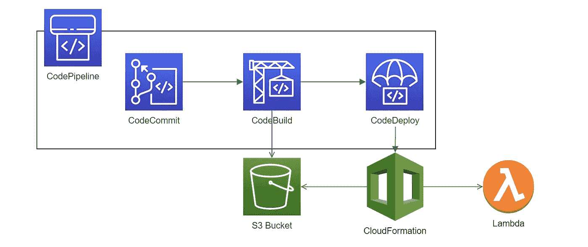

# 使用 Java 运行时持续部署 AWS Lambda

> 原文：<https://medium.com/nerd-for-tech/continuous-deployment-of-aws-lambda-with-java-runtime-7b6d6188607?source=collection_archive---------0----------------------->



> 这是我自己写的一篇关于如何为用 Java 编写的 Lambda 设置 CI/CD 的笔记。

如今，只需要证明的想法和概念的实现可以使用无服务器方法来完成。这种方法有很多好处:没有基础设施管理和现收现付的支付模式，等等。但是在开始编写业务逻辑代码之前，您需要确保尽可能快地构建和交付代码更改。

AWS CodePipeline 是一项服务，它编排连续交付无服务器应用程序所需的步骤。基本上，这些步骤包括从 CodeCommit 中提取代码，用 CodeBuild 编译和打包代码，最后用 CodeDeploy 部署包。但在 AWS Lambda 的情况下，部署过程略有不同，还涉及亚马逊 S3、CloudFormation 和 AWS 无服务器应用模型。

假设我们的目标是在每次提交时使用 CodeCommit 中托管的 Java 代码库执行 Lambda 函数的自动部署。AWS 提供的代码管道教程很少。描述如何[将无服务器应用程序发布到 AWS 无服务器应用程序库](https://docs.aws.amazon.com/codepipeline/latest/userguide/tutorials-serverlessrepo-auto-publish.html)的版本是最接近帮助实现我们目标的版本，但是它需要一些小的更新和注释来使其适用于 Lambda 和 Java 代码。

## 开始之前

您必须已经拥有或按照本教程创建:

*   一个 CodeCommit 存储库，里面有一些用 Java 编写的 Lambda 示例代码，你可以使用 AWS 提供的[示例。您还可以在为本文创建的 GitHub](https://github.com/awsdocs/aws-lambda-developer-guide/tree/main/sample-apps/java-basic) 资源库中使用[代码示例。](https://github.com/antonbakalets/demo-aws-lambda-ci-cd)
*   存储代码部署包的 S3 桶。
*   您应该熟悉 AWS CloudFormation 和 AWS 无服务器应用程序模型(AWS SAM)

## 步骤 1:创建一个 buildspec.yml 文件

使用以下内容创建一个`buildspec.yml`文件，并将其添加到 CodeCommit 存储库的根文件夹中。`sam-template.yml`是您的应用程序的 AWS SAM 模板，`bucketname`是您打包的应用程序将被存储的 S3 桶。

```
**version**: 0.2

**phases**:
  **install**:
    **runtime-versions**:
      **java**: corretto11
  **build**:
    **commands**:
      - mvn package
      - sam package 
        --template-file *sam-template.yml* 
        --s3-bucket *bucketname* 
        --output-template-file packaged-template.yml
**artifacts**:
  **files**:
    - packaged-template.yml
```

这里最重要的是理解`sam-template.yml`和`packaged-template.yml`文件的区别。`sam package`命令为你的代码创建一个. zip 文件，并上传到 S3。然后它返回 AWS SAM 模板的副本(`packaged-template.yml`，用亚马逊 S3 的位置替换对本地工件的引用。

这里需要注意的其他几个项目:

*   您可能已经注意到 Maven 用于构建包含所有必需依赖项的阴影 jar，但是 Gradle 也可以使用。
*   `runtime-versions`部分指定了 Java 的版本 11。亚马逊推荐亚马逊 Linux 2 标准镜像使用`correto11`，Ubuntu 标准镜像使用`openjdk11`。
*   请注意`buildspec.yml`0.1 版不支持`runtime-versions`部分。

## 步骤 2:创建并配置您的管道

这一步完全重复教程中的步骤 2:创建和配置您的管道。如果你用的是 CodeCommit 而不是 GitHub，用的是 Amazon Linux 2 操作系统而不是 Ubuntu，只要做适当的改动就可以了。

只是不要忘记添加一个新的策略声明，允许 CodeBuild 将对象放入存储打包应用程序的 S3 桶中。

## 步骤 3:创建部署操作

按照以下步骤设置负责创建包含 Lambda 函数的 CloudFormation 堆栈的管道操作。

1.  打开代码管道控制台。
2.  在左侧导航部分，选择要编辑的管道。
3.  选择**编辑**。
4.  在当前管道的最后一个阶段之后，选择 **+添加阶段**。在**阶段名称**中输入一个名称，如`**Deploy**`，选择**添加阶段**。
5.  在新阶段，选择 **+添加行动组**。
6.  输入操作名称。从**动作提供器**中，在**调用**中，选择 **AWS CloudFormation** 。
7.  从**输入工件**，选择**构建工件**。
8.  从**动作模式**中，选择**创建或更新堆栈**。
9.  选择您的**堆栈名称**。
10.  在**工件名称**的**模板**部分，选择 **BuildArtifact** 并且**文件名**应该是前面提到的 SAM 转换的结果`packaged-template.yml`。
11.  您需要添加两个**功能** : **CAPABILITY_IAM** 来确认您希望允许 Cloudformation 修改 IAM 项，以及 **CAPABILITY_AUTO_EXPAND** 因为模板包含 AWS::Serverless transforms，这是一个由 AWS CloudFormation 托管的宏。
12.  您需要创建一个角色来允许 CloudFormation 执行所需的操作:从 S3 下载工件，创建变更集，创建 Lambda 函数，并为模板文件中定义的 Lambda 函数创建一个角色。

```
{
  **"Version"**: **"2012-10-17"**,
  **"Statement"**: [
    {
      **"Action"**: [
        **"lambda:CreateFunction"**,
        **"lambda:GetFunction"**,
        **"lambda:DeleteFunction"**,
        **"lambda:UpdateFunctionCode"**,
        **"lambda:UpdateFunctionConfiguration"**,
        **"lambda:ListTags"**,
        **"lambda:TagResource"**,
        **"lambda:UntagResource"**,
        **"cloudformation:CreateChangeSet"**,
        **"iam:GetRole"**,
        **"iam:CreateRole"**,
        **"iam:DeleteRole"**,
        **"iam:PutRolePolicy"**,
        **"iam:AttachRolePolicy"**,
        **"iam:DeleteRolePolicy"**,
        **"iam:DetachRolePolicy"**,
        **"iam:PassRole"**,
        **"s3:GetObject"** ],
      **"Resource"**: **"*"**,
      **"Effect"**: **"Allow"** }
  ]
}
```

13.选择**完成**动作。

14.为舞台选择 **Done** 。

为了验证您的管道，提交并将更改推送到您的代码库中。当管道完成时，您可以检查由 CloudFormation stack 创建的资源，并找到您的 Lambda 函数。

## 演员表

既然您的管道已经设置好了，Lambda 函数也已经部署好了，那么您可能想知道运行这个基础设施的成本是多少。根据计费服务收取下一次服务费用:

*   每个用户的代码提交费用。
*   每构建分钟的代码构建费用。
*   S3 按不同类型的请求和存储量收费。
*   CloudWatch 按日志数据量收费。
*   Lambda 每次调用收费。

因此，您使用现收现付模式进行收费。对于列表中的每一项资源，您只需在使用时付费:当您触发构建或调用 Lambda 函数时。当然，在执行快速原型时，您可以设法将所有费用保持在免费使用层限制之下。

## 打扫

通过删除存储在 S3 存储桶中的构建包，可以减少 S3 存储的使用量。最简单的方法是在 bucket 上声明[生命周期管理](https://docs.aws.amazon.com/AmazonS3/latest/dev/object-lifecycle-mgmt.html)规则，不需要任何额外的服务调用和 IAM 配置。

即使成本真的很低，您也可能希望删除所有创建的资源，以避免任何额外的费用。只需删除 CloudFormation 堆栈，它将删除所有资源，如 Lambda 函数和与其相关的 IAM 角色。

既然您的栈模板已经在[源代码](https://github.com/antonbakalets/demo-aws-lambda-ci-cd)中，您可以根据基础设施作为代码原则添加新的资源，对业务逻辑或栈模板的每个更改都将由管道自动部署。