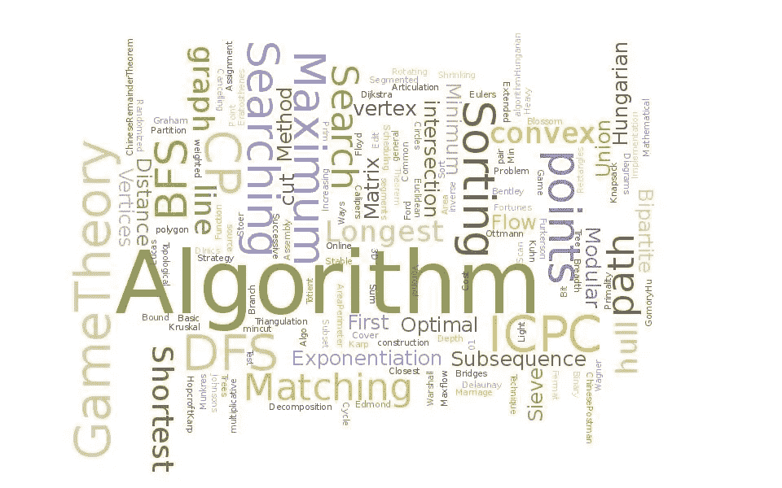

# 将排序后的数组转换为二叉查找树

> 原文：<https://medium.com/nerd-for-tech/convert-sorted-array-to-binary-search-tree-61eccf6df812?source=collection_archive---------9----------------------->



嘿伙计们，欢迎回来！这个博客是我们每天解决一个问题系列的延续。

**问题:-** 给定一个元素按升序排序的整数数组`nums`，将其转换为高度最小的二叉查找树。

**举例:-**

```
Input:  [1, 2, 3]
Output:
     2
   /  \
  1    3 

Input: [1, 2, 3, 4]
Output: 
      3
    /  \
   2    4 
 /
1OR 2
    /  \
   1    3
         \
          4
```

**解决方案:-**

在阅读了这个问题和创建一个具有最小搜索高度的二叉查找树的要求后，很明显我们需要创建一个平衡的二叉查找树。

平衡二叉树是一种二叉树，其中每个节点的两个子树的高度相差不超过一。

当谈到二叉树时，我立即开始寻找递归解决方案。

为了制作一个二叉查找树，我们需要总是有相等数量的元素(或者左节点子节点和右节点子节点的数量之差应该≤1)。

因此，给定一个数组，我们应该总是选择中间的元素作为根。(偶数长度数组中的任何中间元素)。

因此，基于此我们可以创建一个递归伪代码，

```
1.) Choose the middle element of array and make it root.
2.) Recursively do the same for the left and right children -
2.a) root.left = createBalancedBST(arr, start, mid-1)
     For the left children, since in a BST all left children should be <= the root, hence we will create a Balanced BST from start of the subarray to the mid-1.2.b) root.right = createBalancedBST(arr, mid+1, end)
     For the right children, since in a BST all left children should be >= the root, hence we will create a Balanced BST from mid+1 of the subarray to the end.
```

下面是基于我的方法的问题的 java 代码实现

**时间复杂度:- O(n)** 由于每个元素遍历一次，因此问题的总时间复杂度是线性的。

**数据结构和算法的必读书籍-**

*   [数据结构和算法变得简单:数据结构和算法难题，第二版](https://amzn.to/2NmpRoy)


以上是我的观点，非常感谢你阅读我的博客。我将继续这个系列，继续讨论日常问题。如需进一步讨论，请随时拨打*divyabiyani26@gmail.com 联系我。*

更多更新，让我们连线领英。