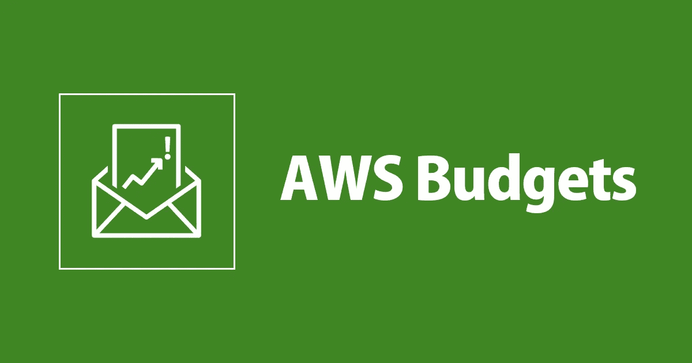
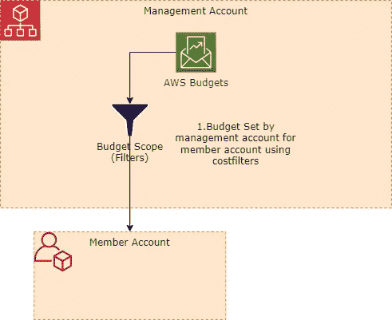
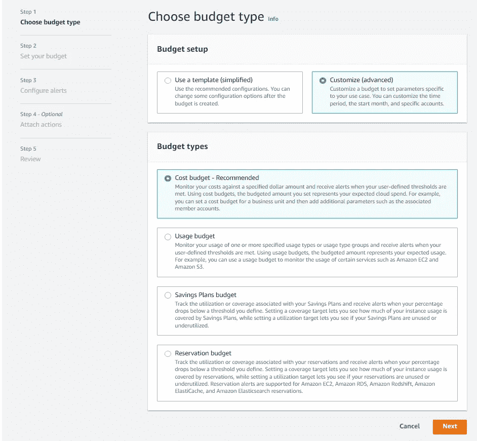
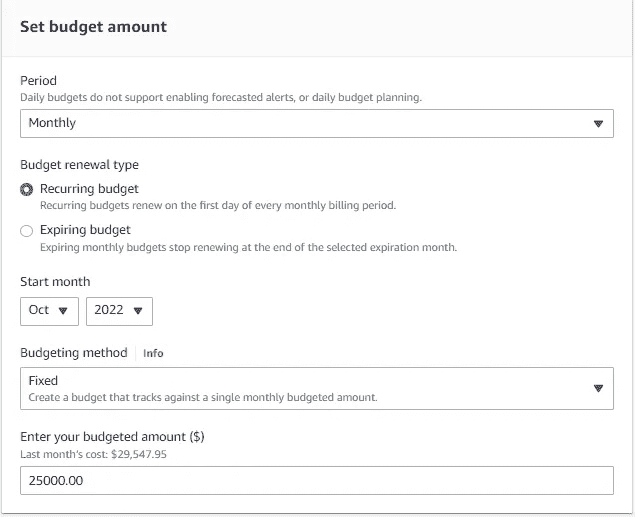
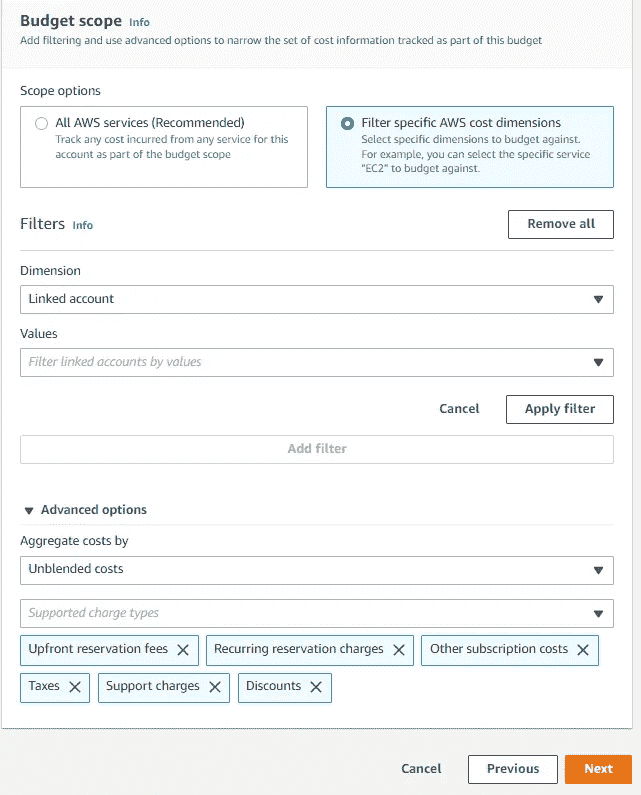
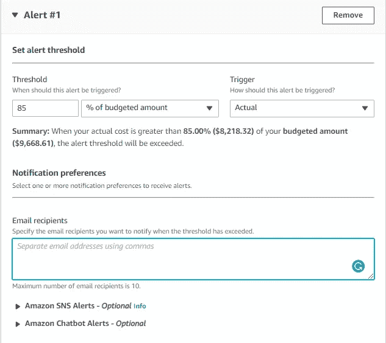
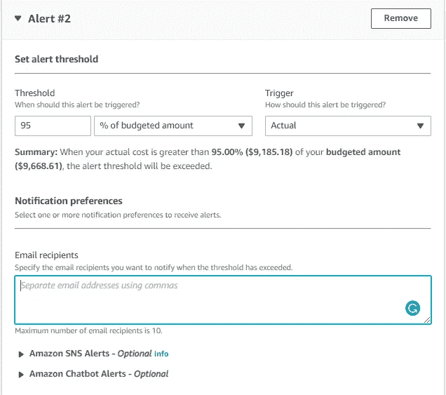
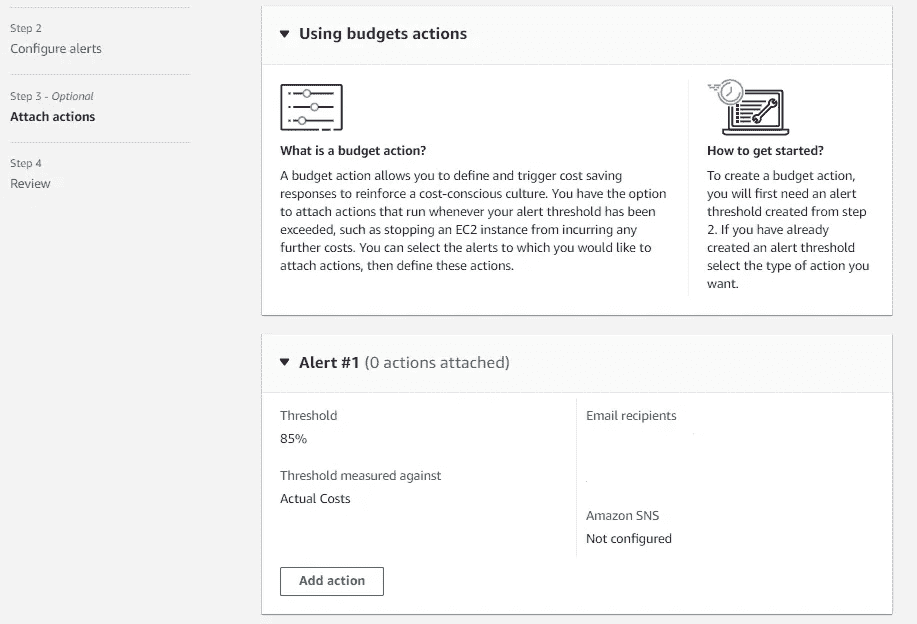
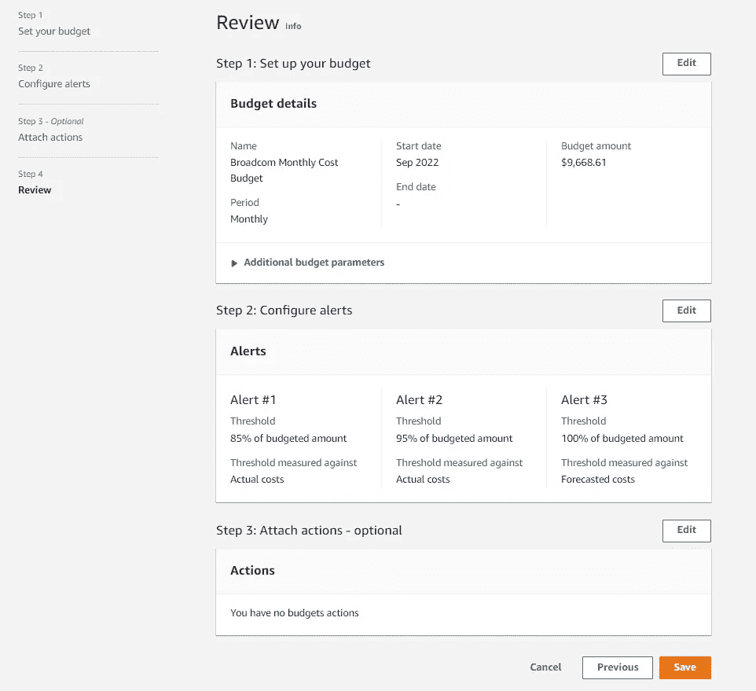
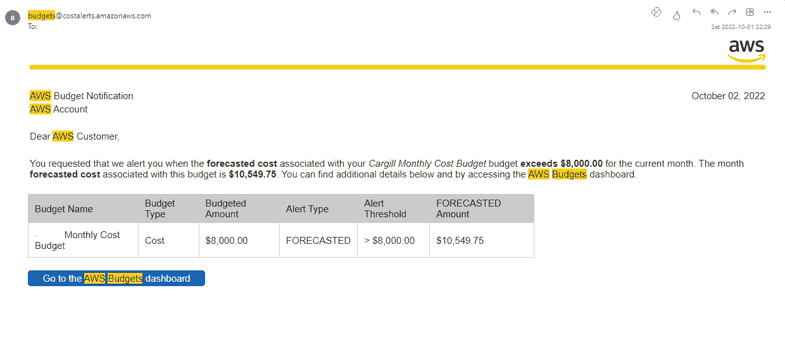

# 使用 AWS 预算进行成本管理和灵活预算

> 原文：<https://medium.com/nerd-for-tech/cost-management-flexible-budgeting-using-aws-budgets-af86c8edccd8?source=collection_archive---------2----------------------->

图 1 图片由谷歌提供

随着公司向云迁移，许多公司往往忽略了成本，而是专注于创新、速度和灵活性。假设云本质上比内部基础设施更具成本效益。

随着组织扩展其云运营，他们很快意识到，使云如此诱人和灵活的相同因素也可能使使用费用远远超出预算&他们需要了解云财务管理，以及如何使用它来增加云成本节约、收入、盈利能力、生产力和运营弹性。

这包括用于组织和跟踪成本和使用数据的服务、工具和资源，通过整合的计费和访问权限增强控制，通过预算和预测实现更好的规划，并通过资源和定价优化进一步降低成本。

今天，我们将讨论云财务管理的主要领域之一。

# AWS 预算

[AWS Budgets](https://aws.amazon.com/aws-cost-management/aws-budgets/) 允许您设置自定义预算，以跟踪从最简单到最复杂的使用案例的成本和使用情况。借助 AWS 预算，您可以选择在实际或预测的成本和使用量超过预算阈值时，或者在实际 RI 和储蓄计划的使用量或覆盖范围低于所需阈值时，通过电子邮件或产品升级和技术支持服务通知向您发出警报。

通过 AWS 预算操作，您还可以配置特定的操作来响应您帐户中的成本和使用状态，这样，如果您的成本或使用超过或预计超过阈值，就可以自动执行操作，或在您的批准下执行操作，以减少无意的超支。

AWS 预算提供了两种跟踪费用的选项。

AWS 管理控制台允许您监控每天的消耗变化，但 *AWS Budgets* 允许您在不登录的情况下将此视图作为常规电子邮件报告提供。AWS Budgets 中的预算是针对您的 AWS 资源的单个、频繁更新的成本或消耗统计服务。由于 AWS 数据的深层性质，您可能会创建各种预算来跨部门跟踪这些数据，或者深入到不同的系统和资源种类。

您可以设置预算警报来警告适当的个人或触发自动措施，如限制帐户或关闭特定的 AWS 资源，而不是依赖常规报告来检测费用何时将超出预算。

成本控制的坚实基础是发送给相关接收方的常规报告和事件驱动警报的组合。

您可以使用 AWS 预算来实现从简单到复杂的成本和使用情况跟踪。一些例子包括:

*   设定固定目标金额的每月成本预算，以跟踪与您的帐户相关的所有成本。您可以选择收到实际(应计后)和预测(应计前)支出的警报。
*   设定具有可变目标金额的月度成本预算，随后的每个月将预算目标增加 5%。然后，您可以为预算金额的 80%配置通知，并应用一项活动。例如，您可以自动应用自定义 IAM 策略，拒绝您在 AWS 帐户中提供额外资源的能力。
*   通过固定使用量和预测通知设置每月使用预算，有助于确保您保持在特定服务的服务限制范围内。您还可以确保自己处于特定的 AWS 免费层服务之下。
*   设定每日利用率或覆盖率预算，以跟踪您的 RI 或储蓄计划。您可以选择在某一天您的利用率低于 80%时，通过电子邮件和 Amazon SNS 主题获得通知。
*   *AWS 预算信息每天最多更新三次*。更新通常发生在上次更新后的 8-12 小时。预算可以跟踪未混合成本、摊销成本和混合成本。预算可以包括或不包括折扣、退款、支持费和税等费用。

您可以创建不同类型的预算:

*   **成本预算**——计划你想在一项服务上花多少钱。
*   **使用预算**——计划你想使用一项或多项服务的费用。
*   **RI 利用率预算** —定义利用率阈值，并在 RI 利用率低于该阈值时接收警报。这可以让您看到您的 RIs 是否未被使用或利用不足。
*   **RI 覆盖预算** —定义覆盖阈值，并在 RI 覆盖的实例小时数低于该阈值时接收警报。这让您可以看到保留覆盖了多少实例使用。
*   **储蓄计划利用率预算** —定义利用率阈值，并在您的储蓄计划的利用率低于该阈值时接收警报。这可以让你看到你的储蓄计划是否未被使用或利用不足。
*   **储蓄计划覆盖范围预算** —定义覆盖范围阈值，并在储蓄计划覆盖的储蓄计划合格使用量低于该阈值时收到警报。这让您可以看到节约计划覆盖了多少实例使用量。

我们将看一些为国际扶轮利用预算以及成本预算建立预算的例子。为此，您可以使用多个 AWS 帐户。AWS 帐户为您的 AWS 资源提供了天然的安全性、访问和计费边界。尽管您可能会从一个帐户开始您的 AWS 之旅，但随着您的工作负载的规模和复杂性的增长，AWS 建议您使用 [AWS 组织](https://aws.amazon.com/organizations/)设置多个帐户。

在多账户 AWS 环境中，根据您组织的治理结构，有两种**模式**用于管理预算:

*   ***集中预算管理→*** 预算由管理账户为其所有成员 AWS 账户设定。
*   ***分散预算管理→*** 预算是由所有者为单个 AWS 成员账户设置的。

在这篇博客中，我们来看看 ***集中预算管理。***

在这种预算模式中，一个中央 is 团队管理总的云支出，并在您组织的各个部门之间进行分配。

您可以使用活动来定义在预算超出其活动阈值时要采取的明确回应。您可以根据实际或预测的成本和使用预算触发这些警报。这种方法的工作流程包括以下步骤:

1.  管理帐户使用预算过滤器为成员帐户设置预算和阈值。
2.  当超出预算阈值时，预算操作将应用于预算范围中包含的关联帐户。

请检查如下所示的工作流程:

图 2\. *使用 AWS 管理账户的 AWS 预算操作*

## 工作原理:

借助 AWS 预算，设置自定义预算来跟踪您的成本和使用情况，并在您超出阈值时快速响应从电子邮件或 SNS 通知收到的警报。

图 3 AWS 预算工作流程

## 部署步骤:

1.  登录 AWS 管理控制台，在[https://console.aws.amazon.com/cost-management/home](https://console.aws.amazon.com/cost-management/home)打开 AWS 成本管理控制台。
2.  在导航窗格中，选择**预算**。
3.  您将看到两个不同的预算选项，即“使用模板”和“自定义(高级)”。
4.  预算模板是开始使用 AWS 预算的一种简化方式，具有单页工作流程，不同于[定制预算(高级)](https://docs.aws.amazon.com/cost-management/latest/userguide/custom-budgets.html)所需的 5 步工作流程。
5.  成本预算类型，它类似于每月 EC2 实际成本预算，如果/当 EC2 实例的实际成本超过指定的预算金额时，它会通知我们。

图 4 自定义预算类型

输入以下详细信息:

*   **周期:**每月
*   **预算有效日期:**经常性预算
*   **开始月份**:(当前月份)
*   **选择预算方式**:固定(注意:有不同的预算方式，比如你知道你要花多少钱(大概)的计划或自动调整，自动调整会分析你的消费模式并动态调整)
*   **输入您的预算金额($)** : 1.00(基于您可以添加的上个月的费用)

图 5 预算金额

*   如前所述，如果您需要管理成员帐户的预算，您可以通过选择“ ***过滤特定 AWS 成本维度*** ”预算范围选项来实现。创建一个过滤器，以便在预算中仅包括链接的帐户:

图 6 预算范围

选择**下一个**按钮:

要为新的链接帐户成本使用预算创建预警，请选择添加预警阈值:

您可以根据预算金额的实际使用情况和预测使用情况添加多个预警阈值，如下图所示:

[1]实际预算

*   通知首选项:在电子邮件收件人字段中输入应该接收电子邮件警报的电子邮件地址。

图 7 实际预算预警

[2]预测预算

图 8 预测预算

作为最佳实践，当您的实际预算达到 70%、85%和 95%时，添加一个警报阈值。

单击“下一步”,在这里您可以附加当您的预算超出阈值时可以采取的措施。我们不会为此实验附加任何操作。选择“下一步”进入下一页:

图 9 附加操作(预算)

查看配置，然后单击创建预算:

图 10 创建预算的最后阶段

因此，如果预算金额超过阈值，您将在几分钟内收到一封电子邮件，如下所示:

图 11 预算阈值的电子邮件提醒

类似地，您现在可以监视并在保留实例(“RI”)利用率低于他们定义的阈值时接收警报。

RI 利用率跟踪匹配实例使用的已购买 RI 小时的百分比，可以按每天、每月、每季度或每年的频率进行测量。例如，您可以在聚合级别(例如，整个 RI 设备的每月利用率)或更详细的级别(例如，在特定区域的 Linux 操作系统上运行的 m4.large 实例的每日利用率)监控 RI 利用率。

希望您已经了解 AWS 预算以及在规划云财务管理时如何利用它们。

如果你喜欢这篇文章，请点赞&分享。:)