# 小熊软糖能进入你的手机吗？

> 原文：<https://medium.com/nerd-for-tech/could-a-gummy-bear-access-your-phone-e692a2684ee2?source=collection_archive---------10----------------------->

自从指纹识别被发明以来，它一直被宣传为现实生活中最安全的安全措施之一，在保护你的手机方面大约有 90%的效率。但是如果我告诉你，有人可以用你在一元店找到的材料解锁你的手机呢！

这让你想知道生物识别技术有多安全，因此在本文中，我们将更深入地了解指纹识别，并探索获取指纹的不同方法。我还试图用胶水模具捕捉我自己的指纹，并在我的 iPhone 8 上进行测试，所以你可以亲自尝试这个实验，这里是[或者查看我的](https://www.notion.so/DIY-Fingerprint-Homepage-4648a89947524d64a48783637acd82b2)[视频](https://www.youtube.com/watch?v=luwLQTRWWJ4)。

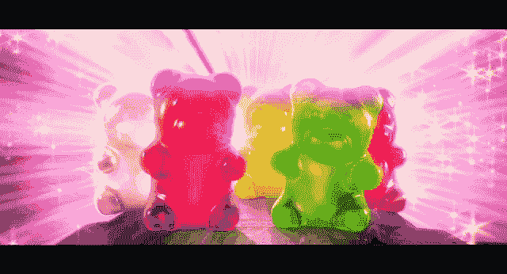

# 什么是指纹识别

指纹识别是当今最流行和最有效的生物识别形式。它无处不在，在我们的手机中最为常见。

简而言之，指纹识别的工作原理是扫描仪获取你的指纹图像，**将它与存储的图像进行比较，如果图像匹配，你就可以访问你的命令，但如果不匹配，你就被拒绝访问。**

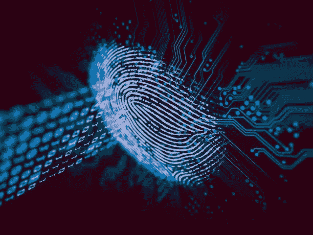

这是一个很好的生物识别工具，因为每个人都有一个**独特的**指纹，并且没有指纹会随着年龄的增长而改变，除非是由非自然原因造成的。即使是同卵双胞胎也没有相同的指纹，许多电话公司倾向于简单的指纹识别。

然而，指纹识别也有一些缺点，如由于手指受伤或灰尘或汗水等其他物质覆盖你的指纹，你的指纹变得无法识别。当用户自己的指纹被拒绝时，这被称为**假阴性**。

一个**假阳性**是当一个无效的指纹被接受时，这可能是危险的，因为你的手机可能被其他人访问。然而，这是罕见的，因为指纹技术对未知指纹非常可靠，所以大多数罪犯通过创建用户指纹的**副本**来绕过指纹传感器。

我们将成为那个罪犯，并寻找所有可能的方法复制一个人的指纹来解锁他们的手机，但首先，我们必须了解指纹的结构。

# 指纹的草图

指纹是由**摩擦脊**组成的独特复杂图案，摩擦脊是你的指纹和拇指凸起的部分。从我们的手掌、脚趾和脚，我们身体上到处都有摩擦纹，但我们大多通过指纹来识别它们。

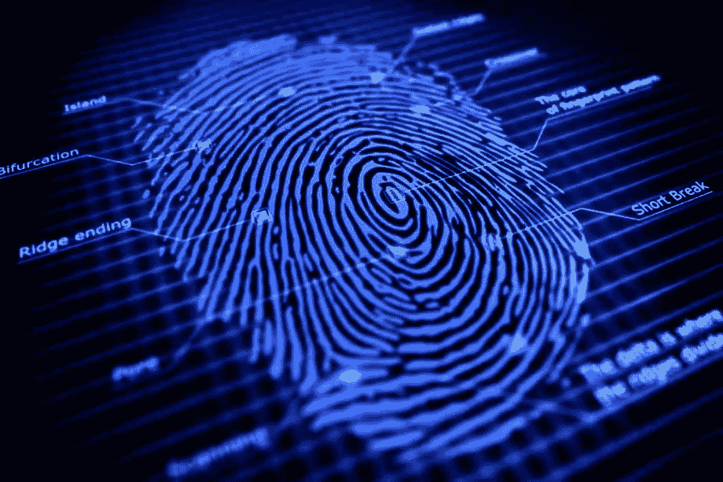

摩擦脊主要分为三种不同的模式，即环，螺纹和拱形。

*   **环形** **印痕**是弯曲成环形的脊。这些指纹被分为指向拇指的径向环和指向小指的尺骨环。它们是最常见的印刷品，占人口的 60%。
*   **涡纹**是脊纹，形成一个像漩涡一样的圆形图案。有 4 种不同类型的螺纹印痕，但所有这些印痕占图案类型的 35%。
*   **拱纹**是创造出波浪状图案的脊纹。这两种类型的拱门是平原和帐篷拱门，其中帐篷有一个比平原更陡峭的波浪。他们是迄今为止最罕见的模式，因为他们只占人口的 5%。

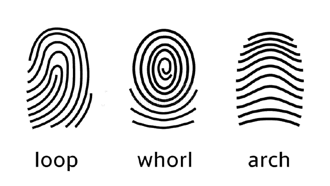

3 种主要的摩擦脊模式

一旦被归类为上述指纹之一，法医科学家就可以通过细节对指纹进行分类。

细节是摩擦脊线**结束或分裂**的点，它们是指纹独一无二的主要部分，这使其成为与其他指纹匹配的绝佳图案。细节有很多种类型，这里就介绍几种。

*   **脊岛:**占据两个分叉脊中间空间的一条稍小的脊线。
*   **山脊结束/终止:**山脊中的一个死胡同。
*   **脊点:**极小的脊。
*   **脊分叉:**一个脊分裂成两个或两个以上脊的点。
*   **山脊围地/湖泊:**当一个山脊一分为二，不久又合二为一。

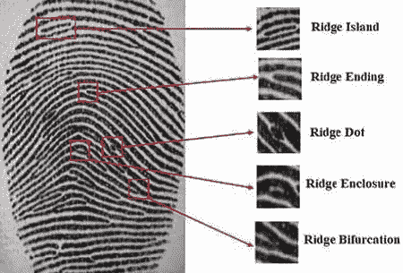

一些不同类型的细节

# 三种类型的印刷品

除了获取原始用户的手指，还有其他获取指纹的方法。其中一项是寻找在物体上留下的印记，你可以收集起来为自己所用。您可以创建三种类型的打印…

*   **塑料印刷品**是 3D 印象，它们是通过将手指压入成型材料(如未干的油漆、蜡和肥皂)中制成的。它们很容易被肉眼看到，不需要任何可见性处理。
*   **专利印痕**是用某人手指上的异物残渣创造出来的。这些物质通常是液体，如血液、油或墨水，它们会在光滑的表面留下可见的印迹。
*   **潜印**由皮肤产生的天然油脂形成。它们可以在各种光滑的表面上被发现，然而，它们需要进一步的处理，因为它们对人眼来说几乎是不可见的。指纹粉或紫外光主要用于发现这几类指纹。

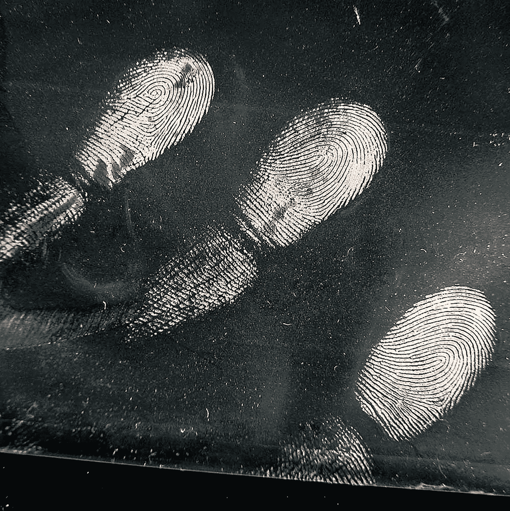

留在窗户上的潜在指纹

# 如何窃取指纹

制作指纹的物理副本很困难，因为你必须获得**原始指纹**作为模板，但很可能有人不会让你根据他们的意愿获取他们的指纹，所以有三种其他方法来窃取别人的指纹。

## 制作模具

使用模具是捕捉塑料印刷最有效和最便宜的方法之一。你可以使用的家庭模型材料包括模型粘土、橡皮泥、牙模，甚至是小熊软糖的**凝胶**。

一旦你在模子里获得了指纹，你就可以用它来存取任何东西。然而，不利的一面是将模具植入受害者的手指中，因为受害者很可能会意识到你在他的手指中推进成型材料。

## 获取扫描仪图像

信不信由你，你可以通过存储生物特征数据的公司，甚至是通过暗网，在网上获得扫描指纹的图像。一旦你获得了你的图像，无论是否非法，它必须通过 3D 打印机转换成 3D 模型，然后你可以用它来访问用户的安全性。

## 拍摄任何玻璃表面上的指纹

如果你注意到你的受害者触摸任何玻璃物体，如酒杯，很可能会留下潜在的指纹。

你可以给它拍一张高清照片，处理图像以提高清晰度，最后通过 3D 打印机创建它的 3D 模型，确保你有正确的尺寸和正确的材料(因为一些带电容屏幕的指纹扫描仪依靠电荷工作)。

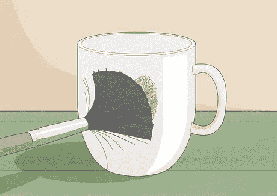

任何玻璃表面都可能留下潜在的印记供你使用

# 不同类型的扫描仪

过去，法医科学家必须用手辨认指纹。现在我们有了革命性的机器，可以在几秒钟内分析指纹，以确定指纹是匹配还是不匹配。三种最常见的扫描仪是光学、电容和超声波传感器。

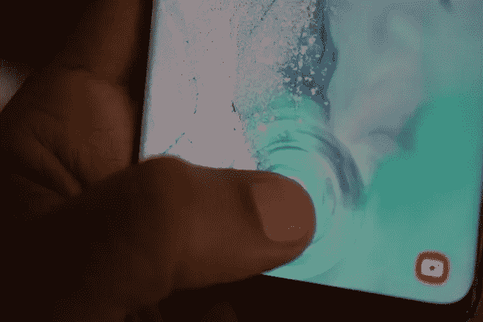

## 光学扫描仪

光学扫描仪通过捕捉你指纹的**光学图像**来工作。然后，它通过区分指纹上的光线水平来分析指纹上的细节，结果是脊最亮，谷最暗，因此使用了额外的光源来照亮指纹。

这是最古老和最常见的指纹采集方法，这种扫描仪的主要缺点是它很容易被欺骗。由于这项技术是基于 2D 图像，模具甚至高清图像都可以骗过这台扫描仪。

## 电容扫描仪

电容扫描仪使用一系列**微型导电板**来收集你的指纹。这些板非常小，当你的指纹脊接触到这些板时，它会创建一个完整的电路，因为你的皮肤可以导电，导致这些板中的**电压降**。

只有你的指纹脊与这些板接触，而不是谷，因为在你的皮肤和板之间有一个微小的空气间隙，这就映射出了你的指纹。电容式扫描仪很难欺骗，因为 2D 图像和一些模具无法工作，这就是为什么它们可以在手机上**找到。**

## 超声波扫描仪

超声波传感器通过使用类似于球棒的回声定位来工作。它使用超声波发射器发送信号，使用超声波接收器接收信号。当它向手指发送超声波脉冲时，一些脉冲在波谷中被吸收，但其他脉冲**由于指纹脊和细节而反弹回来**。

这将创建一个复杂的指纹 3D 模型。它目前正在开发中，将被集成到手机中，它是电容传感器的更安全的替代品。[高通](https://www.androidauthority.com/qualcomm-gen-2-ultrasonic-fingerprint-reader-sensor-1191808/)是一家致力于在手机中集成更好的超声波指纹技术的公司。

# 分析我们的对手

iPhone 8 采用 A11 六核仿生芯片，高达 5.45 英寸，重 5.22 盎司，是其革命性指纹扫描仪的强劲对手。

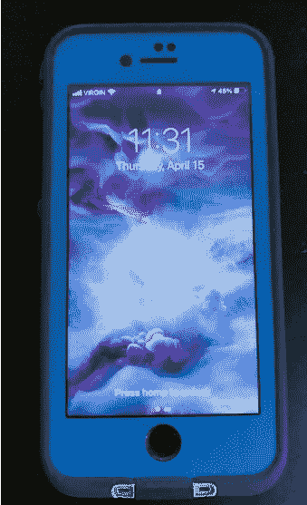

我将在 iPhone 8 上测试我的模具

这款手机利用 home 键上的**电容式**扫描仪来 360 度全方位捕捉你的指纹图像。

苹果的触控 ID 然后将每个指纹分类成拱形、环状和螺旋形，然后它展示细节的细节，并将数据与存储的指纹进行比较。为了补偿更好的用户体验，传感器只查找部分匹配，以便用户更容易打开。

> 由于我没有 3D 打印机，所以我只能在这台 iPhone 的扫描仪上测试自制模具的有效性。

# 测试模具

我为这个实验测试了两种不同类型的模具，分别是胶水模具和橡皮泥模具。

我首先在蜡烛上熔化一根热胶棒，在顶端形成一团胶水。然后我把那团东西放在一张硬纸板上。从那以后，我开始将拇指浸在水中，然后将拇指印在一团胶水中，这样当它变硬时就会留下我的指纹。我重复这个过程 8 次，等待胶水冷却一点。

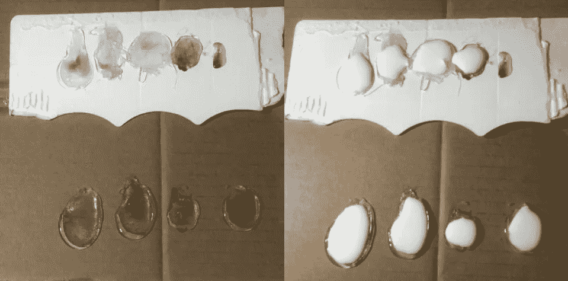

空模具与满模具

之后，我倒了液态的埃尔默胶水，让胶水沉淀一天。在干燥的时候，我也简单地通过把我的拇指印在一个橡皮泥球上来制作橡皮泥模具。

当测试那天到来时，我用我的食指焊接拇指模具，并把它压在我手机的扫描仪上。不幸的是，**没有一个模具工作**。我试了所有的胶水模具和橡皮泥模具，但没有一个能打开我的手机。

# 分析

我们来看看模具是怎么被打败的。首先，由于 iPhone 8 包含一个**电容**传感器，它需要一种导电材料才能工作，而 playdough 和 Elmer 的胶水都不导电。

模具也是平的或稍微向内凹陷，由于扫描仪是 360 度旋转扫描你的指纹，它可能会检测到错误的指纹。

因此，总而言之，似乎所有基本的家用模具都无法对抗现代指纹扫描仪，但它可能会欺骗更原始的扫描仪，如光学传感器或更弱的电容传感器。

## 误差来源

有很多可能改变我实验结果的误差来源。其中一些包括:

*   **胶水中的气泡**可能导致脊部变形。
*   让胶水在**外干燥一天**可能会导致印刷品变得太硬，失去弹性。
*   模具可能不够大，无法覆盖整个扫描仪的表面积。
*   橡皮泥可能**太软**，在接触扫描仪或我的手指时可能很容易被撕破。
*   橡皮泥可能**太薄**了，扫描仪会直接扫描过去。

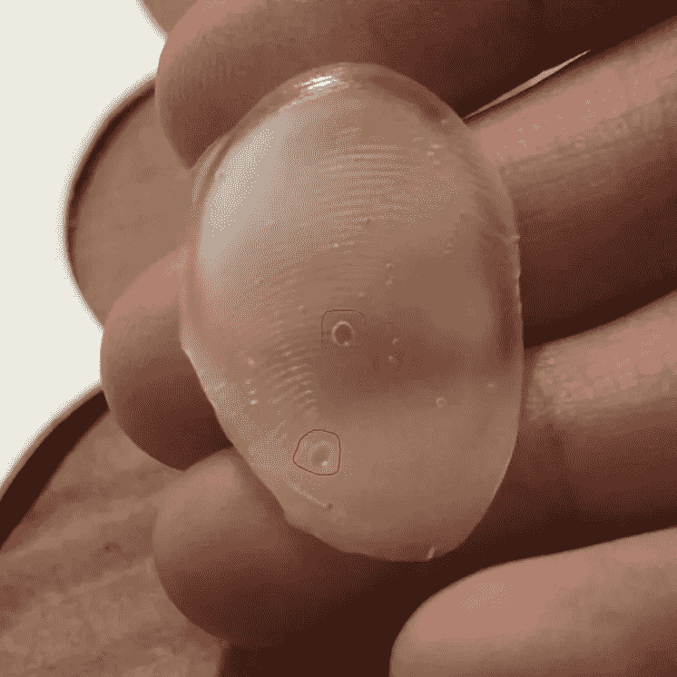

胶水模具中气泡的位置

不幸的是，没有一个模具工作，所有这些误差来源都可能导致指纹错误，但与此同时，令人欣慰的是，指纹识别在过去几年中有了很大的改善，考虑到你可以在一部 [iPhone 5](https://www.cbc.ca/news/technology/apple-iphone-5s-fingerprint-sensor-hacked-1.1864995) 上做到这一点。

随着时间的推移，指纹识别只会变得越来越好，所以请做好准备，迎接生物识别技术在一切领域的兴起！

# TL；速度三角形定位法(dead reckoning)

*   指纹识别的工作原理是将拍摄的指纹图像与存储的图像进行比较。
*   指纹由称为摩擦纹的指纹凸起部分的复杂图案组成，其特征为拱形、环状和螺旋状。细节也可以表现得更深刻。
*   留下的三种类型的印刷品是塑料印刷品(像蜡一样的模具)、专利印刷品(血、墨水)和潜在印刷品(天然油)。
*   窃取指纹可以通过制作模具(我复制的项目)、获取扫描仪图像或在玻璃上拍摄指纹来实现。我的胶水和橡皮泥模具无法打开 iPhone 8 的触控 ID。
*   三种类型的指纹扫描仪是光学、电容和超声波，所有这些都以不同的方式进行验证。

> 如果你想看更多关于生物、技术和其他事情的文章，你可以订阅我的[**中的**](https://cuyleryu.medium.com/) 来查看我的其余文章。也可以查看我的 [**Linkedin**](https://www.linkedin.com/in/cuyler-yu-a478461b0/) 订阅我的 [**简讯**](https://www.subscribepage.com/n0r4f4) 。感谢阅读！