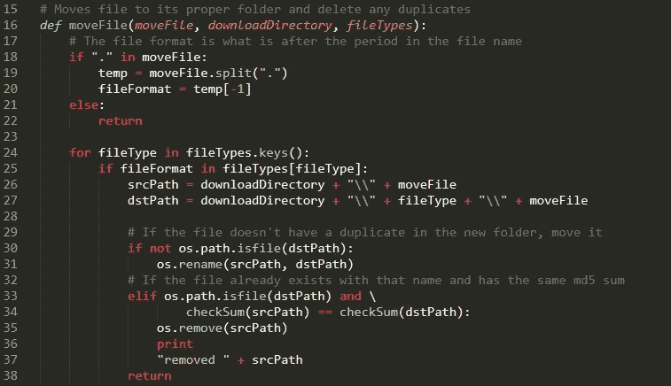
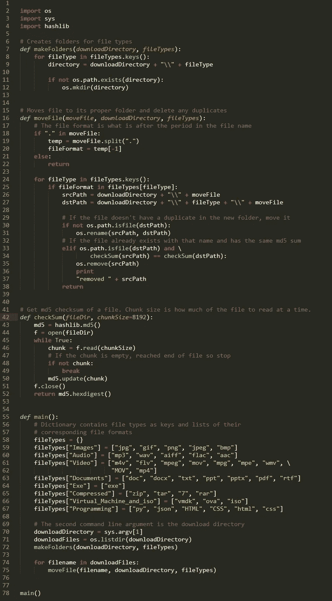

# 学习 Python 脚本的技巧[示例:创建文件夹管理器]

> 原文：<https://medium.com/nerd-for-tech/create-a-folder-organizer-with-python-7f5b8ddc34d3?source=collection_archive---------22----------------------->

[图像来源](https://collegeinfogeek.com/file-folder-organization/)

学习 Python 时，如果没有丰富的 Python 知识，很难想到可以创建和使用的适用项目。如果你想要学习 Python 的技巧，可以看看我的“[学习 Python 的技巧](/nerd-for-tech/tips-for-learning-python-ea9eb25fc03d)”文章。在整篇文章中，我将演示一个简短且相当简单的 Python 脚本。该脚本将组织一个您选择的文件夹，但最常见的是下载文件夹。我将把剧本分成 7 个不同的部分。我还将链接我的包含我的 Python 自动化项目的 GitHub 库，这样您就可以获得一份副本并继续学习！现在是时候开始了！我们走吧！

在这里 给自己复制一份[的代码。如果你想看完整的 Python 脚本，底部有完整脚本的图片。我将分解脚本的每个部分，并解释代码的每个部分。](https://github.com/alltechguyblog/Python_Automation/blob/main/organize.py)

我们将从导入必要的模块来导入库开始。需要的三个模块是:os、sys 和 hashlib。

第一个函数称为“makeFolders ”,包含 3 个参数:moveFile、downloadDirectory 和 fileTypes。下一行代码是一个 for 循环，它将遍历一个字典以及与文件夹中包含的文件扩展名相关联的键。最后一行代码创建 Python 脚本所在的下载目录。

*   您可以更改运行脚本的目录。例如:C:\ Users \[用户名]\Downloads。

下一段代码允许您检查文件目录是否已经创建。如果它不在当前目录中，它将创建文件夹。

下一段代码是一个名为“moveFile”的函数，它有 3 个参数:moveFile、downloadDirectory 和 fileTypes。if 语句循环通过 moveFile 参数，该参数是位于目录中的文件的文件扩展名。(例如:扩展名为. mp4 的文件)接下来，创建一个名为“temp”的变量，根据文件扩展名移动文件。的“.”指示它将使用句点之后的内容，并按文件扩展名对文件进行分类。

这段代码是一个基于 fileFormat 参数的 for 循环。我们将创建一个包含所有文件类型的函数。我们稍后将再次访问这一部分。现在，重要的是知道它将使用 fileTypes.keys()根据文件类型将文件移动到正确的文件夹。它引用文件当前所在的源路径(srcPath ),并将文件移动到文件需要结束的目标路径(dstPath)。

下一段代码将检查 desPath 中文件的副本。如果文件夹不包含副本，它将继续移动文件。下一节通过检查 MD5 校验和来使用 hashlib 模块。MD5 散列是由产生 128 位散列值的算法创建的。然后比较该值以检查重复项。要了解更多关于 md45 散列的信息，[点击这里](https://www.md5hashgenerator.com/)。

下一节使用 hashlib 模块为文件创建一个哈希值。该函数有两个参数:fileDir 和 chunkSize。还创建了一个名为 md5 的变量，并向其传递了一个文件，该文件创建散列并为其分配变量 chunk。哈希文件是通过 md5.hexdigest 方法计算的。if 语句验证文件的大小，如果文件为空，它将关闭。如果语句为真，它将返回哈希值。

main()函数是创建文件类型和文件夹的地方。这部分可以定制成你想要的任何文件夹，并按文件扩展名分类。这些文件夹是通过使用列表和关键字创建的。每个文件夹都是一个单独的列表，并被分配了一组键值对。在这个例子中，我创建了 8 个文件夹:图像、音频、视频、文档、Exe、压缩、Virutal_Machine_and_iso 和编程。在每个文件夹中，都有对应于文件扩展名的键值对。

最后一节从 downloadDirectory 被设置为等于 sys.argv[1]开始。 [sys.argv](https://www.pythonforbeginners.com/argv/more-fun-with-sys-argv) 是传递给 Python 程序的命令行参数列表。downloadFiles 设置为等于 os.listdir()方法，该方法返回一个列表，其中包含由路径给出的目录中的条目名称。在此示例中，参数设置为 downloadDirectory 中的列表。makeFolders 函数接受在 downloadDirectory 和 fileTypes 中创建文件夹所需的两个参数。for 循环遍历下载的文件，并根据 3 个参数将文件移动到必要的文件夹中。调用 main()来运行脚本。运行您的脚本，看看你的文件夹组织！

我希望这个例子能够帮助你学习。Python 是一门很好的学习语言。继续努力吧！如果您没有跟随代码的副本，这里有一个完整的 Python 脚本。

我写过另一篇关于 Python 脚本的文章，有一个例子。如果您尚未查看，请单击下面的链接。谢谢你的支持，祝你编程愉快！

 [## Python 脚本

### 坦纳·琼斯@全技术男

medium.com](/nerd-for-tech/python-scripting-85ed0d1cd19a) 

查看我的资源库，给自己弄一份代码副本，并查看我下面的其他自动化项目。谢谢大家的支持！留下你的评论和你的 Python 脚本想法吧！

 [## alltechguyblog/Python _ Automation

### 创建 Python 脚本来简化日常流程。-alltechguyblog/Python _ Automation

github.com](https://github.com/alltechguyblog/Python_Automation) 

干杯！