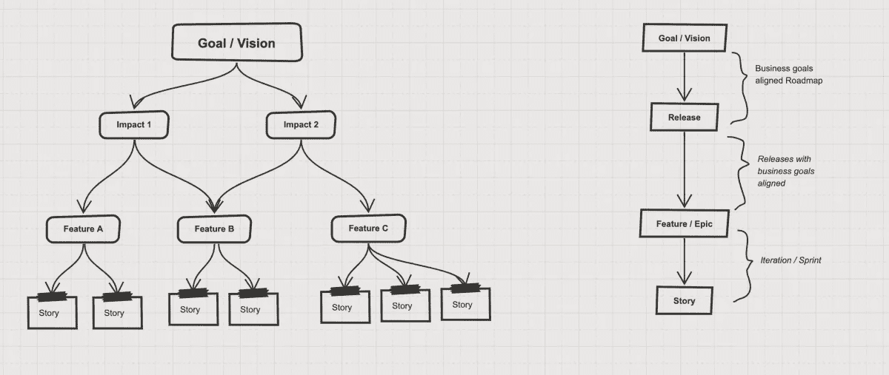
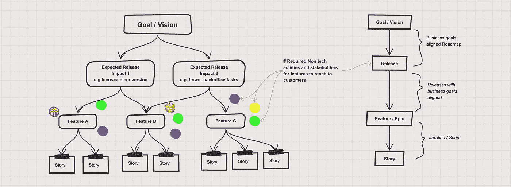

# 创造一个有回报的积压

> 原文：<https://medium.com/nerd-for-tech/creating-a-backlog-that-pays-off-dc0019e7ce00?source=collection_archive---------15----------------------->

积压的工作和路线图总是技术城的热门话题。最近，这种情况有所改变。凭借#Covid，它在大多数组织中都获得了一席之地，并且已经超越了技术领域。首席运营官和首席执行官对数字化有着相当大的关注，因为组织追求为客户和员工提供数字化能力。

这款数码驱动有好有坏。我说它是好的，因为伴随注意力而来的是实现数字承诺所需的关注和必要性。另一方面，现在我们和那些日常工作与数字无关的人谈得更多了。这是一项艰巨的任务。

传统上，技术团队基于称为 brd 或规范文档的文档中叙述的要求来创建软件。最近随着向敏捷的转移，它转移到了用户故事。敏捷是一个受欢迎的变化，它带来了更多的用户视角，并使软件对话变得更加人性化。然而，斗争是可见的。

几次这种斗争导致误解，混乱和延误。更多的时候，人们会说，“嘿，我们以为这是 XXXX 的方式”，“啊，我们以为这个项目会增加我们的收入”。而技术团队却像*一样茫然，我什么时候变成销售团队了？那不是别人的工作吗？”*。在这里，我将讨论我们可以在这种连接上做得更好的一种方法

根据我的经验，人们通常使用两个短语*商业语言*和*技术语言。毫无必要的是，我们在翻译链中有许多译员试图确保从一种语言到另一种语言的正确翻译。在这个过程中，翻译往往失去了目的，交流只是一项任务。随着时间的推移，我看到一些人从来没有面临这个问题，他们总是正确地做对企业有利的事情。我认为在那种情况下，关键是要在*和 ***什么*** 之间建立一个清晰的关系。这意味着我们需要制定明确的关系目标和待办事项，即**

*业务目标>技术成果>路线图>功能/故事*

*当我们在任何计划开始时花一些时间来建立这种流程，会有很大的回报。一旦建立了流程，将活动与流程结合起来是至关重要的，它从工作流程开始，即路线图和待办事项。*

**

*将目标转化为故事，并使其与史诗/版本保持一致*

*通常我们从要求开始，这是巨大的和无法实现的。资源有限；我们会按照优先顺序跟进。有时，业务主管有时间，然后给予指导。但更多的时候，让别人去理解和解释愿景，给工作排序。在缺乏这种联系的情况下，计划与愿景执行相一致的机会是有限的。*

*仅仅这种对齐是不够的；无数次，软件已经准备好了，但是通向客户的道路仍然被阻塞，因为法规遵从性正在等待什么或者市场条件已经改变等等。*

**

*协调活动和利益相关者对实现必要的结果大有帮助*

*因此，请考虑营销活动、合规审批、员工培训、品牌推广、管理报告、监管提交、表格打印、客户服务支持等活动。这些决定成败的活动。它们需要以同步的方式发生来实现目标。将它们列出来，并确保它们与路线图保持一致，会带来很大的执行稳定性。*

*这个博客是将路线图与业务目标相结合并推动成功执行愿景的概念性基础。在随后的随笔中，我将介绍我们如何确保我们保持一致，并继续为每个人建立虚幻的价值对话。*