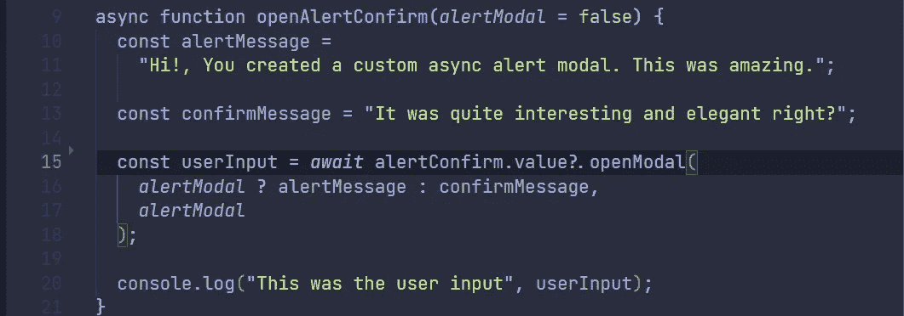
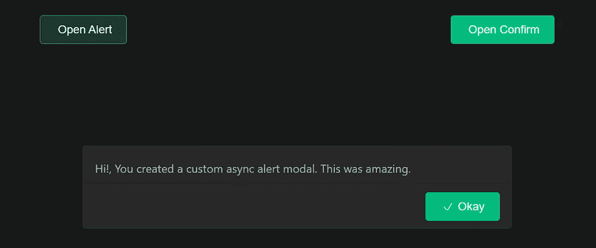
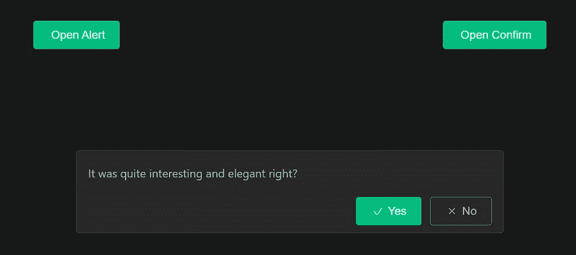

# 创建定制的警报和确认功能模式组件，该组件可以停止功能执行，直到用户在 Vue 3 中做出响应

> 原文：<https://medium.com/nerd-for-tech/creating-a-customized-alert-and-confirm-function-modal-component-which-can-stop-function-execution-bb26914da78a?source=collection_archive---------1----------------------->


[https://unsplash.com/@oulashin](https://unsplash.com/@oulashin)

嗨，这可能是我写过的最长的标题了。但是我想这是必要的，因为没有办法总结这个任务。在现代 web 开发中，我们大量使用模态来提醒用户和确认操作，当然，没有人喜欢使用浏览器 API 在 JavaScript 中提供的提醒和确认功能，浏览器默认模态看起来很可怕。但是关于这些函数，有一点我很感兴趣，那就是它们可以停止脚本执行，直到它们收到用户响应/确认，我想实现类似的东西，我想要一种方法，我可以使用**等待**来自我的 **alertConfirm** 模式的用户响应。这样做的原因可能是，您不想离开当前的功能，并且希望基于该功能内的用户响应来执行某些操作。我遇到的最好的用例是，我在一个 **beforeLeave** route guard 中，如果用户在我的 **alertConfirm** 模式中点击“否”,我不想离开该路线。



上图是如何在视图或任何其他组件中使用该模态组件的示例。该函数的第一个参数是你希望在模态中显示的消息，第二个参数是一个布尔值，如果为真，模态将是一个警告，并且只有一个按钮。



项目的用户界面截图

> 项目链接[AK shat-triv/Custom-Vue-Alert-Confirm-Modal](https://github.com/akshat-triv/Custom-Vue-Alert-Confirm-Modal)

我在我的项目中使用了 Vite 和 TypeScript，但是这不应该影响你，即使你不知道 TypeScript，因为你可以忽略类型。

# 创建警报确认模式组件

我正在使用编写 Vue SFCs 的组合 API 和脚本设置方式。在设置中，我已经导入了我的按钮组件，以及我想要放在按钮中的图标组件，我还从 Vue 导入了 ref 和 computed 函数。

## 我正在使用的引用、变量和计算属性

1.  **showConfirm** :如果值为真，此 ref 用于使模态可见。
2.  **modalType** :只能有两个值“确认”或“预警”。如果值为“确认”，模式将有两个带有文本“是”和“否”的按钮。如果值是“alert ”,那么模式只有一个按钮，文本为“Okay”。
3.  **alertConfirmMessage** :用于存储和显示 modal 内部的消息文本。
4.  **trueBtnText** :返回 true 的按钮的计算属性，值根据 **modalType** ref 变化。
5.  **falseBtnText** :点击返回 false 的按钮上显示的文本的引用。
6.  **resolvePromise** :这是一个 let 变量，我们稍后将使用它来存储解析函数引用。(现在不要太担心这个，以后你会明白这个背后的含义)。这个变量的类型是一个函数，它接受类型为 **Boolean** 或**promise like<Boolean>**的值，并返回 **void** 。

AlertConfirm.vue

我的组件中有两个按钮，一个按钮在单击时返回 true，另一个返回 false。当**模式**为“报警”时，误返回按钮隐藏。

## **函数 openModal**

在这个函数中，我们得到两个参数，第一个是我们希望在模态中显示的消息，第二个是一个布尔值，如果为 true，我们将我们的**模态类型** ref 设置为“alert”。这个函数的开始非常简单，首先，我们将 **showConfirm** ref 设置为 true，我们将**alert confirm message**ref 设置为我们在参数 1 中收到的值，如果参数 2 为 true，我们就执行我两行前所说的操作。现在，在这之后，我们返回一个新的承诺，在回调函数中，我们将 resolve 函数的引用传递给我们之前声明的一个全局变量，称为 resolvePromise。你可能会想，我们什么时候调用这个函数，答案是我们不在这个组件中调用它，我们将这个函数(使用 Vue 为**脚本设置**提供的**define expose**函数)公开给其他组件，这些组件将导入并使用这个组件，从那里我们将调用这个函数并等待用户的响应。我们能够使用 await 的原因是我们正在返回一个**承诺**。

## 函数 handleUserInput

现在，当我们的用户点击我们在模态中给定的按钮时，我们将调用这个函数，并将传递 true 或 false，如果用户点击了 true 按钮，则传递 true，如果用户点击了 false 按钮，则传递 false(当**模态类型**为“alert”时，false 按钮将被隐藏，我保证这是我最后一次提到这个)。在这个函数中，我们只有一个 Boolean 类型的参数，首先，为了让 TypeScript 满意，我们检查 resolvePromise 是否未定义，然后我们调用 **resolvePromise** 传递我们收到的参数值，最后将 showConfirm 设置为 false 以关闭模态。

**handleUserInput** 函数只有在 **showConfirm** ref 为真时才会被调用，并且只有在 **openModal** 函数被调用时才会为真，因此 **resolvePromise** 变量将始终引用我们在 **openModal** 中返回的承诺中的 resolve 函数。

# 在其他组件中使用 AlertConfirm 模式

按照以下步骤使用 AlertConfirm.vue

1.  导入组件。
2.  将组件添加到您的模板中，并定义和添加一个模板引用变量。假设变量名为 alertConfirm。
3.  现在，当你想打开模态时，只需做以下事情

```
// For using it as an Alert
await alertConfirm.value?.openModal("This will be an alert", true);
// For using it as an Confirm
await alertConfirm.value?.openModal("This will be an confirm");
```

以下要点显示了我如何在我的 **App.vue** 中使用 **AlertConfirm.vue** 。我的 **App.vue** 文件有两个按钮，一个用于打开报警模式，一个用于打开确认模式。我相信这个组件没有太多需要解释的东西，就是基本的 JavaScript 和 Vue。

仅此而已。这就对了，你有一个惊人的方式来写你的提醒和确认。

如果你想看完整的项目代码，可以在我的 GitHub 上找到[AK shat-triv/Custom-Vue-Alert-Confirm-Modal(github.com)](https://github.com/akshat-triv/Custom-Vue-Alert-Confirm-Modal)。

如果你有任何问题，请在评论中提出，我会尽快回答。谢谢你的阅读，我会在 6 个月后再来看你的，只是开个玩笑，我现在会努力保持写作的连贯性。再见。