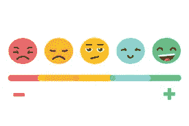

# 逐行创建面部情感识别器

> 原文：<https://medium.com/nerd-for-tech/creating-a-facial-emotion-recognizer-line-by-line-169d8a2c3986?source=collection_archive---------12----------------------->

最近我有了一个想法，用机器学习来识别人们脸上的微表情。在我自己学习如何制作算法的过程中，我想我应该从基础开始，制作一个可以检测普通**宏表达式**的算法。

使用 CK+48 数据集发现[在这里](https://www.kaggle.com/gauravsharma99/ck48-5-emotions)，我能够复制一个模型，达到 66%的最高精度水平。由于数据集的规模较小，这种准确性不是最大的，我计划在未来尝试改进这一点，但就目前而言，创建该模型是一次很好的学习体验。

所以我们开始，如何使用 PyTorch 一行一行地检测面部表情。



鸣谢:Getty Images/iStockphoto

## 导入所需的模块

```
import numpy as np
import torch
from torch import nn
from torch import optim
import torch.nn.functional as F
from torchvision import datasets, transforms, models
```

在这里，我们正在导入制作模型所需的必要模块。**导入 numpy 作为 np** 导入 NumPy 库来创建和操作矩阵。**导入 torch** 导入 pytorch 库，它有几个函数可以用更少的代码创建网络。**从 torch 导入 nn** 从 torch 库中导入 nn 函数，这使得我们可以轻松地为网络创建层。**从 torch 导入 optim** 导入 optim 功能，使我们可以轻松访问减少误差的功能。**导入 torch.nn.functional as F** 导入 torch.nn.functional 函数，可从 torchvision 导入数据集、转换、模型**用命令“F”调用该函数**从 torchvision 模块导入必要的库。**数据集**帮助我们将图像转换成可以操作的数据集，**变换**为我们提供可以对图像进行的不同变换，**模型**让我们从 torchvision 网站访问预先训练好的卷积网络。

**将数据集上传到 google collab**

```
from google.colab import files
uploaded = files.upload()
for fn in uploaded.keys():
   print('User uploaded file "{name}" with length {length}      
   bytes'.format(name=fn, length=len(uploaded[fn])))
```

**从 google.colab 导入文件**导入 google colab 上的文件库。**uploaded = files . upload()**为上传文件的字典创建一个变量。**对于 uploaded.keys()中的 fn:print('长度为{length}字节的用户上传文件" {name} ")。format(name=fn，length=len(uploaded[fn])))** 显示上传文件的名称和大小。运行此代码后，将弹出一个“上传”按钮，允许您访问您的 zip 文件。

## **提取压缩数据文件**

```
from zipfile import ZipFile
file_name = "Emotions.zip"
with ZipFile(file_name, 'r') as zip:
   zip.extractall()
   print("Done")
```

**从 zipfile 导入 ZipFile** 导入模块 ZipFile。 **file_name = "Emotions.zip"** 创建一个名为“file_name”的变量，其值为“emotions . zip”**zip file(file_name，' r ')为 zip:** 找到 file _ name 的路径，并将该文件作为 zip 引用。 **zip.extractall()** 提取 zip 中的所有文件。 **print("Done)** 用于告诉我们提取完成的时间。

## 转换数据

```
test_dir = '/content/Emotions/CK+48/test'
train_dir = '/content/Emotions/CK+48/train'train_transforms = transforms.Compose([transforms.RandomRotation(30),transforms.RandomResizedCrop(100),transforms.RandomHorizontalFlip(),transforms.ToTensor(),transforms.Normalize([0.5,0.5,0.5],[0.5,0.5,0.5])])test_transforms = transforms.Compose([transforms.Resize(255), transforms.CenterCrop(224),transforms.ToTensor()])
```

上面两行将路径分配给测试数据文件夹和训练数据文件夹，以及它们对应的测试和训练目录。第二行创建一个变量，该变量包含将应用于训练集中照片的所有变换。 **RandomRotation(30)** 以 30*的间隔随机旋转每张照片。 **RandomResizedCrop(100)** 将照片裁剪为 100 个单位的边长。 **RandomHorizontalFlip()** 会沿着其横轴随机翻转部分照片。 **ToTensor()** 将照片转换成张量，以便稍后模型可以对其进行计算。 **Normalize([0.5，0.5，0.5]，[0.5，0.5])])** 有助于将每个像素的颜色值转换为-1 到 1 之间的值，因此它们更容易被模型处理。最后一行创建一个变量，该变量包含将应用于测试集中照片的所有转换。 **Resize(255)** 调整所有边长为 255 个单位的照片的大小。 **CenterCrop(224)** 裁剪照片，并使其上下左右居中 16 个像素。

## 创建可计算的数据集

```
train_data = datasets.ImageFolder(train_dir, transform=train_transforms)
trainloader = torch.utils.data.DataLoader(train_data, batch_size=32, shuffle=True)test_data = datasets.ImageFolder(test_dir, transform=test_transforms)
testloader = torch.utils.data.DataLoader(test_data, batch_size=32, shuffle=True)
```

第一行为由 train 文件夹中的图像组成的训练数据创建一个变量，并对它们应用前面提到的转换。第二行将这个新转换的训练数据分成每批 32 个图像的批，并且每批中的照片被送入模型的顺序在每次迭代中被打乱。最后两行与前两行做同样的事情，但是使用的是测试数据。

## 载入我们预先训练的模型

```
model = models.alexnet(pretrained=True)for param in model.parameters():
   param.requires_grad = False
```

第一行是使用开头导入的“模型”库，将预先训练好的卷积网络“alexnet”上传到代码中。 **pretrained=True** 只是表示网络是预先训练好的。这个网络来自 torchvision，一个你可以找到预先训练好的网络的网站。它们已经在数千张照片上进行了训练，非常适合通用图像识别。

最后两行遍历网络中的每个参数(或层)，并使用**param . requires _ grad = False**命令关闭每个参数的反向传播功能。由于这些参数已经过预先训练，我们不希望我们添加的数据影响它们。

## 创建分类器并将其添加到模型中

```
classifier = nn.Sequential(nn.Linear(9216, 1000), nn.ReLU(), nn.Dropout(0.2), nn.Linear(1000, 5), nn.LogSoftmax(dim=1))model.classifier = classifier
```

第一行定义了一个有五层的分类器。 **nn。Linear(9216，1000)** 是一个普通层，它接受 9216 个输入，输出 1000 个值。 **nn。ReLU()** 是一个用于将 1000 个输出值转换为 1 或 0 的函数。 **nn。Dropout(0.2)** 是一个关闭层中节点的函数，每个节点有 20%的机会被关闭。这有助于防止过度拟合，强制模型进行更多的概括。 **nn。Linear(1000，5)** 是另一个正常层，它接受 1000 个输入，并吐出 5 个输出，每个输出对应于我们试图分类的每一类情绪。 **nn。LogSoftmax(dim=1)** 通过 Softmax 函数发送五个输出中的每一个，softmax 函数将输入转换为 0 到 1 之间的某个值，每个值代表该图像出现在每类情绪中的概率。

最后一行只是用我们刚刚创建的分类器替换了 alexnet 模型的原始分类器。

## **创建损失和反向传播功能**

```
criterion = nn.NLLLoss()optimizer = optim.SGD(model.classifier.parameters(), lr=0.003)
```

**判据= nn。NLLLoss()** 将创建一个名为 criterion 的变量，当被命令时，将计算给定参数的负对数似然损失。这有助于通过将每个类别中的预测值与实际图像值进行比较来确定模型预测的错误程度。

**优化器= optim。Adam(model . classifier . parameters()，lr=0.003)** 为反向传播函数创建一个变量，在本例中是 Adam 函数。该函数应用于我们之前创建的分类器变量中的所有参数或层。学习率 **lr=0.003** 被设置为 0.003，这决定了函数改变节点的权重和偏差的幅度。

## 为培训创建变量

```
epochs = 8
steps = 0
running_loss = 0
print_every = 5
```

**时期**是所有数据通过模型向前和向后反馈一次的次数。**步数**是训练模型运行的批次数。这被设置为零，因为还没有批次被前馈。 **running_loss** 是在训练阶段早期建立的损失函数或标准的输出的累加值。 **print_every** 是一个设定值，用于确定在多少个步骤后对模型进行测试运行。

## 创建训练循环

```
for epoch in range(epochs):
   for inputs, labels in trainloader:
      steps += 1
      optimizer.zero_grad() 
      logps = model.forward(inputs) 
      loss = criterion(logps, labels) 
      loss.backward()
      optimizer.step()
      running_loss += loss.item()
```

**对于范围内的时期(epochs):** 按照 epochs 的值运行训练循环，在本例中为 8 次。**对于输入，trainloader 中的标签:**遍历我们的训练数据集 trainloader 中的每个输入和相应的标签。 **steps += 1** 每通过训练循环发送一批，我们的“steps”变量增加 1 点。

由于优化器的自然趋势是累积每个输入的梯度，而不是静止它们， **optimizer.zero_grad()** 用于在反向传播步骤中重置每个节点的梯度值。**logps = model . forward(inputs)**通过我们的模型将来自我们的训练批次的输入向前馈送，并创建一个称为“logps”的输出变量。 **loss = criterion(logps，labels)** 使用我们之前创建的标准函数计算批次中每个图像的损失。 **loss.backward()** 计算损失函数的输出相对于通过分类器发送的原始输入的导数。 **optimizer.step()** 根据 loss.backward()函数给每个节点的导数，更新和改变每个节点的权重和偏差。**running_loss+= loss . item()**将每个输入的损失值添加到我们的“running _ loss”变量中，以便我们可以确定该批的总训练损失。随着时间的推移，这应该会变小。

## 创建测试循环条件和变量

```
if steps % print_every == 0:
   test_loss = 0
   accuracy = 0 
   model.eval()
```

第一行是这样的，当“steps”除以“print_every”的余数为 0 时，执行后续代码。基本上每五步就要进行一次测试。

**test_loss = 0** 与 running_loss 相同，但专门针对测试数据。**精度= 0** 只是为模型的精度创建一个变量，从 0 开始。 **model.eval()** 将模型置于评估模式。

## 创建测试循环

*注意:下面的代码属于上面的 if 语句。*

```
with torch.no_grad():
   for inputs, labels in testloader:
      logps = model.forward(inputs)
      batch_loss = criterion(logps, labels)
      test_loss += batch_loss.item()
```

**torch.no_grad()** 停止测试数据的反向传播。这一点很重要，因为我们在这里不是试图训练模型，而是测试模型在当前状态下的准确性。**对于输入，testloader 中的标签:**遍历 testloader(我们的测试数据集)中的输入和相应的标签。**logps = model . forward(inputs)**通过当前模型向前馈送测试数据输入。**batch _ loss = criteria(logps，labels)** 计算测试批次的损失。**test_loss+= batch _ loss . item()**将批处理中每个输入的损失添加到我们的“test _ loss”变量中。

## 检查我们模型的准确性

```
ps = torch.exp(logps)
top_p, top_class = ps.topk(1, dim=1)
equals = top_class == labels.view(*top_class.shape)
accuracy += torch.mean(equals.type(torch.FloatTensor)).item()
```

**ps = torch.exp(logps)** 计算图像在五个情感类别中的概率。 **top_p，top_class = ps.topk(1，dim=1)** 根据前面的行，将变量“top_class”赋给概率最高的类。**equals = top _ class = = labels . view(* top _ class . shape)**检查概率最高的类别是否等于图像实际所属的类别。**准确度+=火炬.平均值(等于.类型(火炬。FloatTensor)。item()** 将“equals”变量转换为浮点张量(因为之前它是一个字节张量)，然后对所有预测取正确预测的平均值，并将该值添加到我们的准确度中。

## 打印结果并将模型设置回训练模式

```
print(f"Epoch {epoch+1}/{epochs}.. "
      f"Train loss: {running_loss/print_every:.3f}.. "
      f"Test loss: {test_loss/len(testloader):.3f}.. "
      f"Test accuracy: {accuracy/len(testloader):.3f}")running_loss = 0
model.train()
```

第一个语句仅使用模型中的变量来打印当前时期、该时期的列车损失、该时期的测试损失以及最重要的测试准确度。 **running_loss = 0** 将 running_loss 设置回 0，以便模型可以在下一批上训练。 **model.train()** 使模型退出评估模式，并返回测试模式。

## 你完了！

你有它！我们刚刚逐行创建了一个面部情绪识别模型。你应该能得到 60%以上的准确率。

如果你想在 GitHub 上查看代码，点击[这里](https://gist.github.com/Strady123/949f3d3ac8257c1e8e168a08460d1b54#file-emotion-recognition-ipynb)。感谢你的阅读，祝你在发现这些情绪时愉快！:)