# 在 Unity 中创建一个寻的射弹

> 原文：<https://medium.com/nerd-for-tech/creating-a-homing-projectile-in-unity-81787b4316e2?source=collection_archive---------1----------------------->

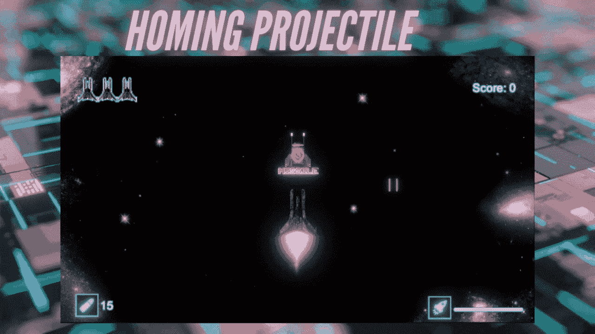

今天的核心编码挑战将会有点重数学和物理，但不用担心！一如既往，我们将一步一步来，并在前进的过程中分解每件事情。

**目标**:制造一个自动瞄准最近敌人的制导炮弹，*瞄准*直到它击中目标。

# 设置全局变量

您将需要两组全局变量:第一组用于目标逻辑，第二组用于运动物理。

> **注意**:这个脚本将会附加到射弹/导弹物体上。

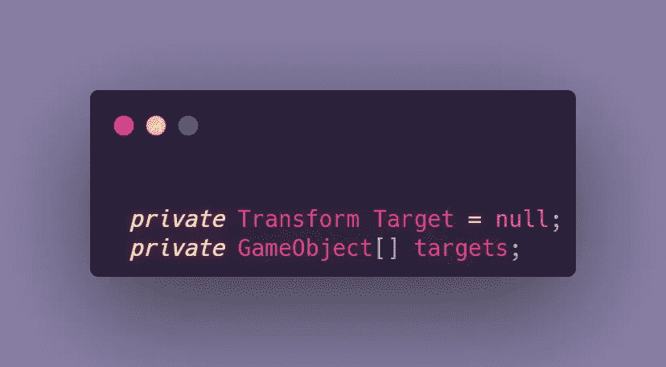

*   目标变量将是 Transform 类型的，因为所有对象都有一个转换，我们将利用它来找到我们想要的特定对象。
*   **目标**将是一个游戏对象数组，因为这将用于捕捉场景中每个有敌人标签的对象，这就是我们如何指定目标(这将在本文后面显示)。

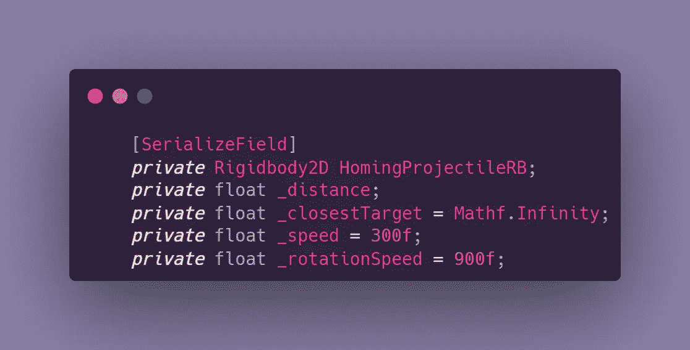

*   **刚体 2D** 是附着在抛射体物体上的刚体组件。刚体使得在 unity 中使用物理成为可能，我们将使用物理来解释抛射体的运动逻辑。这个变量是一个 **SerializeField** ，因为我们需要在检查器中分配抛射体对象的刚体。为此，只需将带有附加刚体的对象拖放到检查器中。

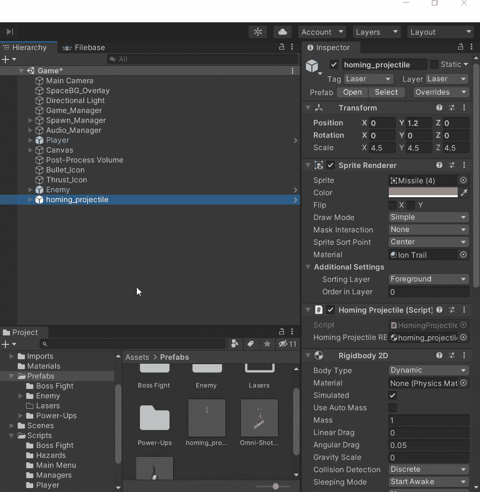

*   **_distance** 这有助于我们确定我们的抛射体需要穿越的*距离*以到达**_ 最近的目标**，该目标是它将撞击的物体。
*   **_closestTarget** 正在使用 Unity 的 Mathf 类，这是一个常用数学函数的集合，其中一些包括三角函数。这里我们使用 **Infinity** 因为我们在寻找可以在我们场景的任何无限点上的物体，当然，我们很快会缩小范围。
*   **_ 速度**:物体直线运动的速度。
*   **_ rotations speed**对象的轴心点向给定目标方向旋转的速度。下图展示了更好的视觉效果。

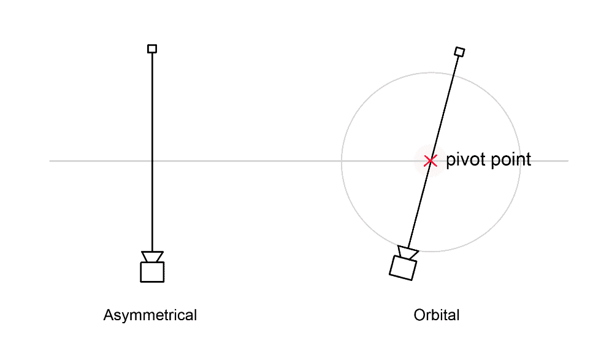

[图像来源](https://80.lv/articles/tutorial-an-orbital-parallax-effect-with-hexels/)

> **注**:先前的速度值有很高的数字，如你所见，这是这些值相互配合并产生足够的力使物体相应移动所必需的。否则，**抛射物体可能会卡在围绕目标的轨道上，而不是真正击中它**。你可以随意摆弄这些价值观，看看什么对你有用，但是**如果你在 akward 运动中遇到问题，很可能就是这些价值观。**

# 寻找最近的目标

现在所有的变量都设置好了，是时候寻找最近的目标了！第一个 void 方法是寻找最近的目标，并指定什么是目标。

1.  使用你的 targets 变量(GameObject 数组)，并将其设置为专门查找带有“敌人”标签的对象。它可以是你的目标对象拥有的任何标签，它都一样工作。

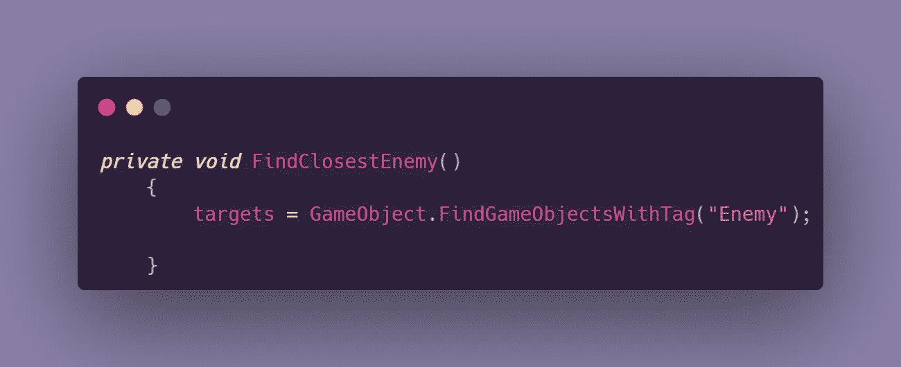

> **注意:**这个方法要求你已经给你的对象分配了标签。通过选择对象并转到顶部，可以在检查器中分配标签。

2.这里我们使用一个 foreach 循环，因为它将为在我们的目标游戏对象数组中找到的每个敌人对象运行*。*

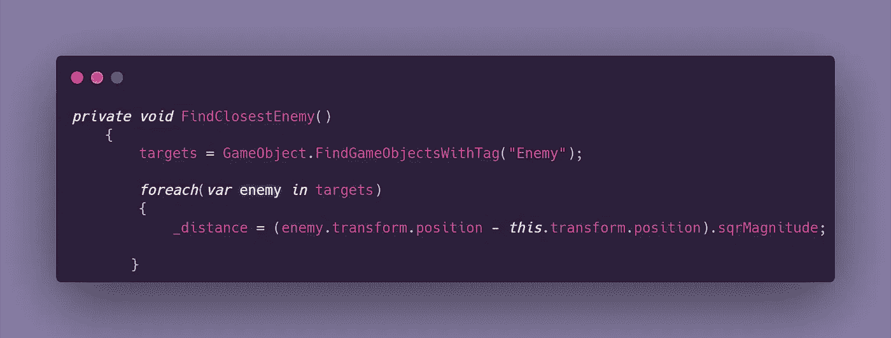

*   **_distance** 变量被设置为敌人的变形位置，从当前射弹的位置中减去。
*   [**sqrMagnitude**](https://docs.unity3d.com/ScriptReference/Mathf.Sqrt.html) 实际上是允许我们使用毕达哥拉斯理论(是的，你实际上在校外使用它！).

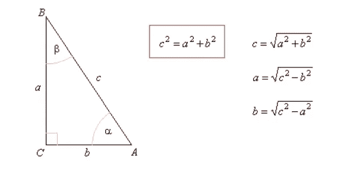

[图像来源](http://www.nabla.hr/BA-PlaneFigureTrianA.htm)

让我进一步分析一下…

所以，想象你要击中的目标在下面三角形的**位置 B** ，你在**位置 C** 。要计算两点之间的距离，需要求解长边，或者说**斜边**。

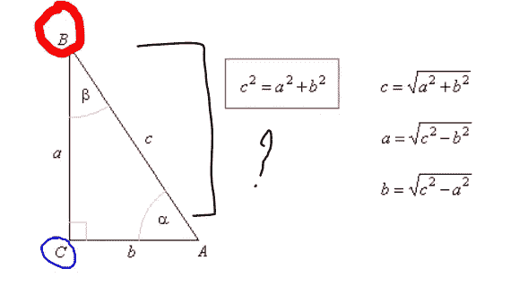

Unity 是一个非常棒的工具，你所要做的就是使用简单的 sqrMagnitude！

2.对于 foreach 的最后一部分，我们将添加一个 if 语句来检查 **_distance** 是否小于 **_closerDistance。如果条件满足，我们将我们的目标，也就是变换变量，分配给敌人的变换变量。**

> 注意:记住，一个对象的变换携带了它所有的位置信息。这就是为什么这行得通。

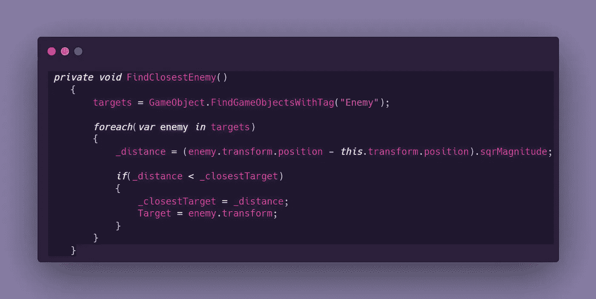

# 创建点火方法

创建点火方法主要是使用 Unity 的引擎物理。

1.  在开始，得到刚体组件。您还可以在这里添加 findClosestEnemy 函数。

> **注意**:当获取一个组件时，最好检查它是否为空，以避免不必要的错误和问题。

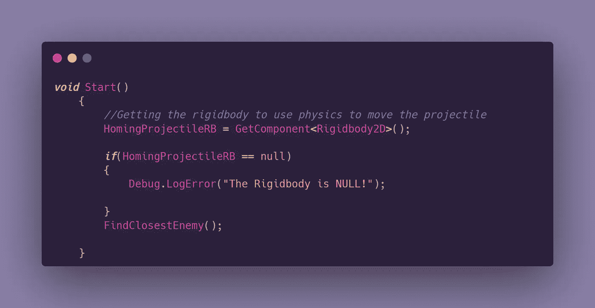

2.创建一个 void 方法来发射炮弹。我们要在这个方法中加入的第一件事是抛射体的速度。

在物理学中，我们认为**速度**是一个**矢量**，它包含了给定时刻物体的**方向**和**速度**。所以，这正是我们将在这里指定的。

3.接下来，我们添加一个 if 语句来检查目标数组是否不为空。

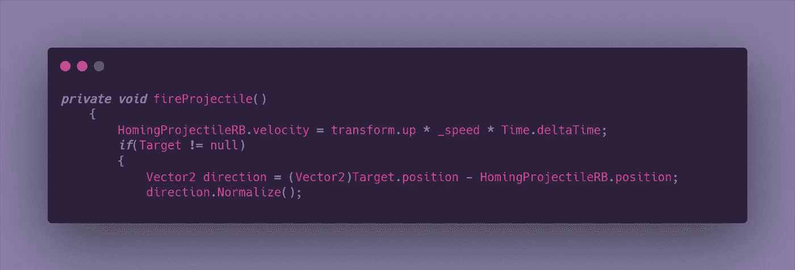

*   如果满足这个条件，我们就有了一个方向向量，它负责减去目标的位置和刚体的位置(我们的抛射体)。这将使物体之间的距离减少，导致它开始接近。
*   **方向向量被归一化**。当我们归一化一个向量时，它本质上意味着我们希望向量**保持相同的方向**——我们希望它保持稳定不变。这也将使向量成为一个单位向量，这意味着它的长度现在是 1.0(这不影响行进的距离)。

4.最后，该方法需要实际设置射弹在行进所需距离时将进行的适当运动。如前所述，如果没有正确设置，抛射体可能会漫无目的地游荡或绕着目标旋转，而不是击中目标。让我们一步步来看这个。

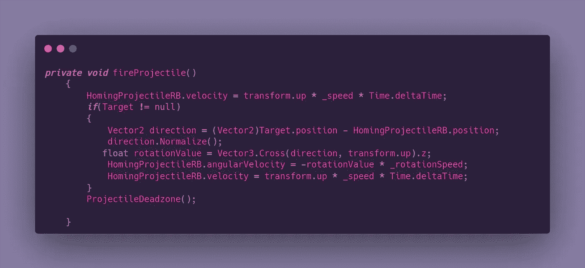

*   **旋转值**使用 Unity 的 [Vector3.Cross。两个向量的叉积产生第三个向量，该向量垂直于两个输入向量](https://docs.unity3d.com/ScriptReference/Vector3.Cross.html)。垂直意味着它的结果将是一条从其他两个向量展开的 90 度线。

图片由 Unity AP 提供

*   HomingProjectileRB 的 [**角速率**](https://docs.unity3d.com/ScriptReference/Rigidbody-angularVelocity.html) ，也被称为抛射体的刚体，是 Unity 的引擎内物理系统的一部分。这是刚体的速度矢量，单位是弧度每秒。我们将使用之前建立的旋转变量来进一步操纵它。
*   为了结束 if 语句，我们最后一次设置**速度**。这需要在 if 语句的外部和内部，因为无论是否有目标，射弹都会在发射时移动。我们需要 if 语句块来修改这种移动，以便在找到目标时，它能够正确地向目标移动。

5.将触发方法添加到 FixedUpdate。每当我们的方法依赖于引擎物理的统一性时，我们就使用固定更新。

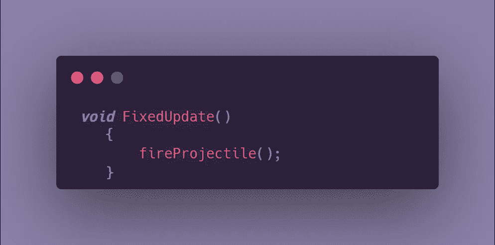

# 可选的越界参数

你在 fire 方法中看到的最后一个方法只是一个死区参数，我设置这个参数是为了让抛射体对象在出界时被销毁。这种情况只发生在没有目标并且射弹被发射的情况下，这意味着它会在场景中无限移动直到被摧毁。如果您愿意，您可以设置自己的参数或使用其他方法来消除该对象。这些是我的参数。

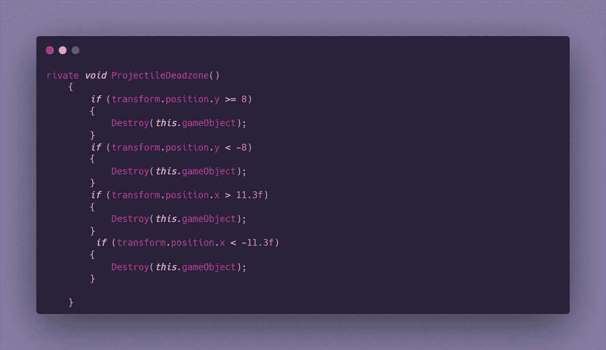

# 结果呢

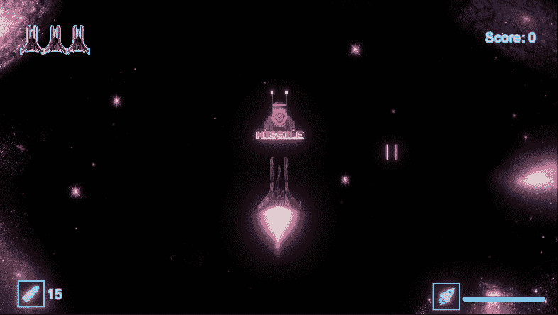

这是来自 GameDevHQ 的一系列编码挑战的一部分！在下一个，也是最后一个挑战中，我们将会看到有多个阶段的 boss 战斗代码！

特别感谢 Hiren Namera 帮助我找到了这次挑战的逻辑！我喜欢分解编码逻辑，并期待了解更多！