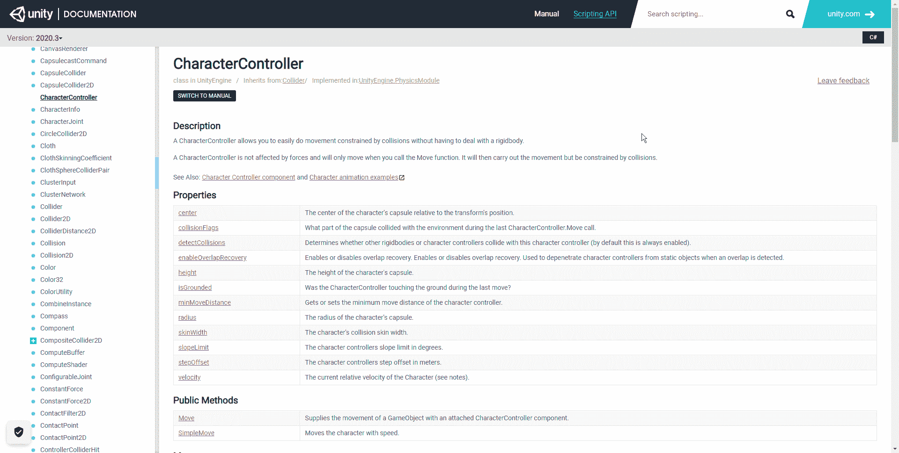
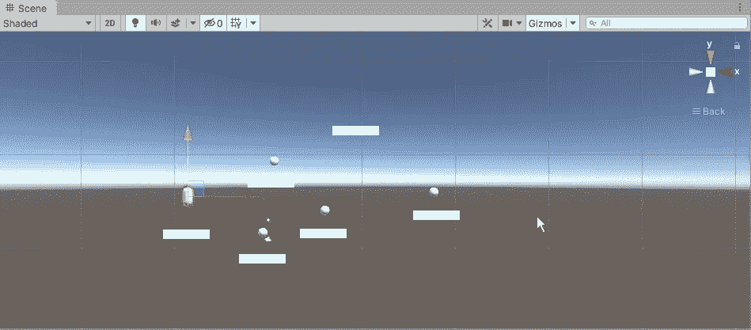
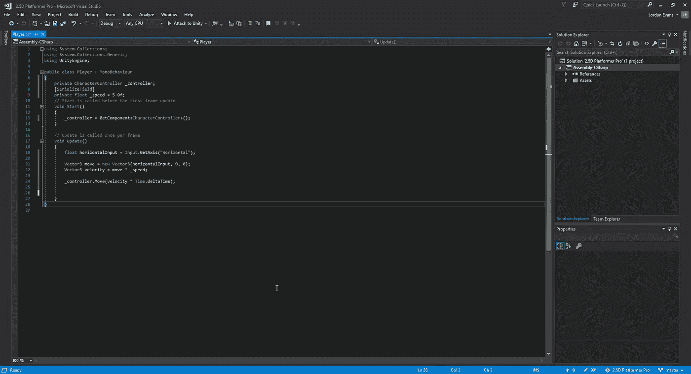
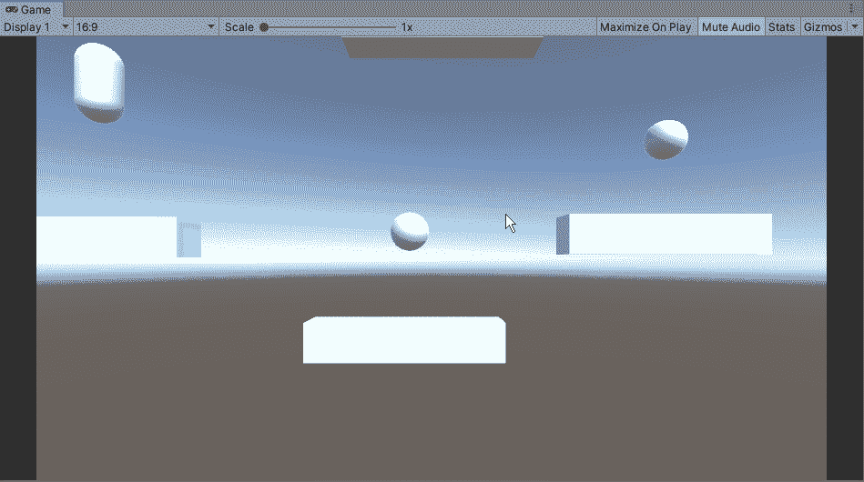
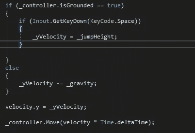
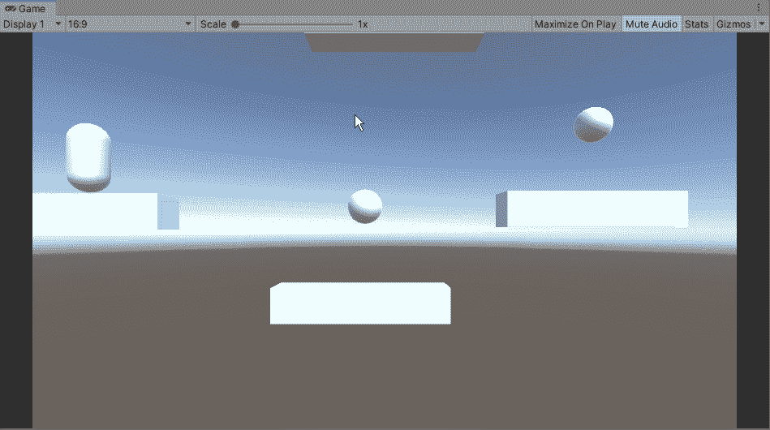

# 在 Unity 中创建基于物理的角色控制器

> 原文：<https://medium.com/nerd-for-tech/creating-a-physics-based-character-controller-in-unity-9eca4642ace?source=collection_archive---------15----------------------->

现在我们开始了一个新项目，让我们开始这个游戏的一些基础知识，并让我们的玩家控制器就位。首先，我们想通过 Unity 文档了解角色控制器组件以及如何使用它编写脚本:

从这一页，我们可以进入移动方法，看看我们如何创建球员的移动。首先，我们只是要担心为我们的球员创造一些水平移动。由于这将是一个平台风格的游戏，我们将不需要创建一个垂直运动系统，因为我们将只引入跳跃，并将我们的重力代码带我们的玩家回到地面。首先，我们将创建一些基本的平台、收藏品和一个供我们摆弄的播放器:

有了这个设置，我们将让我们的球员脚本运行并在我们的移动方法中编码:

我们在这里所做的是创建一个到我们的播放器控制器的链接，这样我们就可以通过代码来调整控制器的值。从那里，我们正在创建一个简单的水平移动方法。对于我们的速度变量，我们简单地将基本速度 1 米/秒乘以我们希望角色移动的速度，在这个例子中是 5。_speed 是序列化的，所以如果我们想在我们的检查器中调整它，我们可以快速地完成，而不必进入我们的代码:

现在，我们的玩家可以从一边移动到另一边，让我们看看如何在适当的位置获得一些重力，以便我们可以与平台互动，并能够接触到我们所有的收藏品:

有了我们的控制器，我们有了一个 isGrounded 方法，我们可以调用它让 Unity 知道我们的玩家对象是否在地面上。从这里，我们将简单地告诉 unity，如果我们被禁足，我们现在不想做任何事情，但如果我们没有被禁足，让我们的球员倒在地上:

现在我们的游戏中有了一些重力，让我们想出跳跃的方法，这样我们就可以到达更高的平台:

为了让我们的跳跃成功，我们需要创建一个缓存来存储我们的高度值。这是因为 Unity 将如何阅读脚本。如果我们不为我们的身高设置缓存，将会发生的是每一帧单位将重置我们的 y 值为 0，这将导致我们的球员有一个小兔子跳一样的运动。然而，使用这种方法，并在 Unity 通过该过程并将其设置为 0 后放置我们的 y 值，我们告诉 Unity 将我们的 y 值设置为我们的缓存值，随着每一帧的通过，它将因我们的重力而降低:

现在，我们有了。我们已经使用我们的玩家控制器在我们新的平台风格的游戏中设置了基本的动作。同样，我们创造了我们自己的重力，所以如果我们想在游戏的不同部分调整值，这将更容易管理。