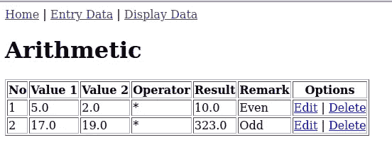
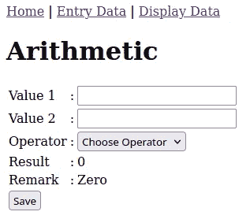
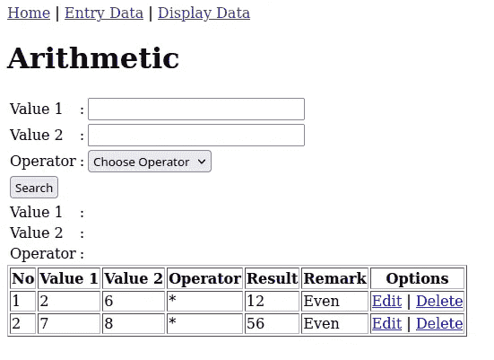

# 使用 Flask 创建数据过滤器

> 原文：<https://medium.com/nerd-for-tech/creating-data-filter-using-flask-3f96c393b8df?source=collection_archive---------0----------------------->

应用程序通常需要存储在数据库或文件中数据。数据来自用户入口、审查、照相机等。数据显示在页面中，因此用户可以看到数据。在本文中，我们创建了一个表格形式的数据显示，还创建了一个由一些属性组成的数据过滤器。

我们使用使用 Flask 制作的算术应用程序的数据显示，这是一个 Python 框架，我也在这篇文章中写了一篇如何开发它的文章([https://medium . com/nerd-for-tech/developing-a-simple-create-read-update-and-delete-crud-application-using-Flask-and-Maria db-f 037 a 5798 ee2](/nerd-for-tech/developing-a-simple-create-read-update-and-delete-crud-application-using-flask-and-mariadb-f037a5798ee2))。您可以在 https://github.com/sofwanbl/flask_mariadb_crud[获得源代码，在使用之前，我建议您先阅读 README.md 文件。应用程序上的数据显示如下:](https://github.com/sofwanbl/flask_mariadb_crud)



图 1:数据显示

上面显示的数据是保存在一个表格中并以表格形式显示的数据。属性来自用户输入，即值 1、值 2 和运算符，而结果和备注来自计算和条件。在上面的显示中，因为选择的运算符是*或乘法，所以值 1 和值 2 相乘，程序通过使用条件(if-else 语句)决定备注是偶数、奇数还是零。输入形式如下:



图 2:条目数据

**一、创建数据过滤器**

我们将在数据显示中添加数据过滤器，用于过滤标准，即值 1、值 2 和运算符。如果用户没有填写所有的标准，程序将显示所有的数据，因为没有应用过滤器。我们也将用户填写的内容写在过滤器输入的下方，所以过滤器设计为:
值 1:————————
值 2:————————
运算符:——————
<<搜索按钮> >

值 1: xxxxx
值 2 : xxxxx
操作员:xxxx

基于如下设计的用户界面:



搜索表单和显示

我们有 3 个筛选标准，它们是值 1、值 2 和运算符。
我们可以根据值 1、值 2 或运算符进行搜索。我们可以根据一个标准、两个标准或全部标准进行搜索，这取决于用户填写的内容。搜索的算法如下:
1。初始化变量。

2.将值 1、值 2 和运算符的值保存到变量中

3.搜索值 1。
检查值 1。
如果有值，在 SQL 中筛选值 1。
如果它没有值，则 SQL 中没有针对值 1 的过滤器。

4.搜索值 2
如果值 1 有值，则检查值 2。
如果值 2 有值，则为值 2 添加过滤器，并使用“与”与过滤器值 1 连接。
如果值 1 没有值，那么检查值 2。如果值 2 有值，则使用“where”(单个过滤器)为值 2 添加过滤器。

5.搜索运算符
如果值 1 或值 2 有值，则检查运算符。
如果操作符有值或已选择，则使用“与”连接过滤值 1 或过滤值 2，为操作符添加过滤器。
如果值 1 和值 2 都没有值，则检查运算符。如果运算符有值，则在开头使用“where”为运算符添加筛选器(单个筛选器)。

6.根据前面的步骤，对值 1、值 2 和运算符应用带有过滤器的 sql，检查所有值是否存在。

实际上，该算法独立于框架，甚至独立于编程语言，所以我们可以将该算法用于任何编程语言，只要它使用 SQL。

Flask 中算法的实现是在 routes.py 文件中的一个函数下实现的，该函数是在用户按下搜索按钮时执行的。代码如下:

```
xvalue_1=0
xvalue_2=0
xoperator=""
wherenya_1=""
wherenya_2=""
wherenya_3=""# Save inputted data to variables
 if request.method==”POST”:
    details=request.form
    xvalue_1=details[“value_1”]
    xvalue_2=details[“value_2”]
    xoperator=details[“operatornya”]

 # Search value 1
 if len(xvalue_1)>0: 
    wherenya_1=” where value_1=”+xvalue_1
 else: 
    wherenya_1=””

 # Search value 2 
 if len(xvalue_1)>0:
   if len(xvalue_2)>0: 
      wherenya_2=” and value_2=”+xvalue_2
 else: 
   if len(xvalue_2)>0: 
        wherenya_2=” where value_2=”+xvalue_2

 # Search operator
 if len(xvalue_1)>0 or len(xvalue_2)>0:
    if len(xoperator)>0: 
       wherenya_3=” and operator=”+ xoperator
 else: 
    if len(xoperator)>0: 
       wherenya_3=” where operator=”+ xoperator 

cur=mysqlnya.connect().cursor() 
cur.execute(“select * from penjumlahan “+ wherenya_1 + wherenya_2 +     wherenya_3)
```

基于我们使用的算法，我们可以用不太复杂的算法制定一些标准来过滤数据，我们检查用户填写了多少个标准和哪些标准，并通过使用“where”语句将其应用到 SQL 中。

我们在应用程序中添加数据搜索后的完整源代码，包括 SQL 文件，其中包含此处使用的表结构，可在此处获得:
[https://github.com/sofwanbl/crud-search-flask](https://github.com/sofwanbl/crud-search-flask)

**结论** 搜索对于一个应用程序来说是一件很重要的事情，尤其是当它显示大量数据以加速检索某些数据的时候。在搜索中，我们需要一些标准来决定我们想要显示的数据。在这个应用程序中，有 3 个搜索标准。用户可以满足一个标准、两个标准、所有标准或没有标准。需要特定的算法来管理基于输入标准的搜索。