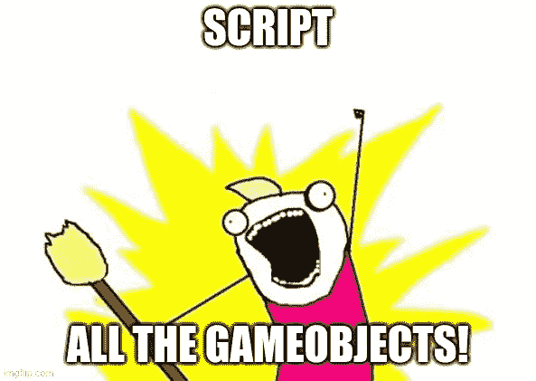
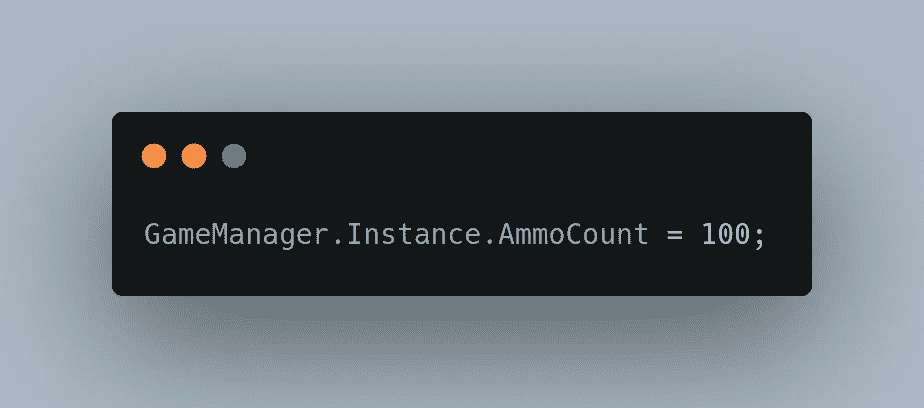
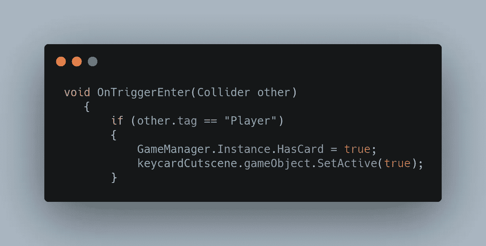
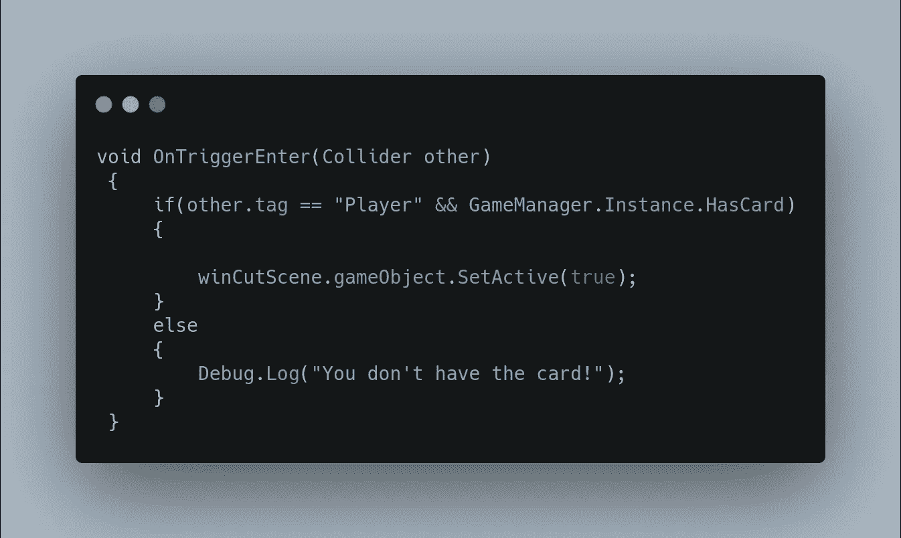
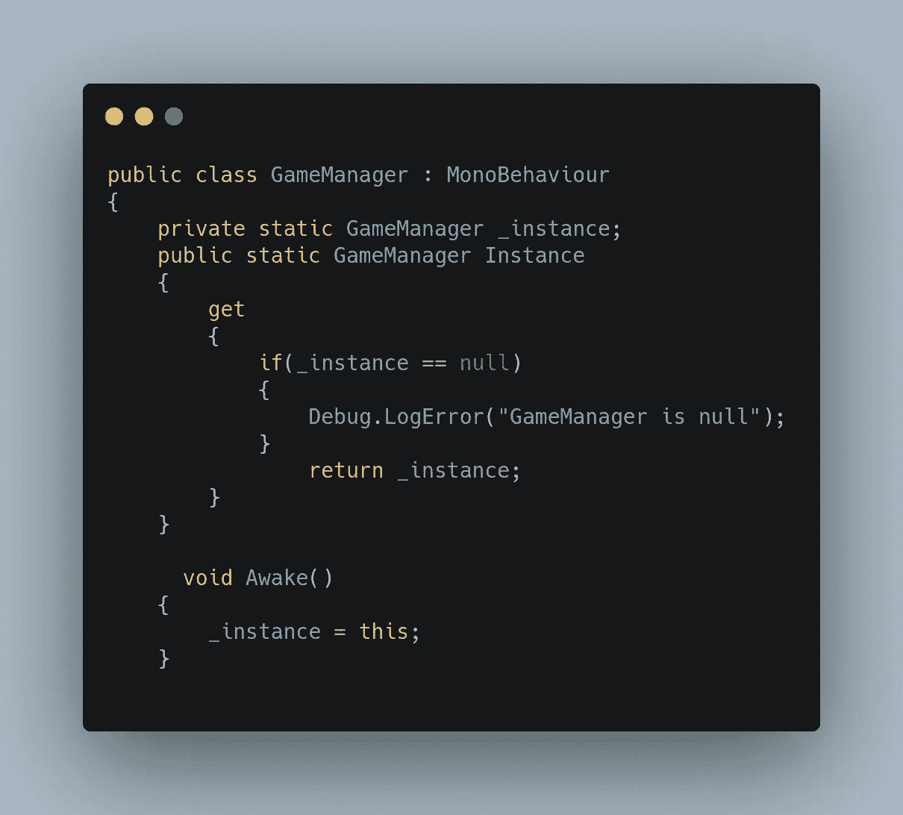

# 在 Unity 中创建管理器类

> 原文：<https://medium.com/nerd-for-tech/creating-manager-classes-in-unity-4f5e9b54ff82?source=collection_archive---------9----------------------->

是的，如果你能让那艘外星飞船产卵，那就太好了！

一般来说，当我们第一次开始在 Unity 中编程时，我们倾向于只在需要的地方编写脚本，而不是组织它们。这是完全有效的！这就是面向对象编程的目的，但是有时你想更有条理一点，创建一个管理器类来帮助…嗯…管理事物！更具体地说，经理帮助控制游戏的状态和流程。你有自己的游戏管理器，它甚至在 unity 中有自己的特殊图标

GameManager 类通常与 singleton 模式配对，这有助于使它们在任何地方都容易使用，明天我将详细介绍这一点，但现在只需知道，如果你想说，修改你的飞船弹药量，你不必通过 GetComponent <>获得玩家，然后通过它访问弹药变量，你可以直接调用 GameManager！

在我的大羊毛的例子中，游戏管理器跟踪像过场动画这样的东西，并且跟踪像安全卡密钥这样的重要游戏元素。当玩家抓住它时，GrabKeyActivation 脚本告诉游戏管理员玩家现在拥有了钥匙。

当玩家到达保险库门口时，他们触摸 WinStateActivation 触发框，它会检查您是否有卡:

GameManager 是一个完美的中间人，负责处理任务，让游戏中的其他对象顺利完成任务。

UI 管理器也是管理器类的完美应用。我记得很多开始游戏编程的例子，我会从不同的地方访问 UI，比如玩家，敌人，甚至是主游戏，如果出了问题，人们很容易忘记事情。GalaxyShooter 教授了 UIManager 的概念，其中有一个集中的脚本，每个人都可以宣布更新 UI。有一些额外的步骤，但它使我的代码更有组织性。

而且有了 UI，还有音频管理器，乐谱管理器等。这里的要点是，你想要创建一个系统，它可以优雅地协同工作，并且易于跟踪和追踪。

制作一个游戏管理器类很容易。只需创建一个名为 GameManager.cs 的脚本，以下是游戏管理器的核心代码:

如果它看起来像一堆未知的命令，不要担心，我明天会全部写下来，但简单地说，这是一个单例模式，通过使它成为一个静态实例，它将有助于使 GameManager 对任何外部类可用。现在，如果你有任何公共变量或函数，你可以用**游戏管理器访问它。任何公共事物！**