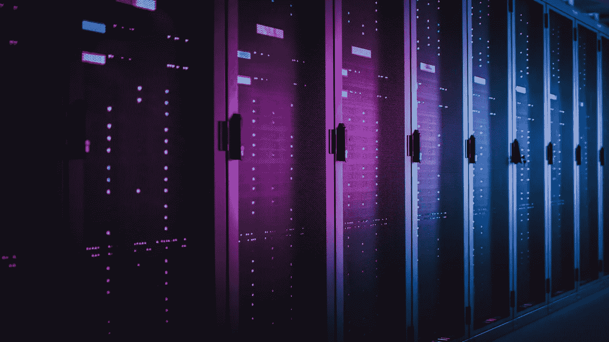

# 关键基础设施必须在几年内向联邦政府报告网络事件、勒索软件付款

> 原文：<https://medium.com/nerd-for-tech/critical-infrastructure-must-report-cyber-incidents-ransomware-payments-to-feds-in-a-few-years-70b2ac12f9dc?source=collection_archive---------3----------------------->

居民拜登上周签署了一项立法，在互联网历史上首次要求美国关键基础设施(CI)的运营商向联邦政府报告“重大”网络事件和任何勒索软件付款。至少在一些利益相关方看来，这是一笔非常大的交易，也是一笔非常好的交易。

网络安全和基础设施安全局(CISA)局长珍·伊斯特利(jen Easterly)——CI 运营商必须向其报告这些事件——[在 Twitter 上发布了](https://twitter.com/CISAJen/status/1502254277301002244)，称她“非常激动”，并称该法案“改变了游戏规则&，是我们国家网络安全向前迈出的关键一步。”

前国务院网络协调员克里斯·佩因特(Chris Painter)也曾在联邦调查局和国家安全委员会工作过，[在推特上写道](https://twitter.com/C_Painter/status/1502307267286294528)他 20 年前在司法部(DoJ)第一次致力于事件报告立法，“当它总是停滞不前时，他感到沮丧了很多年。终于过去了！这是加强网络安全急需的基础要素。”

迈克·弗林。政府事务高级主管和信息技术产业委员会(ITI)的法律顾问在一份声明中表示,“我们欢迎立法者加强网络安全事件报告的努力，这可以在为应对事件和遏制或防止进一步影响的行动提供信息方面发挥重要作用。"

在某种程度上,《2022 年关键基础设施网络事件报告法案》( Cyber Incident Reporting for Critical infra structure Act 2022)将真正改变游戏规则，该法案是长达 2741 页、价值 1.5 万亿美元的综合支出法案的一部分。如上所述，这是联邦法律首次要求私营部门实体报告某些网络攻击和所有勒索软件支付。过去曾有过信息共享举措，但都是自愿的。这个不是。它涵盖 16 个 CI 部门，从食品和农业到信息技术、能源、医疗保健、供水、金融、核能和交通。

被认为重大的网络事件必须在 72 小时内报告给 CISA，任何勒索付款必须在 24 小时内报告。目标是将政府和私营部门的资产结合起来，以快速应对和缓解这些事件，并将消息传播给可能容易受到类似攻击的其他 CI 运营商。

弗林在接受采访时表示，“政府来自一个好地方，”在国会两党很少达成一致的时候，两党的大力支持证明了这一点。

“这是关于帮助实体的事情，只有政府知道，但如果没有这种事件报告，政府不会知道外面发生的一切，”他说。

**几年后**

那么，这真的会让它成为网络安全游戏规则的改变者吗？俗话说，那还有待观察。

首先，因为它可能需要 42 个月——三年半——才能生效。这是分配给 CISA 规则制定过程的时间，尽管 ITI 表示，有人猜测该机构将比法律授予的两年时间更快地发布规则制定建议的通知。之后，在最终规则发布之前，有 18 个月的时间征求意见。尽管如此，即使 CISA 只花了最初通知时间的一半，它也需要几年而不是几个月才能生效，而网络攻击会在几天或几周内演变。

第二，并非所有联邦政府官员都支持这项新法律，因为它要求事故报告直接向 CISA 进行，而不是向联邦调查局。虽然该法案确实要求 CISA 在 24 小时内与其他机构分享这些报告，但司法部和联邦调查局都表示，这还不够快。

司法部副部长丽莎·莫纳科在[给政治](https://www.politico.com/news/2022/03/02/doj-hack-reporting-bill-fbi-less-safe-00013420)的一份声明中说，“该法案草案将我们最好的工具之一，联邦调查局置于一旁，在我们面临前所未有的威胁时，使我们变得不安全。”

联邦调查局局长克里斯多佛·雷最近在 T4 众议院情报委员会作证时说，该机构实时了解这些攻击是至关重要的。“我们有现场代理，他们通常会在一个小时左右的时间内对受到冲击的业务做出响应。这种情况每年会发生数千次，所以我们需要确保信息流受到保护，”他说，并补充说，“这不是取代 CISA——我们希望他们向 CISA 报告，CISA 获得的信息越多越好。”

但这些评论立即遭到了该法案的参议院共同提案人加里·彼得斯(密歇根州民主党人)和罗布·波特曼(俄亥俄州共和党人)的反对，他们说，联邦调查局和司法部已经咨询了几个月，法案的语言已经改变，以解决他们的担忧。

波特曼的发言人凯莉·诺兰[告诉国会山](https://thehill.com/policy/cybersecurity/596736-doj-officials-criticize-cyber-bill),该立法“将使美国明显更加安全，任何相反的建议都是严重误导，对公众不利。司法部和联邦调查局的担忧与美国其他部门不一致，似乎包括他们为之工作的拜登政府。

**袭击还是意外？**

第三，至少有一位专家说，这项立法没有涵盖所有的基地。乔·韦斯，应用控制解决方案公司的董事总经理，CI 控制系统专家，在他的[自由博客](https://www.controlglobal.com/blogs/unfettered/it-is-not-possible-to-meet-senate-cyber-disclosure-requirements-or-cisa-ot-recommendations/)上写道，“迅速报告控制系统网络事件对于准备和应对大范围可能的网络攻击显然是重要的”，但是对控制系统的攻击“并不总是容易识别的”。它们可能会被误认为是事故或故障，可能根本不会被认出来。”

Weiss 写道，控制系统“由 OT(操作技术)网络和控制系统现场设备组成，如过程传感器、致动器、驱动器和分析器。”

但这些现场设备“既没有网络安全能力，也没有网络安全取证能力，因此没有能力满足报告要求的意图，”他写道。

最后，一些专家警告说，整个竞争情报行业过去没有受到高度监管，目前也没有能力满足报告要求。

全国清洁水机构协会的政府事务常务董事 Kristina Surfus 告诉 Bloomberg Law 说，全国有成千上万的供水系统分散运作。“这些系统大多规模小，位于农村，资源不足。她说:“我认为这些人可能是最难对付的。”。

但是，如上所述，这些运营商将有至少两年，也许三年的准备时间。新思科技的政府合同和价值链安全总监 Emile Monette 表示，许多提前通知是“即使是最小的 CI 所有者/运营商也有足够的时间来计入合规成本。这是一项成本，但没有那么繁重。”

**几项改进**

此外，该法案的最终版本收紧了早期版本的一些细节。

大约一个月前，该法案没有包括“重大”网络攻击的定义。最终的措辞将其定义为一个或一组事件，包括泄露敏感信息、破坏业务或运营的攻击，以及“可能对美国的国家安全利益、外交关系或经济，或者对美国人民的公众信心、公民自由或公共健康和安全造成明显损害的事件。”

该定义将在最终规则中变得更加具体，包括它涵盖哪些 CI 操作员，他们成为目标的可能性有多大，以及攻击可能造成的损害有多大。但是，即使是一个一般性的定义也能很好地说明接下来会发生什么。

它还包括对遵守报告要求的组织的责任保护。报告不能用于规范这些实体，不能用作证据或在发现程序中使用，也不能在任何法庭上作为诉因的“唯一依据”。

Monette 曾在法案的早期草案中指出缺乏责任保护，他说现在包括的那些“很好——至少现在有一些。”。当然，行业会要求更多更强的保护，但当你考虑到法律风险时，排除整个诉讼原因是一件非常重要的事情。”

最后，该法案现在包括了一些强制手段。它允许 CISA 发出传票，迫使实体提供所需的信息，并允许司法部发起民事诉讼，以执行传票。拒绝服从传票的组织可能会被判藐视法庭。

弗林说，一些执行机制是必要的，这些并不严厉。“这是非常慎重的，”他说。“有些条款要求 CISA 伸出援手，所以它在某种程度上是有帮助的。唯一受到打击的将是真正糟糕的演员。”