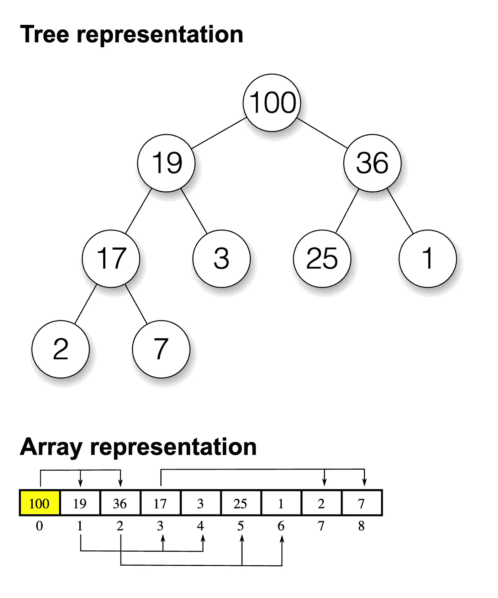
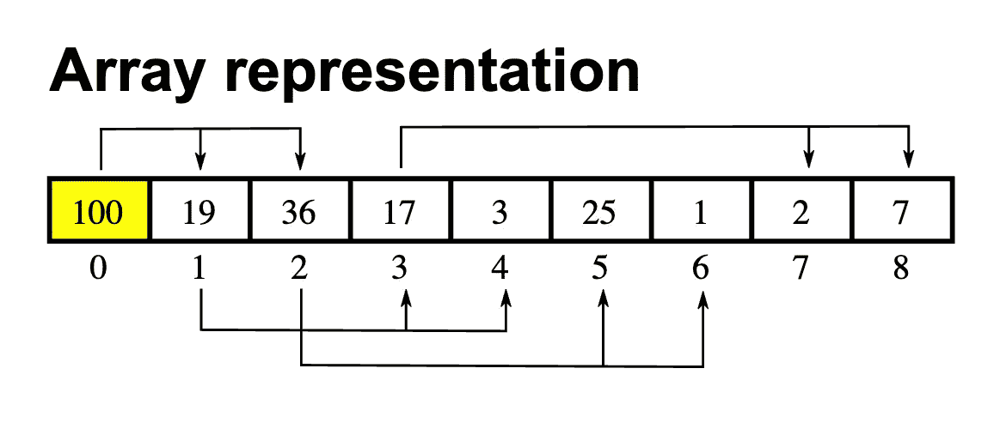
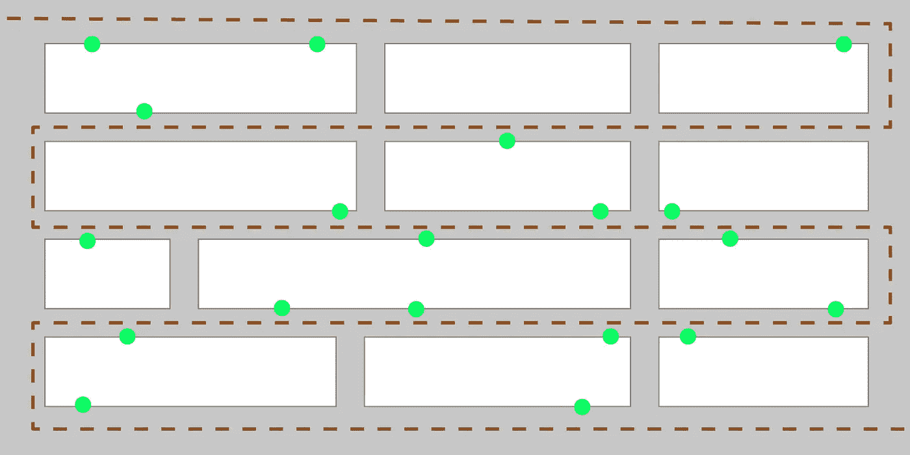
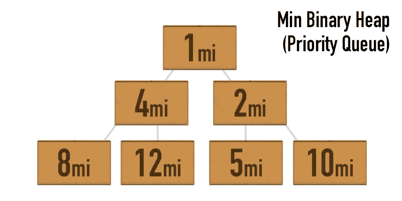
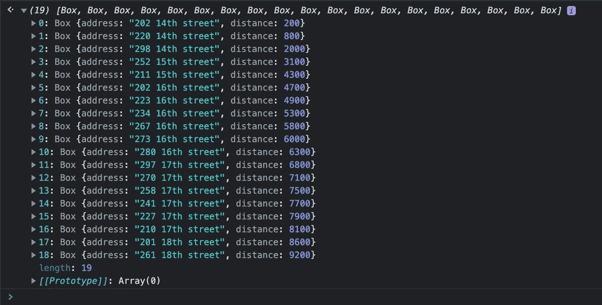
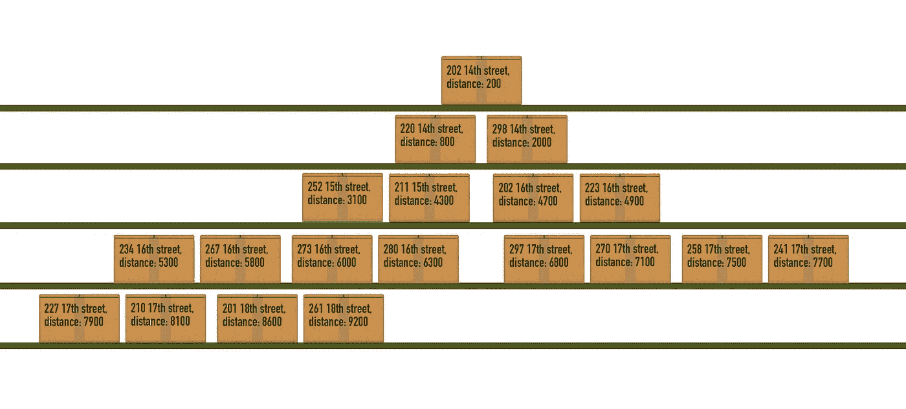
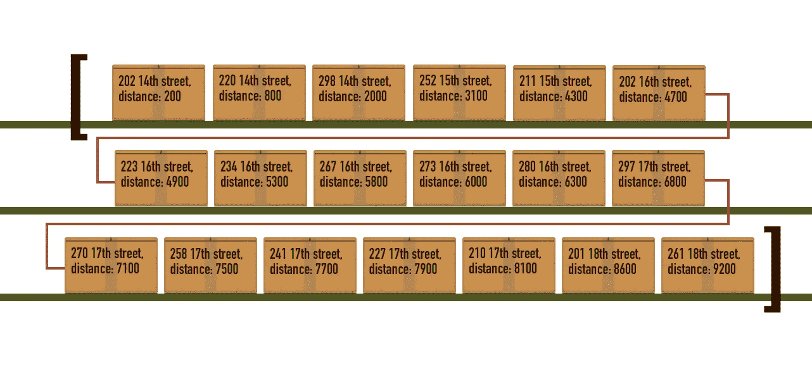
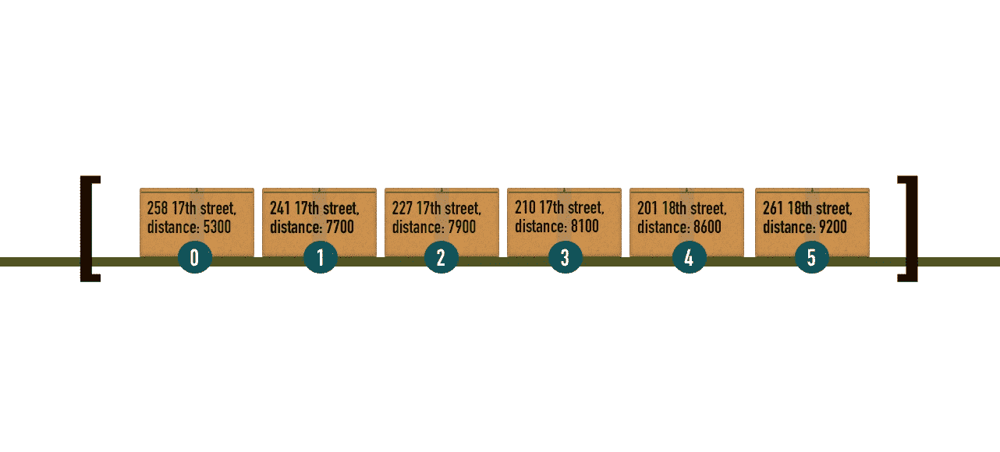

# 排队等候

> 原文：<https://medium.com/nerd-for-tech/cue-the-queue-915d01bae98?source=collection_archive---------11----------------------->

探索二进制堆的数据结构，它对二进制优先级队列的适应性，以及它的实际应用。


利瓦伊·琼斯在 [Unsplash](https://unsplash.com?utm_source=medium&utm_medium=referral) 上的照片

# 什么是堆？

根据[维基百科](https://en.wikipedia.org/wiki/Heap_(data_structure))，在[计算机科学](https://en.wikipedia.org/wiki/Computer_science)中，**堆**是一种专门的基于[树](https://en.wikipedia.org/wiki/Tree_(data_structure))的[数据结构](https://en.wikipedia.org/wiki/Data_structure)本质上是一种几乎完整的[【1】](https://en.wikipedia.org/wiki/Heap_(data_structure)#cite_note-1)树，满足**堆属性**:在一个*最大堆*中，对于任意给定的[节点](https://en.wikipedia.org/wiki/Node_(computer_science)) C，如果 P 是 C 的父节点 那么 P 的*键*(值*)大于或等于 c 的键，在一个*最小堆*中，P 的键小于或等于 c 的键[【2】](https://en.wikipedia.org/wiki/Heap_(data_structure)#cite_note-2)堆“顶”上的节点(没有父节点)称为*根*节点。*

*下面是一个二进制堆的图像，如果这没有任何意义的话:*

**

*来源:[https://upload . wikimedia . org/Wikipedia/commons/c/C4/Max-Heap-new . SVG](https://upload.wikimedia.org/wikipedia/commons/c/c4/Max-Heap-new.svg)*

*换句话说，堆是一个树形结构。我们要特别讨论的是二进制堆。与二叉查找树不同，这些值不会在同级之间排序。在二进制最大堆(根节点上的最大值)中，当您遍历树时，降序的子元素需要具有较小的值。不同之处在于，堆没有与二叉查找树相同的规则。兄弟姐妹之间的值没有小于或大于的顺序。在二进制堆中最重要的是，如果它是一个*最大二进制堆，*父节点的值比子节点的值大，而在一个*最小二进制堆中，*父节点总是比子节点小。只关心树的血统的好处是它可以更紧凑。兄弟节点的值是不相关的。重要的是，在 MaxBinaryHeap 中，父节点的价值更大，而它们的子节点的价值较小。此外，每个父母最多只能有两个孩子，因此二进制这个词。*

## *那么我们如何创建二进制堆呢？*

*二进制堆只是一个数组，但是应用了一些额外的规则。让我们再来看看上图的底部。*

**

*这是一个二进制堆的数组表示，更像实际代码的样子。箭头表示父子关系。从你的普通数组转换到一个**最大二进制堆**的规则如下。*

*   *子节点必须≤父节点。*
*   *对于数组中的任何索引(x)。左孩子存储在 2x + 1。右边的孩子以 2x + 2 存储*
*   *可以通过 Math.floor((x -1) / 2)找到子节点(x)的父节点*

# *二进制堆和优先级队列有什么区别？*

*二进制堆实际上只是实现优先级队列的一种常见方式。我认为一个区别是，首先，它们是按优先级排列的，而不仅仅是纯数值。这导致了另一个不同:创建一个具有优先级值和附加键和值的对象。例如，假设你在急诊室排队。每个元素可能包含一个名称、去急诊室的原因和优先级。*

# *真正的编码和现实生活中的应用。*

*如前所述，优先级队列是一个二进制堆，它是一个应用了一些附加规则的数组。我们将利用面向对象的设计模式来创建一个优先级队列类。此外，我们将利用一个**最小二进制堆**，而不是**最大二进制堆**。这是一回事。只是优先级从最小到最大。*

## *引入快速交付*

*我们现实生活中的应用程序将为**快速递送**创建一个优先级队列，以安排包裹在递送司机的路线上递送。我们将忽略关于尺寸和重量差异的其他细节，并优化我们的队列，以确定包裹处理人员应该如何将包裹放入卡车。*

*所以我们的任务就是做一个优先级队列，按照沿线距离排列优先级。换句话说，当司机在路线上行进时，从路线的起点到每次交付的距离是多远？这是这一天司机的路线，绿点代表送货。*注意路线从左上角开始。**

**

*因此，如果我们要画出包在优先级队列树中的样子，它看起来会像这样。*

**

*按英里排序的最小二进制堆来传递盒子*

*让我们从创建基类开始。盒类和优先级队列。*

*对于盒子类，这就是我们所需要的。距离的键-值对将设置优先级。值得一提的是，PriorityQueue 类需要初始化的只是一个空数组来保存我们的对象。*

## *排队()*

*现在我们需要一个方法来向 PriorityQueue 类添加新的 Box 对象。通常这将被命名为 *enqueue* ，这样我们也将这样做。*

## *气泡泵()*

*也许你注意到了上面第 14 行的函数调用`this.bubbleUp()`,这是我们优先级队列成功的一个基本函数。但是因为它只有几行代码，所以它被抽象成了自己的函数。它所做的是将我们新添加的对象与其父对象进行比较。如果它的优先级低于父元素，它将与父元素交换，并重复这个过程，直到父元素的优先级低于它自己的优先级值。*

## *出列()*

*这样，我们就完成了向 PriorityQueue 类添加 box 对象的方法。现在我们需要一个方法来删除最高优先级的项目`dequeue()`。这可以被认为是我们的包交付后运行的函数。*

*和 enqueue()一样，我们有一个对帮助器方法`bubbleDown()`的调用，我们一会儿会用到它，但是我想让你注意我们从数组中移除值的独特方式。我们将最高优先级的对象设置为一个变量，然后用数组的最后一个元素交换第一个元素的值。这是为什么呢？是的，有一个名为`Array.shift()`的内置方法可以毫不费力地给我们提供对象。好吧，缺点是 shift()不是很有效，我们试图尽可能快地保持我们的运行时。shift()的问题是数组的所有元素都将被重新索引。而使用。pop()和交换值保持了类的精简和快速运行。*

## *泡泡街()*

*现在关于 bubbleDown()。代码相当多，所以请务必阅读 GitHub Gist 中的注释。实际上，代码中发生的事情是，交换的值需要与它的子值进行比较，看它是否应该被交换，如果它比子值大，那么它就在树中的正确位置。*

# *回到快速交货*

*咻，好吧，这是相当多的代码，但好消息是，这就是我们拥有一个功能完整的优先级队列所需的全部代码。*

> *附带说明:确保上述所有方法都包含在 PriorityQueue 类中。我确实把它们从里面去掉了，只是为了熟悉这些方法。*

## *现在我们可以专注于它的应用。*

*这是一个清爽的清晨，包裹已经被分好，放在送货卡车外面，准备放进卡车里。其中一个打包员按下电脑上的按钮**打印打包订单，**正在后台运行上面的代码。另外，关于距离，我们可以说它们是米，因为很容易转换成千米。*

```
*let newPriorityQueue = new PriorityQueue()newPriorityQueue.enqueue('211 15th street', 4300);
newPriorityQueue.enqueue('223 16th street', 4900);
newPriorityQueue.enqueue('252 15th street', 3100);
newPriorityQueue.enqueue('202 16th street', 4700);
newPriorityQueue.enqueue('234 16th street', 5300);
newPriorityQueue.enqueue('202 14th street', 200);
newPriorityQueue.enqueue('298 14th street', 2000);
newPriorityQueue.enqueue('297 17th street', 6800);
newPriorityQueue.enqueue('261 18th street', 9200);
newPriorityQueue.enqueue('267 16th street', 5800);
newPriorityQueue.enqueue('280 16th street', 6300);
newPriorityQueue.enqueue('258 17th street', 7500);
newPriorityQueue.enqueue('273 16th street', 6000);
newPriorityQueue.enqueue('270 17th street', 7100);
newPriorityQueue.enqueue('241 17th street', 7700);
newPriorityQueue.enqueue('220 14th street', 800);
newPriorityQueue.enqueue('201 18th street', 8600);
newPriorityQueue.enqueue('227 17th street', 7900);
newPriorityQueue.enqueue('210 17th street', 8100);*
```

*上面输入的输出是什么。*

**

*由于知道箱子的优先级，现在包装员知道如何包装卡车。项目 0 是最高优先级(在顶部), 18 是最低优先级。*

**

> *从理论上讲，使用树来显示数据是有道理的，但是对于包装一辆卡车来说，使用数组格式更节省空间。*

**

***啊，好多了:D** 包裹现在被分类成优先队列，最高优先级是距离路线起点最短的距离。优先级最低的是数组中的最后一项。使得包裹的递送比将它们随机分布在卡车的后部更容易和更有效。*

## *与现实世界的轻微偏离。*

*我已经展示了二进制优先级队列的实际应用。分拣包裹以便投递。如果你参考上面的图片，你可以想象一个司机会从货架上拿起箱子去送货。很棒吧？如果您还记得上面的这一段，我们需要脱离实际，讨论数组数据类型。*

> *我们将最高优先级的对象设置为一个变量，然后用数组的最后一个元素交换第一个元素的值。这是为什么呢？是的，有一个名为`Array.shift()`的内置方法，它会毫不费力地为我们提供对象。缺点是 shift()不是很有效，我们试图尽可能快地保持我们的运行时间。shift()的问题是数组的所有元素都将被重新索引。而使用。pop()和交换值保持了类的精简和快速运行。*

*一个数组被索引，我们的优先级队列在一个数组中，所有的位置都有一个索引。这里有一个视觉参考。*

**

*如上所述，使用 shift()效率很低，运行时间为 O(n ),因为所有内容都需要重新索引。所以我们需要做的是移除第一个项目，但不要打乱盒子的索引。这是用我们的函数完成的。`dequeue() and bubbleDown()`*

## ***出列的直观例子()***

**

*你可以在上面看到，我们从来没有重新索引数组。我们交换最后一个值的 pop()以外的值，但这是在常数时间 O(1)完成的。enqueue()函数基本上是相同的，但是它将一个对象推到末尾，然后*使其冒泡*，直到它在数组中找到正确的位置。*

*概括地说，我们讨论什么是堆，什么是二进制优先级队列。我向您展示了创建这些类的实际代码。然后我们考虑了现实世界应用的想法。至此，我们关于二进制优先级队列的讨论结束了。*