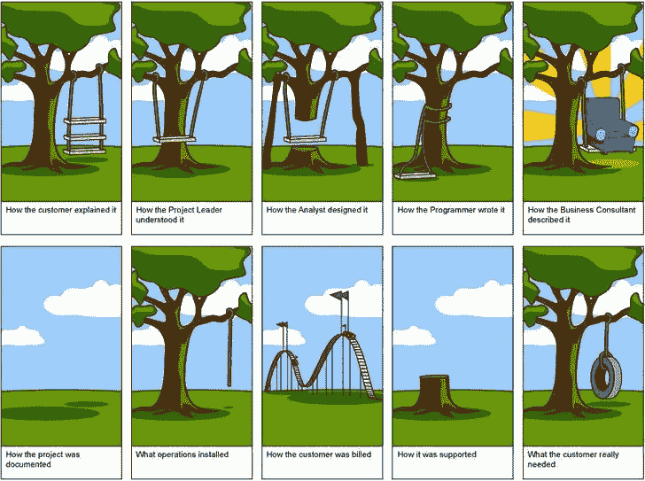
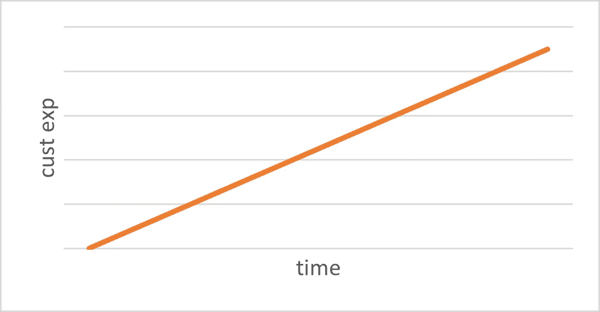
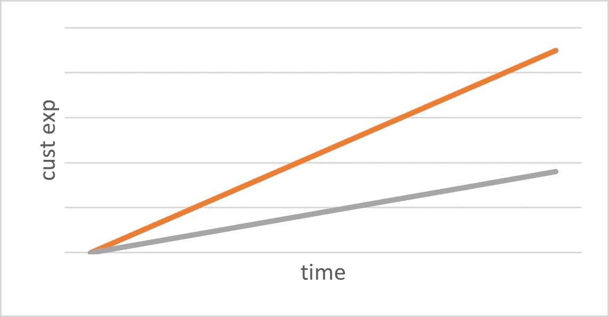
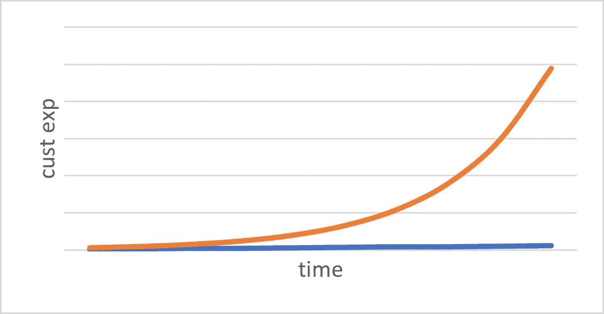
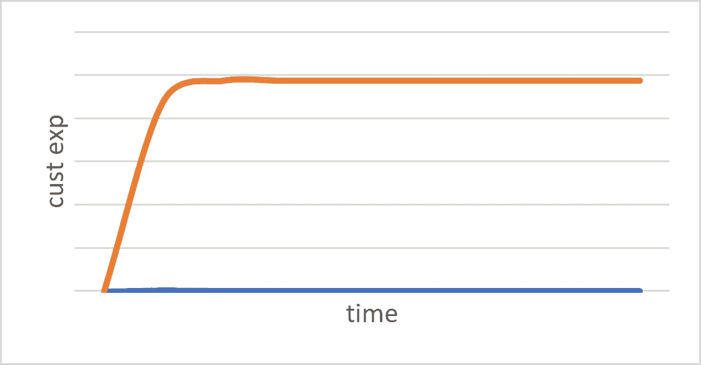
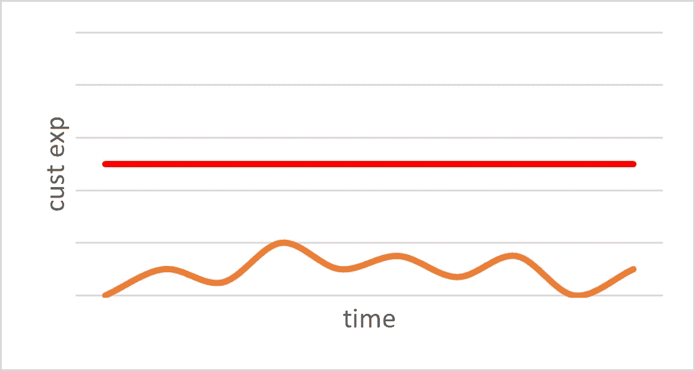
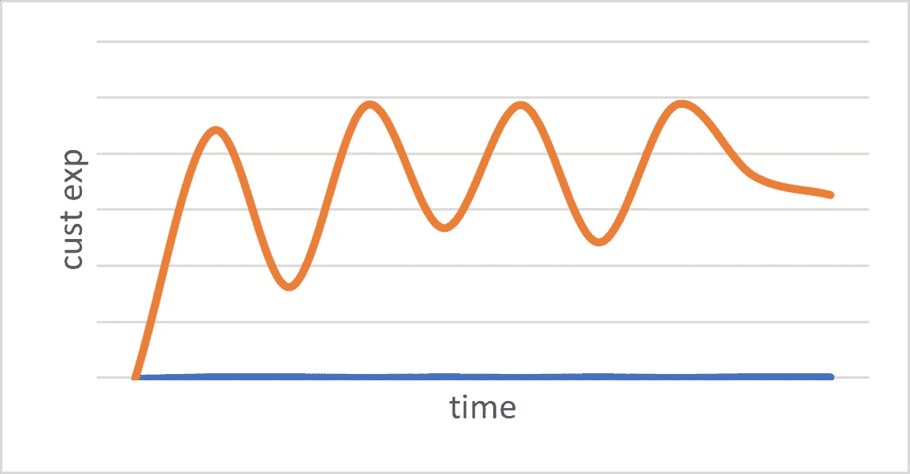
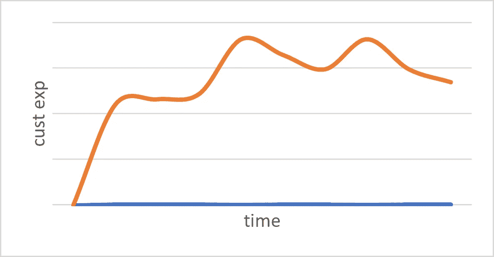
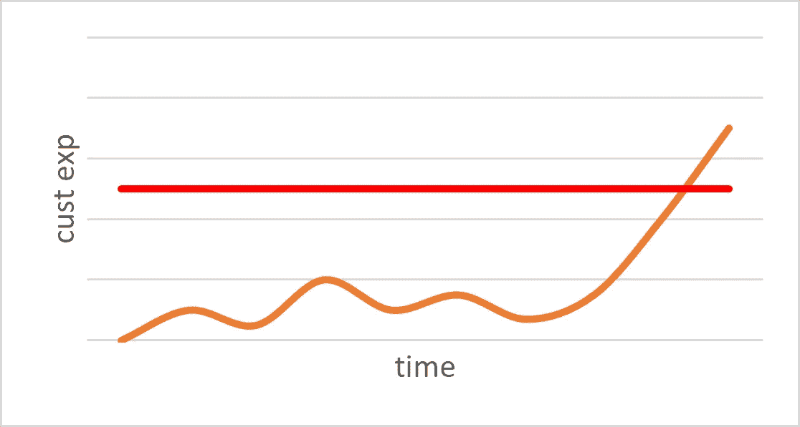

# 解释了客户期望行为

> 原文：<https://medium.com/nerd-for-tech/customer-expectation-behavior-explained-217973b049a3?source=collection_archive---------2----------------------->

世界上的每个项目都有一个客户(内部或外部)。每个项目经理都知道，项目最关键的方面之一(除了按时交付和预算之外)是处理客户的期望。如果做得不好，那么项目可能会被客户贴上失败的标签(注意选择的词:标签),并带来不希望的后果(项目取消、加班、成本过高等)。

然而，尽管它很重要，但很多时候它们没有得到很好的管理，最终会严重损害客户与供应商的关系。

在本文中，我们将讨论一下它是什么以及它是如何工作的，这样我们就可以对如何管理它有一个更清晰的了解。

# 那么什么是客户期望呢？

客户期望基本上是客户对项目结果的设想。它是在他的头脑中制造的，因此对每个顾客来说都是非常主观和固有的。

它甚至在项目开始之前就开始形成，并且它的形状将在项目的整个生命周期中变化。许多因素以不同的方式影响它:客户有多信任，项目经理感觉有多值得信任，客户自己过去的经验、愿望、研究、来自同行、专家的建议、最后期限、他是否为此付费等等。

举个例子吧。想象一下，你突然意识到你必须在周一早上把你的车带到商店去，因为刹车失灵了。你接受 500 美元的报价，汽车将在周三结束时准备好。所以，这就是你的**客户期望**:故障会被修复，成本是 500 美元，需要 3 天。

周三，你正准备去取车，然后你接到电话:“车还要多留一天”。你的反应是什么？你的期望没有实现。而且，基于许多因素(你的背景、你的个性、你对正在发生的事情的了解、你过去的经历等)，也许你的反应是相当随和的(因为那几天你没有使用汽车的计划)。但另一方面，如果你做了呢？。

那么是什么错误呢？让我们假设商店没有有意识地或疏忽地这样做。澄清一下，错误不在于商店需要多一天时间:事情发生了，你无法预测。

这里的错误是商店在截止日期前几分钟才给你打电话。这家商店没有正确处理顾客(你的)期望。如果你向顾客承诺 X，那么他会期待的。对计划的任何改变都必须与客户沟通，越快越好，如果你能提前提供解决方案，那就更好了。

因此，让我们假设商店在星期二之前知道汽车还需要一天时间(由于任何原因:那天员工不足，顾客超载，等等)。那么正确的做法是打电话告诉你发生了什么，这样你的期望就得到管理(你期望在周三之前成功，现在你将在周四之前成功)。也许如果你事先有适当的通知，你可以打电话借你哥哥的车。最后，虽然你并不完全满意，但你至少可以感谢这家商店，它考虑到了你的需求和时间，现在你有更多的时间来调整你的计划(所以你手头有更多的选择)。

在这个例子中，大多数，甚至所有的期望都可以分为三个“类别”:客户将会得到什么结果，他什么时候会得到，以及他要花多少钱才能得到。

你可能已经猜到了，这就是项目著名的**铁三角:范围(做什么和如何做)、时间(什么时候准备好)和成本(要花多少钱)。有时候你可以把时间看做进度，或者把成本看做努力，但最后都是一样的想法。**

与时间和成本相关的期望是有形的，容易理解。它们以绝对值表示，每个人都知道它们是什么。通常情况下，项目经理会在评估中为可能的延迟或成本过高设置缓冲。

另一方面，范围是一个不同的野兽。范围通常是客户(说他)需要什么与团队在可用的时间和成本内可以实现什么的协商。然而，很常见的情况是，客户不会告诉你全部情况(记住，这是**你**的责任，而不是客户的责任)，所以他自己对结果的期望有时会比讨论、协商甚至签署的结果大得多。

关于客户要求的一个非常著名的笑话(我希望有来源证明)

既然我们已经确定了什么是客户期望以及如何对它们进行分类，那么让我们进入文章的核心部分，在这里，我将介绍一个模型，该模型描述了客户期望的行为，通过理解这一点，您可以更有效地处理它们。

# 模型

明显的免责声明:*我的意图不是创造一个任何意义上的精确模型，也不是将它转化为科学理论。这是一个简单的基于观察和经验的模型，它被放在关系、变量等方面，使它随着时间的推移更加持久，因此它可以更容易和更形象地解释。*

作为这个模型的第一个前提，我会说客户的期望**一直在增长**。每当客户开始一个他希望(并期望)成功完成的新项目或任务时，他的期望就会增加。

另一方面，只有当客户放弃或失去对项目的兴趣时，期望才会有下降的趋势(所以我们将在本文中放弃这个场景)。

它为什么生长？我不是行为心理学家或类似的人，但我认为这是天生乐观的问题，实际上可以追溯到一个或两个认知偏差，即确认偏差和乐观偏差。两者都会欺骗你的大脑，让你相信你的计划会变好(这是一种矛盾，因为估计或计划完全是主观的，甚至没有人能预测未来的某一天)。

请注意，这些偏差也可能受到项目经理如何向客户传达进度的影响，尤其是不愉快的事件，如延迟、失败、错误、返工等。透明度是关键。

期望总是在增长

第二个前提，期望值与客户在项目中的利益成正比。

利害关系可能意味着有形的概念:金钱、时间和对它的依赖。或者它也可以意味着更抽象和个人的概念，如声望和荣誉。不管是什么，他们只是依赖于每个客户和他赋予他们的价值。价值越多，期望越高。

两种不同的客户期望

作为第三个前提，我们也可以说，它的曲线或形状会根据客户的个性而有所不同。不过，让我换个说法。个性是一个模糊的概念，它包含了许多东西，所以(我不想这样称呼它)也许焦虑是一个更好的术语(*)如果你找到一个更好的词，请告诉我！*)。

一些客户很灵活，开始时表现出较低的焦虑水平。而且，随着项目的进展，期望的步伐将会加快。随着最后期限的临近，预算越来越少，这很正常。

低焦虑客户期望

另一方面，焦虑水平较高的客户预期可能已经开始处于高位，取决于我们如何处理它，然后它会进一步增长或保持在同一水平。

高焦虑客户期望

这一切的要旨是什么？**了解你的客户**，预测他对积极或消极事件的可能反应。

到目前为止，我们已经看到了根本没有干预客户期望的案例。如果不进行干预，那么预期肯定会增长。这是使用传统项目管理技术和瀑布开发周期的项目经常发生的情况。从项目的初始阶段到构建阶段，没有关于正在构建的产品的可见结果或反馈。几个月过去了，没有任何有形的东西(除了文档、会议记录和原型)，这至少是不可思议的。你能想象对这些项目的期望有多高吗？。

另一方面，敏捷框架推荐的是与客户一起管理项目(不仅仅是为客户)，这意味着双方都有持续的反馈:关于项目进展(向客户输出项目)和关于结果(向项目输入客户)。这是以控制客户期望(或者你甚至可以说驯服)的方式管理项目的最佳方式。

## 干涉；干预

我们来看一些图表，当进行周期性干预时。

干预顾客期望

在这种情况下，您需要定期与客户联系或接触，以展示所做的工作，并报告项目的状态。正如你所看到的，有时我们能够将客户期望降低到零，而其他时候则是在较小的程度上。这里重要的是，至少它没有达到任何“用我的指甲”的水平(红线)，并且项目总是在检查中。

我甚至会说这是一个**健康**的项目(就像任何身体健康的人一样，它有一些起伏，但没有什么真正糟糕的)。不要期望项目会平淡无奇或者没有任何错误或失败。如果是，要么你高估了你的项目，要么它非常简单，要么一个炸弹就在拐角处等着你。

因此，第四个前提是关于**干预**的。每次你干预顾客期望时，曲线的形状都会或多或少地发生变化，或正或负(正表示降低期望，负表示提高期望)。

无论积极还是消极，都要介入

让我们继续其他案件。那些高焦虑项目呢？

干预高焦虑的顾客期望

如果你幸运的话，结果会像上面一样。有点像处理它，永远不会超出最初的期望，并且希望在最后，当你交付你的项目时，它会下降。

另一方面，更令人讨厌的是，对于所有这些情况中的任何一种，事情都可能变得更糟，可以显示如下图表:

哦哦

然而，有一点是肯定的，最好是对客户透明，提前展示问题，承担责任，承受打击并继续前进，这将产生期望的增加(因为失败需要被修复，加上交付最终结果)，而不是将问题“隐藏”在地毯下，然后，当它们最终浮出水面时，打击将比周围的其他情况更有影响，甚至在更深的层次上伤害客户对项目的信任。

:(

此时，另一个概念也出现了:控制圈。您无法控制客户的反应，但您可以影响它。我不是建议操纵甚至欺骗客户。我只是说有一些方法可以说坏消息，你总是可以通过提供一个替代的解决方案、一个新的时间表、一些额外的努力等来评估它的影响。最后，一切都取决于项目经理管理局面的能力和经验。知道如何“抓住公牛的角”。

总之，希望这是您从本文中得到的最后一条信息，客户期望必须始终得到管理。

**永远不要假设**它们受到管理，除非您明确确认它们受到管理。

了解您的客户，并尝试预测他的“个性”(以及他的图表可能是什么样子)。通过这种方式，您可以准备一些关于期望以及如何降低期望的策略(也许有更多的关于功能的回顾会议，有更多的模型并且更频繁地得到反馈等等)。也许甚至问他对这个项目最担心或最怀疑的是什么都可以帮助同步双方。

希望本文有用！