# 每日进度-从 Mixamo 获得免费动画到你的 Unity 游戏中

> 原文：<https://medium.com/nerd-for-tech/daily-progress-getting-free-animations-from-mixamo-into-your-unity-game-e64b794e05dd?source=collection_archive---------12----------------------->

如果你需要游戏角色的动画，Adobe 提供了 Mixamo，一个巨大的各种动画库，你可以在游戏中使用。在这里，我将演示如何为我昨天选择的消防员角色导入一个空闲状态。

登录后，我搜索了一个闲置的动画，很快找到了一个我喜欢的角色正在四处张望，准备行动！

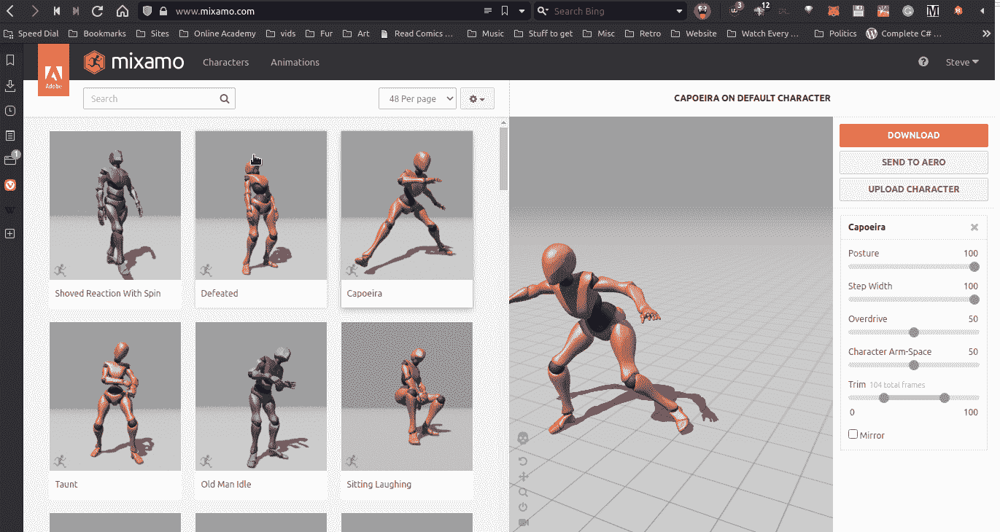

点击下载按钮，确保选择了 Unity 的 FBX 以及“带皮肤”。

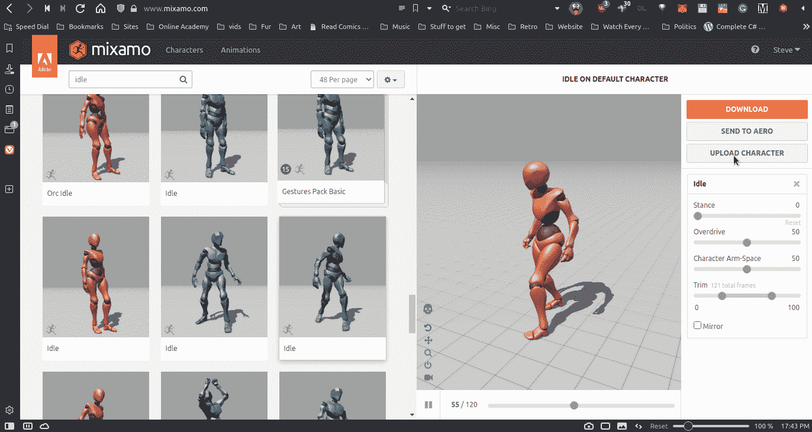

然后将新下载的动画拖到消防员模型中。从技术上来说，它不一定要去那里，但方便的是把东西放在一起。然后进入钻机和动画类型下，选择人形和应用。

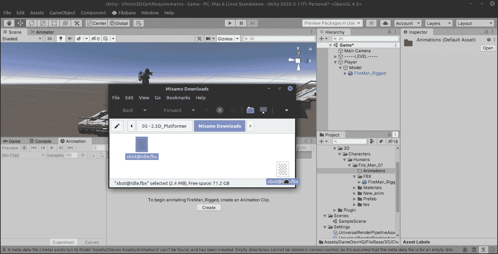

接下来，创建一个名为 Animations 的目录，并创建一个新的 Animator 控制器，将其重命名为 Player_Animator_Controller，并将其拖到 models Animator 中。

我们想把空闲的动画拖到动画制作工具中，但是它的选项目前是受限制的。如果我们复制一个(ctrl-d ),选项会向我们打开，所以让我们做一个，然后把它拖进动画。

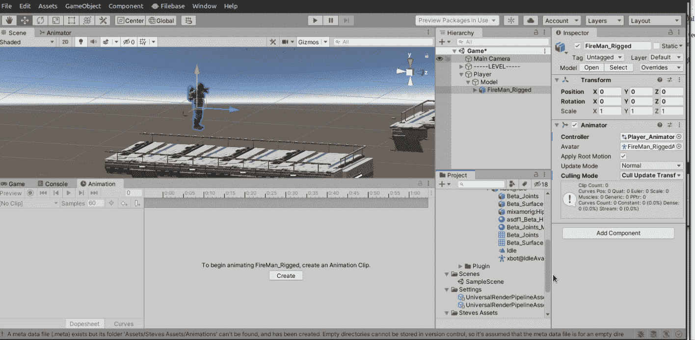

此外，为了让事情有条理，继续在角色文件夹资产中创建一个动画文件夹，并将新复制的空闲文件拖到其中。

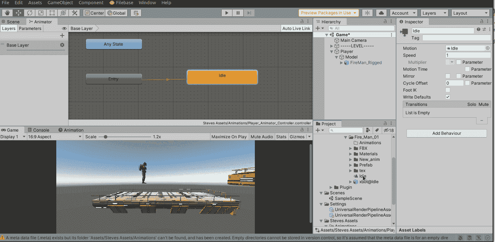

确保首先进入场景并选择角色，然后双击 animator 组件或打开窗口(如果可用)，然后拖动空闲动画。它应该自动将自己附加为第一个动作。双击空闲的动画，在右手边，一定要点击'循环时间'，让动画循环播放。

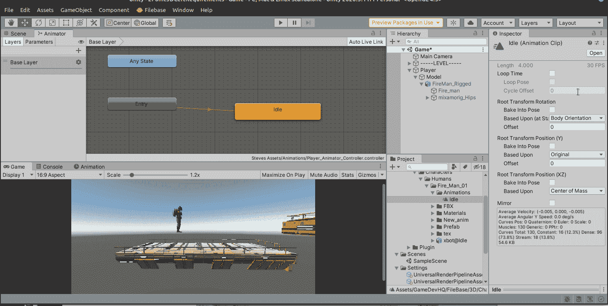

现在只需点击播放按钮，如果一切顺利，你的角色将环顾四周，准备行动！

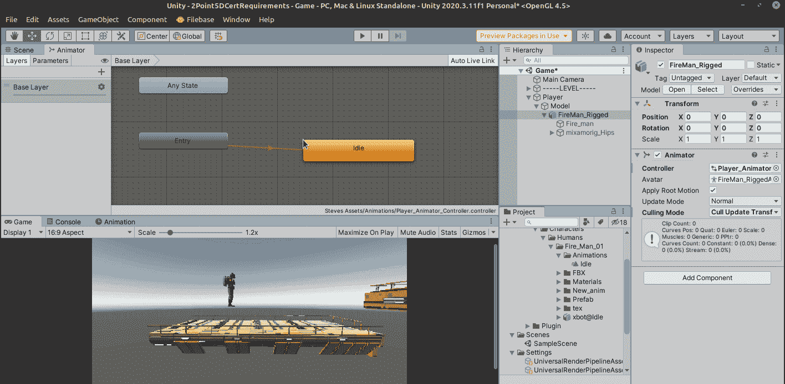

接下来，我们在 animator 窗口中连接动画，并添加一个速度浮动参数来进行过渡。空转运行时，速度会大于 0，空转运行时，速度会小于 0。

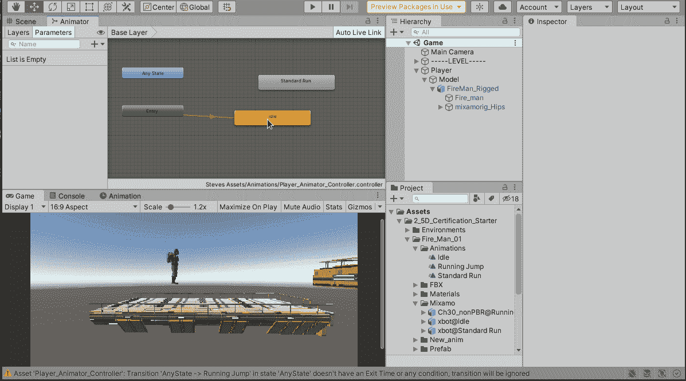

接下来，我们通过代码控制了动画师。最初我们会制作一个单独的玩家动画脚本，但现在，我们会在玩家脚本中编码。

首先，我们将引用我们的 animator，虽然这并不新鲜，animator 是一个子对象，所以我们用 GetComponentInChildren 方法考虑到了这一点。：

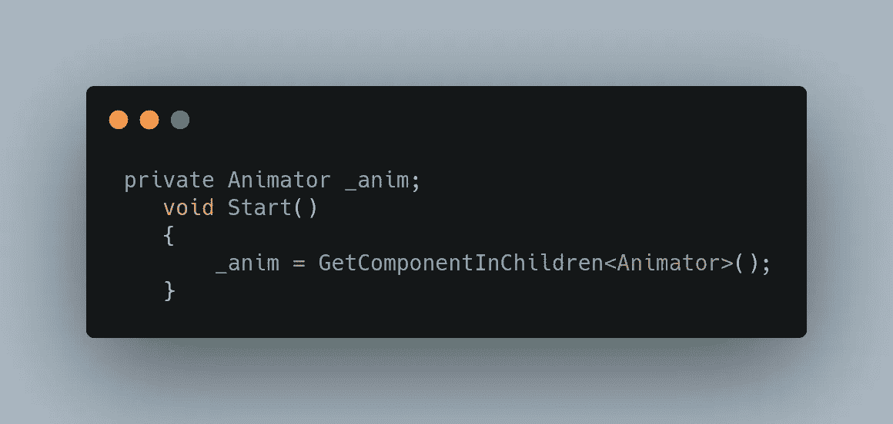

接下来只需要调用控制器并使用水平输入作为参数。因为向左移动是一个负数，所以我们用 Mathf。Abs 命令返回一个正整数。效果非常好！

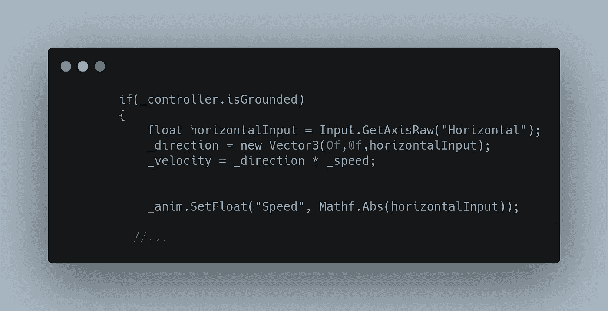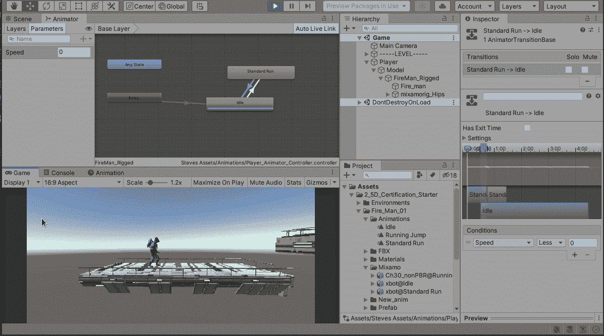

除了意外死亡，我认为它工作得很好！

然后，我用和第一种方法完全一样的方法导入了一个跳跃，尽管动画确实覆盖了一段距离，而且没有选项来保持它“在原位”，所以我们只是照原样下载了它。

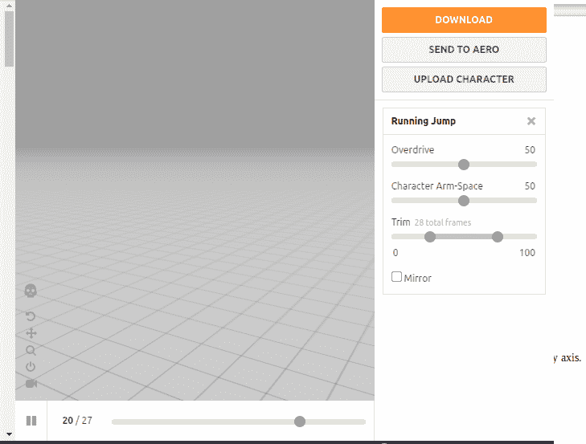

在复制动画后，我们可以使用“烘焙成姿势”选项来移除根变换 y 位置的距离。

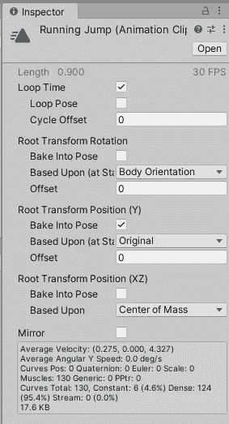

我也尝试在一开始从任何状态转换到跳转并使用触发器时对它进行稍微不同的连线，但它似乎没有像我预期的那样工作。然后，我使用一个名为 jump 和 running states 的 bool 参数创建了从 Jump 到 idle 的来回转换，效果好了很多。调整过渡也是感觉良好的角色控制的关键。以下是我使用的逻辑:

空转跳转:无退出时间，0 转换持续时间，
条件:速度< .2，跳转=真。

跳转到怠速:无退出时间. 1 过渡持续时间
条件:速度< .2，跳转=假

跳转运行:无退出时间. 1 过渡持续时间
条件:速度> 0，跳转=假

运行到跳转:无退出时间，0 转换持续时间
条件:速度> 0，跳转=真

空转运行:无退出时间，0 过渡持续时间
条件:速度> .15

空转运行:无退出时间. 25 过渡持续时间
条件:速度<1

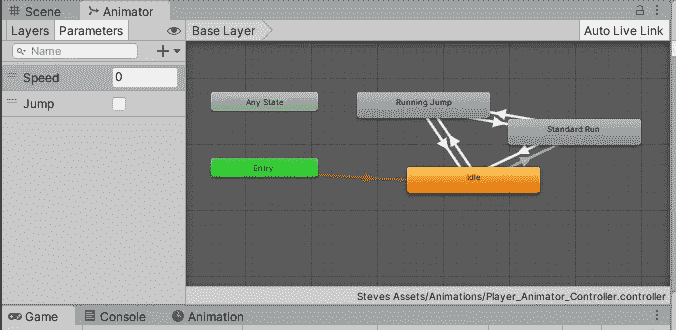

虽然比使用触发器多做了一点工作，但代码仍然很简单，我们创建了一个名为 _jumping 的新 bool 变量，并在播放器脚本中添加了适当的 _anim。SetBool("Jump "，true)行。

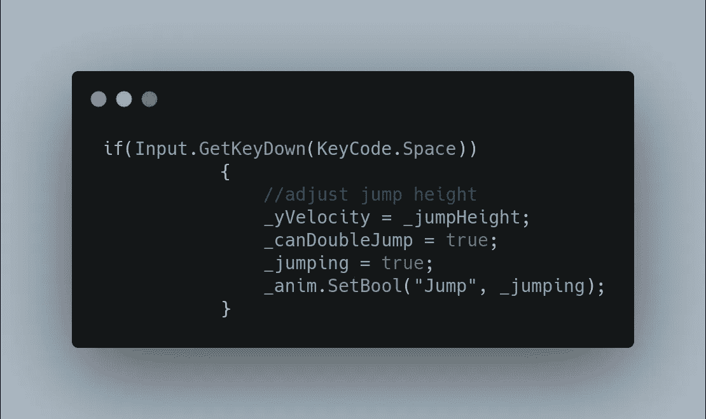

因为我们把跳转设置为真，我们需要把它设置为假。当玩家被禁足是最符合逻辑的地方。

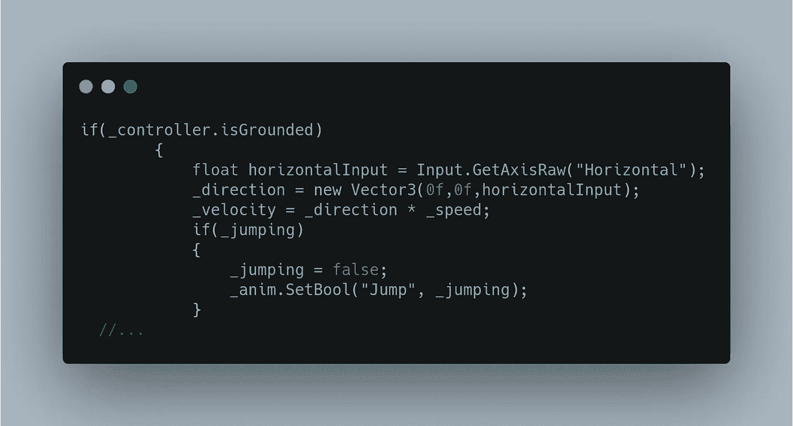

这导致了一个非常好的工作跳跃！

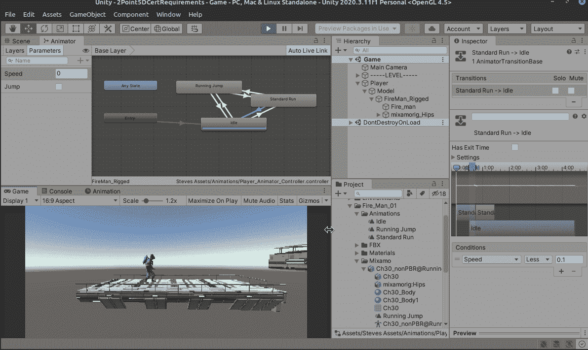

最后还有球员没有面对正确方向的问题。解决方案是根据 horizontalInput 的值将播放器旋转 180 度！

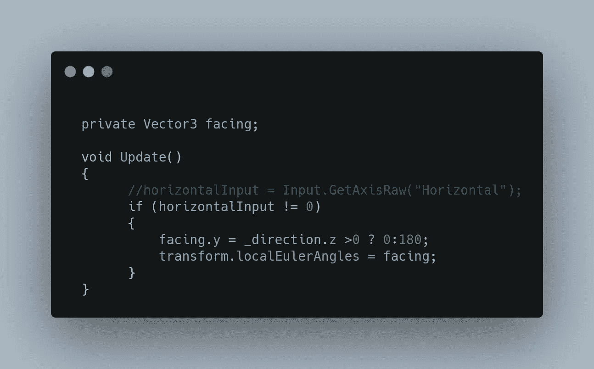

虽然第一行的逻辑看起来有点奇怪，但它实际上是一个三进制运算符[形式的 if else 语句！基本上你给出一个 if 语句，然后一个问号。问号后面，如果为真，就是冒号前的第一项，如果为假，那么就是后面的选项。](https://learn.unity.com/tutorial/ternary-operator)

所以这里:facing.y = _direction.z >0？0:180;

请记住，z 方向保存水平输入，如果水平输入向右移动，则为正 1，因此为真，如果它向左移动，则为-1，因此为假。所以如果为真，旋转为 0，如果为假，旋转为 180 度或翻转。

希望有意义。但是你有它！我今天学到的一切！明天我们要去抓壁架！