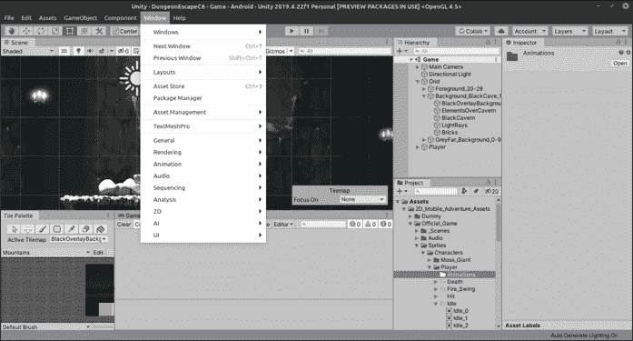
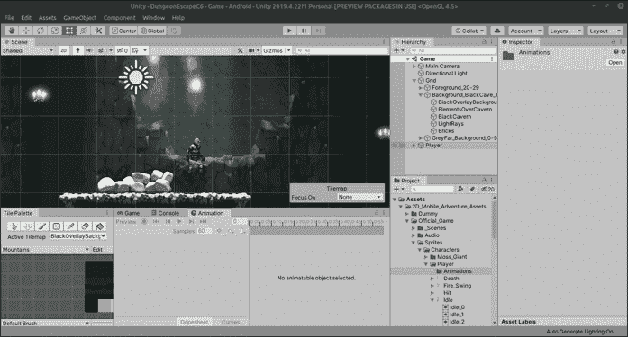
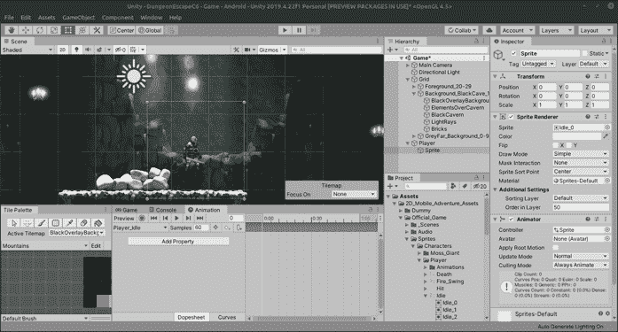
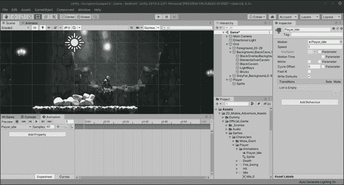
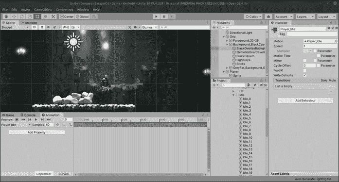
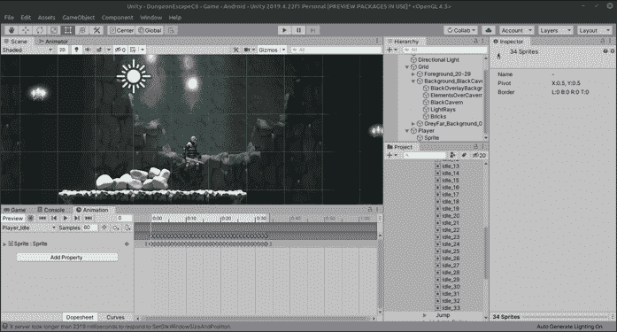
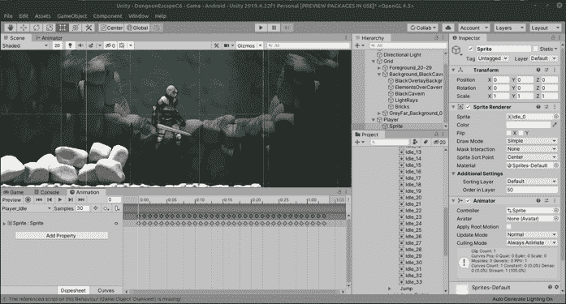
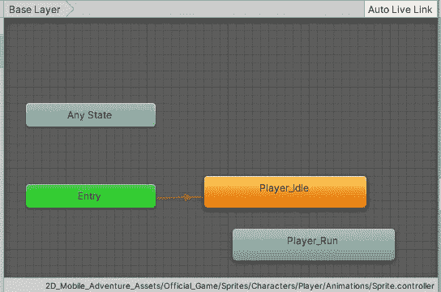

# 每日进度-设置玩家动画

> 原文：<https://medium.com/nerd-for-tech/daily-progression-setting-up-player-animations-d260b38daaf0?source=collection_archive---------14----------------------->

下一个任务是给静态播放器精灵注入生命，有相当多的动画要经历，但是我将分享导入空闲作为复习，它有提醒所需的所有步骤:

打开 Unitys 动画窗口，将其设置到游戏场景区域。

然后选择球员精灵对象，并在动画窗口点击“创建动画”。将它保存在动画下的 players sprite 目录中，命名为“player_Idle”或类似的名称。

我不认为我们需要瓷砖调色板了，所以我要关闭它，给动画。

好多了！现在，如果你看看动画导演，有 PlayerIdle，我们仍然需要用动画帧填充，在检查器中，在 Animator 部分，我们看到一个名为 Sprite 的动画控制器。这是现在正在播放器精灵中使用的控制器，如果你双击它，它将带你进入 Mecanims animator(或者你可以总是手动打开 animator 窗口，在 Unity 中有不止一种方法来做大多数事情！)我们稍后将对此进行更深入的探讨。

将动画放入播放器实际上非常简单，只需将所有的精灵帧拖入动画窗口。给 Unity 一些时间来处理所有的事情，然后你就可以按下播放按钮，看到你的球员在行动！

它以大约 60fps 的速度播放，有点太快了。让我们减半到 30 帧/秒。

那好多了！

现在动画师设置好了，添加新的动画就容易多了。只需进入动画窗口，选择播放器精灵，点击 Player_Idle 所在的下拉菜单并选择“创建新剪辑”，在这种情况下，我们将使 Player_Run 并将其保存在同一个动画目录中。

如果您检查动画窗口，您将看到它也创建了一个 Player_Run 状态。

这差不多就是全部了！有更多的动画可以加入，比如奔跑、攻击、跳跃等等。你以同样的方式实现它们，所以一旦你知道如何通过这些步骤，你就掌握了在 Unity 中制作精灵动画的过程！这当然只是其中的一步。我们得到了动画，但现在我们需要在它们之间进行转换！请继续关注，我们明天将了解所有相关信息！