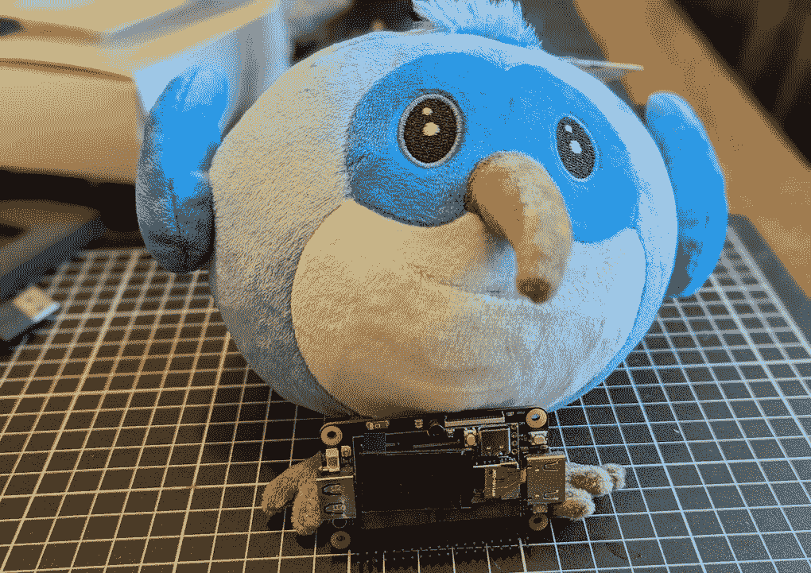

# 达什的 RISC-y 业务

> 原文：<https://medium.com/nerd-for-tech/dashs-risc-y-business-d39e2ba9d042?source=collection_archive---------1----------------------->

## 在 RISC-V 上使用 Dart

林 2022 年，破折号抓住一块荔枝板

# 介绍

Dart 2.17 发布会包括增加对 RISC-V 架构的(实验性)支持，这对我来说是该版本的亮点之一。

对于那些以前可能没有听说过它的人来说， [RISC-V](https://en.wikipedia.org/wiki/RISC-V) 是一种相对较新的 CPU 架构，重要的是它有一个开放的标准指令集架构(ISA ),经过十多年，现在终于出现在真正的硬件产品中。

# 选择正确的缩写

虽然已经有一些 RISC-V SoC 开发板发布，但第一批价格合理且广泛可用的是 [Sipeed Lichee RV](https://linux-sunxi.org/Sipeed_Lichee_RV) 和 [Allwinner D1 SoC](https://linux-sunxi.org/D1) 。

从他们的网上商店订购了一个之后，我最近收到了一个荔枝房车板，并热衷于在上面使用 Dart 进行测试！

需要注意的一件重要事情是，Dart 仅支持在 Linux 上的 RISC-V [rv32gc 和 rx64gc 上运行，并且还有 RISC-V ISA 的其他变体，例如功率低得多的 RV32IMC，它开始出现在微控制器中，如](https://github.com/dart-lang/sdk/wiki/Supported-Architectures) [Espressif ESP32-C3](https://www.espressif.com/en/news/ESP32_C3) 。

# BS 什么？

当然，没有软件，硬件只不过是一纸空文。这些开发板的供应商通常会提供一个操作系统，作为[板支持包(BSP)](https://en.wikipedia.org/wiki/Board_support_package) 的一部分在板上运行。然而，尽管这些 bsp 几乎总是基于 Linux(或 Android 风格),但通常基于过时(甚至古老)的 Linux 内核版本和类似过时的主流 Linux 发行版(例如 Ubuntu 或 Debian ),并且可能包含二进制 blobs 或其他对专有软件的依赖。几乎不是我们在嵌入式设备上运行 Dart 的理想起点！

# 安装在 D1 上

虽然使用供应商 bsp 的另一种选择是从头开始构建自己的 Linux 内核或 Linux 发行版，但对我来说幸运的是，其他人已经在这方面做了大量工作，并为此铺平了道路。

所以我最终使用安德里亚斯的[预建 Linux 内核和 rootfs 来放在 SD 卡上。一旦你把它插入到 Lichee boards 的 sd 卡插槽中，你就可以在主板上运行 Debian 发行版了，不会有任何问题。网页上的说明非常全面，所以我不会在这里重复，除了指出我无法让板直接连接到我的 wifi AP 上，所以我最终将 USB UART 适配器连接到它和我的笔记本电脑，以获得对板的串行控制台访问。](https://andreas.welcomes-you.com/boot-sw-debian-risc-v-lichee-rv/)

一旦 Debian 在 Lichee 上启动并运行，很简单的事情就是设置 Wifi，然后在 SSH 可用的情况下，使用`scp`复制 RISC-V 的 Dart SDK(RV 64 GC ),现在您可以从 [Beta](https://dart.dev/get-dart/archive#beta-channel) 或 Dev Dart 通道获得。

一旦安装了 Dart SDK，就可以像在任何其他运行 Linux 的机器上一样使用它。

# 状态

鉴于 RISC-V 的 Dart“实验”状态，当然 RISC-V 端口仍有许多已知的问题。其中包括[不完全的 FFI 支持](https://github.com/dart-lang/sdk/issues/48164)以及[在非 AOT 模式下的低性能](https://github.com/dart-lang/sdk/issues/49253)。第二个问题是目前最大的限制，也就是说只有 AOT 能够提供足够好的性能在 Lichee 板上运行 Dart 应用程序。

# 输入－输出

当然，让 Dart 命令行程序在 SSH 会话中工作只是一个开始，对于小型嵌入式开发板来说并不令人兴奋，所以在下一篇文章中，我将研究如何让您的 Dart 应用程序与 Lichee 板上可用的一些硬件 I/O 进行对话。

我希望这对你有所帮助，如果有或者你有任何其他方便的技巧可以分享，请在下面的评论中或者通过 [Twitter](https://twitter.com/mklin) 告诉我。

*原载于*[*https://manichord.com*](https://manichord.com/blog/posts/dash-risc-y-business.html)*。*