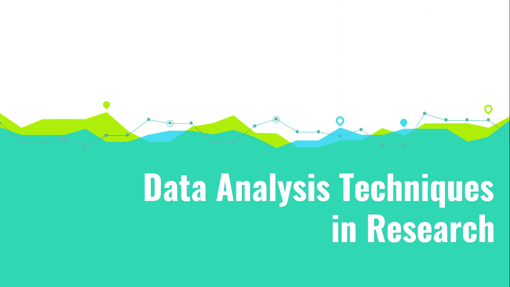

# 研究中的数据分析技术

> 原文：<https://medium.com/nerd-for-tech/data-analysis-techniques-in-research-8754d484f74?source=collection_archive---------5----------------------->

对特定主题或差距的调查被称为研究，这是一个通用短语。研究包括对某一主题的直接探究，以增强或发展该领域已有的理解。研究是为了实现特定目标而对特定目标进行的有组织、有系统的调查。研究是系统的，因为这个过程被分解成不同的阶段，从而产生推论。这是有组织的，因为有一个深思熟虑的框架或程序来达成一个洞察力。研究必须产生或重申一个完整的洞见，不管这个洞见是否有利于假设。

学术研究和商业研究是研究可以大致分为的两大类；虽然这种划分不足以涵盖所有不同的专业研究组，但它提供了对大多数分组的总体把握。旨在填补知识空白或验证当前信息的研究被称为学术研究。学术研究被定义为*“对一个问题或情况的系统调查，其目的是确定将有助于解决问题或处理情况的事实和/或观点”*(博士援助，2019) *。*

商业研究基本上是对一个商业问题的调查，通常是针对这个问题如何直接或间接影响一个组织的，这个组织通常是主要的研究者。商业研究是公司通过收集和分析有关其运营的相关信息来增加其收入和组织绩效的程序。商业研究是一个公司通过收集和分析有关其运营的相关信息来增加其收入和组织绩效的过程。

数据通常是指未经处理的原始信息。从这个意义上说，这些信息是对数据所涉及的特定领域的洞察。获得对任何研究数据的洞察是一个核心工具，而将数据解释为有用的洞察需要对数据进行分析。分析数据以发现数据被称为数据分析。数据分析被定义为*“系统地应用统计和/或逻辑技术来描述和说明、浓缩和概括以及评估数据”的过程*(负责任的研究行为，2005)。根据当代的定义，数据分析是为了找到有用的信息、得出结论和支持决策而对数据进行检查、清理、建模和更改的行为(Brown，2014)。

研究人员可以利用两个主要的数据来源，即原始数据和二手数据。基本上，原始数据是研究人员或研究团队通过实验、访谈和调查获得的数据。来自这个来源的信息通常是特定于研究需要的知识，以实现其目标。二手数据是从以前的研究或公开信息中获得的信息。研究者不产生它们；他们相当干净和模型，以适应研究。二手数据可以从已发布的数据集中获得，包括书籍、网络搜集、社交媒体等。

为了理解研究中的各种数据分析技术，我们必须讨论数据的类别，因为这决定了应用于特定数据的技术。这些类别是:

定量数据:

该数据与标度测量相关联，并由数字表示。数据可以服从大多数的统计操作，可以用序数、区间或比率尺度来表示。通常，来自结果测量系统(OMS)的调查问卷用于收集信息，或用于二手来源的公开数据集或期刊。

定性数据:

代表经验、观点、情感或描述符的文本或单词通常用于表示这些数据。这些数据主要是主观的，因为它涉及个人对特定主题的观点。它们通常很难在研究中进行分析；有时它们是转换成定量数据以便于分析的量表分数。访谈、文本挖掘、网络搜集、焦点小组和开放式调查问题是常见的来源。

分类数据:

数据按分组显示。分类数据点只能属于一个组。当有人回答调查时，他们可能会提供分类数据，如教育水平、婚姻状况、饮食偏好或宗教信仰。

用于分析一组数据的方法取决于将被分析的数据的种类。研究中用于数据分析的方法有:

描述性统计:

在解释数据样本及其测量的总结中，描述性统计描述、说明和总结了在特定研究中发现的数据集的基本特征。它有助于分析师更好地理解数据。可用数据样本由描述性统计表示，不包括假设、判断、概率和结论。它通常应用于定量数据

推理统计:

为了将您的样本数据与其他样本或早期研究进行比较，它利用了统计模型。大多数研究采用了被称为广义线性模型的统计模型，包括学生 t 检验、ANOVA(方差分析)、回归分析以及其他各种产生直线(“线性”)概率和结果的模型。在大多数情况下，它用于分析定量数据。

内容分析:

它是一种用于检查记录在文本、图像中的信息的技术，偶尔也用于检查实物。何时何地使用这种类型的分析由研究问题决定。

叙事分析

它包括使用现场文本，如故事、采访、信件、对话、照片、日记、自传、现场笔记等。作为分析的单位，以验证研究问题背后的原因。

感谢你花时间阅读我的博客❤️.你可以在 LinkedIn 上联系我

**如果你对话题有什么想法，请在评论中分享；我一直在寻求更多的学习和提高。**

如果这篇文章有帮助，请点击拍手👏按钮几下，以示你对作者的支持👇