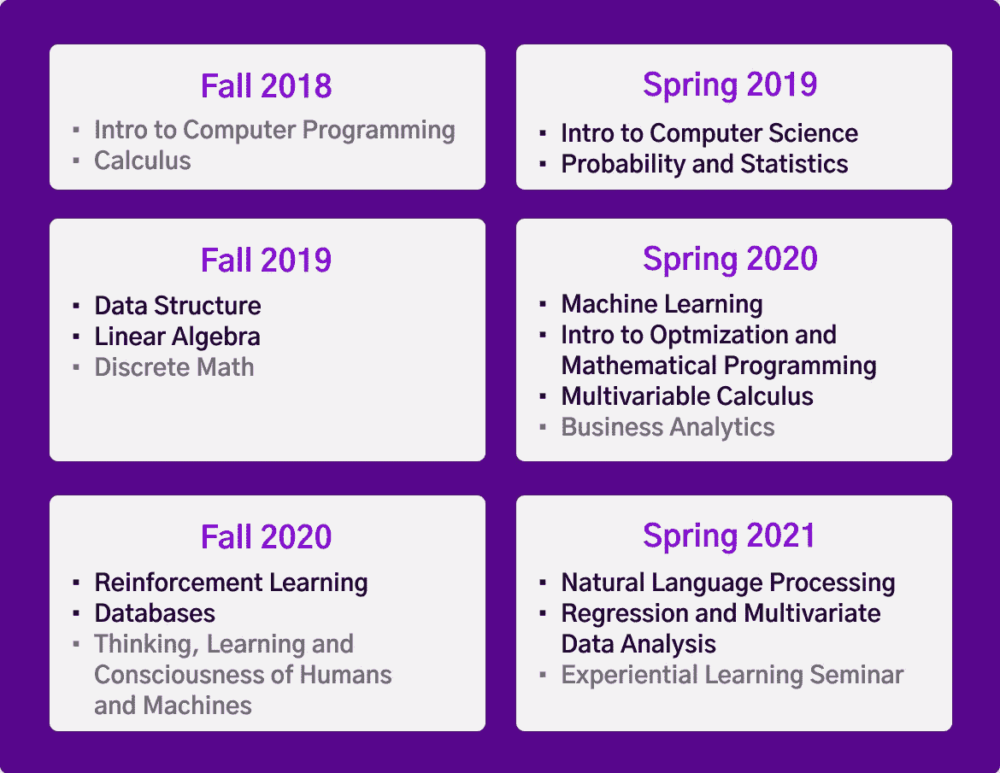

# 数据科学本科生之旅第 2 部分

> 原文：<https://medium.com/nerd-for-tech/data-science-undergrad-journey-part2-school-courses-i-find-helpful-a3b7f9b47258?source=collection_archive---------8----------------------->

## 第二部分:我觉得有用的学校课程

马特·拉格兰在 [Unsplash](https://unsplash.com?utm_source=medium&utm_medium=referral) 上拍摄的照片

您正在向数据科学过渡吗？或者你和我一样是数据科学本科生？如果我能重新开始，我会做些什么不同的事情？

# 介绍

在我的[上一篇帖子](/nerd-for-tech/data-science-undergrad-journey-part1-why-did-i-choose-data-science-as-my-major-606202be1aba)中，我分享了我为什么选择数据科学作为本科专业的故事。

 [## 数据科学本科之旅第 1 部分:我为什么选择数据科学作为我的专业？

### 你好世界！我是艾莉森。我是一名数据科学专业的大四学生。我刚刚结束了第三年在我的…

medium.com](/nerd-for-tech/data-science-undergrad-journey-part1-why-did-i-choose-data-science-as-my-major-606202be1aba) 

我意识到，与我不同，许多当前的数据科学家是从其他领域和工作岗位转型过来的。他们要么在工作中慢慢掌握技能，要么在工作之外花时间一点一点地学习数据科学。我很幸运成为第一批“正统”数据科学本科生之一。参加本科项目节省了我自己设计课程的时间和精力。

在这篇文章中，我将列出我上过的数据科学和相关的**课程**。我也简单总结一下我做过的**类项目**(提供代码)。希望这篇文章能让你对 DS 本科项目有所了解。

# DS & DS 相关课程

首先，正如我上一篇帖子提到的，我是一名正在上升的大四学生，专业是数据科学。我们学校要求学生为数据科学选择一个方向或专业。我的专注是人工智能，所以下面只是我上过的相关课的一个例子。对于学金融或政治学的学生来说，他们需要选择 2-3 门专业课，而不是我下面列出的人工智能课。

## 先决条件

*   **计算机编程入门** (Python，无项目)
    这是一门 Python 入门课，面向之前没有编程知识的学生。该类涵盖基本数据类型，如字符串、整型、浮点型、列表、元组和字典，基本逻辑，如 for 循环和 while 循环，函数和文件输入/输出。
*   **微积分**(数学)
    我们没有微积分 1、2、3。我们的微积分课在一个学期中涵盖了 1 和 2。积分和导数无处不在，在所有其他数学课程和任何涉及数学的计算机科学/数据科学课程中。

## 主要要求

编程类:

*   **计算机科学导论** (Python，1 个期末项目)
    本课程继续教授 Python，即 OOP 和递归与动态编程。这门课涵盖了所有内容的一点点:计算机架构、算法、机器学习、深度学习和人工智能。我们从零开始给 KNN 编码，我第一次听说了人工神经网络。
    对于[的最终项目](https://github.com/AlisonYao/ICS_final_project)，我们使用 Python 制作了一个集成了 GUI 界面和 Pygame 的聊天系统。
*   **数据结构** (Python，无项目)
    这个类巩固了我们在这个类中关于 OOP、递归、时间&空间复杂度的知识。本课程还涵盖数据结构构建模块，如堆栈、队列、链表、树、哈希表、映射、集合和图形。涵盖的算法包括排序算法，搜索算法，图探索(DFS，BFS)，最短路径算法，最小生成树，选择算法，优先队列等。我发现棘手的是如何以最佳方式混合不同的数据结构来更有效地解决问题。
*   **数据库** (SQL & Python &前端语言，1 个期末专题)
    本课程讲授关系数据库、SQL 语法和数据库管理系统，如索引技术、查询处理算法和事务管理技术。SQL 是一名数据科学家的必备技能之一，因此尽早学习 SQL 可能会增加一个人获得实习的机会。
    对于[最终项目](https://github.com/AlisonYao/Databases-final-project)，我们为一家航空公司的客户、订票代理和工作人员构建了完整的前端(HTML、CSS、Javascript 和 Bootstrap)和后端(Python Flask)。
*   **最优化和数学规划简介** (GAMS，1 个期末项目)
    我很少在其他数据科学课程中看到这样的课程。本课程涵盖基础设施系统的模型构建、非线性规划和优化条件、线性规划和对偶理论、网络优化模型和整数规划。对我来说新奇的是 GAMS 软件，这是一个解决最优化问题的专门工具。机器学习和深度学习算法本质上是解决优化问题的，所以这门课在理解底层机制方面是有帮助的。
    对于[期末项目](https://github.com/AlisonYao/Optimization-Final-Project)，我们优化了学校的班车时刻表，以在满足学生需求的同时降低成本。
*   **机器学习** (Python，1 个期末项目)
    课堂被分成 7 周的机器学习和 7 周的深度学习。涵盖的模型包括朴素贝叶斯、逻辑回归、线性回归、图形模型、EM、聚类、神经网络、CNN 和 RNN。这个班每学期变化很大。我觉得我的学期没有涵盖太多的机器学习，但我在我的商业分析课程中弥补了一些。
    在[期末项目](https://github.com/AlisonYao/Machine-Learning-Final-Project)中，我们比较了几种神经网络，设计了一个交通标志图像分类器。就在这门课后，我得到了计算机视觉的实习机会。
*   **回归与多元数据分析** (Minitab 或 R，5 个作业项目)
    这堂课是我真正喜欢的研究生水平的课。它涵盖了简单和多元线性回归，如何检查假设，如何解决违反假设，时间序列分析，方差分析和协方差分析，以及逻辑回归。我们可以随意使用任何统计软件或编程语言，我恢复默认，从头开始学习 Minitab。我们总共有 5 个作业项目。我们可以自己决定题目，收集自己的数据。作为一个漫威迷和电视剧迷，我从分析超级英雄电影在中国的票房表现和预测我最喜欢的电视剧是否会被续订或取消中获得了很多乐趣。

人工智能类别:

*   **强化学习** (Python，1 final project)
    课程分为 7 周的表格化 RL 和 7 周的深度强化学习。前半部分涵盖了多武装匪徒、Marvok 决策过程、动态编程、蒙特卡罗方法、时间差学习和 Dyna-Q。后半部分涵盖了策略梯度/强化算法、行动者-评论家、DQN、DDPG、TD3、SAC 和 Alpha Go 和 Atari games 等有趣的示例。
    最终项目[是一个研究项目，而不是 DRL 申请。我做了一些实验，看看是否有一种新方法，即多步法，可以在减少偏差方面取代现有的限幅双 Q 方法。除此之外，我还测试了将限幅双 Q 和多步法结合起来是否能产生更好的结果。](https://github.com/AlisonYao/Reinforcement-Learning-Final-Project)
*   **自然语言处理** (Python，1 个期末项目)
    这堂课是我迄今为止上过的最难的一堂课。课程涵盖了 N-gram 语言模型、单词嵌入、神经网络语言模型、序列标记、期望值最大化、神经序列建模、GPT、编码器-解码器、变压器和 BERT。这门课很快涵盖了很多内容，但我们最终还是接触到了创造奇迹的最先进的模型。
    在[的最终项目](https://github.com/AlisonYao/NLP-Final-Project)中，我们使用基于 BERT 的模型将中文问题转换成 SQL 语句。特别感谢 Google Colab GPU！

数学课:

*   **概率与统计**(数学)
    这门课涵盖了基本的概率概念，包括样本空间、随机变量、概率分布、矩、均值、方差和相关性。它还介绍了各种离散和连续的概率分布，包括伯努利，二项式，几何，泊松，均匀，正常和指数，以及随机变量的变换。它还教授大数定律、中心极限定理、统计推断和假设检验。我发现所涉及的概念非常重要。统计学在数据科学中无处不在，例如，概率是强化学习的基石。
*   **线性代数**(数学)
    这门课涵盖线性方程组、矩阵运算、行列式、向量空间、特征值与特征向量、正交性与最小二乘、对称矩阵、谱分解、二次型等。我觉得线性代数比较高级的部分在其他课上不会经常出现，但是像矩阵运算这种基础的，在比如深度学习中会经常用到。
*   **多变量微积分**(数学)
    基于微积分，Multi Calc 教授序列和级数、空间几何、向量函数、偏导数、多重积分和向量微积分。这有助于理解随机梯度下降的机理等。

# 相关类别

*   **人类和机器的思维、学习和意识**
    我个人认为道德实践应该是任何技术相关专业的必修内容。这门课不是主要要求，但像负责任的数据科学、人工智能偏见以及技术的机遇和局限这样的主题很有启发性。
*   **商业分析** (Python & R，1 competition)
    这是一门将机器学习模型应用于现实生活商业案例的商业课。课程包括线性回归、逻辑回归、KNN、回归树、聚类、偏差-方差权衡、CART 树、正则化、特征工程、聚类、PCA、因果推理和潜在结果模型等。这堂课感觉就像一堂机器学习课，理论更少，应用更多。
    我们在学期末进行了一场[的课内 Kaggle 竞赛](https://github.com/AlisonYao/Business_Analytics_Final_project)，我们团队在预测外卖配送时间方面获得了第一名。
*   **体验式学习研讨会**(我用的是 Python，1 个期末项目)
    这门课在我的成绩单上是如此独特的存在。这是正常课程工作量的三倍，因为学生还需要实习。在课堂之外，我每周有两天的数据科学实习(我会在下一篇博客中保存所有关于实习的内容)。在课堂上，我做了一个关于数据科学的社会科学项目。由于我试图回答的问题对任何文献综述和现有数据库来说都太新，我不得不暂时忘记我的数据科学技能，转而求助于进行采访。这就是为什么它被制定为一个社会科学项目。然而，由于我同时在学习 NLP，我的 DS 本能发挥了作用，我最终设法对面试成绩单(它们是文本数据)做了一些分析。
*   **离散数学**(数学)
    这门课是多门 cs 课的前提。我从来不需要它作为先决条件，但我发现时间复杂性、big-O 符号、递归逻辑、矩阵(线性代数警报)和概率等主题很有用。

# 未来计划

作为一名本科生，我仍然在探索各种事物。现在，除了最后的顶点项目，我已经完成了所有的主要要求，我可以在高三的时候喘口气，探索更多的艺术和媒体课程。但同时，这是我对数据科学的计划:

*   **了解更多关于 R 的知识**
    你可能注意到了，我上面列举的编程课程，大部分都是用 Python。Python 已经赢得了与 R 的战争，但是在我的 DS 实习期间，我注意到 R 是一个很棒的工具，仍然被许多公司广泛使用。
*   **数据可视化**
    没有人能抗拒美好的剧情。是的，Matplotlib 和 Seaborn 一直在我们的军火库中，但对于像我这样的前端开发人员来说，我一直想学习 d3.js 并创建惊人的交互情节。
*   了解更多关于统计学的知识
    我所学的课程并没有涵盖我所希望的那么多统计学应用。有时，好的旧统计模型可以赢得业务人员的支持，并且实际上被部署来创建业务影响。黑盒模型不一定有优势。
*   **顶点工程**
    所有 DS 的学生都需要完成一个顶点工程来勾选毕业要求的最后一格。我仍然有足够的时间来学习新的东西，但我认为我的顶点项目可能位于计算机视觉和强化学习之间。

# 结论与反思

到目前为止，我喜欢所有与 DS & DS 相关的课程。基于项目的学习很适合我。随着时间的推移，我的编程技能确实有所提高。课堂上的算法绝对吸引人，也很有启发性。这些课程相互借鉴，一些关键思想贯穿多年。比如近似优化的思想是随机梯度下降的基础，在 ML 和 DL 中处处都有。强化学习中探索与开发的权衡也可能是我人生中最重要的启示之一。

作者图片

如果我用不同的方式安排我的课程，我可能会调整我的课程顺序。我会:

*   我认为在早期阶段学习 SQL 会更明智，因为它可以更好地为实习做准备。而且实习很好玩！
*   **摄回归和多元数据分析更早**
    回归模型可以先于其他机器学习模型出现。回归模型刷新一个人的统计知识，并作为机器学习的温和介绍。

除此之外，事情对我来说都很顺利:)

# 承认

在策划这个系列的时候，我偶然看到了 [Jaemin Lee](https://medium.com/u/983bdeefa40e?source=post_page-----a3b7f9b47258--------------------------------) 的[文章](https://towardsdatascience.com/b-s-in-data-science-is-it-worth-majoring-in-it-668729a160c6)中一个相似的主题。他有一个非常不同的故事要讲，但他的文章无疑成为我的灵感之一。我很惊讶地发现我们的课程要求有很大不同。我的课都不教 Java 或者 C++。我也没上过多少统计课。我当然推荐去看看 Jaemin 的博客。

# 下一篇博客——实习和研究

我在数据科学和人工智能领域的实习和研究机会真的让我对科技世界大开眼界。我将在下一篇博文中深入探讨细节。

 [## 数据科学本科之旅第三部分:我的实习和研究经历

### 转专业？不会吧！

medium.com](/codex/ds-undergrad-journey-part3-my-internship-research-experience-907aaa57c497) 

谢谢你阅读我的博客！希望对你有帮助。

我的 Github:[https://github.com/AlisonYao](https://github.com/AlisonYao)

我的卡格尔:【https://www.kaggle.com/alisonyao】T2